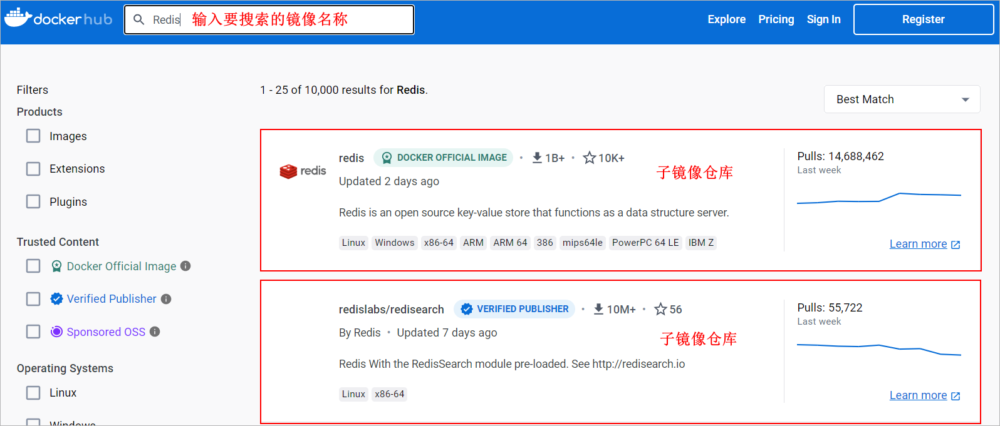
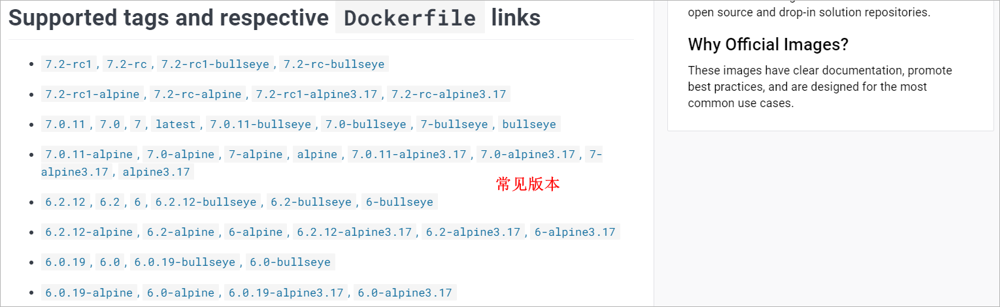
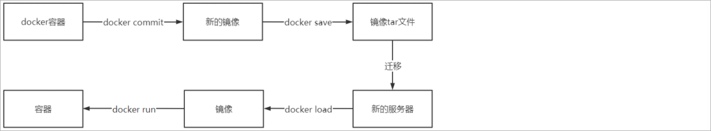
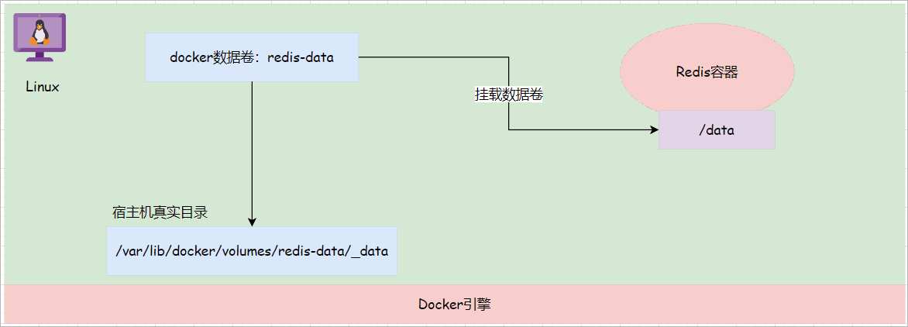
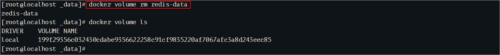
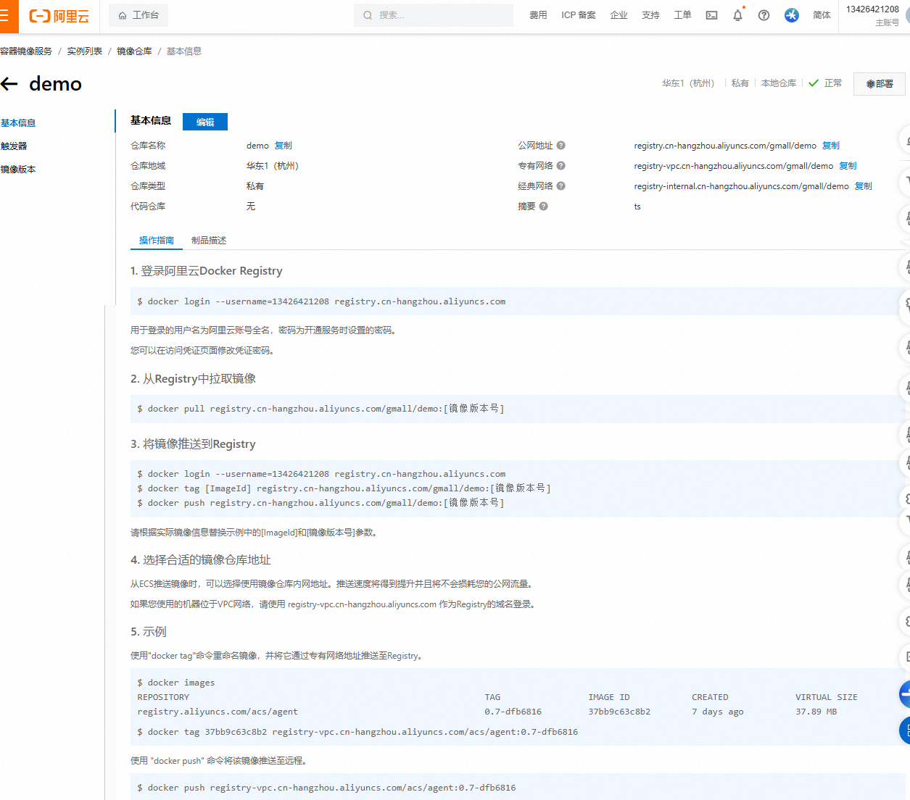
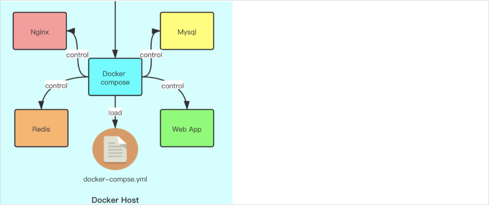

# 1 docker初体验

## 1.1 docker简介

* **问题：为什么会有docker出现？**
  一款产品从开发到上线，从操作系统，到运行环境，再到应用配置。作为开发+运维之间的协作我们需要关心很多东西，这也是很多互联网公司都不得不面对的问题，特别是各种版本的迭代之后，不同版本环境的兼容，对运维人员都是考验 , 这个时候 docker 横空出世，是因为它对此给出了一个标准化的解决方案。
  环境配置如此麻烦，换一台机器，就要重来一次，费力费时。很多人想到，能不能从根本上解决问题，软件可以带环境安装？也就是说，安装的时候，把原始环境一模一样地复制过来。开发人员利用 docker 可以消除协作编码时“在我的机器上可正常工作”的问题。


* docker官网地址：https://www.docker.com/

   

* docker 是一个开源的应用容器引擎，基于 Go 语言开发。docker 可以让开发者打包他们的应用以及依赖包到一个轻量级、可移植的容器中，然后发布到任何流行的 Linux 机器上，也可以实现虚拟化。容器是完全使用沙箱机制，相互之间不会有任何接口（类似 iPhone 的 app）,更重要的是容器性能开销极低。
* docker的主要目标是“Build，Ship and Run Any App,Anywhere”，也就是通过对应用组件的封装、分发、部署、运行等生命周期的管理，使用户的APP（可以是一个WEB应用或数据库应用等等）及其运行环境能够做到“一次封装，到处运行”。
* 总之一句话：只需要一次配置好环境，换到别的机子上就可以一键部署好，大大简化了操作 。


## 1.2 docker的优势

docker的优势包括：

1、可移植性：docker容器可以在任何支持docker的环境中运行，包括本地开发环境、测试环境和生产环境，从而提高了应用程序的可移植性。

2、可伸缩性：docker容器可以根据负载的变化进行快速扩展和收缩，从而更好地满足应用程序的需求。

3、隔离性：docker容器提供了隔离的运行环境，从而使得不同容器中运行的应用程序互相隔离，避免了应用程序之间的干扰。


## 1.3 docker和虚拟机的区别

docker和虚拟机的区别如下图所示：

   

**隔离性**：在于隔离性上面，由于vm对操作系统也进行了虚拟化，隔离的更加彻底。而docker共享宿主机的操作系统，隔离性较差。

**运行效率**：由于vm的隔离操作，导致生成虚拟机的速率大大低于容器docker生成的速度，因为docker直接利用宿主机的系统内核。它们的启动速度是在数量级上的差距。

**资源利用率**：在资源利用率上虚拟机由于隔离更彻底，因此利用率也会相对较低。

经典名句：虚拟机已死，容器才是未来


## 1.4 docker架构

* docker是一个客户端-服务器（C/S）架构程序。docker客户端只需要向docker服务器或者守护进程发出请求，服务器或者守护进程将完成所有工作并返回结果。docker提供了一个命令行工具docker以及一整套RESTful API。你可以在同一台宿主机上运行docker守护进程和客户端，也可以从本地的docker客户端连接到运行在另一台宿主机上的远程docker守护进程。

* docker的架构图如下所示：

  


## 1.5 docker镜像与容器

**镜像：**类似虚拟机镜像 , 是一个特殊的文件系统

操作系统分为内核和用户空间。对于Linux而言，内核启动后，会挂载root文件系统为其提供用户空间支持。而docker镜像（Image），就相当于是一个root文件系统。

docker镜像是一个特殊的文件系统，除了提供容器运行时所需的程序、库、资源、配置等文件外，还包含了一些为运行时准备的一些配置参数（如匿名卷、环境变量、用户等）。 镜像不包含任何动态数据，其内容在构建之后也不会被改变。

**容器：**类似linux系统环境，运行和隔离应用。是镜像运行时的实体

镜像（Image）和容器（Container）的关系，就像是面向对象程序设计中的类和实例一样，镜像是静态的定义，容器是镜像运行时的实体。容器可以被创建、启动、停止、删除、暂停等 。

**仓库：**集中存放镜像文件的地方。

镜像构建完成后，可以很容易的在当前宿主上运行，但是， 如果需要在其它服务器上使用这个镜像，我们就需要一个集中存储、分发镜像的地方，比如后面我们要学的，docker Registry就是这样的服务。


## 1.6 Docker hub

* docker用Registry来保存用户构建的镜像。Registry分为公共和私有两种。docker公司运营公共的Registry叫做**docker Hub**。用户可以在Docker Hub注册账号，分享并保存自己的镜像（说明：在docker Hub下载镜像很慢，可以自己构建私有的Registry）。

* 访问docker Hub搜索Redis镜像

https://hub.docker.com/

  

一般都会选择官方的的子镜像仓库：

  

在子镜像仓库中会存在很多的版本的镜像。


## 1.7 docker的安装与卸载

* docker 从 17.03 版本之后分为 CE（Community Edition: 社区版） 和 EE（Enterprise Edition: 企业版），CE版本是免费的，EE版本是收费的。本次我们使用社区版。

docker的安装和卸载可以参考官方文档：https://docs.docker.com/engine/install/centos/

### （1）卸载docker：

```shell
sudo yum remove docker \
                  docker-client \
                  docker-client-latest \
                  docker-common \
                  docker-latest \
                  docker-latest-logrotate \
                  docker-logrotate \
                  docker-engine
```

### （2）安装docker：

* 第一步 检查系统版本

  注意：这里建议安装在CentOS7.x以上的版本，在CentOS6.x的版本中，安装前需要安装其他很多的环境，而且Docker很多补丁不支持更新。

```shell
# 确定是CentOS7.x及其以上版本
cat /etc/redhat-release
```

* 第二步 检查环境，安装gcc和g++

```shell
yum -y install gcc
yum -y install gcc-c++
```

* 第三步 安装必要的一些系统工具

```shell
yum install -y yum-utils device-mapper-persistent-data lvm2
```

* 第四步 添加软件源信息（设置阿里云镜像地址，提高下载速度）

```shell
yum-config-manager --add-repo http://mirrors.aliyun.com/docker-ce/linux/centos/docker-ce.repo
```

* 第五步 更新yum软件包索引并安装Docker-CE

```shell
yum makecache fast

yum install -y docker-ce docker-ce-cli containerd.io docker-buildx-plugin docker-compose-plugin
```


## 1.8 docker服务相关命令

docker服务操作的相关命令如下所示：

```shell
# 查看docker服务的运行状态
systemctl status docker

# 启动docker服务
systemctl start docker

# 关闭docker服务
systemctl stop docker

# 重启docker服务
systemctl restart docker
```


## 1.9 配置镜像加速器

docker的使用过程中，需要从远程仓库下载镜像，但是默认为国外网站，所以在下载时可能会出现下载连接超时导致下载失败，因此需要为其配置镜像加速器，以提高下载速度。目前使用的镜像加速器有很多，比如阿里云，网易云等等。

### （1）国内配置的镜像地址

受目前网络环境影响，其它加速器可能暂时不能使用，所以大家尽量采样优先推荐（如果不行就挨个试一下）：

```
0.优先选用★
https://registry.dockermirror.com

1.Docker中国区官方镜像
https://registry.docker-cn.com

2.网易
http://hub-mirror.c.163.com
 
3.中国科技大学
https://docker.mirrors.ustc.edu.cn
```


### （2）阿里云镜像地址

阿里云镜像加速器的使用步骤：

1、注册和登录

2、进入管理后台

3、搜索**容器镜像服务**

4、查看示例代码进行配置即可

  


### （3）配置过程

* 创建文件daemon.json

```shell
vim  /etc/docker/daemon.json
```

* 文件中添加如下内容

```json
{ 
  "registry-mirrors":["https://registry.dockermirror.com","https://registry.dockermirror.com"] 
}
```

* 重启docker生效


# 2 docker镜像操作

## 2.1 搜索远程镜像

相关命令如下所示：

```shell
# 命令：
docker search

# 格式：
docker search 镜像关键字

# 示例：搜索镜像名称中包含redis关键字的镜像
docker search redis	
docker search --limit 5 redis	
```

执行效果如下所示：


列介绍：

1、name：            镜像仓库源名称

2、description：  镜像的描述

3、official:		  是否 docker 官方发布

4、stars: 		    镜像的收藏数，收藏数越多表示此镜像的受欢迎程度越高

5、automated:     是否自动构建


## 2.2 拉取镜像

相关命令如下所示：

```shell
# 命令: 
docker pull

# 格式: tag表示的镜像的标签，也可以理解为就是镜像的版本
docker pull 镜像名称[:tag]		

# 示例1: 默认拉取的是最新的redis镜像
docker pull redis		

# 示例2: 拉取redis7.0.10镜像，一个镜像到底存在哪些标签，需要上docker hub中进行查看
docker pull redis:7.0.10	   
```

执行效果如下所示：

  


## 2.3 查看本地镜像

相关命令如下所示：

```shell
# 命令: 
docker images			

# 示例: 
docker images
docker images -qa
```

执行效果如下所示：

  

列介绍：

1、repository：镜像来源仓库名称

2、tag：		  镜像标签

3、image id：  镜像id

4、created：  创建时间

5、size：		镜像的大小


## 2.4 删除本地镜像

相关命令如下所示：

```shell
# 命令：
docker rmi 		

# 删除单个镜像(-f 强制删除)：
docker rmi  -f 镜像ID

# 删除多个镜像：
docker rmi -f   镜像名1:TAG    镜像名2:TAG
# 根据镜像的id或者镜像的名称进行删除，如果不添加镜像的标签删除的就是最新的镜像

# 示例: 
docker rmi redis:7.0.10				# 删除redis:7.0.10镜像
```

执行效果如下所示：

* 根据镜像名称删除

  

* 根据镜像id删除


* 注意：如果一个镜像存在对应的容器，此时这个镜像是无法进行删除的。
* 删除所有镜像：

```shell
docker rmi $(docker images -q)			# 慎用
```


## 2.5 帮助文档使用

docker中提供了很多命令，每一个命令也可以加很多的参数选项。把一个命令以及对应的参数选项都记住很显然是不太现实的。可以通过查看docker

帮助文档来学习docker的常用命令以及参数选项的使用。

帮助文档的使用如下所示：

```shell
# 查询docker可以使用到的命令
docker --help

# 查询images命令的使用文档
docker images --help
```

执行效果如下所示：

  


# 3 docker容器操作

## 3.1 查询容器

相关命令如下所示：

```shell
命令：docker ps 
格式：docker ps [options]	# 可以添加一些参数选项，如果不添加表示查询本地所有正在运行的容器
示例: docker ps 			# 查看本地正在运行的容器
```

执行效果如下所示：

  

列介绍：

1、container id：   容器名称

2、image:			  镜像名称

3、command：      容器启动时所执行的命令

4、created：        创建时间

5、status：		  容器状态

6、ports：            端口映射情况

7、names：          容器的名称


常见参数选项：

```shell
-a,--all												# 查询所有，包含未运行的容器
-q,--quiet												# 查询容器的id

示例1：docker ps -a									  # 查询所有的容器包含未运行的容器
示例2：docker ps -q									  # 查询容器的id	
```


## 3.2 创建容器

* 容器分类：

1、交互型容器：具有和用户交互的输入和输出终端，容器创建后自动进入容器，退出容器后，容器自动关闭。

2、守护型容器：没有和用户交互终端，需要使用docker exec进入容器，退出后，容器不会关闭。


* 命令介绍：

```shell
命令:  docker run
格式： docker run [OPTIONS] 镜像的名称:镜像标签/镜像id [COMMAND] [ARG...]

类型参数选项：
-i：表示运行容器
-t：表示容器启动后会进入其命令行。加入这两个参数后，容器创建就能登录进去。即分配一个伪终端。
--name :为创建的容器命名。
-v：表示目录映射关系（前者是宿主机目录，后者是映射到宿主机上的目录），可以使用多个－v做多个目录或文件映射。注意：最好做目录映射，在宿主机上做修改，然后共享到容器上。
-d：在run后面加上-d参数,则会创建一个守护式容器在后台运行（这样创建容器后不会自动登录容器，如果只加-i -t两个参数，创建后就会自动进去容器）。
-p：表示端口映射，前者是宿主机端口，后者是容器内的映射端口。可以使用多个-p做多个端口映射
```


* 交互式方式创建容器

以交互式方式创建并启动容器，启动完成后，直接进入当前容器。使用exit命令退出容器。需要注意的是以此种方式启动容器，如果退出容器，则容器会进入停止状态，可以理解成交互式容器 是前台容器

```shell
docker run -it --name=容器名称 镜像名称:标签 /bin/bash
# 比如：docker run -it --name=mycentos centos:7 /bin/bash
# docker run:表示创建容器
# -it：表示运行容器并进入它的命令行
# --name=mycentos：给当前的容器命名
# centos:7：使用该镜像创建
# /bin/bash：放在镜像名后的是命令，这里我们希望有个交互式 Shell，因此用的是 /bin/bash
```

执行效果如下所示：

```shell
# 准备测试镜像
docker pull centos:7

# 交互方式创建
docker run -it --name=mycentos centos:7 /bin/bash
```

效果：

  

交互型容器创建好了以后，直接进入到容器的内部了。

退出当前容器：**exit**，退出之后，容器也退出了，没有删除


* 守护式方式创建容器

```shell
# 守护式容器和交互式容器的创建方式区别：
# -it 换成 -di
# 去掉后面的 /bin/bash
docker run -di --name=容器名称 镜像名称:标签
# 比如：docker run -di --name=mycentos10 centos:7
```

效果：


## 3.3 容器服务管理

容器管理的相关命令如下所示：

```shell
docker stop 容器名称/容器id											# 关闭容器
docker start  容器名称/容器id											# 启动容器
docker restart 容器名称/容器id										# 重启容器
```


## 3.4 删除容器

删除容器的常见命令如下所示：

```shell
命令: docker rm
格式：docker rm 容器名称/容器的id							#  删除容器
示例：docker rm mycentos10							 #  删除mycentos10容器
```

注意：上述的命令只能删除已经关闭的容器，如果想删除正在运行的容器，可以通过添加 **-f 参数**进行实现。


删除所有的容器

```shell
docker rm $(docker ps -aq)
```


## 3.5 进入容器

进入容器命令如下所示：

```shell
命令：docker exec
格式：docker exec [OPTIONS] CONTAINER COMMAND [ARG...]
常见的参数选项：												  
-t, --tty											# 分配一个虚拟终端，通常和-i参数一起使用
-i,--interactive									# 把交互界面一直保留，通常和-t参数一起使用

示例1：docker exec -it mycentos10 /bin/bash			# 进入到容器中同时打开一个shell窗口
```

执行效果如下所示：

  


## 3.6 其他命令

如下所示：

```shell
docker logs -f 容器名称/容器的id						# 查询容器内进程日志，-f参数表示实时监控日志信息
docker inspect 容器名称/容器的id						# 查看容器的详情信息
docker cp 											 # 完成容器和宿主机之间的文件copy

示例1: docker logs -f redis01				   # 实时查看redis01这个容器中的日志信息
示例2: docker inspect redis01				   # 查看容器的详情信息，主要就是：目录映射情况、端口映射情况、ip地址
示例3: docker cp a.txt redis01:/root		   # 把宿主机中a.txt文件拷贝到redis01的root目录中
示例4: docker cp redis01:/root/a.txt .       # 把容器中的root目录下的a.txt文件拷贝到宿主机中当前目录中
```


## 3.7 备份与迁移

对某一个容器修改完毕以后，我们可以把最新的容器部署到其他的环境中。具体的流程操作如下所示：

  

涉及的docker命令：

```shell
docker commit 容器名称/容器的id 镜像名称			  # 把docker容器保存成一个镜像
docker save -o 镜像tar文件名称 镜像名称/镜像id		 # 把镜像保存为tar文件
docker load -i 镜像tar文件名称					# 把tar文件恢复成为一个镜像
```

示例代码：

```shell
docker commit mycentos10 mycentos				     # 将mycentos10容器保存为一个镜像
docker save -o mycentos.tar mycentos 				 # 将mycentos镜像保存为一个tar文件
docker rmi mycentos								     # 删除之前的mycentos镜像
docker load -i mycentos.tar 						 # 将mycentos.tar恢复成一个镜像
```


# 4 docker数据卷操作

## 4.1 数据卷概述

思考问题：在Redis容器中存储的数据，如果Redis容器被删除了，数据是否还存在?

解决方案：将数据存储到Linux宿主机的磁盘目录中


数据卷概述：数据卷是docker所提供的一个虚拟目录，这个虚拟目录会对应宿主机的一个真实目录。在创建容器的时候就可以将这个数据卷挂载到容器中的某一个目录下，那么此时在该目录下所产生的数据就会存储到宿主机的目录下，实现了容器和宿主机之间的文件共享。

如下图所示：

  

## 4.2 常见命令

### 4.2.1 查看数据卷

命令如下所示：

```shell
docker volume ls
```

执行效果如下所示：

  

### 4.2.2 创建数据卷

命令如下所示：

```shell
docker volume create 数据卷名称
```

执行效果如下所示：

 

### 4.2.3 查询数据卷详情

命令如下所示：

```shell
docker volume inspect 数据卷名称
```

执行效果如下所示：

 

### 4.2.4 删除数据卷

命令如下所示：

```shell
docker volume rm 数据卷名称  # 删除指定的数据卷
```

执行效果如下所示：

 


## 4.3 数据卷挂载

数据卷创建好了以后，在创建容器的时候就可以通过-v参数，将创建好的数据卷挂载到容器中的某一个目录下。

命令如下所示：

```shell
格式: -v 数据卷名称:容器目录
示例：docker run -d --name=redis02 -p 6380:6379 -v redis-data:/data redis:7.0.10

Docker挂载主机目录Docker访问出现cannot open directory .: Permission denied
解决办法：在挂载目录后多加一个--privileged=true参数即可
```

注意事项：

1、如果数据卷没有提前创建好，那么在创建容器的时候会自动创建对应的数据卷

2、数据卷挂载的时候数据卷名称前面**没有/**

3、容器目录不存在会自动创建

4、数据卷目录如果不为空，此时会使用数据卷目录内容覆盖容器目录内容

5、数据卷目录如果为空，容器目录不为空，此时就会使用容器目录内容覆盖数据卷目录


## 4.4 目录挂载

通过-v参数也可以将宿主机上的某一个目录挂载到容器中的某一个目录下。

命令如下所示：

```shell
格式: -v 宿主机目录:容器目录
示例：docker run -d --name redis03 -p 6381:6379 -v /redis-data:/data redis:7.0.10
```

注意事项：

1、如果宿主机目录没有提前创建好，那么在创建容器的时候会自动创建对应的宿主机目录

2、宿主机目录挂载的时候宿主机目录名称前面**有/**

3、容器目录不存在会自动创建

4、宿主机目录如果不为空，此时会使用宿主机目录内容覆盖容器目录内容

5、宿主机目录如果为空，容器目录不为空，此时就会将容器目录内容清空掉


# 5 Spring Boot项目部署

本章节主要讲解的就是如何把一个Spring Boot项目使用docker进行部署，以减少整个项目的维护成本。

## 5.1 dockerfile

### 5.1.1 dockerfile简介

前面我们所使用的镜像都是别人构建好的，但是别人构建好的镜像不一定能满足我们的需求。为了满足我们自己的某一些需求，此时我们就需要构建自己的镜像，怎么构建？使用dockerfile。

dockerfile就是一个**文本文件**，在这个文本文件中可以使用docker所提供的一些指令来指定我们构建镜像的细节，后期就可以使用这个dockerfile文件来构建自己的镜像。

dockerfile文件内容一般分为4部分：

1、基础镜像信息(必选)

2、维护者信息(可选)

3、镜像操作指令(可选)

4、容器启动时执行的指令(可选)

常用命令

|    指令    | 用法                                   | 作用                                                         |
| :--------: | :------------------------------------- | :----------------------------------------------------------- |
|    FROM    | FROM  image_name:tag                   | 指定一个构建镜像的基础源镜像，如果本地没有就会从公共库中拉取，没有指定镜像的标签会使用默认的latest标签，可以出现多次，如果需要在一个dockerfile中构建多个镜像。 |
| MAINTAINER | MAINTAINER user_name                   | 描述镜像的创建者，名称和邮箱                                 |
|    RUN     | RUN "command" "param1" "param2"        | 用来执行一些命令，可以写多条                                 |
|    ENV     | ENV key value                          | 设置容器的环境变量，可以写多条。                             |
|    ADD     | ADD source_dir/file                    | 将宿主机的文件复制到容器内，如果是压缩文件，则复制后自动解压 |
| ENTRYPOINT | ENTRYPOINT "command" "param1" "param2" | 用来指定容器启动时所执行的命令                               |

### 5.1.2 入门案例

需求：使用dockerfile来构建一个包含Jdk17的centos7镜像

分析：

1、基础的镜像的应该选择centos:7

2、在自己所构建的镜像中需要包含Jdk17，就需要把Jdk17添加到centos:7的基础镜像中

3、为了方便的去使用自己构建的镜像中的Jdk17，就需要去配置环境变量

4、因为Jdk17仅仅是一个开发工具，并不是一个服务进程，因此在启动容器的时候可以不指定任何的执行命令

实现步骤：

1、将Jdk17的安装包上传到linux服务器的指定目录下

2、在Jdk17所在的目录下创建一个dockerfile文件

3、使用docker build命令构建镜像

4、使用docker images查看镜像构建情况

5、使用自己所构建的镜像创建容器，测试Jdk17的安装情况


代码实现

```shell
# 1、创建目录
mkdir –p /usr/local/dockerfilejdk17
cd /usr/local/dockerfilejdk17
  
# 2、下载jdk-17_linux-x64_bin.tar.gz并上传到服务器（虚拟机）中的/usr/local/dockerfilejdk17目录
# 3、在/usr/local/dockerfilejdk17目录下创建dockerfile文件，文件内容如下：
vim dockerfile

FROM centos:7
MAINTAINER atguigu
RUN mkdir -p /usr/local/java
ADD jdk-17_linux-x64_bin.tar.gz /usr/local/java/
ENV JAVA_HOME=/usr/local/java/jdk-17.0.7
ENV PATH=$PATH:$JAVA_HOME/bin

# 4、执行命令构建镜像；不要忘了后面的那个 .
docker build -t centos7-jdk17 .

# 5、查看镜像是否建立完成
docker images

# 6、创建容器
docker run -it --name atguigu-centos centos7-jdk17 /bin/bash
```


## 5.2 案例介绍与需求分析

需求：将提供的Spring Boot项目使用容器化进行部署

分析：

1、Spring Boot项目中使用到了Mysql环境，因此需要先使用docker部署mysql环境

2、要将Spring Boot项目使用docker容器进行部署，就需要将Spring Boot项目构建成一个docker镜像

实现步骤：

1、使用docker部署mysql

2、使用dockerfile构建Spring Boot镜像

* 将Spring Boot打包成一个Jar包
* 把Jar包上传到Linux服务器上
* 编写dockerfile文件
* 构建Spring Boot镜像

3、创建容器进行测试


## 5.3 docker部署Mysql

使用docker部署Mysql步骤如下所示：

```shell
# 创建容器。 -e: 设置环境变量	--privileged=true 开启root用户权限
docker run -di --name=mysql -p 3306:3306 -v mysql_data:/var/lib/mysql -v mysql_conf:/etc/mysql --privileged=true -e MYSQL_ROOT_PASSWORD=1234 mysql:8.0.30

# 进入容器
docker exec -it -e LANG=C.UTF-8 mysql /bin/bash
mysql -uroot -p								# 登录mysql
```

并创建对一个的数据库和数据库表

创建数据库：docker

创建表：

```sql
CREATE TABLE `tb_school` (
  `id` int(11) NOT NULL AUTO_INCREMENT,
  `name` varchar(255) DEFAULT NULL,
  `address` varchar(255) DEFAULT NULL,
  PRIMARY KEY (`id`)
) ENGINE=InnoDB DEFAULT CHARSET=utf8;
```

添加测试数据

```sql
INSERT INTO `tb_school` VALUES (1, '尚硅谷-北京校区', '北京市昌平区宏福科技园2号楼3层');
INSERT INTO `tb_school` VALUES (2, '尚硅谷-上海校区', '上海市松江区谷阳北路166号大江商厦3层');
INSERT INTO `tb_school` VALUES (3, '尚硅谷-深圳校区', '深圳市宝安区西部硅谷大厦B座C区一层');
INSERT INTO `tb_school` VALUES (4, '尚硅谷-西安校区', '西安市雁塔区和发智能大厦B座3层');
INSERT INTO `tb_school` VALUES (5, '尚硅谷-成都校区', '成都市成华区北辰星拱青创园综合楼3层');
INSERT INTO `tb_school` VALUES (6, '尚硅谷-武汉校区', '武汉市东湖高新区东湖网谷6号楼4层');
```


## 5.4 dockerfile构建镜像

### 5.4.1 项目打包

具体步骤：

1、在idea中部署资料\基础项目\ebuy-docker项目，并启动项目访问：http://localhost:8081/

2、执行mvn package命令进行项目打包

3、上传jar包到linux服务器上

### 5.4.2 dockerfile文件

dockerfile文件的内容如下所示：

```shell
FROM centos7-jdk17
MAINTAINER atguigu

# 声明容器内主进程所对应的端口
EXPOSE 8081
ADD ebuy-docker-1.0-SNAPSHOT.jar /ebuy-docker-1.0-SNAPSHOT.jar

# 相当于windows中的cd命令
WORKDIR /      
ENTRYPOINT ["java" , "-jar" , "ebuy-docker-1.0-SNAPSHOT.jar"]
```

目录结构如下所示：

 

### 5.4.3 构建镜像

命令如下所示：

```shell
docker build -t ebuy-docker:v1.0 .
```

执行效果如下所示：

 

```properties
docker服务端开启远程访问
	
#修改该文件
vim /lib/systemd/system/docker.service

#找到ExecStart行，修改成如下内容
ExecStart=/usr/bin/dockerd -H tcp://0.0.0.0:2375 -H fd:// --containerd=/run/containerd/containerd.sock

systemctl daemon-reload				#重启守护进程
systemctl restart docker			#重启docker
```


### 5.4.4 推送镜像

推送到阿里云镜像

- 开通阿里云镜像仓库（打开阿里云登录页，让学生扫码登录，演示从零到一开通过程）

- 登录镜像仓库
- 重命名镜像，按照阿里云规范
- 推送镜像




## 5.5 创建容器

命令如下所示：

```shell
docker run -d --name ebuy-docker -p 8081:8081 ebuy-docker:v1.0
```

访问测试: http://192.168.6.131:8081


# 6 docker compose

## 6.1 docker compose简介

1、Docker Compose是一个工具，用于定义和运行多容器应用程序的工具；

2、Docker Compose通过yml文件定义多容器的docker应用；

3、Docker Compose通过一条命令根据yml文件的定义去创建或管理多容器；

如下图所示：

 

Docker Compose 是用来做Docker 的多容器控制，有了 Docker Compose 你可以把所有繁复的 Docker 操作全都一条命令，自动化的完成。

官网地址：https://docs.docker.com/compose/install/linux/


## 6.2 下载与安装

下载与安装：

* 在安装docker时候已经完成了安装，直接查看版本号，查看是否安装成功

```shell
# 创建指定目录存储docker compose
mkdir -p /usr/local/lib/docker/cli-plugins

# 下载并移动
curl -SL https://github.com/docker/compose/releases/download/v2.14.2/docker-compose-linux-x86_64 -o /usr/local/lib/docker/cli-plugins/docker-compose

# 给docker-compose文件赋予可执行权限
sudo chmod +x /usr/local/lib/docker/cli-plugins/docker-compose

# 查看docker compose的版本
docker compose version
```


## 6.3 入门案例

需求：使用docker compose部署redis

docker-compose.yml文件的内容如下所示：

```yml
services:
  redis:
    image: redis:7.0.10
    container_name: redis
    ports:
      - "6379:6379"
    volumes:
      - redis-data:/data
volumes:
  redis-data: {}
```

docker compose相关命令：  

```shell
# 启动容器(如果不存在容器就创建、存在则修改)
docker compose -f docker-compose.yml up -d

# 删除所有容器
docker compose -f docker-compose.yml down

# 停止所有容器
docker compose -f docker-compose.yml stop

# 启动所有容器
docker compose -f docker-compose.yml start

# 重启所有容器
docker compose -f docker-compose.yml restart
```

docker compose文件中其他的常见指令参考官方文档：https://docs.docker.com/compose/compose-file/05-services/


## 6.4 编排Spring Boot项目

需求：使用docker compose部署第六章的spring boot项目

docker-compose.yml文件的内容如下所示：

```yaml
services:
  mysql:
    container_name: mysql
    image: mysql:8.0.30
    ports:
      - "3306:3306"
    volumes:
      - mysql_data:/var/lib/mysql
      - mysql_conf:/etc/mysql
    privileged: true
    environment:
      - "MYSQL_ROOT_PASSWORD=1234"
  ebuy:
    container_name: ebuy
    image: ebuy-docker
    ports:
      - "8081:8081"
volumes:
  mysql_data: {}
  mysql_conf: {}
```


## 6.5 一键安装超多中间件

```shell
#Disable memory paging and swapping performance
sudo swapoff -a

# Edit the sysctl config file
sudo vi /etc/sysctl.conf

# Add a line to define the desired value
# or change the value if the key exists,
# and then save your changes.
vm.max_map_count=262144

# Reload the kernel parameters using sysctl
sudo sysctl -p

# Verify that the change was applied by checking the value
cat /proc/sys/vm/max_map_count
```

注意：

- 将下面文件中 `kafka` 的  `119.45.147.122` 改为你自己的服务器IP。
- 所有容器都做了时间同步，这样容器的时间和linux主机的时间就一致了

准备一个 `compose.yaml`文件，内容如下：

```yaml
name: devsoft
services:
  redis:
    image: bitnami/redis:latest
    restart: always
    container_name: redis
    environment:
      - REDIS_PASSWORD=123456
    ports:
      - '6379:6379'
    volumes:
      - redis-data:/bitnami/redis/data
      - redis-conf:/opt/bitnami/redis/mounted-etc
      - /etc/localtime:/etc/localtime:ro

  mysql:
    image: mysql:8.0.31
    restart: always
    container_name: mysql
    environment:
      - MYSQL_ROOT_PASSWORD=123456
    ports:
      - '3306:3306'
      - '33060:33060'
    volumes:
      - mysql-conf:/etc/mysql/conf.d
      - mysql-data:/var/lib/mysql
      - /etc/localtime:/etc/localtime:ro

  rabbit:
    image: rabbitmq:3-management
    restart: always
    container_name: rabbitmq
    ports:
      - "5672:5672"
      - "15672:15672"
    environment:
      - RABBITMQ_DEFAULT_USER=rabbit
      - RABBITMQ_DEFAULT_PASS=rabbit
      - RABBITMQ_DEFAULT_VHOST=dev
    volumes:
      - rabbit-data:/var/lib/rabbitmq
      - rabbit-app:/etc/rabbitmq
      - /etc/localtime:/etc/localtime:ro
  opensearch-node1:
    image: opensearchproject/opensearch:2.13.0
    container_name: opensearch-node1
    environment:
      - cluster.name=opensearch-cluster # Name the cluster
      - node.name=opensearch-node1 # Name the node that will run in this container
      - discovery.seed_hosts=opensearch-node1,opensearch-node2 # Nodes to look for when discovering the cluster
      - cluster.initial_cluster_manager_nodes=opensearch-node1,opensearch-node2 # Nodes eligibile to serve as cluster manager
      - bootstrap.memory_lock=true # Disable JVM heap memory swapping
      - "OPENSEARCH_JAVA_OPTS=-Xms512m -Xmx512m" # Set min and max JVM heap sizes to at least 50% of system RAM
      - "DISABLE_INSTALL_DEMO_CONFIG=true" # Prevents execution of bundled demo script which installs demo certificates and security configurations to OpenSearch
      - "DISABLE_SECURITY_PLUGIN=true" # Disables Security plugin
    ulimits:
      memlock:
        soft: -1 # Set memlock to unlimited (no soft or hard limit)
        hard: -1
      nofile:
        soft: 65536 # Maximum number of open files for the opensearch user - set to at least 65536
        hard: 65536
    volumes:
      - opensearch-data1:/usr/share/opensearch/data # Creates volume called opensearch-data1 and mounts it to the container
      - /etc/localtime:/etc/localtime:ro
    ports:
      - 9200:9200 # REST API
      - 9600:9600 # Performance Analyzer

  opensearch-node2:
    image: opensearchproject/opensearch:2.13.0
    container_name: opensearch-node2
    environment:
      - cluster.name=opensearch-cluster # Name the cluster
      - node.name=opensearch-node2 # Name the node that will run in this container
      - discovery.seed_hosts=opensearch-node1,opensearch-node2 # Nodes to look for when discovering the cluster
      - cluster.initial_cluster_manager_nodes=opensearch-node1,opensearch-node2 # Nodes eligibile to serve as cluster manager
      - bootstrap.memory_lock=true # Disable JVM heap memory swapping
      - "OPENSEARCH_JAVA_OPTS=-Xms512m -Xmx512m" # Set min and max JVM heap sizes to at least 50% of system RAM
      - "DISABLE_INSTALL_DEMO_CONFIG=true" # Prevents execution of bundled demo script which installs demo certificates and security configurations to OpenSearch
      - "DISABLE_SECURITY_PLUGIN=true" # Disables Security plugin
    ulimits:
      memlock:
        soft: -1 # Set memlock to unlimited (no soft or hard limit)
        hard: -1
      nofile:
        soft: 65536 # Maximum number of open files for the opensearch user - set to at least 65536
        hard: 65536
    volumes:
      - /etc/localtime:/etc/localtime:ro
      - opensearch-data2:/usr/share/opensearch/data # Creates volume called opensearch-data2 and mounts it to the container

  opensearch-dashboards:
    image: opensearchproject/opensearch-dashboards:2.13.0
    container_name: opensearch-dashboards
    ports:
      - 5601:5601 # Map host port 5601 to container port 5601
    expose:
      - "5601" # Expose port 5601 for web access to OpenSearch Dashboards
    environment:
      - 'OPENSEARCH_HOSTS=["http://opensearch-node1:9200","http://opensearch-node2:9200"]'
      - "DISABLE_SECURITY_DASHBOARDS_PLUGIN=true" # disables security dashboards plugin in OpenSearch Dashboards
    volumes:
      - /etc/localtime:/etc/localtime:ro
  zookeeper:
    image: bitnami/zookeeper:3.9
    container_name: zookeeper
    restart: always
    ports:
      - "2181:2181"
    volumes:
      - "zookeeper_data:/bitnami"
      - /etc/localtime:/etc/localtime:ro
    environment:
      - ALLOW_ANONYMOUS_LOGIN=yes

  kafka:
    image: 'bitnami/kafka:3.4'
    container_name: kafka
    restart: always
    hostname: kafka
    ports:
      - '9092:9092'
      - '9094:9094'
    environment:
      - KAFKA_CFG_NODE_ID=0
      - KAFKA_CFG_PROCESS_ROLES=controller,broker
      - KAFKA_CFG_LISTENERS=PLAINTEXT://:9092,CONTROLLER://:9093,EXTERNAL://0.0.0.0:9094
      - KAFKA_CFG_ADVERTISED_LISTENERS=PLAINTEXT://kafka:9092,EXTERNAL://192.168.6.101:9094
      - KAFKA_CFG_LISTENER_SECURITY_PROTOCOL_MAP=CONTROLLER:PLAINTEXT,EXTERNAL:PLAINTEXT,PLAINTEXT:PLAINTEXT
      - KAFKA_CFG_CONTROLLER_QUORUM_VOTERS=0@kafka:9093
      - KAFKA_CFG_CONTROLLER_LISTENER_NAMES=CONTROLLER
      - ALLOW_PLAINTEXT_LISTENER=yes
      - "KAFKA_HEAP_OPTS=-Xmx512m -Xms512m"
    volumes:
      - kafka-conf:/bitnami/kafka/config
      - kafka-data:/bitnami/kafka/data
      - /etc/localtime:/etc/localtime:ro
  kafka-ui:
    container_name: kafka-ui
    image: provectuslabs/kafka-ui:latest
    restart: always
    ports:
      - 8080:8080
    environment:
      DYNAMIC_CONFIG_ENABLED: true
      KAFKA_CLUSTERS_0_NAME: kafka-dev
      KAFKA_CLUSTERS_0_BOOTSTRAPSERVERS: kafka:9092
    volumes:
      - kafkaui-app:/etc/kafkaui
      - /etc/localtime:/etc/localtime:ro

  nacos:
    image: nacos/nacos-server:v2.3.1
    container_name: nacos
    ports:
      - 8848:8848
      - 9848:9848
    environment:
      - PREFER_HOST_MODE=hostname
      - MODE=standalone
      - JVM_XMX=512m
      - JVM_XMS=512m
      - SPRING_DATASOURCE_PLATFORM=mysql
      - MYSQL_SERVICE_HOST=nacos-mysql
      - MYSQL_SERVICE_DB_NAME=nacos_devtest
      - MYSQL_SERVICE_PORT=3306
      - MYSQL_SERVICE_USER=nacos
      - MYSQL_SERVICE_PASSWORD=nacos
      - MYSQL_SERVICE_DB_PARAM=characterEncoding=utf8&connectTimeout=1000&socketTimeout=3000&autoReconnect=true&useUnicode=true&useSSL=false&serverTimezone=Asia/Shanghai&allowPublicKeyRetrieval=true
      - NACOS_AUTH_IDENTITY_KEY=2222
      - NACOS_AUTH_IDENTITY_VALUE=2xxx
      - NACOS_AUTH_TOKEN=SecretKey012345678901234567890123456789012345678901234567890123456789
      - NACOS_AUTH_ENABLE=true
    volumes:
      - /app/nacos/standalone-logs/:/home/nacos/logs
      - /etc/localtime:/etc/localtime:ro
    depends_on:
      nacos-mysql:
        condition: service_healthy
  nacos-mysql:
    container_name: nacos-mysql
    build:
      context: .
      dockerfile_inline: |
        FROM mysql:8.0.31
        ADD https://raw.githubusercontent.com/alibaba/nacos/2.3.2/distribution/conf/mysql-schema.sql /docker-entrypoint-initdb.d/nacos-mysql.sql
        RUN chown -R mysql:mysql /docker-entrypoint-initdb.d/nacos-mysql.sql
        EXPOSE 3306
        CMD ["mysqld", "--character-set-server=utf8mb4", "--collation-server=utf8mb4_unicode_ci"]
    image: nacos/mysql:8.0.30
    environment:
      - MYSQL_ROOT_PASSWORD=root
      - MYSQL_DATABASE=nacos_devtest
      - MYSQL_USER=nacos
      - MYSQL_PASSWORD=nacos
      - LANG=C.UTF-8
    volumes:
      - nacos-mysqldata:/var/lib/mysql
      - /etc/localtime:/etc/localtime:ro
    ports:
      - "13306:3306"
    healthcheck:
      test: [ "CMD", "mysqladmin" ,"ping", "-h", "localhost" ]
      interval: 5s
      timeout: 10s
      retries: 10
  prometheus:
    image: prom/prometheus:v2.52.0
    container_name: prometheus
    restart: always
    ports:
      - 9090:9090
    volumes:
      - prometheus-data:/prometheus
      - prometheus-conf:/etc/prometheus
      - /etc/localtime:/etc/localtime:ro

  grafana:
    image: grafana/grafana:10.4.2
    container_name: grafana
    restart: always
    ports:
      - 3000:3000
    volumes:
      - grafana-data:/var/lib/grafana
      - /etc/localtime:/etc/localtime:ro

volumes:
  redis-data:
  redis-conf:
  mysql-conf:
  mysql-data:
  rabbit-data:
  rabbit-app:
  opensearch-data1:
  opensearch-data2:
  nacos-mysqldata:
  zookeeper_data:
  kafka-conf:
  kafka-data:
  kafkaui-app:
  prometheus-data:
  prometheus-conf:
  grafana-data:
```

各中间件访问地址：

| 组件（容器名）                 | 介绍            | 访问地址                  | 账号/密码          | 特性                |
| ------------------------------ | --------------- | ------------------------- | ------------------ | ------------------- |
| Redis(redis)                   | k-v 库          | 你的ip:6379               | 单密码模式：123456 | 已开启AOF           |
| MySQL(mysql)                   | 数据库          | 你的ip:3306               | root/123456        | 默认utf8mb4字符集   |
| Rabbit(rabbit)                 | 消息队列        | 你的ip:15672              | rabbit/rabbit      | 暴露5672和15672端口 |
| OpenSearch(opensearch-node1/2) | 检索引擎        | 你的ip:9200               |                    | 内存512mb；两个节点 |
| opensearch-dashboards          | search可视化    | 你的ip:5601               |                    |                     |
| Zookeeper(zookeeper)           | 分布式协调      | 你的ip:2181               |                    | 允许匿名登录        |
| kafka(kafka)                   | 消息队列        | 你的ip:9092 外部访问:9094 |                    | 占用内存512mb       |
| kafka-ui(kafka-ui)             | kafka可视化     | 你的ip:8080               |                    |                     |
| nacos(nacos)                   | 注册/配置中心   | 你的ip:8848               | nacos/nacos        | 持久化数据到MySQL   |
| nacos-mysql(nacos-mysql)       | nacos配套数据库 | 你的ip:13306              | root/root          |                     |
| prometheus(prometheus)         | 时序数据库      | 你的ip:9090               |                    |                     |
| grafana(grafana)               |                 | 你的ip:3000               | admin/admin        |                     |
|                                |                 |                           |                    |                     |

