# 															第01章 JVM快速入门

**从面试开始**：

1.JVM是什么? JVM的内存区域分为哪些?

2.什么是OOM? 什么是StackoverflowError? 有哪些方法分析?

3.JVM 的常用参数调优你知道哪些?

4.GC是什么? 为什么需要GC?

5.什么是类加载器?

## 1、什么是JVM

JVM：**J**ava **V**irtual **M**achine，Java虚拟机

**位置：**JVM是运行在操作 系统之上的，它与硬件没有直接的交互。

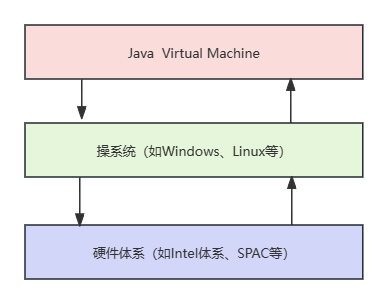

为什么要在程序和操作系统中间添加一个JVM？

Java 是一门抽象程度特别高的语言，提供了自动内存管理等一系列的特性。这些特性直接在操作系统上实现是不太可能的，所以就需要 JVM 进行一番转换。有了 JVM 这个抽象层之后，Java 就可以**实现跨平台**了。JVM 只需要保证能够正确执行 .class 文件，就可以运行在诸如 Linux、Windows、MacOS 等平台上了。而 Java 跨平台的意义在于**一次编译，处处运行**，能够做到这一点 JVM 功不可没。

## 2、主流虚拟机有哪些？

- JCP组织（Java Community Process 开放的国际组织 ）：**Hotspot虚拟机**（Open JDK版），sun2006年开源
- Oracle：Hotspot虚拟机（Oracle JDK版），闭源，允许个人使用，商用收费
- BEA：JRockit虚拟机
- IBM：J9虚拟机
- 阿里巴巴：Dragonwell JDK（龙井虚拟机），电商物流金融等领域，高性能要求。


## 3、结构图

**JVM的作用：**加载并执行Java字节码文件(.class) - 加载字节码文件、分配内存（运行时数据区）、运行程序

**JVM的特点：**一次编译到处运行、自动内存管理、自动垃圾回收


- 类加载器子系统：将字节码文件（.class）加载到内存中的方法区
- 运行时数据区：
  - 方法区：存储已被虚拟机加载的类的**元数据信息(元空间)**。也就是存储字节码信息。
  - 堆：**存放对象实例**，几乎所有的对象实例都在这里分配内存。
  - 虚拟机栈(java栈)：虚拟机栈描述的是**Java方法执行的内存模型**。每个方法被执行的时候都会创建一个**栈帧**（Stack Frame）用于存储局部变量表、操作数栈、动态链接、方法出口等信息
  - 本地方法栈：本地方法栈则是**记录**虚拟机当前使用到的**native方法**。
  - 程序计数器：当前线程所执行的字节码的**行号指示器**。

- 本地方法接口：虚拟机使用到的native类型的方法，负责调用操作系统类库。（例如Thread类中有很多Native方法的调用）
- 执行引擎：包含解释器、即时编译器和垃圾收集器 ，负责执行加载到JVM中的字节码指令。

**注意：**

- 多线程共享方法区和堆；
- Java栈、本地方法栈、程序计数器是每个线程私有的。


## 3、执行引擎Execution Engine

**Execution Engine**执行引擎负责解释命令(将字节码指令解释编译为机器码指令)，提交操作系统执行。


JVM执行引擎通常由两个主要组成部分构成：**解释器和即时编译器（Just-In-Time Compiler，JIT Compiler）**。

1. 解释器：当Java字节码被加载到内存中时，解释器逐条解析和执行字节码指令。解释器逐条执行字节码，将每条指令转换为对应平台上的本地机器指令。由于解释器逐条解析执行，因此执行速度相对较慢。但解释器具有优点，即可立即执行字节码，无需等待编译过程。
2. 即时编译器（JIT Compiler）：为了提高执行速度，JVM还使用即时编译器。即时编译器将字节码动态地编译为本地机器码，以便直接在底层硬件上执行。即时编译器根据运行时的性能数据和优化技术，对经常执行的热点代码进行优化，从而提高程序的性能。即时编译器可以将经过优化的代码缓存起来，以便下次再次执行时直接使用。

JVM执行引擎还包括其他一些重要的组件，如**即时编译器后端、垃圾回收器、线程管理器**等。这些组件共同协作，使得Java程序能够在不同的操作系统和硬件平台上运行，并且具备良好的性能。


## 4、本地方法接口Native Interface

本地接口的作用是融合不同的编程语言为 Java 所用，于是就在内存中专门开辟了一块区域处理标记为native的代码，它的具体做法是 Native Method Stack中登记 native方法，在Execution Engine 执行时加载native libraies。

例如**Thread类**中有一些标记为native的方法：

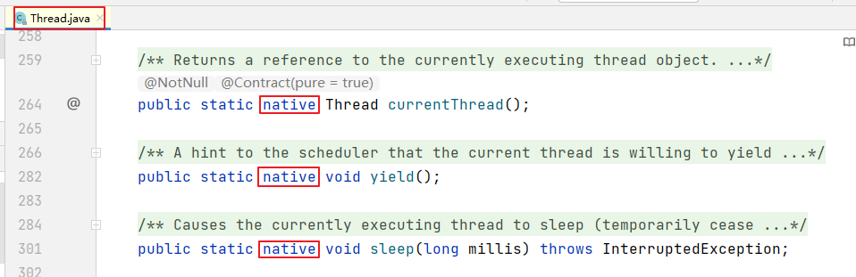


## 5、Native Method Stack

本地方法栈存储了从Java代码中调用本地方法时所需的信息。是**线程私有**的。


## 6、PC寄存器(程序计数器)

每个线程都有一个程序计数器，是**线程私有**的，就是一个指针，指向方法区中的方法字节码（用来存储指向下一条指令的地址，即 将要执行的指令代码），由执行引擎读取下一条指令，是一个非常小的内存空间，几乎可以忽略不记。


# 第02章 类加载器ClassLoader

- 负责加载class文件，class文件在文件开头有特定的文件标识(cafe babe)。
- ClassLoader只负责class文件的加载，至于它是否可以运行，则由Execution Engine决定。
- 加载的类信息存放到方法区的内存空间。

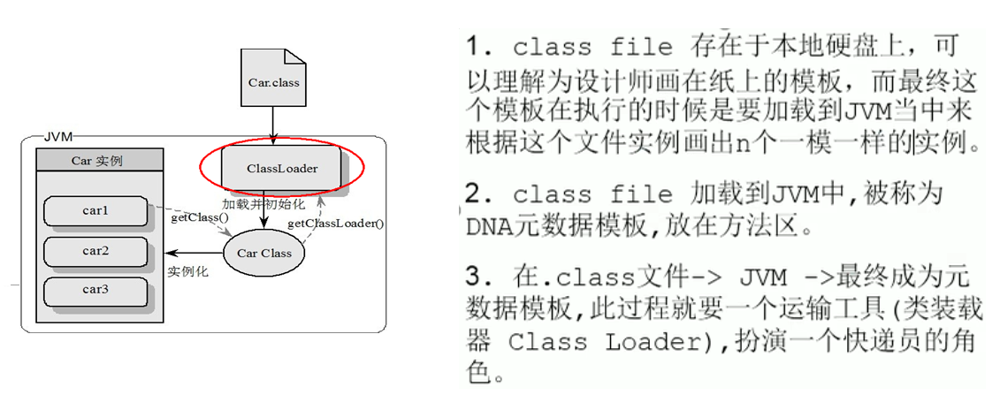

## 1、 类的加载过程

**类加载过程**主要分为三个步骤：**加载**、**链接**、**初始化**，而其中链接过程又分为三个步骤：**验证**、**准备**、**解析**，加上**使用、卸载**两个步骤统称为为类的生命周期。

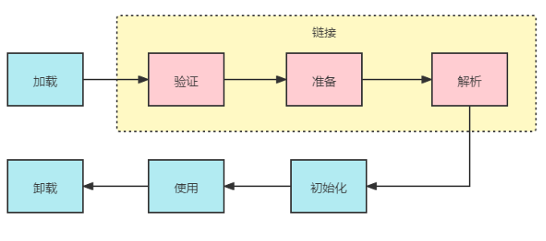

**阶段一：加载**

- 通过一个类的全限定名获取定义此类的二进制字节流
- 将这个字节流代表的静态存储结构转为方法区运行时数据结构
- **在内存中生成一个代码这个类的java.lang.Class对象**，作为方法区这个类的各种数据的访问入口

结论：类加载为懒加载

**阶段二：链接**

- 验证：验证阶段主要是为了为了确保Class文件的字节流中包含的信息符合虚拟机要求，并且不会危害虚拟机
- 准备：
  - 为类的**静态变量**分配内存并且设置该类变量的默认初始值，即**赋初值**(虚拟机赋默认值，不是代码指定的值)
  - **实例变量**是在创建对象的时候完成赋值，且实例变量随着对象一起分配到Java堆中
  - **final修饰的常量**在编译的时候会分配，准备阶段直接完成赋值，即没有赋初值这一步。被所有线程所有对象共享
- 解析：将**符号引用**替换为**直接引用**
  - 符号引用：以一组**符号来描述**所引用的目标，符号可以是任何形式的**字面量**，只要使用时能无歧义地定位到目标即可
  - 直接引用：可以**直接**指向目标的指针，而直接引用必须引用的目标已经**在内存中存在**

**阶段三：初始化**

​	初始化阶段是执行类构造器 <clinit>()（类构造器是加载类时，虚拟机给每一个自动生成，为类初始化做准备的，调用静态初始化块）的过程。这一步主要的目的是：根据程序员程序编码制定的主观计划去初始化类变量和其他资源。

## 2、类加载器的作用

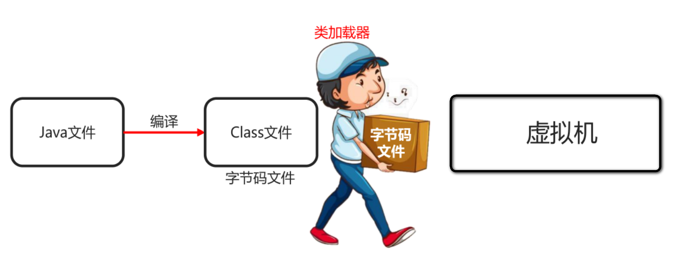

负责加载class文件，class文件在文件开头有的文件标识**（CA FE BA BE）**，并且ClassLoader只负责class文件的加载，至于它是否可以运行，则由Execution Engine决定。

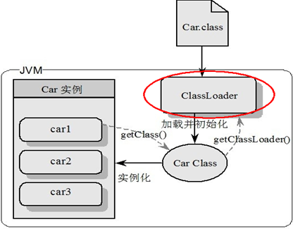

```java
public class ClassLoaderDemo1 {
    public static void main(String[] args) {
        Car car = new Car();
        Class<? extends Car> aClass = car.getClass(); //由对象得到类模板
        ClassLoader classLoader = aClass.getClassLoader(); //由类模板得到类加载器(快递员)
        System.out.println(classLoader); //Car的类加载器是AppClassLoader
    }
}
class Car
{
    Integer id;
    String  carName;
}
```


## 3、类加载器分类

分为四种，前三种为虚拟机自带的加载器。

- 启动类加载器（BootstrapClassLoader）：由C++实现。
- 扩展类加载器（ExtClassLoader/PlatformClassLoader）：由Java实现，派生自ClassLoader类。
- 应用程序类加载器（AppClassLoader）：也叫系统类加载器。由Java实现，派生自ClassLoader类。
- 自定义加载器 ：程序员可以定制类的加载方式，派生自ClassLoader类。


**Java 9之前的ClassLoader**

- Bootstrap ClassLoader加载$JAVA_HOME中jre/lib/rt.jar，加载JDK中的核心类库
- ExtClassLoader加载相对次要、但又通用的类，主要包括$JAVA_HOME中jre/lib/ext/*.jar或-Djava.ext.dirs指定目录下的jar包
- AppClassLoader加载-cp指定的类，加载用户类路径中指定的jar包及目录中class

**Java 9及之后的ClassLoader**

- Bootstrap ClassLoader，使用了模块化设计，加载lib/modules启动时的基础模块类，java.base、java.management、java.xml
- ExtClassLoader更名为PlatformClassLoader，使用了模块化设计，加载lib/modules中平台相关模块，如java.scripting、java.compiler。
- AppClassLoader加载-cp，-mp指定的类，加载用户类路径中指定的jar包及目录中class


**查看类加载器的层级关系：**

```java
public class ClassLoaderDemo2 {

    public static void main(String[] args) {

        ClassLoaderDemo2 demo2 = new ClassLoaderDemo2();
        
        //AppClassLoader
        System.out.println(demo2.getClass().getClassLoader()); 
        System.out.println(ClassLoader.getSystemClassLoader());
        
        //PlatformClassLoader
        System.out.println(demo2.getClass().getClassLoader().getParent()); 
        
        //null(BootstrapClassLoader)
        System.out.println(demo2.getClass().getClassLoader().getParent().getParent()); 
        
        //null(BootstrapClassLoader)
        String s = new String();
        System.out.println(s.getClass().getClassLoader()); 
    }
}
```

注意，这里的父子关系并不是代码中的extends的关系，而是逻辑上的父子。


## 4、双亲委派模型


如果一个类加载器收到了类加载的请求，它首先不会自己去尝试加载这个类，**而是把请求委托给父加载器去完成，依次向上**：

- 1、当AppClassLoader加载一个class时，它首先不会自己去尝试加载这个类，而是把类加载请求委派给父类加载器PlatformClassLoader去完成。
- 2、当PlatformClassLoader加载一个class时，它首先也不会自己去尝试加载这个类，而是把类加载请求委派给父类加载器BootStrapClassLoader去完成。
- 3、如果BootStrapClassLoader加载失败，会用PlatformClassLoader来尝试加载；
- 4、若PlatformClassLoader也加载失败，则会使用AppClassLoader来加载
- 5、如果AppClassLoader也加载失败，则会报出异常ClassNotFoundException


其实这就是所谓的**双亲委派模型**。简单来说：如果一个类加载器收到了类加载的请求，它首先不会自己去尝试加载这个类，而是把**请求委托给父加载器去完成，依次向上**。


**目的：**

一，性能，避免重复加载；

二，安全性，避免核心类被修改。


# 第03章 方法区Method Area

## 1、方法区存储什么

方法区是被所有**线程共享**。《深入理解Java虚拟机》书中对方法区存储内容的**经典描述**如下：它用于存储已被虚拟机加载的类型信息、常量、静态变量、即时编译器编译后的代码缓存等：


## 2、方法区演进细节

**Hotspot中方法区的变化：**

 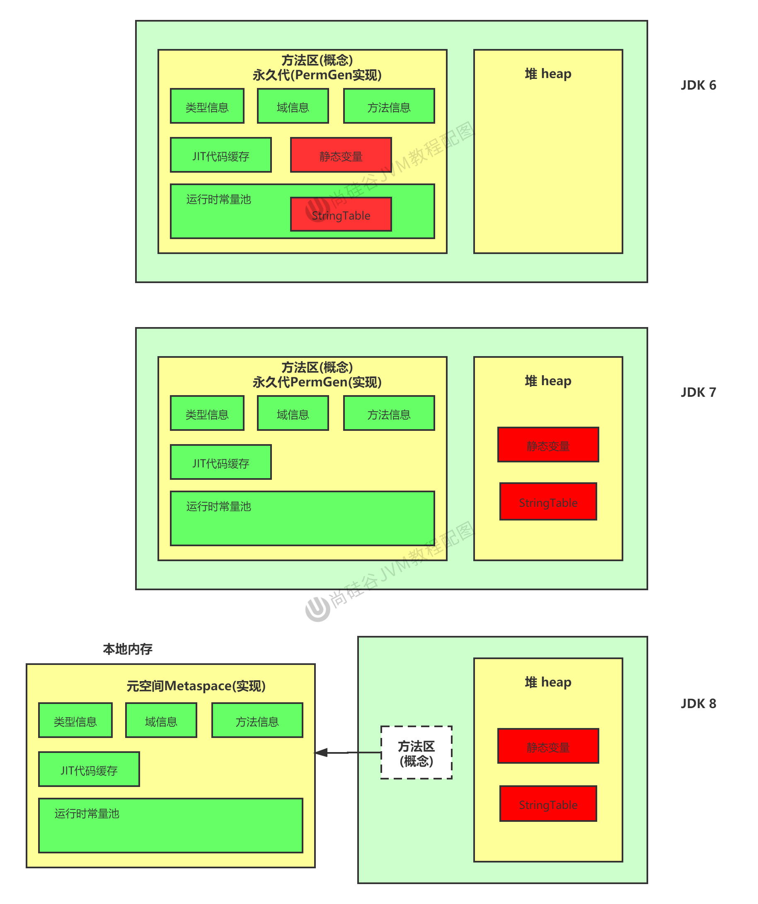

**方法区(永久代（JDK7及以前）、元空间（JDK8以后）)**

* **方法区**是 JVM 规范中定义的一块内存区域，用来存储类元数据、方法字节码、即时编译器需要的信息等
* **永久代**是 Hotspot 虚拟机对 JVM 规范的实现（1.8 之前）
* **元空间**是 Hotspot 虚拟机对 JVM 规范的另一种实现（1.8 以后），使用本地内存作为这些信息的存储空间


# 第04章 虚拟机栈stack

## 1、Stack 栈是什么？

- 栈也叫栈内存，主管Java程序的运行，是在线程创建时创建，每个线程都有自己的栈，它的生命周期是跟随线程的生命周期，线程结束栈内存也就释放，**是线程私有的**。
- 线程上正在执行的每个方法都各自对应一个**栈帧（Stack Frame）**。

## 2、栈运行原理

```java
public class StackDemo {

    public static void main(String[] args) {
        System.out.println("main()开始");
        StackDemo test = new StackDemo();
        test.method2();
        System.out.println("main()结束");
    }

    public void method2(){
        System.out.println("method2()执行...");
        this.method3();
        System.out.println("method2()结束...");
    }

    public void method3() {
        System.out.println("method3()执行...");
        this.method4();
        System.out.println("method3()结束...");
    }

    public void method4() {
        System.out.println("method4()执行...");
        System.out.println("method4()结束...");
    }
}
```


- JVM对Java栈的操作只有两个，就是对栈帧的**压栈和出栈**，遵循“先进后出”或者“后进先出”原则。
- 一个线程中只能由一个正在执行的方法（当前方法），因此对应只会有一个活动的**当前栈帧**。

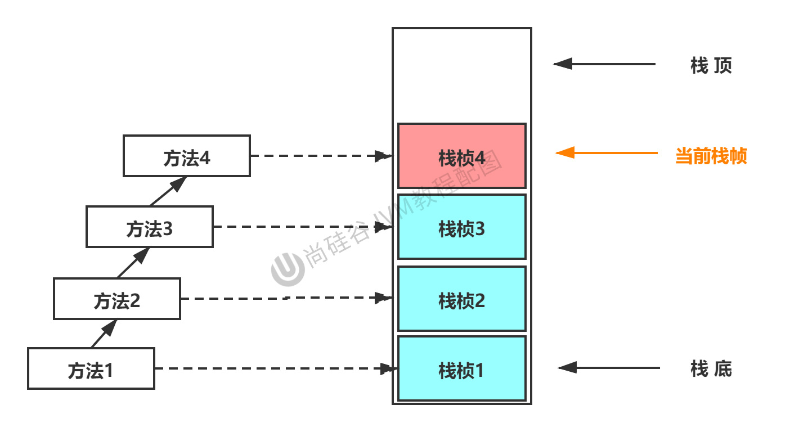

当一个方法1（main方法）被调用时就产生了一个栈帧1 并被压入到栈中，栈帧1位于栈底位置

方法1又调用了方法2，于是产生栈帧2 也被压入栈，

方法2又调用了方法3，于是产生栈帧3 也被压入栈，

……

执行完毕后，先弹出栈帧4，再弹出栈帧3，再弹出栈帧2，再弹出栈帧1，线程结束，栈释放。


## 3、栈存储什么?

栈中的数据都是以栈帧（Stack Frame）的格式存在。栈帧是一个内存区块，是一个数据集，包含方法执行过程中的各种数据信息。

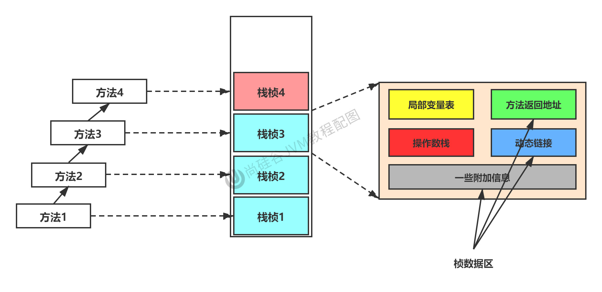

### 4.1、局部变量表（Local Variables）

也叫本地变量表。

**作用：**存储方法参数和方法体内的局部变量：8种基本类型变量、对象引用（reference）。

可以用如下方式查看字节码中一个方法内定义的的局部变量，当程序运行时，**这些局部变量会被加载到局部变量表中。**

```java
public class LocalVariableTableDemo {

    public static void main(String[] args) {
        int i = 100;
        String s = "hello";
        char c = 'c';
        Date date = new Date();
    }
}
```


查看局部变量：

可以使用**javap -  *.class** 命令，或者idea中的**jclasslib**插件。

**注意：**以下方式看到的是加载到方法区中的字节码中的局部变量表，当程序运行时，局部变量表会被动态的加载到栈帧中的局部变量表中

```shell
类路径> javap -v 类名.class
```

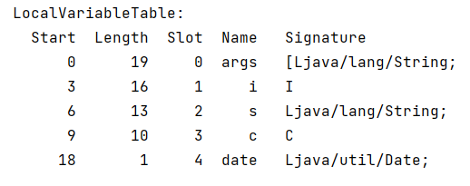

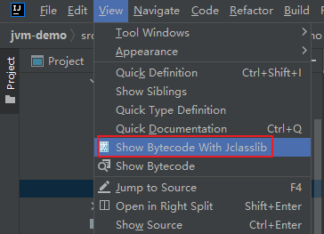

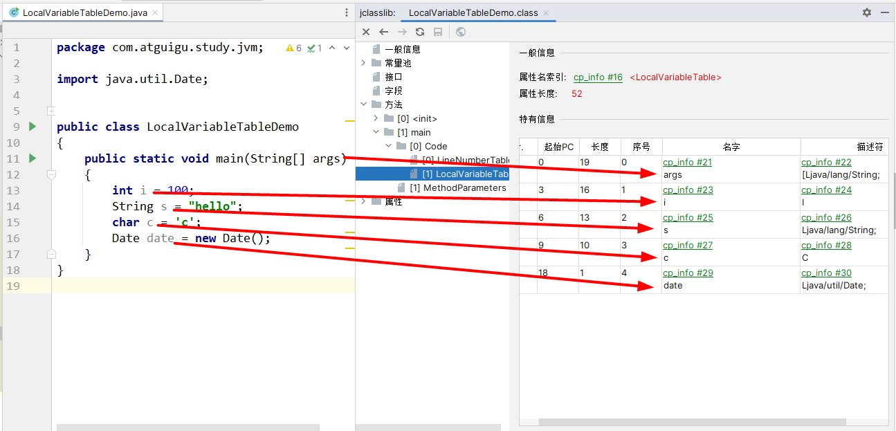


### 4.2、操作数栈（Operand Stack）

**作用：**也是一个栈，在方法执行过程中根据字节码指令记录当前操作的数据，将它们入栈或出栈。用于保存计算过程的中间结果，同时作为计算过程中变量的临时存储空间。

```java
public class OperandStackDemo {

    public static void main(String[] args) {
        int i = 15;
        int j = 8;
        int k = i + j;
    }
}
```

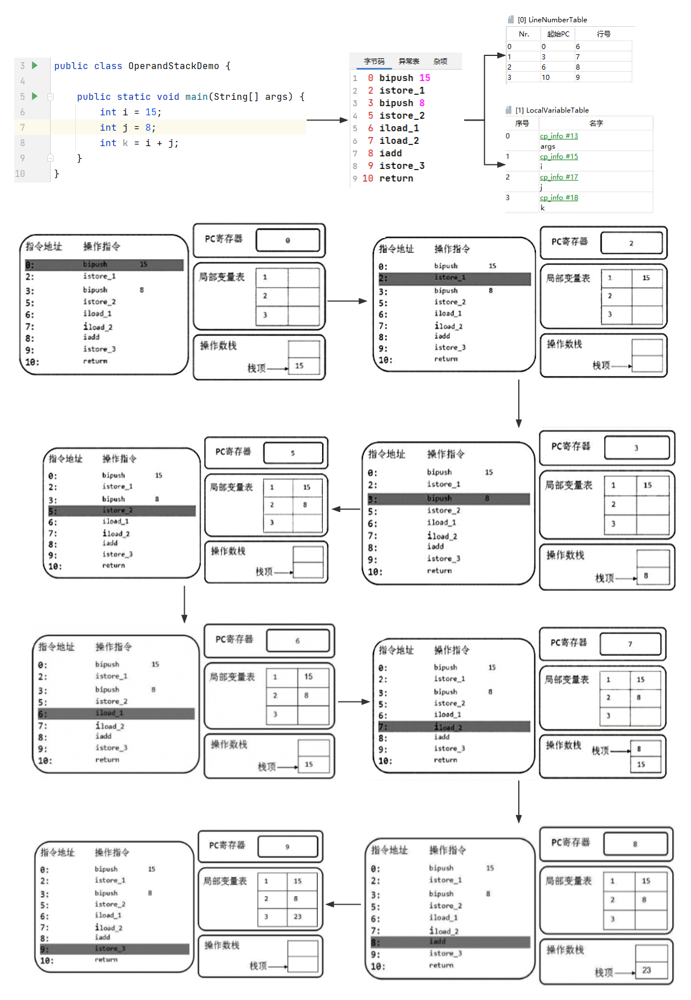


### 4.3、动态链接（Dynamic Linking）

**作用：**可以知道当前帧执行的是哪个方法。**指向运行时常量池中方法的符号引用。**程序真正执行时，类加载到内存中后，符号引用会换成直接引用。

```java
public class DynamicLinkingDemo {

    public void methodA(){
        methodB(); //方法A引用方法B
    }

    public void methodB(){

    }
}
```

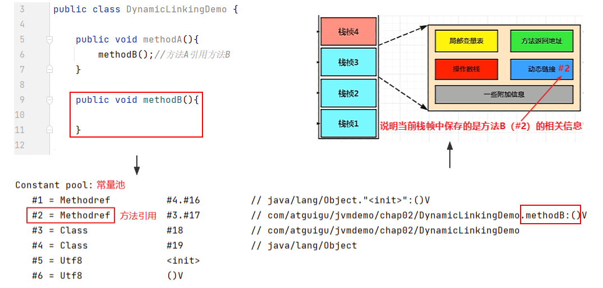


### 4.4、方法返回地址（Return Address）

**作用：**可以知道调用完当前方法后，上一层方法接着做什么，**即“return”到什么位置去**。存储当前方法调用完毕

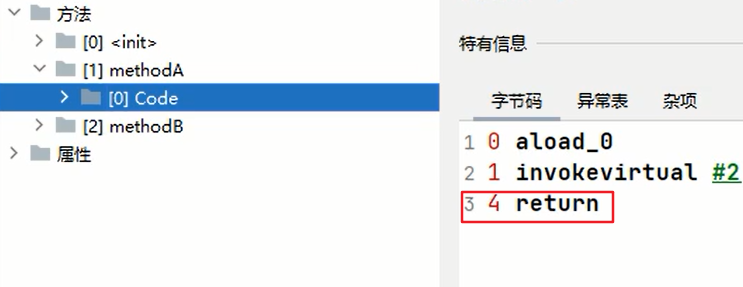

### 4.5、完整的内存结构图如下

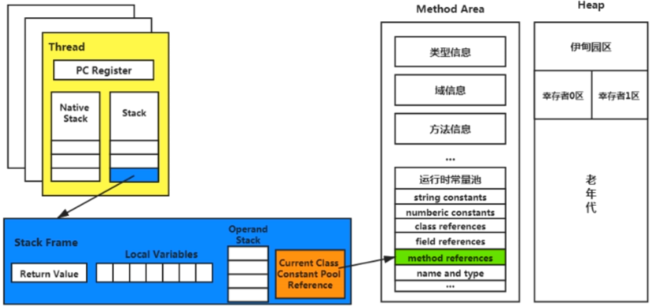

### 4.6、 栈溢出

```java
/**
 * 未设置栈大小默认：11416次
 * 设置VM参数：-Xss256k 2475次
 */
public class StackOOMDemo {

    public static int count = 1;

    public static void main(String[] args) {
        System.out.println(count);
        count++;
        main(args);
    }
}
```

**常见问题栈溢出**：Exception in thread "main" java.lang.StackOverflowError通常出现在递归调用时。

问题辨析：

- 垃圾回收是否涉及栈内存？

  不涉及，因为栈内存在方法调用结束后都会自动弹出栈。

- 方法内的局部变量是线程安全的吗？

  当方法内局部变量没有逃离方法的作用范围时线程安全，**因为一个线程对应一个栈，每调用一个方法就会新产生一个栈桢，都是线程私有的局部变量**，当变量是static时则不安全，因为是线程共享的。

### 4.7、设置栈的大小

在StackRecurrenceDemo中添加count变量：

```java
public class StackRecurrenceDemo{
    private static AtomicLong atomicLong = new AtomicLong(0);
    public static void test(){
        System.out.println(atomicLong.getAndIncrement());
        test();
    }
    public static void main(String[] args) {
        StackRecurrenceDemo.test();
    }
}
```

```java
// 使用默认栈大小，没有任何配置，默认运行次数
```


```java
// 使用配置，设置栈为1MB，下面可以3选一
-Xss1m  
-Xss1024k
-Xss1048576
完整的写法是： -XX:ThreadStackSize=1m  
```

在idea中设置，本次案例：


或者在在命令行中设置，第2种方法：

```bash
java -Xss1m YourClassName
```

配置后效果


# 第05章 堆heap

## 1、堆体系概述

### 1.1、堆、栈、方法区的关系

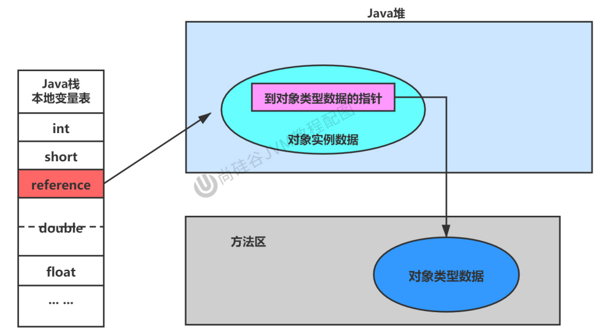

HotSpot是使用指针的方式来访问对象：

- Java堆中会存放指向类元数据的地址

- Java栈中的reference存储的是指向堆中的对象的地址

 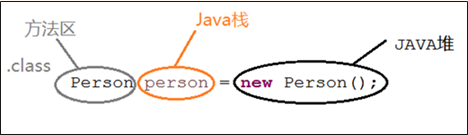

### 1.2、堆空间概述

- 一个Java程序运行起来对应一个进程，一个进程对应一个JVM实例，一个JVM实例中有一个运行时数据区。
- 堆是Java内存管理的核心区域，在JVM启动的时候被创建，堆内存的大小是可以调节的。


### 1.3、分代空间

#### 1.3.1、堆空间划分

堆内存**逻辑**上分为三部分：

- Young Generation Space  				新生代/年轻代                    Young/New
- Tenured generation space  	       养老代/老年代                   Old/Tenured
- Permanent Space/Meta Space     永久代/元空间                    Permanent/Meta

新生代又划分为：

- 新生代又分为两部分： 伊甸园区（Eden space）和幸存者区（Survivor pace） 。

- 幸存者区有两个： 0区（Survivor 0 space）和1区（Survivor 1 space）。

#### 1.3.2、JDK1.7及之前堆空间

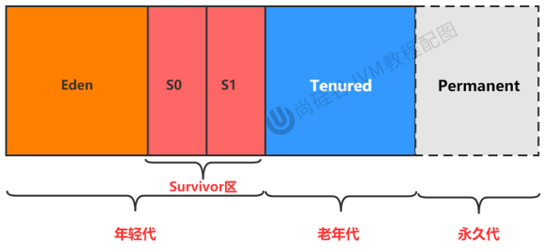


#### 1.3.3、JDK1.8及之后堆空间

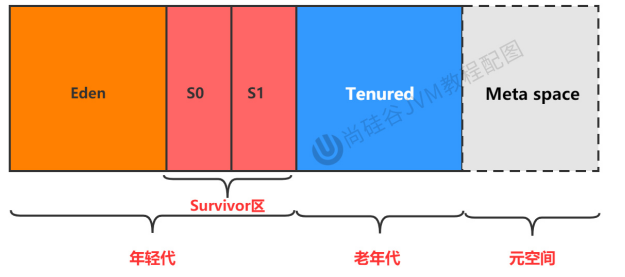


**注意：**方法区（具体的实现是永久代和元空间）逻辑上是堆空间的一部分，但是虚拟机的实现中将方法区和堆分开了，如下图：

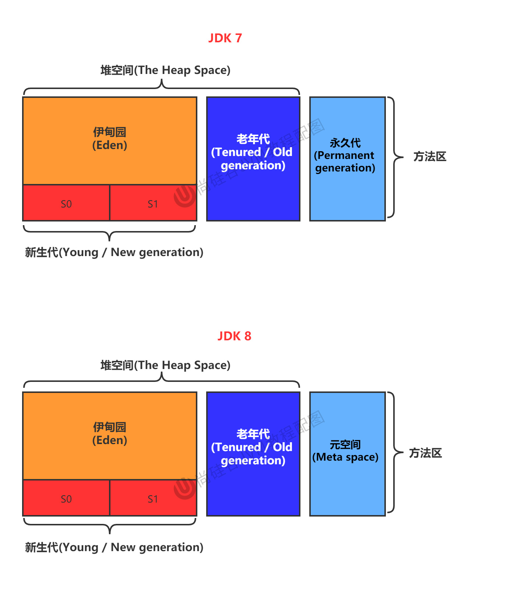

## 2、分代空间工作流程

存储在JVM中的Java对象可以被划分为两类：

- 一类是生命周期较短的对象，创建在新生代，在新生代中被垃圾回收。
- 一类是生命周期非常长的对象，创建在新生代，在老年代中被垃圾回收，甚至与JVM生命周期保持一致。
- 几乎所有的对象创建在伊甸园区，绝大部分对象销毁在新生代，大对象直接进入老年代。


### 2.1、新生代

**工作过程：**

（1）新创建的对象先放在伊甸园区。

（2）当伊甸园的空间用完时，程序又需要创建新对象，此时，触发JVM的垃圾回收器对伊甸园区进行垃圾回收（Minor GC，也叫Young GC），将伊甸园区中不再被引用的对象销毁。

（3）然后将伊甸园区的剩余对象移动到空的幸存0区。

（4）此时，伊甸园区清空。

（5）被移到幸存者0区的对象上有一个年龄计数器，值是1。

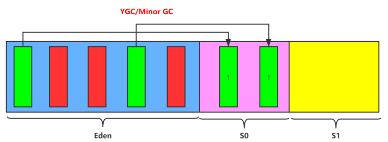


（6）然后再次将新对象放入伊甸园区。

（7）如果伊甸园区的空间再次用完，则再次触发垃圾回收，对伊甸园区和s0区进行垃圾回收，销毁不再引用的对象。

（8）此时s1区为空，然后将伊甸园区和s0区的剩余对象移动到空的s1区。

（9）此时，伊甸园区和s0区清空。

（10）从伊甸园区被移到s1区的对象上有一个年龄计数器，值是1。从s0区被移到s1区的对象上的年龄计数器+1，值是2。

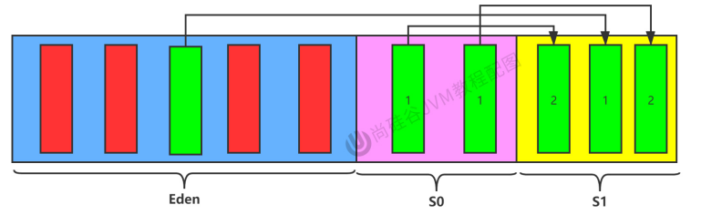


（11）然后再次将新对象放入伊甸园区。如果再次经历垃圾回收，那么伊甸园区和s1区的剩余对象移动到s0区。对象上的年龄计数器+1。

（12）当对象上的年龄计数器达到15时（**-XX:MaxTenuringThreshold**），则晋升到老年代。

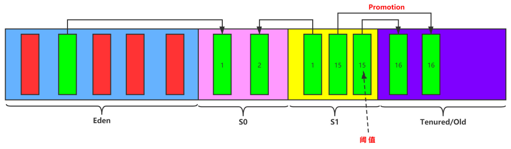

**总结：**

- 针对幸存者s0，s1，GC之后有交换，谁空谁是to

- 垃圾回收时，**伊甸园区和from区对象会被移动到to区**

  


### 2.2、老年代

经历**多次Minor GC**仍然存在的对象（默认是15次）会被移入老年代，老年代的对象比较稳定，不会频繁的GC。若老年代也满了，那么这个时候将**产生Major GC（同时触发Full GC）**，进行老年代的垃圾回收。若老年代执行了Major GC之后发现依然无法进行对象的保存，就会**产生OOM异常OutOfMemoryError**。


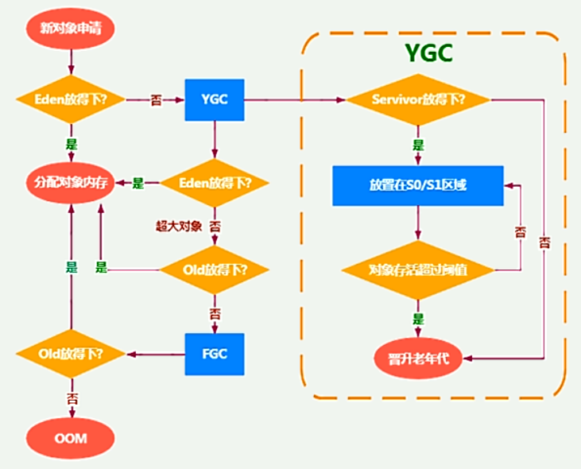


### 2.3、永久代/元空间

方法区是一个常驻内存区域，用于存放JDK自身所携带的 Class，Interface 的元数据，也就是说它存储的是运行环境必须的类信息，方法区的回收效率很低，在full gc的时候才会触发。而full gc是老年代的空间不足、方法区不足时才会触发。如果出现 **java.lang.OutOfMemoryError:PermGen space**/**java.lang.OutOfMemoryError:Meta space**，说明是Java虚拟机对永久代内存设置不够。一般出现这种情况，都是程序启动需要加载大量的第三方jar包。例如：在一个Tomcat下部署了太多的应用。或者大量动态反射生成的类不断被加载，最终导致Perm区被占满。


尽管方法区在逻辑上属于堆的一部分，对于HotSpotJVM而言，方法区还有一个别名叫做Non-Heap(非堆)，目的就是要和堆分开。对于HotSpot虚拟机，很多开发者习惯将方法区称之为永久代 ，但严格说两者不同，或者说是使用永久代来实现方法区而已。


### 2.4、GC总结

- 频繁回收新生代
- 很少回收老年代
- 几乎不动方法区


**部分收集：**

- 年轻代收集（Minor GC  /  Young GC）：新生代垃圾收集（伊甸园区 + 幸存者区）
- 老年代收集（Major GC / FullGC）：老年代垃圾收集
- 混合收集（Mixed GC）：收集整个新生代以及部分老年代。**G1垃圾收集器**有这种方式

**整堆收集（Full GC）：**

- 整个Java堆的垃圾收集和方法区的垃圾收集


**年轻代GC触发机制（Minor GC ）：**

年轻代的Eden空间不足，触发Minor GC。

每次Minor GC在清理Eden的同时会清理Survivor From区。

Minor GC非常频繁，回收速度块。

引发STW（Stop The World），暂停其他用户线程，垃圾回收结束，用户线程恢复。


**老年代GC触发机制（Full GC ）：**

老年代满了，对象从老年代消失是因为发生了Major GC 。

Major GC比Minor GC速度慢10倍以上，STW时间更长。

如果Major GC后，内存还不足，就报OOM。


**Full GC触发机制：**

Full GC（Full Garbage Collection）是Java虚拟机对堆内存中的所有对象进行全面回收的过程。Full GC的执行时机取决于Java虚拟机的实现和具体的垃圾回收策略。

一般情况下，Full GC发生的情况包括：

1. 当堆内存空间不足以分配新对象时，会触发一次Full GC。这种情况下，Java虚拟机会先执行一次新生代的垃圾回收（Minor GC），如果仍然无法满足内存需求，则会执行Full GC。
2. 在某些垃圾回收器中，当老年代空间不足以容纳晋升到老年代的对象时，会执行Full GC。这通常发生在长时间运行的应用程序中，随着对象的逐渐增加，老年代空间可能会变得不足。
3. 手动调用System.gc()方法或Runtime.getRuntime().gc()方法可以触发Full GC。但值得注意的是，这只是建议Java虚拟机进行垃圾回收的请求，并不能保证立即执行Full GC。

需要注意的是，Full GC是一项资源密集型的操作，会导致应用程序的停顿时间增加，因为在Full GC期间，应用程序的线程会被挂起。因此，在设计和开发应用程序时，应尽量避免频繁触发Full GC，以减少对应用程序性能的影响。


## 3、JVM结构总结

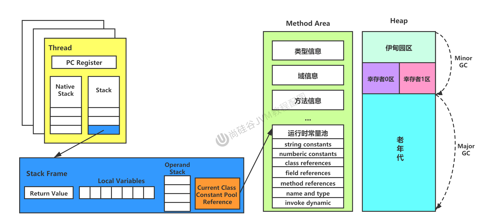


## 4、堆参数

### 4.1、查看堆内存大小

```java
/**
 * 查看堆内存大小
 */
public class HeapSpaceInitialDemo {
    public static void main(String[] args) {

        //返回Java虚拟机中的堆内存总量
        long initialMemory = Runtime.getRuntime().totalMemory() / 1024;
        //返回Java虚拟机试图使用的最大堆内存量
        long maxMemory = Runtime.getRuntime().maxMemory() / 1024;

        //起始内存
        System.out.println("-Xms : " + initialMemory + "K，" + initialMemory / 1024 + "M");
        //最大内存
        System.out.println("-Xmx : " + maxMemory + "K，" + maxMemory / 1024 + "M");
    }
}
```

- **-Xms**表示堆的起始内存，等价于-XX:InitialHeapSize，默认是物理电脑内存的1/64。

- **-Xmx**表示堆的最大内存，等价于-XX:MaxHeapSize，默认是物理电脑内存的1/4。

  

### 4.2、设置堆内存大小

- **-Xmn** 表示新生代堆大小，等价于-XX:NewSize，默认新生代占堆的**1/3空间**，老年代占堆的**2/3空间**。

使用下面的VM options参数启动HeapSpaceInitialDemo，

```shell
-Xms600m -Xmx600m -Xmn200m
```

**通常会将-Xms和-Xmx配置相同的值**，目的是为了在Java垃圾回收机制清理完堆区后，不需要重新分隔计算堆区的大小，从而提高性能。


### 4.3、OOM演示

**OOM异常：**

JVM启动时，为堆分配起始内存，当堆中数据超过-Xmx所指定的最大内存时，将会抛出**java.lang.OutOfMemoryError: Java heap space**  异常，此时说明Java虚拟机堆内存不够。


**原因有二：**

（1）Java虚拟机的**堆内存设置不够**，可以通过参数-Xms、-Xmx来调整。

（2）代码中创建了大量大对象，并且长时间**不能被垃圾收集器收集**（存在被引用）。


-Xlog:gc*

**OOM演示：**

```java
import java.util.ArrayList;

/**
 * JDK8使用
 * -Xms30m -Xmx30m -XX:+PrintGCDetails
 *
 * JDK17使用，-XX:+PrintGCDetails参数在JDK17版本中不再被推荐
 * [warning][gc] -XX:+PrintGCDetails is deprecated. Will use -Xlog:gc* instead.
 * -Xms30m -Xmx30m -Xlog:gc*
 */
public class OOMDemo
{
    public static void main(String[] args) throws InterruptedException {
        ArrayList<Dog> list = new ArrayList<>();
        while(true){

            System.out.print("最大堆大小：Xmx=");
            System.out.println(Runtime.getRuntime().maxMemory() / 1024.0 / 1024 + "M");

            System.out.print("剩余堆大小：free mem=");
            System.out.println(Runtime.getRuntime().freeMemory() / 1024.0 / 1024 + "M");

            System.out.print("当前堆大小：total mem=");
            System.out.println(Runtime.getRuntime().totalMemory() / 1024.0 / 1024 + "M");

            //list.add(new byte[1*1024*1024]); //1MB
            list.add(new Dog());

            Thread.sleep(100);
            System.out.println();
        }
    }
}

class Dog
{
    Integer id;
    String  dogName;
    byte[] bytes = new byte[1*1024*1024];//1MB
}
```

上述程序出现了OOM异常，该如何分析？

### 4.4、 使用VisualVM工具进行内存分析

#### 4.4.1、VisualVM的下载

自JDK14起，原生JDK已不再集成jvisualvm，需要自己去visualvm官网下载。

下载地址:	https://visualvm.github.io/download.html


#### 4.4.2、VisualVM的安装

下载完成后，在**etc文件夹**下找到**visualvm.conf**文件，打开，并设置自己本机javahome路径


#### 4.4.3、VisualVM的启动

在bin文件夹下找到visualvm.exe启动程序，启动visualvm


## 5、VisualVM的使用

#### 5.1、OOM时自动生成堆内存快照

VisualVM工具：打开jvisualvm工具  ----> 载入文件 ----> 查看类实例数最多的并且和业务相关的对象  ----> 查看线程的报错信息

| 1    | 自己本机新建路径D:\myDump，目的是对应参数-XX:HeapDumpPath=D:\myDump |
| ---- | ------------------------------------------------------------ |
| 2    | -Xms20m -Xmx20m -XX:+PrintGCDetails -XX:+HeapDumpOnOutOfMemoryError -XX:HeapDumpPath=D:\myDump |
|      | -XX:+HeapDumpOnOutOfMemoryError：开启内存溢出时自动生成内存快照<br/>-XX:HeapDumpPath=/xxx/dump.hprof：指定dump文件的位置和文件名称 |

**OOM演示：**

```java
/**
 * -Xms20m -Xmx20m -Xlog:gc* -XX:+HeapDumpOnOutOfMemoryError -XX:HeapDumpPath=D:\myDump
 */
public class OOMDemo {
    public static void main(String[] args) throws InterruptedException {
        ArrayList<Dog> list = new ArrayList<>();
        while(true){

            System.out.print("最大堆大小：Xmx=");
            System.out.println(Runtime.getRuntime().maxMemory() / 1024.0 / 1024 + "M");

            System.out.print("剩余堆大小：free mem=");
            System.out.println(Runtime.getRuntime().freeMemory() / 1024.0 / 1024 + "M");

            System.out.print("当前堆大小：total mem=");
            System.out.println(Runtime.getRuntime().totalMemory() / 1024.0 / 1024 + "M");

            list.add(new Dog()); //1MB
            Thread.sleep(100);
        }
    }
}
class Dog
{
    Integer id;
    String  dogName;
    byte[] bytes = new byte[1*1024*1024];//1MB
}
```


上述程序报了OOM异常，如何分析?

#### 5.2、jvisualvm工具进行OOM分析

第一步，在我们本地新建的D:\myDump路径下会看到新生成的内存文件java_pid22172.hprof


第二步，在我们本地新建的D:\myDump路径下会看到新生成的内存文件java_pid22172.hprof导入进VIsualVm


第三步，查看并分析哪里出了问题


# 第06章 垃圾回收GC

## 1、Java的内存管理

Java中为了简化对象的释放，引入了自动的垃圾回收（**Garbage Collection简称GC**）机制。通过垃

圾回收器来对不再使用的对象完成自动的回收，垃圾回收器主要负责对**堆**上的内存进行回收。其他

很多现代语言比如C#、Python、Go都拥有自己的垃圾回收器。

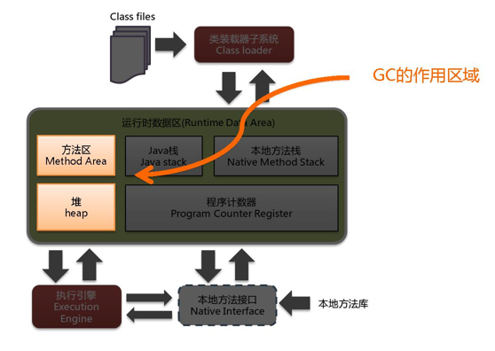

线程不共享的部分，都是伴随着线程的创建而创建，线程的销毁而销毁。因此线程不共享的程序计数器、虚拟机栈、本地方法栈中没有垃圾回收。


## 2、方法区的垃圾回收

### 2.1、类的生命周期

- 加载
- 链接
  - 验证：验证内容是否满足《Java虚拟机规范》
  - 准备：给静态变量赋初值
  - 解析：将常量池中的符号引用替换成指向内存的直接引用
- 初始化
- 使用
- **卸载：在方法区中的类是如何进行垃圾回收的**


### 2.2、方法区回收

方法区中能回收的内容主要就是不再使用的类。判定一个类可以被卸载。需要同时满足下面三个条件：

1、此类所有实例对象没有在任何地方被引用，在堆中不存在任何该类的实例对象以及子类对象。

```java
Car car = new Car();
car = null;
```


2、该类对应的 java.lang.Class 对象没有在任何地方被引用。

```java
Car car = new Car(); 
Class<? extends Car> aClass = car.getClass(); 
car = null;
aClass = null;
```


3、加载该类的类加载器没有在任何地方被引用。

```java
Car car = new Car(); 
Class<? extends Car> aClass = car.getClass(); 
ClassLoader classLoader = aClass.getClassLoader();

car = null;
aClass = null;
classLoader = null;
```


**总结：**方法区的回收通常情况下很少发生，但是如果通过自定义类加载器加载特定的是少数的类，那么可以在程序中释放自定义类加载器的引用，卸载当前类，垃圾回收及会对这部分内容进行回收


## 3、如何判断对象是不是垃圾

**如何判断堆上的对象可以回收？**

<font color='red'>先说结论，如何判断一个对象是否是垃圾，两个算法来决定，分别是：
引用计数算法 和 根可达算法
</font>

Java中的对象是否能被回收，是根据对象是否被引用来决定的。如果对象被引用了，说明该对象还

在使用，不允许被回收。

```java
public class Demo {
	public static void main(String[]args){
		Demo demo = new Demo();
        demo = null;
    }
}
```

**如何判断堆上的对象没有被引用？**

常见的有两种判断方法：引用计数法和**可达性分析法**。

### 3.1、引用计数法

引用计数算法（Reference-Counting）是通过判断对象的**引用数量**来决定对象是否可以被回收。

**基本思路：**

给对象中添加一个引用计数器，

每当有一个地方引用它时，计数器值就加1；当引用失效时，计数器值就减1；

任何时刻计数器为零的对象就是不可能再被使用的。


**优点：**

- 简单，高效，现在的objective-c、python等用的就是这种算法。

**缺点：**

- 引用和去引用伴随着加减算法，影响性能

- 很难处理循环引用(见下面)，相互引用的两个对象则无法释放。

  

**因此目前主流的Java虚拟机都摒弃掉了这种算法**。


### 3.2、可达性分析算法

实现简单，执行高效，解决引用计数算法中循环引用的问题，是Java和C#选择的算法。

**是什么：**

可达性分析将对象分为两类：垃圾回收的根对象（GC Root）和普通对象，对象与对象之间存在引用关系


**分析可达：**

将一系列**GC Root**的集合作为起始点，按照从上至下的方式搜索所有能够被该合集引用到的对象（是否可达），并将其加入到该和集中，这个过程称之为标记（mark），被标记的对象是存活对象。 最终，未被探索到的对象便是死亡的，是可以回收的，标记为垃圾对象。

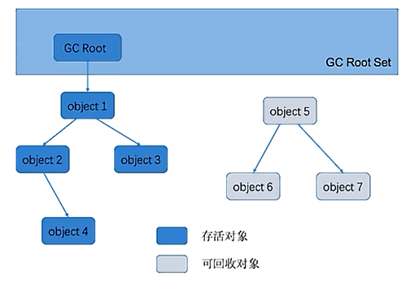

可以理解为没在`关系网中`的对象

**在Java语言中，可以作为GC Root的对象包括下面几种：**


| 1    | 栈帧中的局部变量表中的reference引用所引用的对象 |
| ---- | ----------------------------------------------- |
| 2    | 方法区中static静态引用的对象                    |
| 3    | 方法区中final常量引用的对象                     |
| 4    | 本地方法栈中JNI(Native方法)引用的对象           |


## 4、垃圾回收算法-清除已死对象

当成功区分出内存中存活对象和死亡对象后，GC接下来的任务就是执行垃圾回收。

在介绍JVM垃圾回收算法前，先介绍一个概念：**Stop-the-World：**

Stop-the-world意味着 JVM由于要执行GC而停止了应用程序的执行，并且这种情形会在任何一种GC算法中发生。

当Stop-the-world发生时，除了GC所需的线程以外，`所有线程都处于等待状态直到GC任务完成`。

事实上，`GC优化很多时候就是指减少Stop-the-world发生的时间，从而使系统具有高吞吐 、低停顿的特点。`


### 4.1、复制算法（Copying）


**核心思想：**

1.将堆内存分割成两块From空间 To空间，对象分配阶段，创建对象。

2.GC阶段开始，将GC Root搬运到To空间

3.将GC Root关联的对象，搬运到To空间 

4.清理From空间，并把名称互换

下图：绿色存活对象/红色回收垃圾，激活区-from/空闲区-to

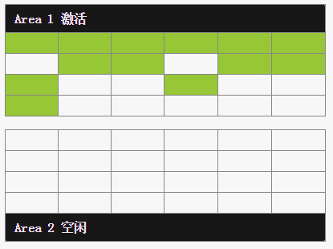

**优点：**

- 实现简单
  - 不产生内存碎片

**缺点：**

- 将内存缩小为原来的一半，浪费了一半的内存空间，代价太高；如果不想浪费一半的空间，就需要有额外的空间进行分配担保，以应对被使用的内存中所有对象都100%存活的极端情况，所以在老年代一般不能直接选用这种算法。

- 如果对象的存活率很高，我们可以极端一点，假设是100%存活，那么我们需要将所有对象都复制一遍，并将所有引用地址重置一遍。复制这一工作所花费的时间，在对象存活率达到一定程度时，将会变的不可忽视。 所以从以上描述不难看出，复制算法要想使用，最起码对象的存活率要非常低才行，而且最重要的是，我们必须要克服50%内存的浪费。

**年轻代中使用的是Minor GC，这种GC算法采用的就是复制算法：**

HotSpot JVM把年轻代分为了三部分：1个Eden区和2个Survivor区（分别叫from和to）。一般情况下，新创建的对象都会被分配到Eden区。因为年轻代中的对象基本都是`朝生夕死的(90%以上)`，所以在年轻代的垃圾回收算法使用的是复制算法。


### 4.2、标记清除（Mark-Sweep）


`标记-清除算法`是几种GC算法中最基础的算法，是因为后续的收集算法都是基于这种思路并对其不足进行改进而得到的。正如名字一样，算法分为**2个阶段**：

（1）**标记：**使用`可达性分析算法`，标记出可达对象。

（2）**清除：**对堆内存从头到尾进行线性便遍历，如果发现某个对象没有被标记为可达对象，则将其回收。


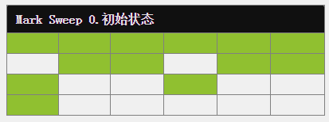

**缺点：**

- 效率问题（两次遍历）

- 空间问题（标记清除后会产生大量不连续的碎片。JVM就不得不维持一个`内存的空闲列表`，这又是一种开销。而且在分配数组对象的时候，寻找连续的内存空间会不太好找。）


### 4.3、标记压缩（Mark-Compact）

**也叫标记整理算法。**


标记整理算法`是标记-清除法的一个改进版`。同样，在标记阶段，该算法也将所有对象标记为存活和死亡两种状态；不同的是，在第二个阶段，该算法并没有直接对死亡的对象进行清理，而是通过`所有存活对像都向一端移动，然后直接清除边界以外的内存`。

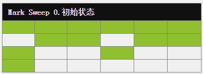

**优点：**

标记整理算法不仅可以弥补标记清除算法中，内存区域分散的缺点，也消除了复制算法当中，内存减半的高额代价。

**缺点：**

如果存活的对象过多，整理阶段将会执行较多复制操作，导致算法效率降低。


**老年代一般是由标记清除或者是标记清除与标记整理的混合实现。**

 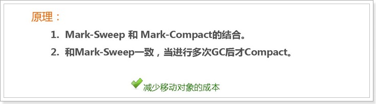


**难道就没有一种最优算法吗？** 

回答：无，没有最好的算法，只有最合适的算法。==========>**分代收集算法**


### 4.4、分代收集算法（Generational-Collection）

**内存效率：**

复制算法 > 标记清除算法 > 标记整理算法（此处的效率只是简单的对比时间复杂度，实际情况不一定如此）。 

**内存整齐度：**

复制算法 > 标记整理算法 > 标记清除算法。 

**内存利用率：**

标记整理算法=标记清除算法>复制算法。 

可以看出，效率上来说，`复制算法是当之无愧的老大，但是却浪费了太多内存`。

为了尽量兼顾上面所提到的三个指标，标记整理算法相对来说更平滑一些，但效率上依然不尽如人意。

比复制算法多了一个标记的阶段，又比标记清除多了一个整理内存的过程


`分代回收算法`实际上是`复制算法和标记整理法、标记清除的结合`，并不是真正一个新的算法。

一般分为`老年代（Old Generation）和年轻代（Young Generation）`

老年代就是很少垃圾需要进行回收的，年轻代就是有很多的内存空间需要回收，所以不同代就采用不同的回收算法，以此来达到高效的回收算法。

**年轻代（Young Gen）**  

`年轻代特点是区域相对老年代较小，对像存活率低。`

这种情况`复制算法`的回收整理，速度是最快的。复制算法的效率只和当前存活对像大小有关，因而很适用于年轻代的回收。而复制算法内存利用率不高的问题，通过hotspot中的两个survivor的设计得到缓解。


**老年代（Tenure Gen）**

`老年代的特点是区域较大，对像存活率高。`

这种情况，存在大量存活率高的对像，复制算法明显变得不合适。一般是`由标记清除或者是标记清除与标记整理的混合实现`。


## 5、四种引用

创建一个User类：

```java
public class User {

    public User(int id, String name) {
        this.id = id;
        this.name = name;
    }

    public int id;
    public String name;

    @Override
    public String toString() {
        return "[id=" + id + ", name=" + name + "] ";
    }
}

```


### 5.1、强引用

强引用是使用最普遍的引用。如果一个对象具有强引用，那垃圾回收器绝不会回收它。当内存空间不足，Java虚拟机宁愿抛出OutOfMemoryError错误，使程序异常终止，也不会靠随意回收具有强引用的对象来解决内存不足的问题。 ps：强引用其实也就是我们平时Book b1 = new Book()这个意思。

```java
User user = new User(1, "zhangsan");
```


- 案例：

```java
public class StrongReferenceTest {

    public static void main(String[] args) {
        //定义强引用
        User user = new User(1, "zhangsan");
        //定义强引用
        User user1 = user;

        //设置user为null，User对象不会被回收，因为依然被user1引用
        user = null;

        //强制垃圾回收
        System.gc();

         try {
             TimeUnit.SECONDS.sleep(1);
         } catch (InterruptedException e) {
             throw new RuntimeException(e);
         }
        System.out.println(user1);
    }
}
```


### 5.2、软引用

**内存不足即回收**

`SoftReference` 类实现软引用。在系统要发生内存溢出`（OOM）`之前，才会将这些对象列进回收范围之中`进行二次回收`。如果这次回收还没有足够的内存，才会抛出内存溢出异常。`软引用可用来实现内存敏感的高速缓存`，例如：EHCache这样的本地缓存框架，还有Netty这样的异步网络通信框架。

```java
SoftReference<User> userSoftRef = new SoftReference<>(new User(1, "zhangsan"));
```


- 案例：内存空间充足时，不会回收软引用的可达对象。注意测试环境设置为  **-Xms10m -Xmx10m**

```java
//-Xms10m -Xmx10m
public class SoftReferenceTest {

    public static void main(String[] args) {
        //创建对象，建立软引用
        SoftReference<User> userSoftRef = new SoftReference<>(new User(1, "zhangsan"));

        //上面的一行代码，等价于如下的三行代码
        //User u1 = new User(1,"zhangsan");
        //SoftReference<User> userSoftRef = new SoftReference<>(u1);
        //u1 = null;//如果之前定义了强引用，则需要取消强引用，否则后期userSoftRef无法回收

        //从软引用中获得强引用对象
        System.out.println(userSoftRef.get());

        //内存不足测试：让系统认为内存资源紧张
        //测试环境： -Xms10m -Xmx10m
        try {
            //默认新生代占堆的1/3空间，老年代占堆的2/3空间，因此7m的内容在哪个空间都放不下
            byte[] b = new byte[1024 * 1024 * 7]; //7M
        } catch (Throwable e) {
            e.printStackTrace();
        } finally {

            System.out.println("finally");

            //再次从软引用中获取数据
            //在报OOM之前，垃圾回收器会回收软引用的可达对象。
            System.out.println(userSoftRef.get());
        }
    }
}
```


### 5.3、弱引用

**发现即回收**

`WeakReference` 类实现弱引用。对象只能生存到下一次垃圾收集`（GC）`之前。在垃圾收集器工作时，无论内存是否足够都会回收掉只被弱引用关联的对象。

```java
WeakReference<User> userWeakRef = new WeakReference<>(new User(1, "zhangsan"));
```


- 案例：

```java
public class WeakReferenceTest {

    public static void main(String[] args) {
        //构造了弱引用
        WeakReference<User> userWeakRef = new WeakReference<>(new User(1, "zhangsan"));
        //从弱引用中重新获取对象
        System.out.println(userWeakRef.get());

        System.gc();
        
        try {
            TimeUnit.SECONDS.sleep(1);
        } catch (InterruptedException e) {
            throw new RuntimeException(e);
        }
        
        // 不管当前内存空间足够与否，都会回收它的内存
        System.out.println("After GC:");
        //重新尝试从弱引用中获取对象
        System.out.println(userWeakRef.get());
    }
}
```


### 5.4、虚引用

也叫幽灵引用、幻影引用。

顾名思义，它是最弱的一种引用关系。如果一个对象仅持有虚引用，在任何时候都可能被垃圾回收器回
收。虚引用主要用来跟踪对象被垃圾回收器回收的活动，主要用于执行一些清理操作或监视对象的回收状态。

**对象回收跟踪**

`PhantomReference` 类实现虚引用。无法通过虚引用获取一个对象的实例，为一个对象设置虚引用关联的唯一目的就是能在这个对象被收集器回收时收到一个系统通知，它主要用于执行一些清理操作或监视对象的回收状态。

虚引用与软引用和弱引用的一个区别在于：
①虚引用必须和引用队列 （ReferenceQueue）联合使用。
②当垃圾回收器准备回收一个对象时，如果发现它还有虚引用，就会在回收对象的内存之前，把这个虚引用加入到与之关联的引用队列中。

```java
ReferenceQueue phantomQueue = new ReferenceQueue();
PhantomReference<User> obj = new PhantomReference(new User(1, "tom"), phantomQueue);
```


- 案例：

```java
public class PhantomReferenceTest {

    public static void main(String[] args) {
        User obj = new User(1, "zhangsan");
        ReferenceQueue<Object> queue = new ReferenceQueue<>();
        PhantomReference<Object> phantomRef = new PhantomReference<>(obj, queue);

        obj = null; // 解除强引用

        // 在这里，对象可能已经被垃圾回收了，但我们无法通过虚引用获取它

        // 判断虚引用是否被回收
        boolean isCollected = false;
        while (!isCollected) {
            System.gc(); // 建议垃圾回收器执行回收操作
            try {
                Thread.sleep(1000); // 等待1秒钟
            } catch (InterruptedException e) {
                e.printStackTrace();
            }
            if (phantomRef.isEnqueued()) { //判断虚引用是否已经被回收。
                isCollected = true;
            }
        }

        // 输出虚引用是否被回收
        System.out.println("虚引用是否被回收：" + isCollected);
    }
}
```

在上面的示例中，我们创建了一个`PhantomReference`对象`phantomRef`，它引用了一个`User`实例`obj`。当我们解除`obj`的强引用后，`obj`将成为垃圾回收的候选对象。然后，我们通过调用`System.gc()`方法建议垃圾回收器执行回收操作，并等待一段时间以确保垃圾回收完成。最后，我们使用`isEnqueued()`方法判断虚引用是否已经被回收。

需要注意的是，由于垃圾回收操作的不确定性，虚引用的回收并不是立即发生的，所以程序中需要等待一段时间才能得出结论。另外，虚引用的主要作用是允许程序员在对象被回收之前进行一些清理操作，而不是直接获取对象的引用。

### 5.5、GCRoots和四大引用总结


## 6、垃圾收集器

> GC算法(复制/标清/标整)是内存回收的思想论，垃圾收集器就是算法落地实现。
>
> 因为目前为止还没有完美的收集器出现，
> 更加没有万能的收集器，只是针对具体应用最合适的收集器，进行分代收集

GC发展史：

有了Java虚拟机，就需要收集垃圾的机制，这就是GC（GarbageCollection），对应的产品我们称为Garbage Collector。

- 1999年随JDK1.3.1一起来的是串行方式的serial Gc ，它是第一款GC。ParNew垃圾收集器是Serial收集器的多线程版本

- 2002年2月26日，ParallelGc和Concurrent MarkSweepC跟随JDK1.4.2一起发布

- Parallel GC在JDK6之后成为Hotspot默认GC。


- 2012年，在JDK1.7u4版本中，G1可用。

- 2017年，JDK9中G1变成默认的垃圾收集器，以替代CMS。
- 2018年3月，JDK 10中G1垃圾回收器的并行完整垃圾回收，实现并行性来改善最坏情况下的延迟。
- 2018年9月，JDK11发布。引入Epsilon垃圾回收器，又被称为"No-0p(无操作)"回收器。同时，引入zGC:可伸缩的低延迟垃圾回收器(Experimental)

- 2019年3月，JDK12发布。增强G1，自动返回未用堆内存给操作系统。同时，引入Shenandoah GC:低停顿时间的GC(Experimental)。
- 2020年3月，JDK14发布。删除CMS垃圾回收器。扩展ZGC在MacOS和Windows上的应用

### 6.1、JVM默认垃圾收集器

#### 6.1.1、垃圾收集器的种类

本章总纲（重要，当堂背下来）


#### 6.1.2、默认垃圾收集器

```bash
java -XX:+PrintCommandLineFlags -version
```

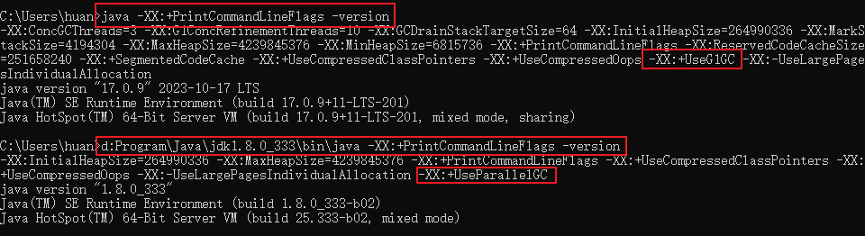

- JDK8 及 JDK 7U40之后的版本：Parallel Scavenge + Parallel Old
- JDK9+：G1
- OracleJDK17：G1

#### 6.1.3、7种主流的垃圾回收器


#### 6.1.4、垃圾收集器的组合关系

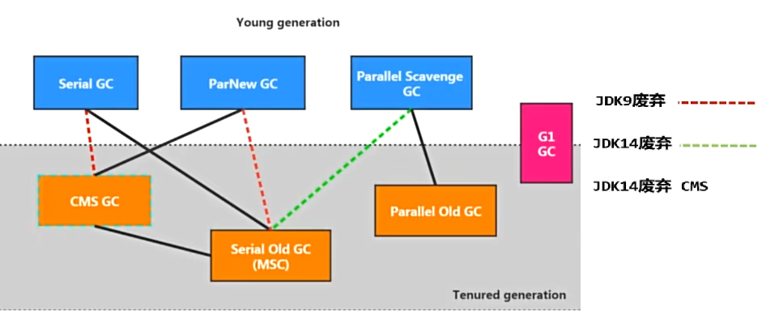

如果两个收集器之间存在连线，则说明它们可以搭配使用。虚拟机所处的区域则表示它是属于新生代还是老年代收集器。

- JDK8中默认使用组合是: Parallel Scavenge GC 、ParallelOld GC
- JDK9开始及之后默认是用G1为垃圾收集器
- JDK14 弃用了: Parallel Scavenge GC 、Parallel OldGC
- JDK14 移除了 CMS GC


#### 6.1.5、GC性能指标

| 吞吐量   | 即CPU用于运行用户代码的时间与CPU总消耗时间的比值（吞吐量 = 运行用户代码时间 / ( 运行用户代码时间 + 垃圾收集时间 )）。例如：虚拟机共运行100分钟，垃圾收集器花掉1分钟，那么吞吐量就是99% |
| -------- | ------------------------------------------------------------ |
| 暂停时间 | 执行垃圾回收时，程序的工作线程被暂停的时间                   |
| 内存占用 | java堆所占内存的大小                                         |
| 收集频率 | 垃圾收集的频次                                               |


### 6.2、串行收集器(Serial)

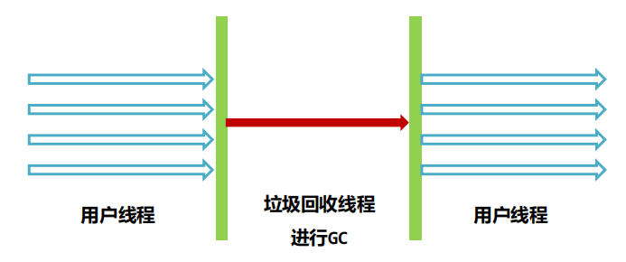

【  串行收集器：Serial收集器】 
一句话：一个单线程的收集器，在进行垃圾收集时候，必须暂停其他所有的工作线程直到它收集结束。

**工作过程：**

新生代（Serial）使用复制算法、老年代（Serial Old）使用标记整理算法

**JVM参数控制：** 

`-XX:+UseSerialGC` 串行收集器

| -Xms10m -Xmx10m -XX:+PrintGCDetails -XX:+PrintCommandLineFlags -XX:+UseSerialGC |
| ------------------------------------------------------------ |


### 6.3、并行收集器(Parallel)

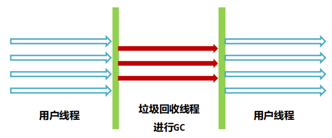

ParNew收集器收集器其实就是`Serial收集器的多线程版本`，除了使用多线程进行垃圾收集之外，其余行为包括Serial收集器可用的所有控制参数、收集算法、Stop The world、对象分配规则、回收策略等都与Serial收集器完全一样，实现上这两种收集器也共用了相当多的代码。

**工作过程：**

新生代并行，老年代串行；新生代使用复制算法、老年代使用标记整理算法。

**JVM参数：**

`-XX:+UseParallelGC` Par收集器

`-XX:ParallelGCThreads` 限制线程数量

备注：在 JDK 17 中，`UseParallelOldGC` 参数不再有效

| -Xms10m -Xmx10m -XX:+PrintGCDetails -XX:+PrintCommandLineFlags -XX:ParallelGCThreads=5 -XX:+UseParallelGC |
| ------------------------------------------------------------ |

#### 6.3.1、Parallel Scavenge收集器

- 是什么

又称为吞吐量优先收集器，和ParNew收集器类似，是一个新生代收集器。使用复制算法的并行多线程收集器。
Parallel Scavenge是Java1.8默认的收集器，特点是并行的多线程回收，以吞吐量优先。

- 能干嘛

Parallel Scavenge收集器的目标是达到一个可控制的吞吐量（Throughput）
吞吐量=运行用户代码时间/(运行用户代码时间+垃圾收集时间)
(虚拟机总共运行100分钟，垃圾收集时间为1分钟，那么吞吐量就是99%)
自适应调节策略，自动指定年轻代、Eden、Suvisor区的比例。

- 适用场景

适合后台运算，交互不多的任务，如批量处理，订单处理，科学计算等。

### 6.4、并发标记清除(**Concurrent Mark Sweep**)

#### 6.4.1、是什么

- CMS 已经被标记为废弃且在 JDK15中已被移除，因此在 JDK17中不可用，但JDK8好使
- Concurrent Mark Sweep 并发标记清除，并发收集低停顿,并发指的是与用户线程一起执行


CMS收集器（Concurrent Mark Sweep：并发标记清除）可以看出CMS收集器是基于标记-清除算法实现的，是一种以获取最短回收停顿时间为目标的收集器。用户线程和垃圾回收线程同时执行，不一定是并行的，可能是交替执行，可能一边垃圾回收，一边运行应用线程，不需要停顿用户线程，互联网应用程序中经常使用，这类应用尤其重视服务器的响应速度，希望系统停顿时间最短。CMS非常适合堆内存大、CPU核数多的服务器端应用，也是G1出现之前大型应用的首选收集器。

#### 6.4.2、CMS垃圾收集过程

它的运作过程相对于前面几种收集器来说要更复杂一些，整个过程分为4个步骤，包括：

| 1    | 初始标记 | (CMS initial mark)会发生STW，只是标记一下GC Roots能直接关联的对象，速度很快，仍然需要暂停所有的工作线程。 |
| ---- | :------: | ------------------------------------------------------------ |
| 2    | 并发标记 | (CMS concurrent mark)GC线程和用户线程一起，进行GC Roots跟踪的过程，和用户线程一起工作，不需要暂停工作线程。 主要标记过程，标记全部对象 |
| 3    | 重新标记 | (CMS remark)会发生STW，为了修正在并发标记期间，因用户程序继续运行而导致标记产生变动的那一部分对象的标记记录，仍然需要暂停所有的工作线程。由于并发标记时，用户线程依然运行，因此在正式清理前，再做修正 |
| 4    | 并发清除 | (CMS concurrent sweep)GC线程和用户线程一起，清除GC Roots不可达对象，和用户线程一起工作，不需要暂停工作线程。基于标记结果，直接清理对象 ，由于耗时最长的并发标记和并发清除过程中，垃圾收集线程可以和用户现在一起并发工作，所以总体上来看CMS 收集器的内存回收和用户线程是一起并发地执行。 |


下图是以前JDK8版本下代码证明，当下JDK17不再使用，了解即可，课堂上不再切换为JDK8演示


**优点： **

并发收集、低停顿
**缺点：**

产生大量空间碎片、并发阶段会降低吞吐量

**参数控制：**

`-XX:+UseConcMarkSweepGC` 使用CMS收集器
`-XX:+UseCMSCompactAtFullCollection` Full GC后，进行一次碎片整理；整理过程是独占的，会引起停顿时间变长
`-XX:+CMSFullGCsBeforeCompaction` 设置进行几次Full GC后，进行一次碎片整理
`-XX:ParallelCMSThreads` 设定CMS的线程数量（一般情况约等于可用CPU数量）


#### 6.4.3、CMS垃圾收集器缺点

1.CMS收集器对CPU抢夺过于凶狠吞吐量会降低

​	面向并发设计的程序都对CPU资源比较凶狠。在并发时它虽然不会导致用户线程停顿但会因为占用
一部分线程而导致应用程序变慢总<font color='red'>吞吐量会降低</font>。CMS默认启动的回收线程数是（处理器核心数量 +3） /4，
也就是说， 如果处理器核心数在四个或以上， 并发回收时垃圾收集线程只占用不超过25%的 处理器运算资源， 并且会随着处理器核心数量的增加而下降。 但是当处理器核心数量不足四个时， CMS对用户程序的影响就可能变得很大。 如果应用本来的处理器负载就很高， 还要分出一半的运算能 力去执行收集器线程， 就可能导致用户程序的执行速度忽然大幅降低。

2.CMS收集器无法处理浮动垃圾或出现"Concurrent Mode Failure"失败而导致另一次Full GC的产生。
	由于CMS并发清理阶段用户线程还在运行着，伴随程序运行自然就还会有新的垃圾不断产生，这一部分垃圾出现在标记过程之后，CMS无法在当次收集中处理掉它们，只好留待下一次GC时再清理掉。这一部分垃圾就称为"浮动垃圾"。同样也是由于在垃圾收集阶段用户线程还需要持续运 行， 那就还需要预留足够内存空间提供给用户线程使用， 因此CMS收集器不能像其他收集器那样等待 到老年代几乎完全被填满了再进行收集， 必须预留一部分空间供并发收集时的程序运作使用。

3.空间碎片:CMS基于标记-清除算法实现的，会有空间碎片的现象。

​	当空间碎片过多时，将会给大对象分配带来很大麻烦，往往会出现老年代还有很大空间剩余，但是无法找到足够大的连续空间来分配当前对象，不得不提前触发一次Full GC。

### 6.5、G1收集器(Garbage-First)

Java9以后默认的垃圾收集器，G1垃圾回收器将堆内存分割成不同的区域然后并发地对其进行垃圾回收。

Garbage First是一款面向服务端应用的垃圾收集器，主要针对配备多核CPU及大容量内存的机器，以极高概率满足GC停顿时间的同时，还兼具高吞吐量的性能特征。<font color='red'>G1收集器的设计目标是取代CMS收集器</font>

#### 6.5.1、G1之前收集器特点

| 1    | 年轻代和老年代是各自独立且连续的内存块                 |
| ---- | ------------------------------------------------------ |
| 2    | 年轻代收集使用伊甸园区+幸存零区+幸存一区进行复制算法； |
| 3    | 老年代收集必须扫描整个老年代区域；                     |
| 4    | 都是以尽可能少而快速地执行GC为设计原则。               |

#### 6.5.2、G1是什么

G1（Garbage-First）收集器，是一款面向服务端应用的收集器


从上述官网的描述中，我们知道G1是一种服务器端的垃圾收集器，应用在多处理器和大容量内存环境中，在实现高吞吐量的同时，尽可能的满足垃圾收集暂停时间短小的要求。另外，它还具有以下特性：

像CMS收集器一样， 能与应用程序线程并发执行。
整理空闲空间更快。
需要更多的时间来预测GC停顿时间。
不希望牺牲大量的吞吐性能。
不需要更大的Java Heap。

<font color='red'>G1收集器的设计目标是取代CMS收集器</font>，它同CMS相比，在以下方面表现的更出色： 

1. **并行与并发**：G1能充分利用CPU、**多核环境下**的硬件优势，使用多个CPU（CPU或者CPU核心）来缩短stop-The-World停顿时间。部分其他收集器原本需要停顿Java线程执行的GC动作，G1收集器仍然可以通过并发的方式让java程序继续执行。

2. **分代收集：**分代概念在G1中依然得以保留。虽然G1可以不需要其它收集器配合就能**独立管理整个GC堆**，但它能够采用不同的方式去处理新创建的对象和已经存活了一段时间、熬过多次GC的旧对象以获取更好的收集效果。**也就是说G1可以自己管理新生代和老年代了**。

3. **空间整合**：由于G1使用了**独立区域**（Region）概念，单个Region大小=堆总大小/2048=2M，G1从整体来看是基于“标记-整理”算法实现收集，从局部（两个Region）上来看是基于“复制”算法实现的，但无论如何，这两种算法都意味着G1运作期间不会产生内存空间碎片。

4. **可预测的停顿**：这是G1相对于CMS的另一大优势，降低停顿时间是G1和CMS共同的关注点，但G1除了追求低停顿外，还能建立可预测的停顿时间模型，能让使用这明确指定一个长度为**M毫秒的时间片段内**，消耗在**垃圾收集上的时间不得超过N毫秒**。

上面提到的垃圾收集器，收集的范围都是整个新生代或者老年代，而G1不再是这样。

#### 6.5.3、G1之Region区域


使用G1收集器时，Java堆的内存布局与其他收集器有很大差别，它将整个Java堆划分为多个大小相等的独立区域（Region），虽然还保留有新生代和老年代的概念，但新生代和老年代不再是物理隔阂了，它们都是一部分（可以不连续）Region的集合。

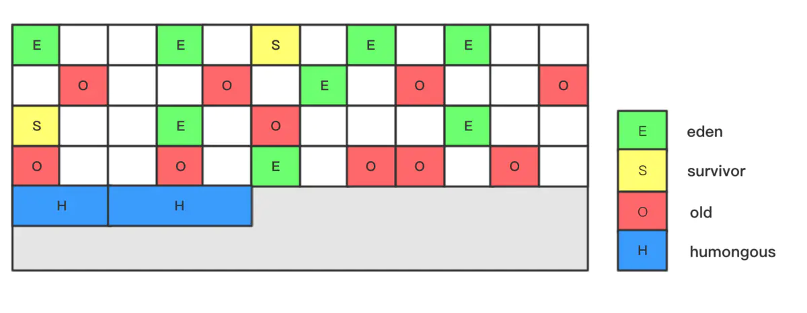

每个Region被标记了E、S、O和H，说明每个Region在运行时都充当了一种角色，其中H是以往算法中没有的，它代表Humongous，这表示这些Region存储的是**巨型对象（humongous object，H-obj）**，当新建对象大小超过Region大小一半时，直接在新的一个或多个连续Region中分配，并标记为H。


#### 6.5.4、G1收集四个阶段

在G1 GC垃圾回收的过程一个有四个阶段:

| 初始标记 | 和CMS一样只标记GC Roots直接关联的对象                  |
| -------- | ------------------------------------------------------ |
| 并发标记 | 进行GC Roots Traceing过程                              |
| 最终标记 | 修正并发标记期间，因程序运行导致发生变化的那一部分对象 |
| 筛选回收 | 根据时间来进行价值最大化收集                           |

G1收集器的运作大致可划分为以下几个步骤：


代码证明一下，观察G1回收信息

```Java
//-Xms10m -Xmx10m -Xlog:gc*
public class OOM_G1Demo{
    public static String baseString = "www.atguigu.com";
    public static void main(String[] args){
        List<String> list = new ArrayList<>();
        for (int i = 1; i <=10000 ; i++) {
            String tmpString = baseString + baseString;
            baseString = tmpString;
            list.add(tmpString);
        }
    }
}
```


针对Eden区进行收集，Eden区耗尽后会被触发，主要是小区域收集 + 形成连续的内存块，避免内存碎片

将存活的对象（即复制或移动）到一或多个幸存者区域，如满足老化阈值则某些对象将被提升到老年代。

 * Eden区的数据移动到Survivor区，假如出现Survivor区空间不够，Eden区数据会部分晋升到Old区

 * Survivor区的数据移动到新的Survivor区，如果满足老化阈值，则某些对象将被晋升到Old区

 * 最后Eden区收拾干净了， GC结束，用户的应用程序继续执行。

   


### 6.6、垃圾回收器选择小总结


垃圾回收器选择策略 ：

- **吞吐率优先**的服务端程序（比如：计算密集型） ： Parallel Scavenge + Parallel Old；

- **响应时间优先**的服务端程序 ：ParNew + CMS。

- G1收集器是基于标记整理算法实现的，不会产生空间碎片，可以精确地控制停顿，将堆划分为多个大小固定的独立区域，并跟踪这些区域的垃圾堆积程度，在后台维护一个优先列表，每次根据允许的收集时间，优先回收垃圾最多的区域（Garbage First）。

  


# 第07章：线上问题定位

面试题：项目上线之后出现了问题，如何解决?

如果存在运维人员，运维人员会配合我们开发人员，拉取项目的运行日志。我们结合项目的日志和本地项目源码，进行问题定位和分析，最后解决更新源码，运维部署迭代。

一般情况下是没有运维人员的，那么问题的排查就需要开发人员进行完成；开发人员排查问题直接操作生产服务器，根据问题的内容进行排查，不同的问题【接口报错，RT超时、CPU飙高、OOM...】排查方案是不一样的。

## 7.1 CPU飙升问题排查

### 7.1.1 原生命令

```Java
package com.atguigu.study.jvm;

import java.util.UUID;

//放入Linux系统或者阿里云服务器，运行后故意让cpu飙高
public class HighCPUDemo
{
    public static void main(String[] args)
    {
        while (true)
        {
            System.out.println("--------hello atguigu"+"\t"+ UUID.randomUUID().toString());
        }
    }
}
```

运行命令，死循环飙高CPU


1、使用top命令找到cpu飙升进程id


2、 根据进程id找到导致cpu飙升的线程 

公式：	ps H -eo pid,tid,%cpu | grep 进程id


3、将线程id转换为16进制

公式： printf '0x%x\n' 线程id


4、根据线程定位问题代码

```Linux
jstack 进程id | grep 16进制线程id -A 20
解释：
jstack：jdk内置命令，用于查看某个java进程所有线程快照，里面包含了线程详细的堆栈信息
grep：从大量文本中快速找到某个关键字所在的行，-A参数后面的20，表示找到内容后，取内容所在行后面20行记录
```


 

### 7.1.2 阿尔萨斯Arthas

**1 是什么**

arthas：阿里开源的一款Java问题诊断利器，

详情见：https://arthas.aliyun.com/doc/quick-start.html


**2 去哪下？**

curl -O https://arthas.aliyun.com/arthas-boot.jar


**3 怎么玩**

运行让CPU飙升的程序后再启动阿尔萨斯 


启动阿尔萨斯命令：**java -jar arthas-boot.jar**


按照提示输入数字进入阿尔萨斯


进arthas后,用thread命令查看cpu占比最高的线程


使用thread 线程id查看线程堆栈，定位问题代码


