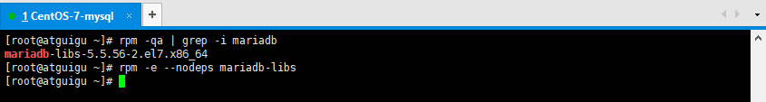
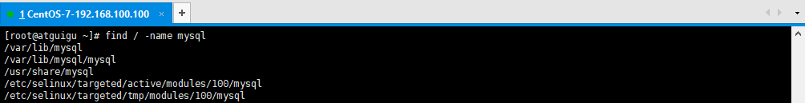
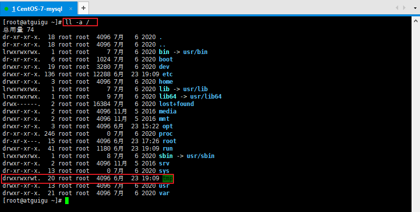
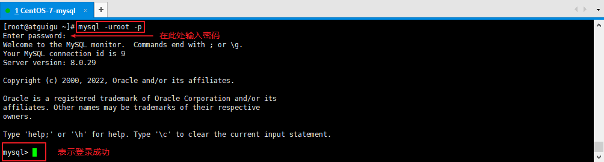

# 第十章 服务环境搭建

# 学习目标

1 熟练在服务器上安装JDK

2 熟练在服务器上安装Tomcat

3 熟练在服务器上安装MySQL

# 第一节 安装JDK

> 第一步 查询系统中自带的JDK

```纯文本
rpm -qa | grep jdk
```

> 第二步 卸载系统中自带的JDK

```纯文本
rpm -e --nodeps jdk的rpm软件包的名字
```

> 第三步 将jdk.tar.gz上传到/opt目录下

> 第四步 解压jdk压缩包

```纯文本
tar -zxvf jdk压缩包名称
```

> 第五步 在/etc/profile.d目录下创建my\_env.sh文件(系统不建议直接修改/etc/profile)

```纯文本
cd /etc/profile.d
touch my_env.sh

```

> 第六步 在my\_env.sh文件中配置JAVA\_HOME环境变量

```纯文本
#JAVA_HOME  
JAVA_HOME=/opt/jdk-17.0.7  
PATH=$PATH:$JAVA_HOME/bin  
export PATH JAVA_HOME 
```

> 第七步 执行source /etc/profile.d/my\_env.sh使环境变量立即生效，如果不生效就重启

# 第二节 安装Tomcat

> 第一步  将tomcat的压缩包上传到/opt目录下

> 第二步  解压缩tomcat的压缩包

> 第三步 进入tomcat的bin目录执行./startup.sh启动tomcat服务器

> 第四步 可以配置tomcat的环境变量，这样就可以在任意目录下执行startup.sh启动tomcat了


```
#JAVA_HOME  
JAVA_HOME=/opt/jdk-17.0.7
CATALINA_HOME=/opt/apache-tomcat-10.1.10
PATH=$PATH:$JAVA_HOME/bin:$CATALINA_HOME/bin
export PATH JAVA_HOME CATALINA_HOME
```

- 第七步 执行source /etc/profile.d/my\_env.sh使环境变量立即生效，如果不生效就重启

# 第三节 安装 MySQL

## 1、采用普通方式安装MySQL

## 2、下载MySQL

### 2.1、官网

[https://www.mysql.com](https://www.mysql.com)


### 2.2、下载页面

https://dev.mysql.com/downloads/mysql/


**下载MySQL 8.0.xx**

这里没有CentOS7系统的版本，所以选择与之对应的`Red Hat Enterprise Linux 7`

点击`Download`下载`RPM Bundle`全量包，包括了所有组件：


### 2.3、安装包

`mysql-8.0.29-1.el7.x86_64.rpm-bundle.tar`


## 3、检查安装环境

### 3.1、卸载系统自带的mariaDB


```shell
#CentOS7中默认安装了mariaDB
#检查是否安装，-i 表示忽略大小写，如果显示完整的rpm的名字，则表示已安装
rpm -qa|grep -i mariaDB
#卸载， --nodeps 表示排除依赖，否则如果别的软件依赖mysql，则无法删除
rpm -e --nodeps mariadb-libs
```




### 3.2、卸载已安装的MySQL

**需要的时候参考**

#### 3.2.1、卸载MySQL5.7

`1.停止MySQL服务`

```shell
systemctl stop mysqld
```


`2.查看当前MySQL安装状况`

```shell
rpm -qa|grep -i mysql
```


`3.卸载已安装程序`

```shell
#卸载上述命令查询出的所有已安装程序
rpm -e --nodeps mysql57-community-release
rpm -e --nodeps mysql-community-server
rpm -e --nodeps mysql-community-common
rpm -e --nodeps mysql-community-libs
rpm -e --nodeps mysql-community-client
```


`4.删除残留文件`

查找相关文件

```shell
find / -name mysql
```



删除上述命令查找出的相关文件

```shell
rm -rf /var/lib/mysql
rm -rf /usr/share/mysql
rm -rf /etc/selinux/targeted/active/modules/100/mysql
rm -rf /etc/selinux/targeted/tmp/modules/100/mysql
```


`5.删除配置文件和日志`

```shell
rm -f /etc/my.cnf*
rm -f /var/log/mysqld.log
```


#### 3.2.2、卸载MySQL8

`1.停止MySQL服务`

```shell
systemctl stop mysqld
```


`2.查看当前MySQL安装状况`

```shell
rpm -qa|grep -i mysql
```


`3.卸载已安装程序`

```shell
#卸载上述命令查询出的所有已安装程序
rpm -e --nodeps mysql-community-common
rpm -e --nodeps mysql-community-server
rpm -e --nodeps mysql-community-libs
rpm -e --nodeps mysql-community-icu-data-files
rpm -e --nodeps mysql-community-client
rpm -e --nodeps mysql-community-client-plugins
```


`4.删除残留文件`

查找相关文件

```shell
find / -name mysql
```


删除上述命令查找出的相关文件

```shell
rm -rf /etc/selinux/targeted/active/modules/100/mysql
rm -rf /etc/selinux/targeted/tmp/modules/100/mysql
rm -rf /usr/lib64/mysql
rm -rf /var/lib/mysql
```


`5.删除配置文件和日志`

```shell
rm -f /etc/my.cnf* #如果有的话
rm -f /var/log/mysqld.log
```


### 3.3、检查必要依赖

查询是否安装了如下依赖

```shell
rpm -qa|grep libaio
rpm -qa|grep net-tools
rpm -qa|grep perl
```

如果存在，则如下所示：


如果不存在，则需要安装

```shell
yum install libaio -y
yum install net-tools -y
yum install perl -y
```

注：-y 表示在安装工程中的提示默认为yes

### 3.4、检查/tmp临时目录权限

由于MySQL安装过程中，会通过MySQL用户在/tmp目录下新建tmp_db文件，所以请给/tmp较大的权限。

权限检查：

```shell
ll -a /
```



如果权限不是777则授权为777：

```shell
chmod -R 777 /tmp
```


## 4、安装

### 4.1、解压

将安装程序上传至到/opt目录下，并解压：

```shell
cd /opt
tar xvf mysql-8.0.29-1.el7.x86_64.rpm-bundle.tar
```


### 4.2、安装

在安装文件目录下执行以下命令**（必须按照顺序执行）：**

```shell
rpm -ivh mysql-community-common-8.0.30-1.el7.x86_64.rpm
rpm -ivh mysql-community-client-plugins-8.0.30-1.el7.x86_64.rpm
rpm -ivh mysql-community-libs-8.0.30-1.el7.x86_64.rpm
rpm -ivh mysql-community-icu-data-files-8.0.30-1.el7.x86_64.rpm
rpm -ivh mysql-community-client-8.0.30-1.el7.x86_64.rpm
rpm -ivh mysql-community-server-8.0.30-1.el7.x86_64.rpm

//一定要进入到opt文件夹
# -i, --install    安装软件包
# -v, --verbose    提供更多的详细信息输出
# -h, --hash       软件包安装的时候列出哈希标记 (和 -v 一起使用效果更好)，展示进度条
```


### 4.3、查看是否安装成功

```shell
rpm -qa|grep -i mysql
```


### 4.4、查看版本

```shell
mysqladmin --version
```


### 4.5、安装后的目录结构

| 路径                                                       | 解释                       |
| ---------------------------------------------------------- | -------------------------- |
| /usr/bin                                                   | 相关命令目录，mysqladmin等 |
| `/var/lib/mysql/`                                          | MySQL数据库文件的存放路径  |
| /usr/lib64/mysql/plugin                                    | MySQL                      |
| `/var/log/mysqld.log`                                      | MySQL日志路径              |
| /var/run/mysqld/mysqld.pid                                 | 进程pid文件                |
| /var/lib/mysql/mysql.sock                                  | 本地连接时用的套接字文件   |
| /etc/systemd/system/multi-user.target.wants/mysqld.service | 服务启停相关脚本           |
| `/etc/my.cnf`、/usr/share/mysql-8.0                        | MySQL配置文件              |


## 5、启动

### 5.1、服务的初始化

```shell
#初始化数据目录并生成初始密码
mysqld --initialize --user=mysql
#查看数据目录
ls /var/lib/mysql/
```


### 5.2、服务的启动和停止

```shell
#启动，安装完MySQL第一次启动服务时，也会同时执行服务的初始化，因此也可以省略5.1
#如果省略了步骤5.1，并且启动失败，则说明之前安装的MySQL没有卸载干净，数据目录/var/lib/mysql/没有删除
#请删除数据目录后再重新启动
systemctl start mysqld
#关闭
systemctl stop mysqld
#重启
systemctl restart mysqld
#查看服务状态
systemctl status mysqld
```


### 5.3、查看进程

```shell
#进程存在则说明MySQL启动成功
ps -ef|grep -i mysql
```


### 5.4、设置开机启动

```shell
#查看服务是否自动启动（是：enabled | 否：disabled）
systemctl list-unit-files|grep mysqld.service 

#设置开机启动：如不是enabled可以运行如下命令设置自启动
systemctl enable mysqld
#重新加载服务配置
systemctl daemon-reload 

#如果希望不进行自启动，运行如下命令设置
systemctl disable mysqld
#重新加载服务配置
systemctl daemon-reload 
```


## 6、配置密码

### 6.1、查找初始密码

```shell
#mysql安装完成之后，在/var/log/mysqld.log文件中给root生成了一个默认密码。通过下面的方式找到root默认密码，然后登录mysql。
grep 'temporary password' /var/log/mysqld.log
或者使用  more /var/log/mysqld.log
```


### 6.2、登录MySQL客户端

```shell
mysql -uroot -p
#然后输入上面找到的默认密码
```



### 6.3、修改密码

因为初始密码只是一个临时密码，默认只可以登录，无法做其他操作，因此我们需要重置密码

```sql
ALTER USER 'root'@'localhost' IDENTIFIED BY '123456';
-- 或者
SET password FOR 'root'@'localhost'= '123456';
```


### 6.4、忘记root密码

**需要的时候参考**

在/etc/my.cnf 文件[mysqld]中加上：

```properties
skip_grant_tables=1
```

重新启动mysql服务使配置生效：

```shell
systemctl restart mysqld
```

就可以无需密码登录MySQL客户端

```shell
mysql -uroot
```

接下来可以执行修改密码的语句重置密码


## 7、相关问题

### （1）远程连接问题

在用SQLyog或Navicat中配置远程连接MySQL数据库时遇到如下报错信息，这是由于MySQL默认不支持远

程连接。


查看系统数据库MySQL中的user表：

```sql
USE mysql;
SELECT Host,User FROM user;
```


可以看到root用户的当前主机配置信息为localhost。**修改Host为通配符%**

Host列指定了允许用户登录所使用的IP：

- `Host=localhost`，表示只能通过本机客户端去访问。

- `Host=%` ，表示所有IP都有连接权限。

```sql
UPDATE user SET Host = '%' WHERE User ='root';
FLUSH PRIVILEGES; -- Host修改完成后记得执行FLUSH PRIVILEGES使配置立即生效：
```

> 注意：在生产环境下不能为了省事将host设置为%，这样做会存在安全问题，可以设置为生产环境IP。

### （2）使用SQLyog连接


出现这个原因是MySQL 8 之前的版本中加密规则是mysql_native_password，而在MySQL 8之后，加密规则是caching_sha2_password。

解决方案有两种，一种是升级SQLyog和Navicat（因此，新版SQLyog不会出现此问题），另一种是把MySQL用户登录密码加密规则还原成mysql_native_password。


**解决方法：**Linux下 mysql -uroot -p 登录你的 MySQL 数据库，然后 执行这条SQL：

```sql
ALTER USER 'root'@'%' IDENTIFIED WITH mysql_native_password BY '123456';
```

然后再重新配置SQLyog的连接，重新填写密码，则可连接成功了。 
