# 第二章 VMware的使用

## 学习目标

1 熟悉VMware软件的作用!

2 可以熟练安装VMware软件

3 可以熟练使用VMware创建虚拟计算机

4 可以熟练为虚拟计算机安装Linux操作系统

5 能独立解决安装过程中的常见问题

## 第一节 VMware的作用

> VMware软件的作用


*   第一步，在Windows上安装VMware软件

*   第二步，使用VM软件创建虚拟的计算机

*   第三步，在虚拟的计算机上安装Linux操作系统

## 第二节 VMware的安装

> 安装前，先检查BIOS中是否开启了虚拟化支持

*   打开任务管理器，查看性能，CPU部分，虚拟化处于“已启用”状态


*   如果没有开启，则需要进入BIOS系统，将 Virtualization Technology 改为Enalble，不同品牌的电脑进入BIOS的方式都不同，可以根据电脑品牌型号搜索对应的进入方式


> 第一步：下载VMware安装包([https://www.vmware.com/cn/products/workstation-pro/workstation-pro-evaluation.html](https://www.vmware.com/cn/products/workstation-pro/workstation-pro-evaluation.html "https://www.vmware.com/cn/products/workstation-pro/workstation-pro-evaluation.html"))，双击开始安装


> 第二步：点击下一步


第三步：同意协议，然后下一步


> 第四步：修改安装位置 勾选“添加到系统PATH”


> 第五步: 不检查更新，不参与客户体验提升计划

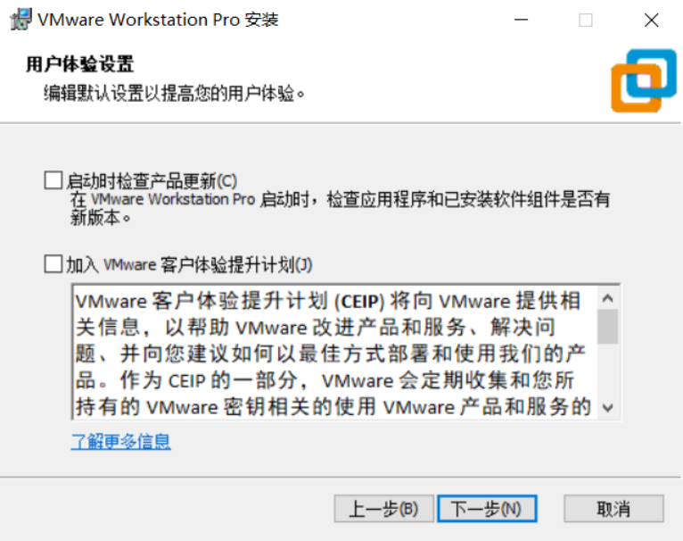

> 第六步：勾选“桌面”和“开始菜单程序文件夹”

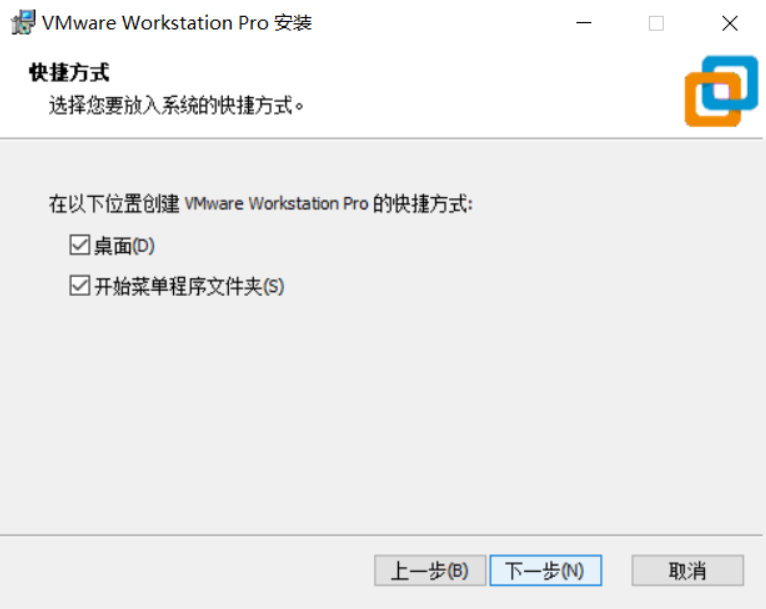

> 第七步：开始安装

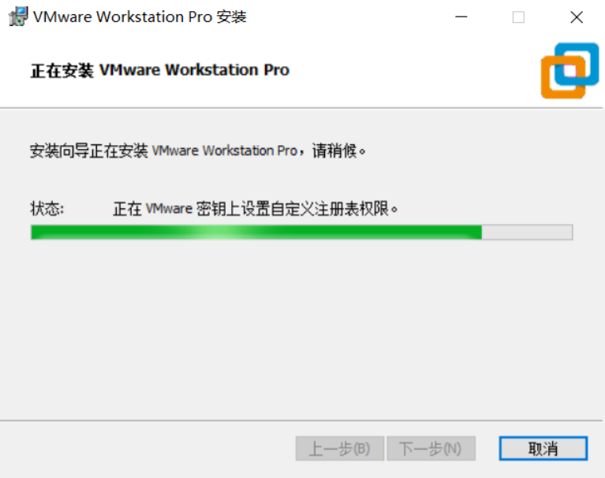

> 第八步：安装完成


> 第九步：点击桌面图标启动程序


> 第十步：购买软件后，获取许可证密钥，输入密钥即可正常使用

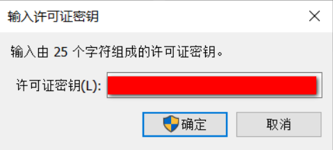

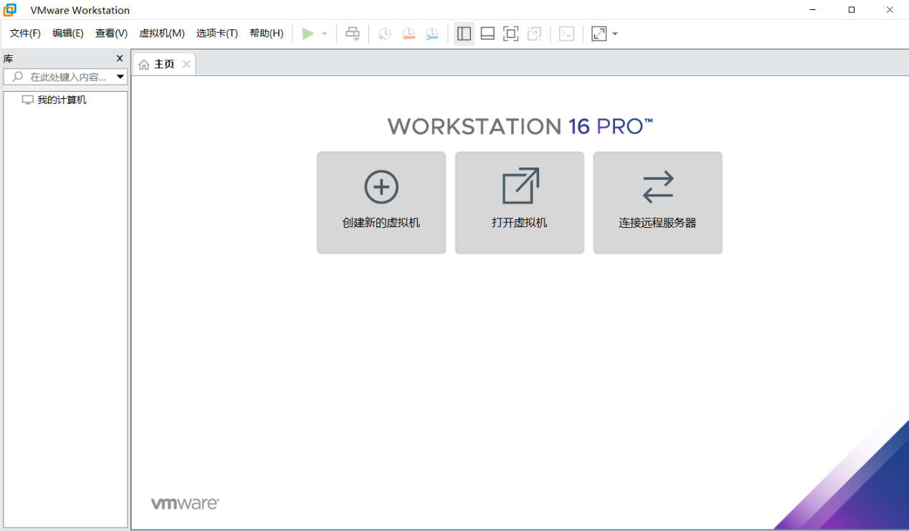

## 第三节 VMware 创建虚拟机

> 第一步：选择创建新的虚拟计算机


> 第二步：选择自定义

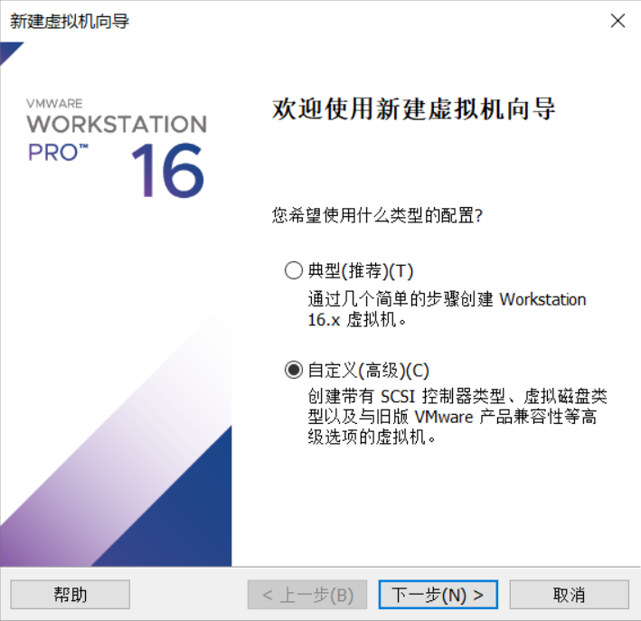

> 第三步： 硬件兼容选择 Workstation \*\*.x


> 第四步：选择稍后安装操作系统

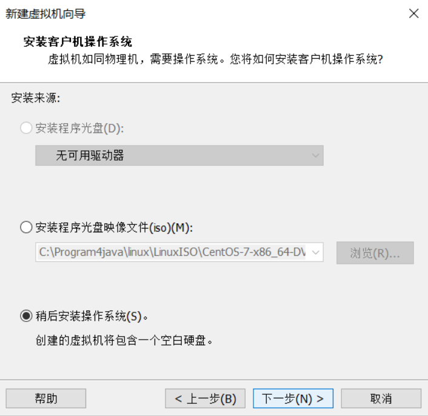

> 第五步：预选将来要安装的操作系统和版本

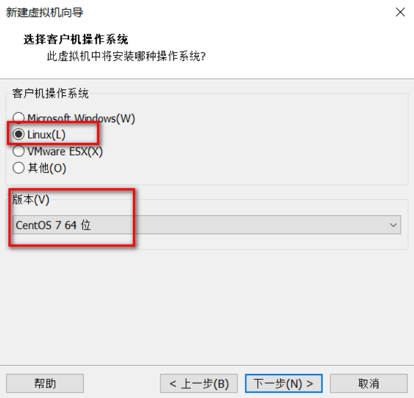

> 第六步：自定义虚拟机名称和虚拟机的存储位置

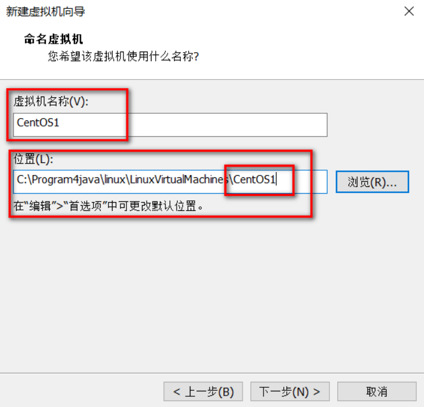

> 第七步：设置虚拟计算机的CPU 数量，不要高于宿主机的实际

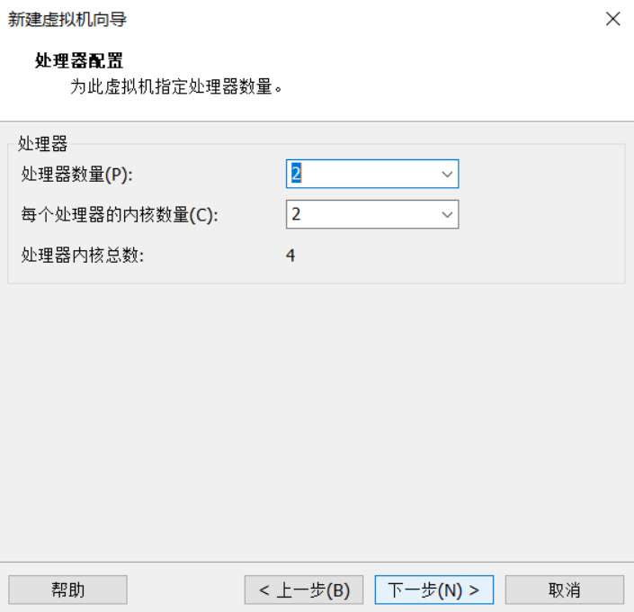

> 第八步：设置虚拟计算机内存，2G即可


> 第九步：设置虚拟计算机初始网络连接方式，建议使用NAT模式


> 第十步：选择I/O控制器类型，默认推荐即可


> 第十一步：选择磁盘类型，默认推荐即可

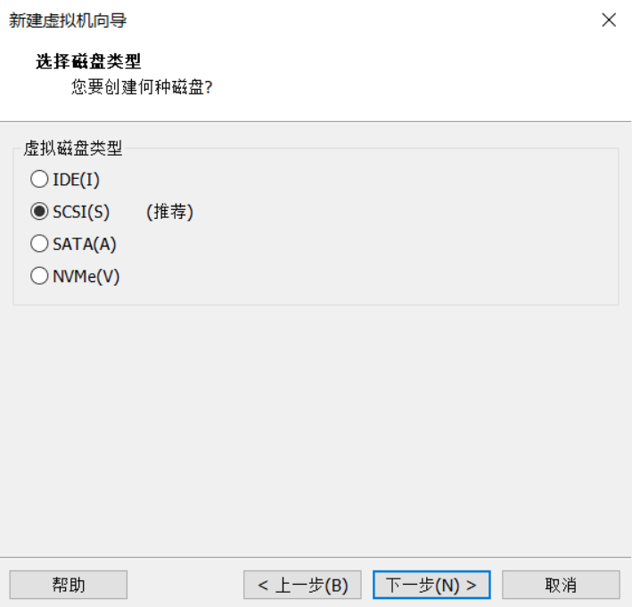

> 第十二步：选择创建新的虚拟磁盘


> 第十三步：设定虚拟磁盘大小，并拆分成多个文件


> 第十四步：检查虚拟磁盘文件名，默认即可


> 第十五步：检查虚拟计算机设置的信息，然后点击完成


> 第十六步： 安装完成


## 第四节 VMware安装Linux

> 第一步：下载Linux的ISO镜像文件，这里选择的版本是Centos7 64位

```纯文本
网易镜像：
http://mirrors.163.com/centos/6/isos/
http://mirrors.163.com/centos/7/isos/x86_64/
搜狐镜像：
http://mirrors.sohu.com/centos/6/isos/ 
http://mirrors.sohu.com/centos/7/isos/x86_64/
```

下载好的镜像文件存于一个比较稳妥的目录下


> 第二步：选中对应的虚拟机然后点击虚拟机选项，找到设置

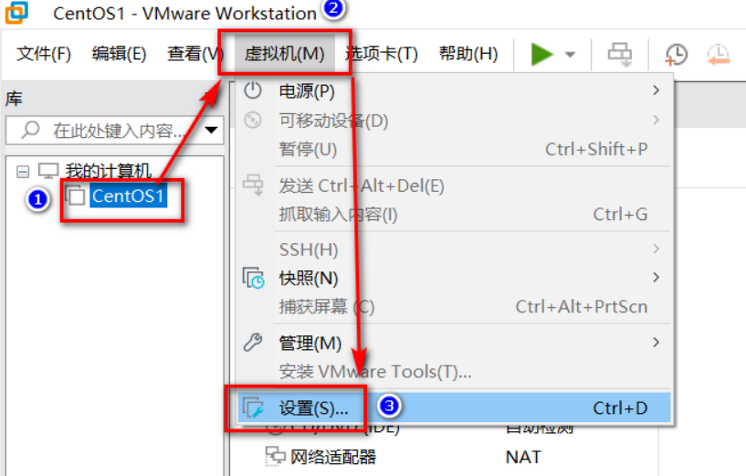

> 第二步：找到CD、DVD选项>使用IOS 镜像文件>浏览>选择的IOS镜像文件


> 第三步：开启虚拟机，开始对虚拟机特征进行设置

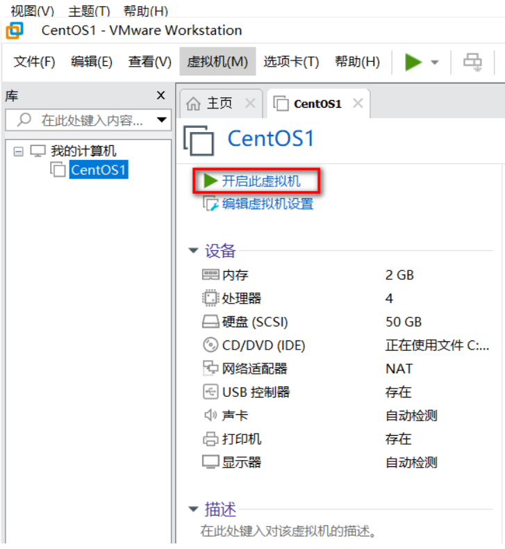

> 第四步：选择 Install Centos 7

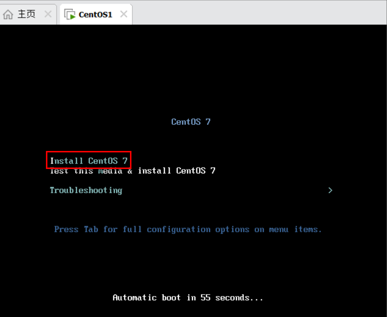

> 第五步：选择安装过程中使用的提示语言


> 第六步：设置时区，时间和日期，与计算机日期一致即可


> 第七步：软件选择GNOME，带有图形界面模式的Linux 然后点击完成
>
> **当前为了学习安装带图形化界面，后续只需要“最小安装”即可**


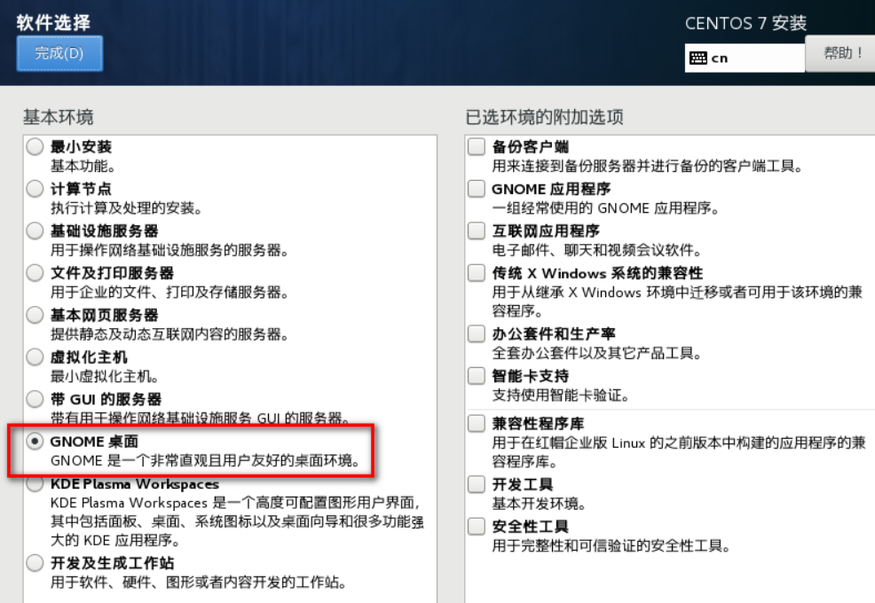

> 第八步：等待安装源和软件选择的支持检查


> 第九步： 设置安装位置，核对信息，然后点击完成即可

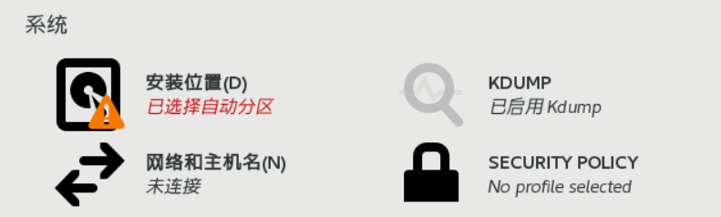


> 第十步： 设置网络和主机名，开启以太网，注意主机名和当前主机IP信息


> 第十一步： KDUMP崩溃存储机制，可以关闭


> 第十二步：开始安装


> 第十三步：设置超级管理员root用户的密码，配置完成，点击重启


> 第十四步：重启后，选择第一项，开启虚拟机


> 第十五步：第一次进入虚拟机，需要接受许可


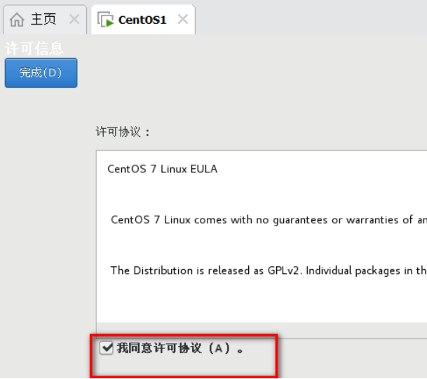

> 第十六步： 选择汉语，然后前进


> 第十七步：选择输入，汉语，然后前进


> 第十八步：位置服务，可以关闭，然后前进


> 第十九步：选择时区，已经设置过，然后前进


> 第二十步：在线账号创建，选择跳过


> 第二十一步：创建用于第一次登陆系统的普通用户账号，这里绝对不可以使用root作为用户名

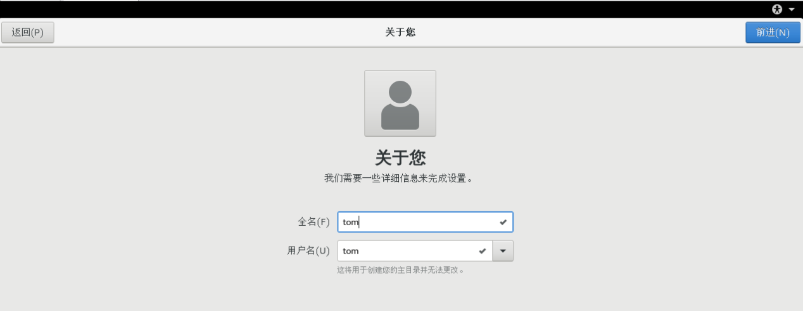

> 第二十二步： 设置普通账户密码


> 第二十三步：进入系统后，点击关机按钮，找到用户，选择注销


> 第二十四步：点击未列出，输入超级管理员的账号密码，以超级管理员身份登录，前面的用户设置重复一遍后，即可进入系统

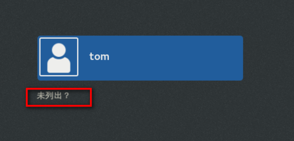

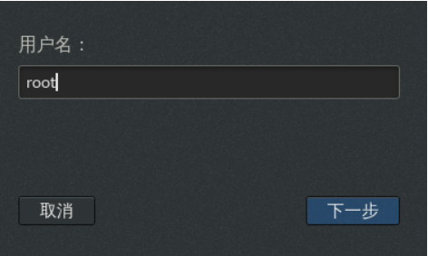

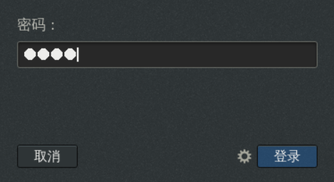

> 第二十五步：如果需要关机，一定要先将虚拟机关机或者挂起后，再关闭VMware，然后关闭windows

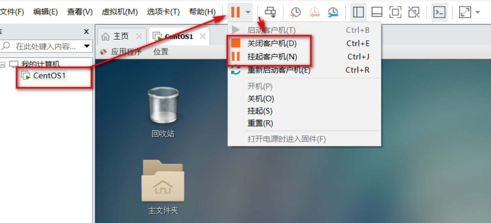

要想让鼠标从VMware的 虚拟中脱离出来，需要按快捷键 ctrl+alt

## 第五节 VMware常见问题

### 问题1 

启动VM报0xc0000005，这是与vindows Hyper-V服务冲突造成的


&#x20;         1 关闭以下服务

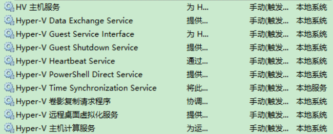

&#x20;         2 以管理员方式运行以下命令

```纯文本
bcdedit /set hypervisorlaunchtype off
```

&#x20;         3 重启电脑


### 问题2 

启动VMware蓝屏问题

&#x20;         1 打开控制面板，点击卸载程序

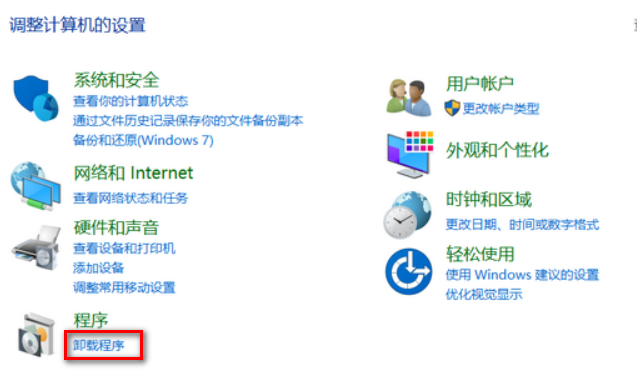

&#x20;        2 点击启用或者关闭Windows功能


&#x20;       3 勾选如下两个选项


### 问题3

* 如果采用问题2方式，运行一段时间后还是蓝屏，到官网下载最新版本安装

* 如果还是不行，可以考虑使用其他虚拟化软件，比如 VirtualBox
* 如果换软件还是出现问题，考虑重新安装Windows操作系统

