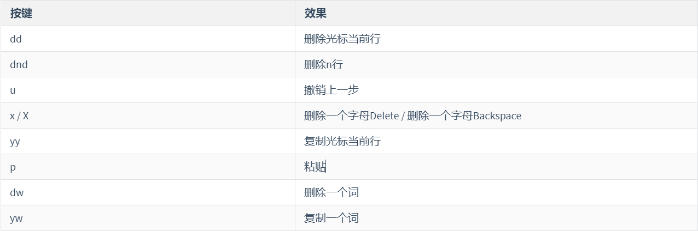

# 第四章 VI和VIM编辑器

## 学习目标

1 了解什么 是VI和VIM 编辑器!

2 熟练VIM编辑器一般模式的常见操作

3 熟练VIM编辑器编辑模式的的进入和推出方式

4 熟练VIM编辑器命令模式的常见命令

## 第一节 什么是VI和VIM编辑器

> vi是Unix和类Unix操作系统中出现的通用的文本编辑器。vim是从vi发展出来的一个性能更强大的文本编辑器,可以主动的以字体颜色辨别语法的正确性,方便程序设计,vim和vi编辑器完全兼容。使用：vi xxx文件 或者vim xxx文件,简单来说,就是用来编辑文件的一个工具,类似于我们再Windows上的一些文本编辑工具,只不过,这里是命令行形式的,不是图形用户界面形式的.接下来我们就准备一个文件,使用VIM对文件进行修改

> 复制一个系统的配置文件到Root目录下，用以练习vim命令

```纯文本
[root@192 ~]# cp /etc/smartmontools/smartd.conf /root
[root@192 ~]# cd /root/
```


## 第二节 VIM的一般模式

> 默认模式,在这个模式中， 你可以使用『上下左右』按键来移动光标，你可以使用『删除字符』或『删除整行』来处理档案内容， 也可以使用『复制、贴上』来处理你的文件数据。

> 1.删除和复制操作



> 2.光标移动操作


## 第三节 VIM的编辑模式

> 在一般模式中可以进行删除、复制、贴上等等的动作，但是却无法编辑文件内容的！要等到你按下『i, I, o, O, a, A, r, R』等任何一个字母之后才会进入编辑模式。注意了！通常在 Linux 中，按下这些按键时，在画面的左下方会出现『INSERT 或 REPLACE 』的字样，此时才可以进行编辑。而如果要回到一般模式时， 则必须要按下『Esc』这个按键即可退出编辑模式。


## 第四节 VIM的命令模式

> 可以进行存盘、退出、显示行号、搜索、批量替换等操作。要在一般模式下输入" / "或 **" : "** 或者"?"可进入命令模式,当命令执行前按esc或者命令执行完毕,自动回到一般模式


* **模式间的切换**


> 如果非正常退出,如使用ctrl+z退出,再次编辑会提示交换文件". *.swp",文件存在,并给出相应的处理方式选项,如果不删除交换文件,每次编辑都会提示,这时可以删除交换文件,通过命令: rm -f *.swp 即可


