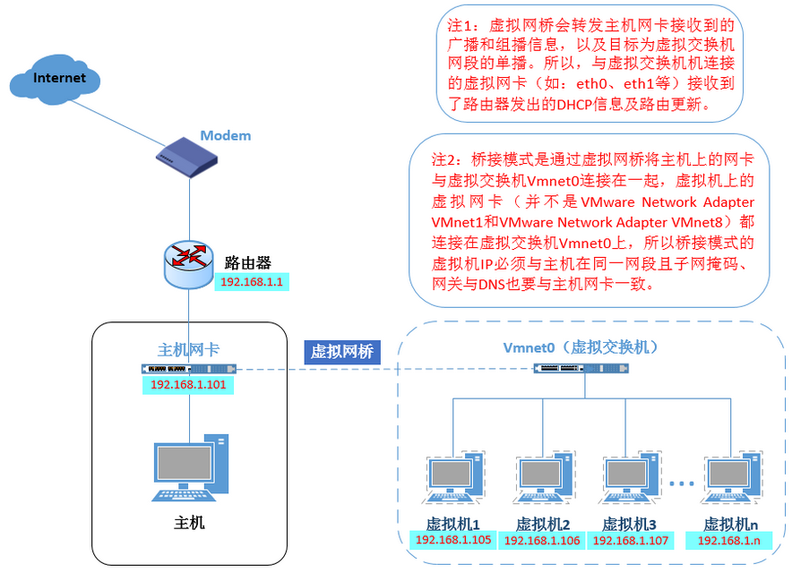
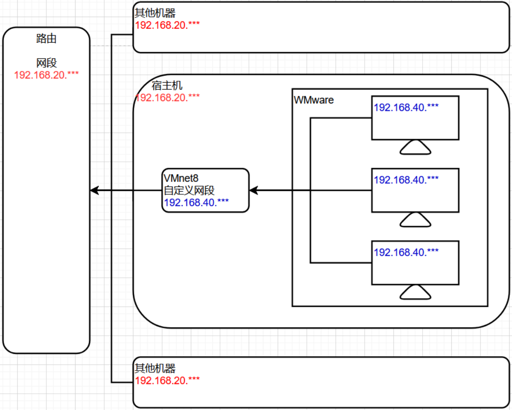
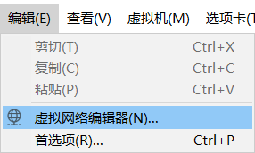
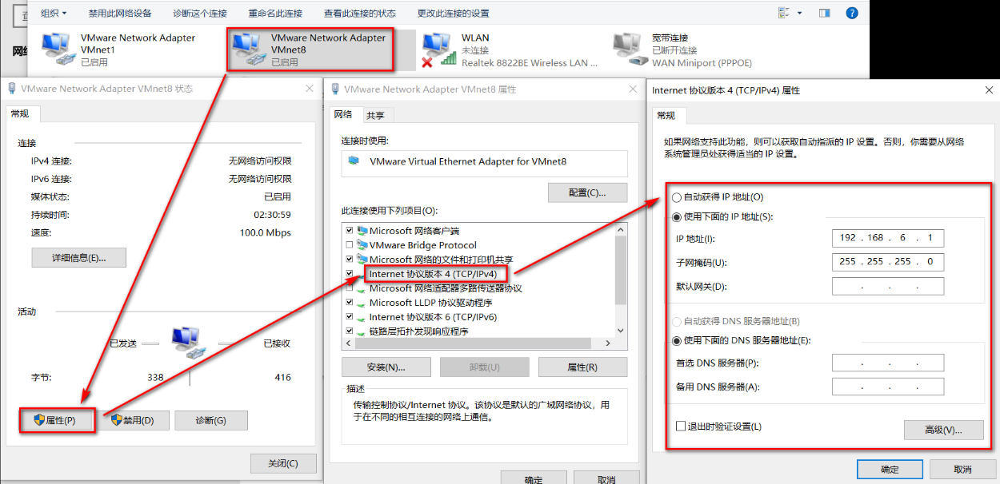
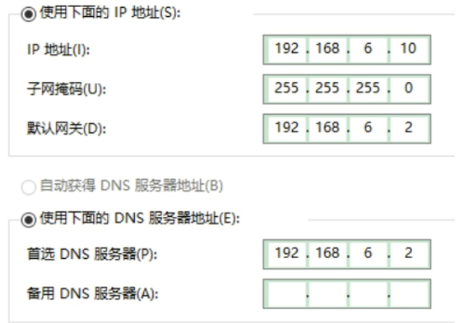

# 第五章 虚拟机网络配置

## 学习目标

1 熟练查看虚拟机网络配置信息

2 熟悉WMware的联网模式及特点

3 熟练在NAT模式下,将虚拟机IP设置为固定IP

4 熟练查看虚拟机主机名及配置主机名IP映射关系

5 熟练掌握Linux服务管理类命令

## 第一节 查看网络信息

> 通过ifconfig命令查看目前的网络信息


> 通过ping命令测试和某个IP之间是否相通


> 在VMware中查看当前虚拟机的联网模式


*   模式1  仅主机模式特点

    *   特点&#x20;

        *   虚拟机只能和宿主机之间实现通信

    *   缺点

        *   只有宿主机和虚拟机之前能通信,虚拟机联网需要做更多的配置


*   模式2 桥接模式特点

    *   特点

        *   宿主机和虚拟机,都是由局域网路由(DHCP)进行IP的分配

        *   宿主机和本地的虚拟机之间可以进行通信

        *   局域网内其他机器也可以与虚拟机进行通信

        *   简单

    *   缺点

        *   虚拟机会占用大量的IP,局域网内如果机器太多,或者虚拟机太多,那么会出现大量的IP冲突




*   模式3 NAT模式特点

    *   特点

        *   宿主机和其他机器的IP由局域网路由进行IP的分配,虚拟机的IP通过VMnet8虚拟交换机进行分配

        *   宿主机和本地的虚拟机之间可以进行通信

        *   不会占用宿主机所在路由IP,不会造成IP冲突

    *   缺点

        *   局域网内的机器无法与其他机器上的虚拟机进行通信




*   关于模式的选择

    *   什么时候选择NAT模式?

        *   在教室内,因为大量同学使用同一个路由,避免大量的IP冲突

        *   我们在学习阶段,主要满足我们自己的计算机(宿主机)和本地虚拟机之间的通信以及虚拟机的联网

    *   什么时候选择桥接模式?

        *   自己独立的路由,想在局域网内实现虚拟机和其他计算机之间的通信

    *   未来如何选择

        *   未来这些问题会由运维人员来处理

        *   未来我们使用的服务器不会在本地,使用远程服务器,自然也不需要我们来处理这种问题

## 第二节 修改网络配置信息

> 第一步:  打开VMware,打开虚拟网络编辑器



> 第二步: 选择NAT模式,对网段进行调整


> 第三步: 设置NAT模式的网关


> 第四步: 检查是否有漏选的选项


> 第五步: 修改虚拟机自己的网络模式选用模式为NAT


> 第六步: 修改虚拟机ens33网卡的网络配置信息

```bash
vim /etc/sysconfig/network-scripts/ifcfg-ens33
```

*   ens33网络配置默认信息如下

```纯文本
TYPE="Ethernet" #网络类型（通常是Ethemet，工业以太网）
PROXY_METHOD="none"
BROWSER_ONLY="no"
BOOTPROTO="dhcp"  #dhcp 为动态IP
DEFROUTE="yes"
IPV4_FAILURE_FATAL="no"
IPV6INIT="yes"
IPV6_AUTOCONF="yes"
IPV6_DEFROUTE="yes"
IPV6_FAILURE_FATAL="no"
IPV6_ADDR_GEN_MODE="stable-privacy"
NAME="ens33"
UUID="e8582df9-96c3-4ddc-9fc6-19282dd5e019"
DEVICE="ens33"
ONBOOT="yes" #系统启动的时候网络接口是否有效（yes/no）
```

*   以下选项,有则修改,无则增加

```纯文本
BOOTPROTO="static" #静态网址 (已有)
ONBOOT="yes" #开机启用 (已有)
IPADDR=192.168.6.100 #IP地址 (增加)
GATEWAY=192.168.6.2 #网关(增加)
DNS1=192.168.6.2 #DNS域名解析(增加) 
```

> 第七步: 重启网络服务

```bash
systemctl restart network
window: net start 
```

*   如果报错,则reboot重启虚拟机

> 第八步: 如果此时宿主机和虚拟机之前ping不通,可以配置windows的 VMnet8虚拟网卡





*   DNS配置：

    *   与网关一样，可以上网

    *   8.8.8.8 测试可能无法上网

    *   114.114.114.114 测试可以上网

> 第九步: 如果网络服务还是不能启动,可能域NetWorkManager服务冲突,关闭该服务即可

```纯文本
查看服务systemctl status NetworkManager.service
停止服务 systemctl stop NetworkManager
查看自启动 systemctl is-enabled NetworkManager
关闭自启动systemctl disable NetworkManager
```

## 第三节 查看和修改主机名

> 查看主机名

```纯文本
hostname
```


> 修改主机名

```纯文本
vim /etc/hostname
```


> 修改主机名和IP地址的映射关系

```纯文本
vim /etc/hosts
```


*   保存退出后重启计算机

> 修改宿主机的主机名和IP地址映射关系

*   windows上如果想通过centos100识别192.168.6.100 ,也需要秀修改hosts文件


*   添加一行 192.168.6.100 centos100

## 第四节 服务管理类命令

> 临时开关服务命令

*   语法

    *   centos6

        *   service 服务名 start 开启服务

        *   service 服务名 stop 关闭服务

        *   service 服务名 restart 重启服务

        *   service 服务名 status 查看服务状态

    *   centos7

        *   systemctl start 服务名  开启服务

        *   systemctl stop 服务名 关闭服务

        *   systemctl restart 服务名 重启服务

        *   systemctl status 服务名 查看服务

        *   systemctl --type service 查看正在运行的服务

*   实操

    *   1 查看网络服务状态

    ```text
    systemctl status network.service
    ```

    *   2 关闭服务

    ```text
    systemctl stop network.service
    ```

    *   3 启动服务

    ```text
    systemctl start network.service
    ```

    *   4 重启服务

    ```text
    systemctl restart network.service
    ```

    *   查看所有服务

    ```text
    systemctl --type service
    ```

    .service后缀可以省略不写

> 永久开关服务命令

*   语法

    *   centos6

        *   chkconfig   查看所有服务自启配置

        *   chkconfig 服务名 off  关闭服务自启

        *   chkconfig 服务名 on   开启服务自启

        *   chkconfig 服务名 --list  查看服务开机启动状态

    *   centos7

        *   systemctl enable 服务名          打开自启
        *   systemctl disable 服务名         关闭自启
        *   systemctl is-enabled 服务名     查看服务是否自启
    *   systemctl list-unit-files      查看所有服务自启配置
    
*   实操

    *   1 关闭防火墙自动启动

    ```text
    systemctl status firewalld  查看防火墙
    systemctl disable firewalld  关闭防火墙自启
    ```

    *   2 开启防火墙自启

    ```text
    systemctl enable firewalld
    ```

    *   3 查看防火墙是否自启

    ```text
    systemctl is-enabled firewalld
    ```

Linux系统有7种运行级别(runlevel)：常用的是级别3和5(CentOS7中只有两个级别了：3和5)

运行级别0：系统停机状态，系统默认运行级别不能设为0，否则不能正常启动

运行级别1：单用户工作状态，root权限，用于系统维护，禁止远程登陆

运行级别2：多用户状态(没有NFS)，不支持网络

运行级别3：完全的多用户状态(有NFS)，登陆后进入控制台命令行模式

运行级别4：系统未使用，保留

运行级别5：X11控制台，登陆后进入图形GUI模式

运行级别6：系统正常关闭并重启，默认运行级别不能设为6，否则不能正常启动


