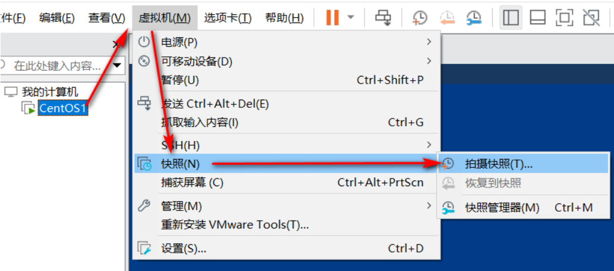
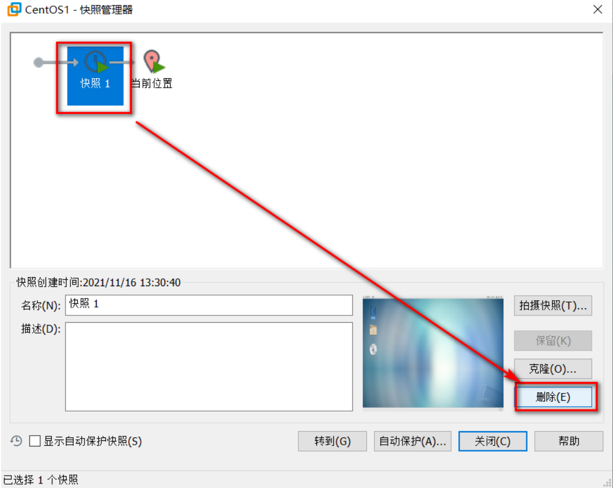
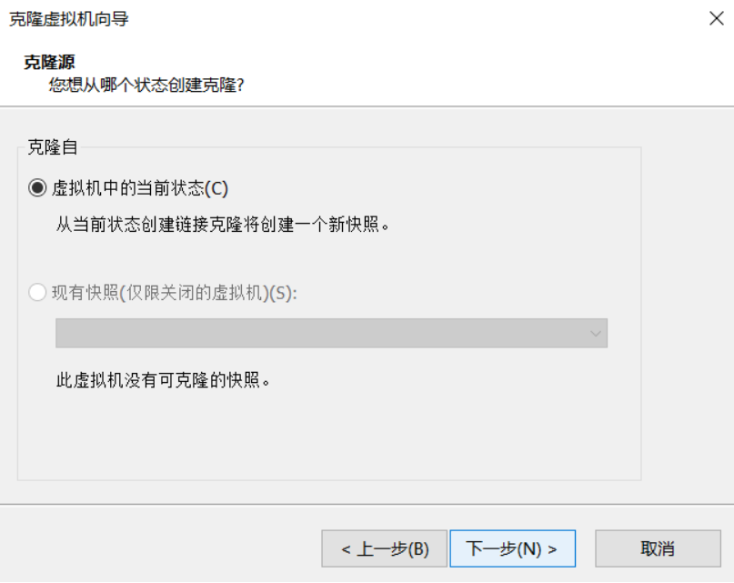
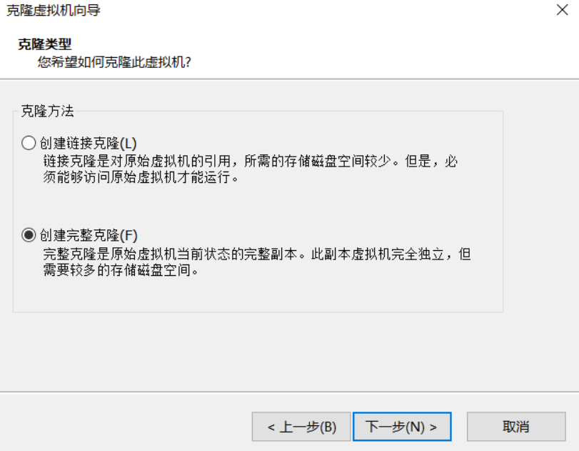
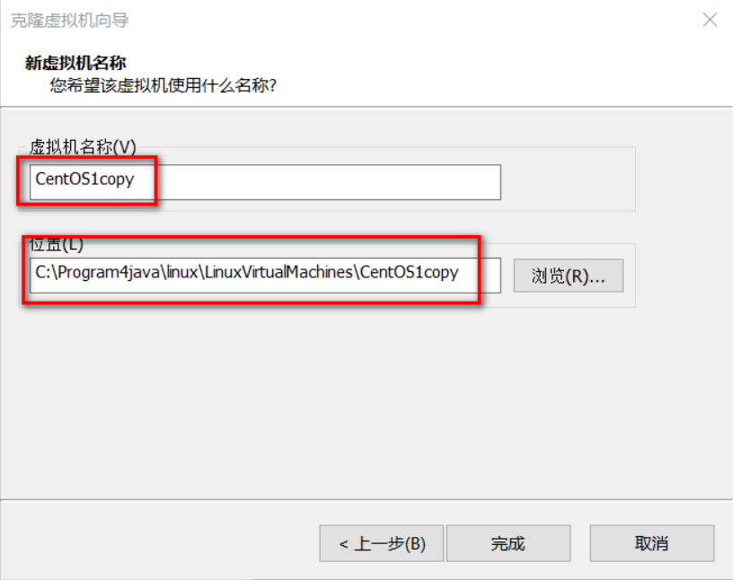

# 第六章 虚拟机管理操作

## 学习目标

1 熟练掌握虚拟机快照的使用和管理

2 熟练掌握通过克隆方式创建虚拟机

## 第一节 VMware为虚拟机拍摄快照

> 通过快照可快速保存虚拟机当前的状态,后续可以使用快照,将虚拟机还原到某个快照的状态. 如某个软件安装失败,可以通过快照快速还原回指定的某个状态

*   选择指定的虚拟机拍摄快照

*   输入快照名称,添加快照描述

*   通过快照恢复虚拟机状态

*   管理和废弃快照

## 第二节 VMware为虚拟机执行克隆

> 第一步: 关闭要克隆的虚拟机

> 第二步: 选中虚拟机,右击>管理>克隆

> 第三步: 可以选择虚拟当前状态和某个快照状态进行克隆

> 第四步: 创建完整克隆

> 第五步: 注意修改克隆之后的虚拟机的名称和存放路径

> 第六步: 克隆完成,关闭即可

> 第七步: 修改克隆出来的虚拟机的主机名和IP配置,然后重启
