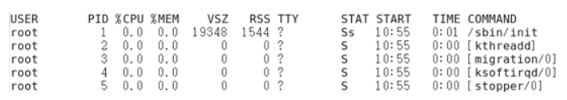
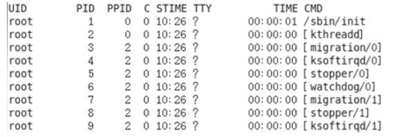

# 第八章 常见Linux命令

## 学习目标

1 熟练文件目录类命令

2 熟悉用户管理命令

3 熟悉组管理命令

4 熟练文件权限命令

5 熟悉搜索查找类命令

6 熟练压缩和解压缩命令

7 熟练进程线程类命令

8 了解磁盘分区类命令

## 第一节 文件目录类命令

### （1）pwd打印当前目录的绝对路径

(print working directory ) 

*   基本语法

    *   pwd    （功能描述：显示当前工作目录的绝对路径）

*   案例实操

    *   显示当前工作目录的绝对路径

    ```纯文本
    [root@hadoop101 ~]# pwd
    /root
    ```


### （2）ls(list) 列出目录内容

*   基本语法

    *   ls \[选项] \[目录或是文件]

*   选项说明

    | 选项 | 功能                                |
    | -- | --------------------------------- |
    | -a | 全部的文件，连同隐藏档( 开头为 . 的文件) 一起列出来(常用) |
    | -l | 长数据串列出，包含文件的属性与权限等等数据；(常用)        |

*   显示说明

    ==每行列出的信息依次是： 文件类型与权限 链接数 文件属主 文件属组 文件大小用byte来表示 建立或最近修改的时间 名字==&#x20;

*   实操案例

    *   查看当前目录的所有内容信息

    ```纯文本
    [atguigu@hadoop101 ~]$ ls -al
    总用量 44
    drwx------. 5 atguigu atguigu 4096 5月  27 15:15 .
    drwxr-xr-x. 3 root    root    4096 5月  27 14:03 ..
    drwxrwxrwx. 2 root    root    4096 5月  27 14:14 hello
    -rwxrw-r--. 1 atguigu atguigu   34 5月  27 14:20 test.txt
    ```


### （3）cd(Change Directory)切换路径

*   基本语法

    *   cd \[参数]

*   参数说明

    | 参数        | 功能                                 |
    | ----------- | ------------------------------------ |
    | cd 绝对路径 | **切换路径 ** /开头                  |
    | cd 相对路径 | **切换路径**  ./ ./可以省略          |
    | cd \~或者cd | 回到自己的家目录                     |
    | cd -        | 回到上一次所在目录                   |
    | cd ..       | 回到当前目录的上一级目录             |
    | cd -P       | 跳转到实际物理路径，而非快捷方式路径 |
    | cd /        | 回到系统根目录                       |

*   实操案例

    *   使用绝对路径切换到root目录

    ```text
    [root@hadoop101 ~]# cd /root/
    ```

    *   使用相对路径切换到“公共的”目录

    ```text
    [root@hadoop101 ~]# cd 公共的/
    ```

    *   表示回到自己的家目录，亦即是 /root 这个目录

    ```text
    [root@hadoop101 公共的]# cd ~
    ```

    *   cd- 回到上一次所在目录

    ```text
    [root@hadoop101 ~]# cd -
    ```

    *   表示回到当前目录的上一级目录，亦即是 “/root/公共的”的上一级目录的意思；

    ```text
    [root@hadoop101 公共的]# cd ..
    ```


### （4）mkdir(Make directory) 建立目录

*   基本语法

    *   mkdir \[选项] 要创建的目录

*   选项说明

    | 选项 | 功能                 |
    | ---- | -------------------- |
    | -p   | 创建多层目录[未存在] |

*   实操案例

    *   创建一个目录

    ```text
    [root@hadoop101 ~]# mkdir xiyou
    
    [root@hadoop101 ~]# mkdir xiyou/mingjie
    ```

    *   创建一个多级目录

    ```text
    [root@hadoop101 ~]# mkdir -p xiyou/dssz/meihouwang
    ```


### （5）rmdir(Remove directory) 删除目录

*   基本语法

    *   rmdir 要删除的【**空目录**】

*   实操案例

    *   删除一个空的文件夹

    ```text
    [root@hadoop101 ~]# rmdir xiyou/dssz/meihouwang
    ```


### （6）touch 创建空文件

*   基本语法

    *   touch 文件名称

*   实操案例

    ```纯文本
    [root@hadoop101 ~]# touch xiyou/dssz/sunwukong.txt
    ```

*   注意事项

    vim也可以创建文件,vim atguigu.txt 进入编辑模式,然后输入内容保存退出即可,但是如果不输出内容直接空文件下退出,则不会创建文件
    
    

### （7）cp 复制文件或目录

*   基本语法

    *   cp \[选项] source dest             （功能描述：复制source文件到dest）

*   选项说明

    | 选项 | 功能        |
    | -- | --------- |
    | -r | 递归复制整个文件夹 |

*   参数说明

    | 参数     | 功能   |
    | ------ | ---- |
    | source | 源文件  |
    | dest   | 目标文件 |

* 实操案例

  *   复制文件

  ```text
  [root@hadoop101 ~]# cp xiyou/dssz/suwukong.txt xiyou/mingjie/
  ```

  *   递归复制整个文件夹

  ```text
  [root@hadoop101 ~]# cp -r a/b/ ./
  ```

  

### （8）rm移除文件或者目录

*   基本语法

    *   rm \[选项] deleteFile

*   选项说明

    | 选项 | 功能             |
    | -- | -------------- |
    | -r | 递归删除目录所有内容     |
    | -f | 强制删除,不提示用户进行确认 |
    | -v | 显示指令的详细执行过程    |

*   实操案例

    *   删除目录中的内容

    ```text
    [root@hadoop101 ~]# rm xiyou/mingjie/sunwukong.txt
    ```

    *   递归删除目录中所有内容

    ```text
    [root@hadoop101 ~]# rm -rf /opt/xiyou
    ```


### （9）mv移动文件与目录或重命名

*   基本语法

    *   重命名&#x20;

    ```纯文本
    mv oldNameFile newNameFile
    ```

    *   移动文件&#x20;

    ```纯文本
    mv /temp/movefile /targetFolder
    ```

*   实操案例

    *   重命名

    ```纯文本
    [root@hadoop101 ~]# mv xiyou/dssz/suwukong.txt xiyou/dssz/houge.txt
    ```

    *   移动文件

    ```纯文本
    [root@hadoop101 ~]# mv xiyou/dssz/houge.txt ./
    ```


### （10）cat查看文件内容

*   基本语法

    *   cat  \[选项] 文件     查看文件内容,从第一行开始显示

*   选项说明

    | 选项  | 功能描述          |
    | --- | ------------- |
    | - n | 显示所有行的行号,包括空行 |

*   经验技巧

    ```纯文本
    一般查看比较小的文件,一屏幕能显示全的
    ```

*   实操案例

    *   查看文件内容并显示行号

    ```纯文本
    [atguigu@hadoop101 ~]$ cat -n houge.txt 
    ```


### （11）more 文件分屏查看器

*   基本语法

    ```纯文本
     more 要查看的文件
    ```
    
    ```纯文本
    more指令是一个基于VI编辑器的文本过滤器，它以全屏幕的方式按页显示文本文件的内容。more指令中内置了若干快捷键，详见操作说明。
    ```
    
*   操作说明

    | 操作          | 功能说明                    |
    | ----------- | ----------------------- |
    | 空白键 (space) | 代表向下翻一页；                |
    | Enter       | 代表向下翻『一行』；              |
    | q           | 代表立刻离开 more ，不再显示该文件内容。 |
    | Ctrl+F      | 向下滚动一屏                  |
    | Ctrl+B      | 返回上一屏                   |
    | =           | 输出当前行的行号                |
    | :f          | 输出文件名和当前行的行号            |

*   实操案例

    *   （1）采用more查看文件

    ```纯文本
    [root@hadoop101 ~]# more smartd.conf
    ```


### （12）less 分屏显示文件内容

*   基本语法

    ```纯文本
    less指令用来分屏查看文件内容，它的功能与more指令类似，但是比more指令更加强大，支持各种显示终端。less指令在显示文件内容时，并不是一次将整个文件加载之后才显示，而是根据显示需要加载内容，对于显示大型文件具有较高的效率。

    less 要查看的文件
    ```

*   操作说明

    | 操作          | 功能说明                       |
    | ----------- | -------------------------- |
    | 空白键         | 向下翻动一页；                    |
    | \[pagedown] | 向下翻动一页                     |
    | \[pageup]   | 向上翻动一页；                    |
    | /字串         | 向下搜寻『字串』的功能；n：向下查找；N：向上查找； |
    | ?字串         | 向上搜寻『字串』的功能；n：向上查找；N：向下查找； |
    | q           | 离开 less 这个程序；              |

*   实操案例

    *   （1）采用less查看文件

    ```纯文本
    [root@hadoop101 ~]# less smartd.conf
    ```


### （13）head显示文件头部内容

*   基本语法

    ```纯文本
    head用于显示文件的开头部分内容，默认情况下head指令显示文件的前10行内容。

    head 文件      （功能描述：查看文件头10行内容）
    head -n 5 文件   （功能描述：查看文件头5行内容，5可以是任意行数）
    ```

*   选项说明

    | 选项      | 功能          |
    | ------- | ----------- |
    | -n <行数> | 指定显示头部内容的行数 |

*   实操案例

    *   （1）查看文件的头2行

    ```纯文本
    [root@hadoop101 ~]# head -n 2 smartd.conf
    ```


### （14）tail 输出文件尾部内容

*   基本语法

    ```纯文本
    tail用于输出文件中尾部的内容，默认情况下tail指令显示文件的后10行内容。
    （1）tail 文件          （功能描述：查看文件后10行内容）
    （2）tail -n 5 文件     （功能描述：查看文件后5行内容，5可以是任意行数）
    （3）tail -f 文件      （功能描述：实时追踪该文档的所有更新）
    ```

*   选项说明

    | 选项     | 功能                 |
    | ------ | ------------------ |
    | -n<行数> | 输出文件尾部n行内容         |
    | -f     | 显示文件最新追加的内容，监视文件变化 |

*   实操案例

    *   （1）查看文件头1行内容

    ```纯文本
    [root@hadoop101 ~]# tail -n 1 smartd.conf 
    ```

    *   （2）实时追踪该档的所有更新

    ```纯文本
    [root@hadoop101 ~]# tail -f houge.txt
    ```


### （15）echo 打印信息

*   基本语法

    ```纯文本
     echo输出内容到控制台  == System.out.println();
     
     echo [选项] [输出内容]
    ```

*   选项说明

    | 选项 | 功能           |
    | -- | ------------ |
    | -e | 支持反斜线控制的字符转换 |

    | 控制字符 | 作用          |
    | ---- | ----------- |
    | \\\\ | 输出\本身       |
    | \n   | 换行符         |
    | \t   | 制表符，也就是Tab键 |

*   实操案例

    *   (1) 打印文字信息

    ```纯文本
    [atguigu@hadoop101 ~]$ echo "hello\tworld"
    hello\tworld
    [atguigu@hadoop101 ~]$ echo -e "hello\tworld"
    hello   world
    ```

    *   (2) 打印环境变量

    ```纯文本
    [atguigu@hadoop101 ~]$ echo $PATH
    ```


### （16）\> 覆盖和>>追加

*   基本语法

    ```纯文本
    （1）ll >文件       （功能描述：列表的内容写入文件a.txt中（**覆盖写**））
    （2）ll >>文件      （功能描述：列表的内容**追加**到文件aa.txt的末尾）
    （3）cat 文件1 > 文件2 （功能描述：将文件1的内容覆盖到文件2）也可以配合>>使用
    （4）echo “内容” >> 文件 也可以配合>>使用
    ```

*   实操案例

    *   （1）将ls查看信息写入到文件中

    ```纯文本
    [root@hadoop101 ~]# ls -l>houge.txt
    ```

    *   （2）将ls查看信息追加到文件中

    ```纯文本
    [root@hadoop101 ~]# ls -l>>houge.txt
    ```

    *   （3）采用echo将hello单词追加到文件中

    ```纯文本
    [root@hadoop101 ~]# echo hello>>houge.txt
    ```


### （17）ln创建链接和软连接

*   基本语法

    ```纯文本
    链接表示目标资源的另外的访问方式,表示一种路径
    软链接也称为符号链接，类似于windows里的快捷方式，有自己的数据块，主要存放了链接其他文件的路径。
    ln [-s] [原文件或目录] [链接名]       （功能描述：给原文件创建一个链接）
    ```

*   选项说明

    | 选项     | 功能                |
    | -------- | ------------------- |
    | -s [小s] | 创建的链接为 软连接 |

*   经验技巧

    ```纯文本
    删除软链接： rm -rf 软链接名，而不是rm -rf 软链接名/
    查询：通过ll就可以查看，列表属性第1位是l，尾部会有位置指向。
    ```

*   实操案例

    *   （1）创建软连接

    ```纯文本
    [root@hadoop101 ~]# mv houge.txt xiyou/dssz/
    [root@hadoop101 ~]# ln -s xiyou/dssz/houge.txt houzi
    [root@hadoop101 ~]# ll
    lrwxrwxrwx. 1 root  root   20 6月 17 12:56 houzi -> xiyou/dssz/houge.txt
    ```

    *   （2）删除软连接

    ```纯文本
    [root@hadoop101 ~]# rm -rf houzi
    ```

    *   （3）进入软连接实际物理路径

    ```纯文本
    [root@hadoop101 ~]# ln -s xiyou/dssz/ ./dssz
    [root@hadoop101 ~]# cd -P dssz/
    ```


### （18）history查看历史命令

*   基本语法

    ```纯文本
     history                    （功能描述：查看已经执行过历史命令）
    ```

*   实操案例

    *   （1）查看已经执行过的历史命令

    ```纯文本
    [root@hadoop101 test1]# history
    ```

    *   (2)   /root/.bash\_history文件中也是历史命令

    ```纯文本
    
    ```


## 第二节 用户管理命令

> useradd添加新用户

*   基本语法

    ```纯文本
    useradd 用户名                （功能描述：添加新用户）
    ​useradd -g 组名 用户名         （功能描述：添加新用户到某个组）
    ```

*   实操案例

    *   （1）添加一个用户

    ```纯文本
    [root@hadoop101 ~]# useradd tangseng
    [root@hadoop101 ~]#ll /home/
    ```


> passwd设置用户密码

*   基本语法

    ```纯文本
    passwd 用户名   （功能描述：设置用户密码）
    ```

*   实操案例

    *   （1）设置用户的密码

    ```纯文本
    [root@hadoop101 ~]# passwd tangseng
    ```


> id查看用户是否存在

*   基本语法

    ```纯文本
    id 用户名
    ```

*   实操案例

    *   （1）查看用户是否存在

    ```纯文本
    [root@hadoop101 ~]#id tangseng
    ```


> cat /etc/passwd 查看创建的所有用户

*   实操案例

    *   (1) 查看创建的所有用户

    ```纯文本
    [root@hadoop101 ~]# cat /etc/passwd
    ```


> su(switch user )切换用户

*   基本语法

    ```纯文本
    su 用户名称      （功能描述：切换用户，只能获得用户的执行权限，不能获得环境变量）
    su - 用户名称    （功能描述：切换到用户并获得该用户的环境变量及执行权限）
    ```

*   实操案例

    *   （1）切换用户

    ```纯文本
    [root@hadoop101 ~]#su tangseng
    [root@hadoop101 ~]#echo $PATH
    /usr/lib64/qt-3.3/bin:/usr/local/sbin:/usr/local/bin:/sbin:/bin:/usr/sbin:/usr/bin:/root/bin
    [root@hadoop101 ~]#exit
    [root@hadoop101 ~]#su - tangseng
    [root@hadoop101 ~]#echo $PATH
    /usr/lib64/qt-3.3/bin:/usr/local/bin:/bin:/usr/bin:/usr/local/sbin:/usr/sbin:/sbin:/home/tangseng/bin
    ```

    *   &#x20;(2) exit 回退到上一个用户 &#x20;

    ```纯文本
    [root@hadoop101 ~]#exit
    ```


> userdel删除用户

*   基本语法

    ```纯文本
    （1）userdel 用户名          （功能描述：删除用户但保存用户主目录）
    ​（2）userdel -r 用户名       （功能描述：用户和用户主目录，都删除）
    ```

*   选项说明

    | 选项 | 功能                    |
    | -- | --------------------- |
    | -r | 删除用户的同时，删除与用户相关的所有文件。 |

*   实操案例

    *   （1）删除用户但保存用户主目录

    ```纯文本
    [root@hadoop101 ~]#userdel tangseng
    [root@hadoop101 ~]#ll /home/
    ```

    *   （2）删除用户和用户主目录，都删除

    ```纯文本
    [root@hadoop101 ~]#useradd zhubajie
    [root@hadoop101 ~]#ll /home/
    [root@hadoop101 ~]#userdel -r zhubajie
    [root@hadoop101 ~]#ll /home/
    ```


> who 查看登录用户信息

*   基本语法

    ```纯文本
    （1）whoami           （功能描述：显示自身用户名称）
    ​（2）who am i         （功能描述：显示登录用户的用户名）
    ```

*   案例实操

    *   （1）显示自身用户名称

    ```纯文本
    [root@hadoop101 opt]# whoami
    ```

    *   （2）显示登录用户的用户名

    ```纯文本
    [root@hadoop101 opt]# who am i
    ```


> sudo 设置普通用户具有root权限

*   基本语法

    ```纯文本
    sudo 命令
    ```

*   实操案例

    *   (1) 添加atguigu用户，并对其设置密码

    ```纯文本
    [root@hadoop101 ~]#useradd atguigu
    [root@hadoop101 ~]#passwd atguigu
    ```

    *   (2)修改配置文件

    ```纯文本
    [root@hadoop101 ~]#vi /etc/sudoers
    ```

    ```纯文本
    修改 /etc/sudoers 文件，找到下面一行(91行)，在root下面添加一行，如下
    
    \## Allow root to run any commands anywhere
    root  ALL=(ALL)   ALL
    ```
    
```纯文本
    或者配置成采用sudo命令时，不需要输入密码
    
    \## Allow root to run any commands anywhere
    root   ALL=(ALL)   ALL
    atguigu  ALL=(ALL)   NOPASSWD:ALL
    
    修改完毕，现在可以用atguigu帐号登录，然后用命令 sudo ，即可获得root权限进行操作。
```

*   (3)用普通用户在/opt目录下创建一个文件夹
    
```纯文本
    [atguigu@hadoop101 opt]$ sudo mkdir module
```


> usermod修改用户

*   基本语法

    ```纯文本
    usermod -g 用户组 用户名
    ```

*   选项说明

    | 选项 | 功能                  |
    | -- | ------------------- |
    | -g | 修改用户的初始登录组，给定的组必须存在 |

*   实操案例

    *   （1）将用户加入到用户组

    ```纯文本
    [root@hadoop101 opt]#usermod -g root zhubajie
    ```


## 第三节 组管理类命令

每个用户都有一个用户组，系统可以对一个用户组中的所有用户进行集中管理。不同Linux 系统对用户组的规定有所不同，如Linux下的用户属于与它同名的用户组，这个用户组在创建用户时同时创建。用户组的管理涉及用户组的添加、删除和修改。组的增加、删除和修改实际上就是对/etc/group文件的更新。

> groupadd新增组

*   基本语法

    ```纯文本
    groupadd 组名
    ```

*   实操案例

    *   （1）添加一个xitianqujing组

    ```纯文本
    [root@hadoop101 opt]#groupadd xitianqujing
    ```

> groupdel删除组

*   基本语法

    ```纯文本
    groupdel 组名
    ```

*   实操案例

    *   （1）删除xitianqujing组

    ```纯文本
    [root@hadoop101 opt]# groupdel xitianqujing
    ```

> 查看创建了那些组

*   实操案例

    ```纯文本
    [root@hadoop101 atguigu]# cat  /etc/group
    ```


## 第四节 文件权限类命令

> 文件属性信息解读

*   文件类型和权限的表示

    

    *   （1） 0首位表示类型 在Linux中第一个字符代表这个文件是目录、文件或链接文件等等

        | 符号 | 对应文件类型           |
        | -- | ---------------- |
        | -  | 代表文件             |
        | d  | d 代表目录           |
        | l  | 链接文档(link file)； |

    *   （2）第1-3位确定属主（该文件的所有者）拥有该文件的权限。U →User

    *   （3）第4-6位确定属组（所有者的同组用户）拥有该文件的权限，G→Group

    *   （4）第7-9位确定其他用户拥有该文件的权限 ,   O →Other

*   rwx作用到目录和文件的不同含义

    *   作用到文件

    ```纯文本
    [ r ]代表可读(read): 可以读取，查看
    ​[ w ]代表可写(write): 可以修改，但是不能删除该文件，对该文件所在的目录有写权限，才能删除.
    ​[ x ]代表可执行(execute):可以被系统执行
    ```

    *   作用到目录

    ```纯文本
    [ r ]代表可读(read): 可以读取，ls查看目录内容
    ​[ w ]代表可写(write): 可以修改，目录内创建+删除+重命名目录
    [ x ]代表可执行(execute):可以进入该目录
    ```

*   实操案例

    *   (1)查看文件权限信息

    ```纯文本
    [root@hadoop101 ~]# ll
    总用量 104
    -rw-------. 1 root root 1248 1月  8 17:36 anaconda-ks.cfg
    drwxr-xr-x. 2 root root 4096 1月 12 14:02 dssz
    lrwxrwxrwx. 1 root root  20 1月 12 14:32 houzi -> xiyou/dssz/houge.tx
    
    ```

    *   (2)文件属性介绍

    ```纯文本
    ls -l  || ll
    ```

    

    \*\* 如果查看到是文件：链接数指的是硬链接个数\*\*
    \*\* 如果查看的是文件夹：链接数指的是子文件夹个数 \*\*​

> chmod改变文件权限

*   基本语法

    

    *   第一种方式变更权限

    ```纯文本
    chmod [{ugoa}{+-=}{rwx}] 文件或目录
    ```

    *   第二种方式变更权限

    ```纯文本
    chmod [mode=421 ] [文件或目录]
    ```

*   经验技巧

    ```纯文本
    u:所有者 g:所有组 o:其他人 a:所有人(u、g、o的总和)
    ​r=4 w=2 x=1         
    rwx=4+2+1=7
    ```

*   实操案例

    *   （1）修改文件使其所属主用户具有执行权限

    ```纯文本
    [root@hadoop101 ~]# cp xiyou/dssz/houge.txt ./
    [root@hadoop101 ~]# chmod u+x houge.txt
    ```

    *   （2）修改文件使其所属组用户具有执行权限

    ```纯文本
    [root@hadoop101 ~]# chmod g+x houge.txt
    ```

    *   （3）修改文件所属主用户执行权限,并使其他用户具有执行权限

    ```纯文本
    [root@hadoop101 ~]# chmod u-x,o+x houge.txt
    ```

    *   （4）采用数字的方式，设置文件所有者、所属组、其他用户都具有可读可写可执行权限。

    ```纯文本
    [root@hadoop101 ~]# chmod 777 houge.txt
    ```

    *   （5）修改整个文件夹里面的所有文件的所有者、所属组、其他用户都具有可读写执行权限。

    ```纯文本
    [root@hadoop101 ~]# chmod -R 777 xiyou/
    ```

> chown 改变所有者

*   基本语法

    ```纯文本
    chown [选项] [最终用户] [文件或目录]     （功能描述：改变文件或者目录的所有者）
    ```

*   选项说明

    | 选项 | 功能   |
    | -- | ---- |
    | -R | 递归操作 |

*   实操案例

    *   （1）修改文件所有者

    ```纯文本
    [root@hadoop101 ~]# chown atguigu houge.txt 
    [root@hadoop101 ~]# ls -al
    -rwxrwxrwx. 1 atguigu root 551 5月 23 13:02 houge.txt
    ```

    *   （2）递归改变文件所有者和所有组

    ```纯文本
    [root@hadoop101 xiyou]# ll
    drwxrwxrwx. 2 root root 4096 9月  3 21:20 xiyou
    [root@hadoop101 xiyou]# chown -R atguigu:atguigu xiyou/
    [root@hadoop101 xiyou]# ll
    drwxrwxrwx. 2 atguigu atguigu 4096 9月  3 21:20 xiyou
    ```

> chgrp改变所属组

*   基本语法

    ```纯文本
    chgrp [最终用户组] [文件或目录]   （功能描述：改变文件或者目录的所属组）
    ```

*   实操案例

    *   （1）修改文件的所属组

    ```纯文本
    [root@hadoop101 ~]# chgrp root houge.txt
    [root@hadoop101 ~]# ls -al
    -rwxrwxrwx. 1 atguigu root 551 5月 23 13:02 houge.txt
    
    groupadd 添加组名
    ```


## 第五节 搜索查找类命令

> find 查找文件或者目录

*   基本语法

    ```纯文本
    find指令将从指定目录向下递归地遍历其各个子目录，将满足条件的文件显示在终端。
    find [搜索范围] [选项]
    ```
    
*   选项说明

    | 选项          | 功能               |
    | ----------- | ---------------- |
    | -name<查询方式> | 按照指定的文件名查找模式查找文件 |
    | -user<用户名>  | 查找属于指定用户名所有文件    |
    | -size<文件大小> | 按照指定的文件大小查找文件。   |

*   实操案例

    *   （1）按文件名：根据名称查找/目录下的filename.txt文件。

    ```纯文本
    [root@hadoop101 ~]# find xiyou/ -name “*.txt”
    ```

    *   （2）按拥有者：查找/opt目录下，用户名称为-user的文件

    ```纯文本
    [root@hadoop101 ~]# find opt/ -user atguigu
    ```

    *   （3）按文件大小：在/home目录下查找大于200m的文件（+n 大于 -n小于  n等于）

    ```纯文本
    [root@hadoop101 ~]find /home -size +204800 
    
    find /path/to/search -type f -size +100M -size -200M
    解释一下上述命令的各个部分：
    
        /path/to/search：要搜索的路径，可以是目录的路径。
        -type f：限定 find 命令仅搜索文件而不是目录。
        -size +100M：指定要搜索的文件大小大于 100MB。
        -size -200M：指定要搜索的文件大小小于 200MB。
    
    根据您的需求，将 /path/to/search 替换为实际的目录路径，执行该命令后，find 将以递归方式搜索指定路径下的所有文件，并返回文件大小在 100MB 和 200MB 之间的文件列表。
    ```

> grep 过滤查找及“|”管道符

*   基本语法

    ```纯文本
    管道符，“|”，表示将前一个命令的处理结果输出传递给后面的命令处理
    grep 选项 查找内容 源文件    select * from  emp where ename like '%a%'

    ```

*   选项说明

    | 选项 | 功能      |
    | -- | ------- |
    | -n | 显示匹配及行号 |

*    实操案例

    ```纯文本
    1.查找指定文件中包含关键词的行：
    cat file.txt | grep "keyword" 
    这将读取 file.txt 文件的内容，并使用 grep 命令搜索包含 "keyword" 的行。
    
    2.过滤出指定文件类型的文件：
    ls -l | grep ".txt"
    这将列出当前目录中的所有文件，并使用 grep 命令过滤出文件名中包含 ".txt" 的文件。
    ```


## 第六节 压缩和解压缩命令

> gzip/gunzip 压缩

*   基本语法

    ```纯文本
    gzip 文件       （功能描述：压缩文件，只能将文件压缩为*.gz文件）
    gunzip 文件.gz  （功能描述：解压缩文件命令）
    ```

*   经验技巧

    ```纯文本
    （1）只能压缩文件,不能压缩目录
    （2）不保留原来的文件
    ```

*   实操案例

    *   （1）gzip压缩

    ```纯文本
    [root@hadoop101 ~]# ls
    houge.txt
    [root@hadoop101 ~]# gzip houge.txt
    [root@hadoop101 ~]# ls
    houge.txt.gz
    ```

    *   （2）gunzip解压缩文件

    ```纯文本
    [root@hadoop101 ~]# gunzip houge.txt.gz 
    [root@hadoop101 ~]# ls
    houge.txt
    ```


> zip/unzip压缩

*   基本语法

    ```纯文本
    zip [选项] XXX.zip 将要压缩的内容     （功能描述：压缩文件和目录的命令）
    unzip [选项] XXX.zip                （功能描述：解压缩文件）
    ```

*   选项说明

    | zip选项 | 功能   |
    | ----- | ---- |
    | -r    | 压缩目录 |

    | unzip选项 | 功能           |
    | ------- | ------------ |
    | -d<目录>  | 指定解压后文件的存放目录 |

*   经验技巧

    ```纯文本
    zip 压缩命令在window/linux都通用，**可以压缩目录且保留源文件**。
    ```

*   实操案例

    *   （1）压缩 1.txt 和2.txt，压缩后的名称为mypackage.zip&#x20;

    ```纯文本
    [root@hadoop101 opt]# touch bailongma.txt
    [root@hadoop101 ~]# zip houma.zip houge.txt bailongma.txt 
     adding: houge.txt (stored 0%)
     adding: bailongma.txt (stored 0%)
    [root@hadoop101 opt]# ls
    houge.txt bailongma.txt  houma.zip 
    ```

    *   （2）解压 mypackage.zip

    ```纯文本
    [root@hadoop101 ~]# unzip houma.zip 
     Archive: houma.zip
     extracting: houge.txt        
     extracting: bailongma.txt    
    [root@hadoop101 ~]# ls
    houge.txt bailongma.txt  houma.zip
    ```

    *   （3）解压mypackage.zip到指定目录-d

    ```纯文本
    [root@hadoop101 ~]# unzip houma.zip -d /opt
    [root@hadoop101 ~]# ls /opt/
    ```


> tar打包

*   基本语法

    ```纯文本
    tar [选项] XXX.tar.gz 将要打包进去的内容  （功能描述：打包目录，压缩后的文件格式.tar.gz）
    ```

*   选项说明

    | 选项 | 功能                  |
    | ---- | --------------------- |
    | -z   | 打包同时压缩          |
    | -c   | 产生.tar打包文件 (水) |
    | -v   | 显示详细信息          |
    | -f   | 指定压缩后的文件名    |
    | -x   | 解包.tar文件(火)      |

*   实操案例

    *   （1）压缩多个文件

    ```纯文本
    [root@hadoop101 opt]# tar -zcvf houma.tar.gz houge.txt bailongma.txt 
    houge.txt
    bailongma.txt
    [root@hadoop101 opt]# ls
    houma.tar.gz houge.txt bailongma.txt 
    ```

    *   （2）压缩目录

    ```纯文本
    [root@hadoop101 ~]# tar -zcvf xiyou.tar.gz xiyou/
    xiyou/
    xiyou/mingjie/
    xiyou/dssz/
    xiyou/dssz/houge.txt
    ```

    *   （3）解压到当前目录

    ```纯文本
    [root@hadoop101 ~]# tar -zxvf houma.tar.gz
    ```

    *   （4）解压到指定目录

    ```纯文本
    [root@hadoop101 ~]# tar -zxvf xiyou.tar.gz -C /opt
    [root@hadoop101 ~]# ll /opt/
    ```

总结：

- gzip 主要用于单个文件的压缩，生成 `.gz` 格式的压缩文件。
- zip 可以压缩多个文件和目录，并生成 `.zip` 格式的压缩文件。
- tar 主要用于将多个文件和目录打包在一起形成一个归档文件，通常与其他压缩工具结合使用。

## 第七节 进程线程类命令

进程是正在执行的一个程序或命令，每一个进程都是一个运行的实体，都有自己的地址空间，并占用一定的系统资源。

> ps (process status 进程状态)查看当前系统进程状态

*   基本语法

    ```纯文本
    ps -aux | grep xxx     （功能描述：查看系统中所有进程）
    ​ps -ef  | grep xxx     （功能描述：可以查看子父进程之间的关系）
    ```

*   选项说明

    | 选项 | 功能          |
    | -- | ----------- |
    | -a | 选择所有进程      |
    | -u | 显示所有用户的所有进程 |
    | -x | 显示没有终端的进程   |

*   功能说明

    *   （1）ps -aux显示信息说明

    ```纯文本
    USER：该进程是由哪个用户产生的
    PID：进程的ID号
    ​%CPU：该进程占用CPU资源的百分比，占用越高，进程越耗费资源；
    ​%MEM：该进程占用物理内存的百分比，占用越高，进程越耗费资源；
    ​VSZ：该进程占用虚拟内存的大小，单位KB；
    ​RSS：该进程占用实际物理内存的大小，单位KB；
    ​TTY：该进程是在哪个终端中运行的。其中tty1-tty7代表本地控制台终端，tty1-tty6是本地的字符界面终端，    tty7是图形终端。pts/0-255代表虚拟终端。
    ​STAT：进程状态。常见的状态有：R：运行、S：睡眠、T：停止状态、s：包含子进程、+：位于后台
    ​START：该进程的启动时间
    ​TIME：该进程占用CPU的运算时间，注意不是系统时间
    ​COMMAND：产生此进程的命令名
    ```

    *   （2）ps -ef显示信息说明

    ```纯文本
    UID：用户ID 
    ​PID：进程ID 
    ​PPID：父进程ID 
    ​C：CPU用于计算执行优先级的因子。数值越大，表明进程是CPU密集型运算，执行优先级会降低；数值越小，表明进程是I/O密集型运算，执行优先级会提高 
    ​STIME：进程启动的时间 
    ​TTY：完整的终端名称 
    ​TIME：CPU时间 
    ​CMD：启动进程所用的命令和参数
    ```

*   经验技巧

    ```纯文本
    如果想查看进程的**CPU**占用率和内存占用率，可以使用aux;
    ​如果想查看**进程的父进程ID**可以使用ef;
    ```

*   实操案例

    ```纯文本
    [root@hadoop101 datas]# ps -aux
    
    ```

    

    ```纯文本
    [root@hadoop101 datas]# ps -ef
    ```

    

> kill终止进程

*   基本语法

    ```纯文本
     kill [选项] 进程号 （功能描述：通过进程号杀死进程）
    ​ killall 进程名称   （功能描述：通过进程名称杀死进程，也支持通配符） 
    ```

*   选项说明

    | 选项 | 功能         |
    | -- | ---------- |
    | -9 | 表示强迫进程立即停止 |

*   实操案例

    *   （1）杀死浏览器进程

    ```纯文本
    [root@hadoop101 桌面]# kill -9 5102
    ```

    *   （2）通过进程名称杀死进程

    ```纯文本
    [root@hadoop101 桌面]# killall firefox
    ```
    
    扩展:
    
    ``` 
    要在 Linux 中查看特定端口（如8080）对应的进程ID，并杀死该进程，可以使用 lsof 命令和 kill 命令。以下是具体步骤：
    sudo lsof -i :8080
    sudo kill <PID>
    ```
    
    

## 第八节 磁盘分区类命令

> &#x20;df (disk free 空余硬盘)查看磁盘空间使用情况&#x20;

* 基本语法

  ```纯文本
   df 选项 （功能描述：列出文件系统的整体磁盘使用量，检查文件系统的磁盘空间占用情况）
  ```

* 选项说明

  | 选项 | 说明                                                     |
  | ---- | -------------------------------------------------------- |
  | -h   | 以人们较易阅读的 GBytes, MBytes, KBytes 等格式自行显示； |

* 实操案例

  *   （1）查看磁盘使用情况

  ```纯文本
  [root@hadoop101 ~]# df -h
  Filesystem   Size Used Avail Use% Mounted on
  /dev/sda2    15G 3.5G  11G 26% /
  tmpfs      939M 224K 939M  1% /dev/shm
  ```

> fdisk 查看分区

* 基本语法

  ```纯文本
   fdisk -l         （功能描述：查看磁盘分区详情）
  ```

* 选项说明

  | 选项 | 功能                   |
  | ---- | ---------------------- |
  | -l   | 显示所有硬盘的分区列表 |

* 经验技巧

  *   该命令必须在root用户下才能使用

* 功能说明

  *   （1）Linux分区

  ```纯文本
  Device：分区序列
  ​Boot：引导
  ​Start：从X磁柱开始
  ​End：到Y磁柱结束
  ​Blocks：容量
  ​Id：分区类型ID
  ​System：分区类型
  ```


* 实操案例

  *   （1）查看系统分区情况

  ```纯文本
  [root@hadoop101 /]# fdisk -l
  Disk /dev/sda: 21.5 GB, 21474836480 bytes
  255 heads, 63 sectors/track, 2610 cylinders
  Units = cylinders of 16065 * 512 = 8225280 bytes
  Sector size (logical/physical): 512 bytes / 512 bytes
  I/O size (minimum/optimal): 512 bytes / 512 bytes
  Disk identifier: 0x0005e654
  
    Device Boot   Start     End   Blocks  Id System
  /dev/sda1  *      1     26   204800  83 Linux
  Partition 1 does not end on cylinder boundary.
  /dev/sda2       26    1332  10485760  83 Linux
  /dev/sda3      1332    1593   2097152  82 Linux swap / Solaris
  ```

> lsblk
