# RabbitMQ概述和安装

# 一、消息中间件概述

## 1 为什么学习消息队列

在互联网应用中，经常需要对庞大的海量数据进行监控，随着网络技术和软件开发技术的不断提高，在实战开发中MQ的使用与日俱增，特别是RabbitMQ在分布式系统中存储转发消息，可以保证数据不丢失，也能保证高可用性，即集群部署的时候部分机器宕机可以继续运行。在大型电子商务类网站，如京东、淘宝、去哪儿等网站有着深入的应用 。

消息队列的主要作用是**消除高并发访问高峰，加快网站的响应速度**。

在不使用消息队列的情况下，用户的请求数据直接写入数据库，在高并发的情况下，会对数据库造成巨大的压力，同时也使得系统响应延迟加剧。


## 2 什么是消息中间件

MQ全称为**Message Queue**， 消息队列(MQ)是一种应用程序对应用程序的通信方法。

介绍：消息队列就是基础数据结构中的“先进先出”的一种数据机构。想一下，生活中买东西，需要排队，先排的人先买消费，就是典型的“先进先出”。

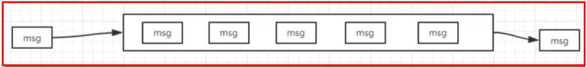

**消息传递：**指的是程序之间通过消息发送数据进行通信，而不是通过直接调用彼此来通信，直接调用通常是用于诸如远程过程调用的技术。

**排队：**指的是应用程序通过队列来通信。

**业务场景说明：**

消息队列在大型电子商务类网站，如京东、淘宝、去哪儿等网站有着深入的应用，为什么会产生消息队列？有几个原因：

不同进程（process）之间传递消息时，两个进程之间**耦合**程度过高，改动一个进程，引发必须修改另一个进程，为了**隔离**这两个进程，在两进程间抽离出一层（一个模块），所有两进程之间传递的消息，都必须通过消息队列来传递，单独修改某一个进程，不会影响另一个；

不同进程（process）之间传递消息时，为了实现标准化，将消息的格式规范化了，并且，某一个进程接受的**消息太多**，一下子无法处理完，并且也有先后顺序，必须对收到的消息**进行排队**，因此诞生了事实上的消息队列；

在项目中，可将一些无需即时返回且耗时的操作提取出来，进行**异步处理**，而这种异步处理的方式大大的节省了服务器的请求响应时间，从而**提高**了**系统**的**吞吐量**。


## 3 消息队列应用场景

首先我们先说一下消息中间件的主要的作用：

　　**[1]异步处理**

　　**[2]解耦服务**

　　**[3]流量削峰**

上面的三点是我们使用消息中间件最主要的目的.


### 3.1 应用解耦

* 以下单功能为例，如下图，存在功能耦合度高的问题。
* 用户下单，需要保存订单，更新购物车，更新库存，还要更新积分，如果在操作过程中，有任何一个环节失败了，最终会导致操作失败，返回错误信息

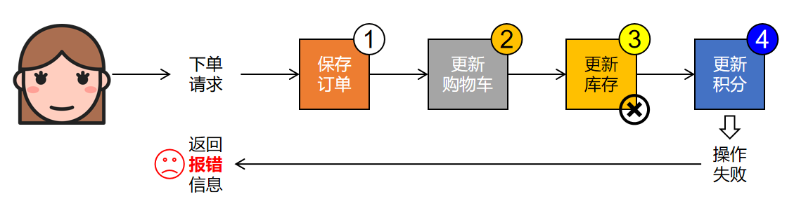

* 而采用消息队列方式，可以很好的解决耦合度过高问题

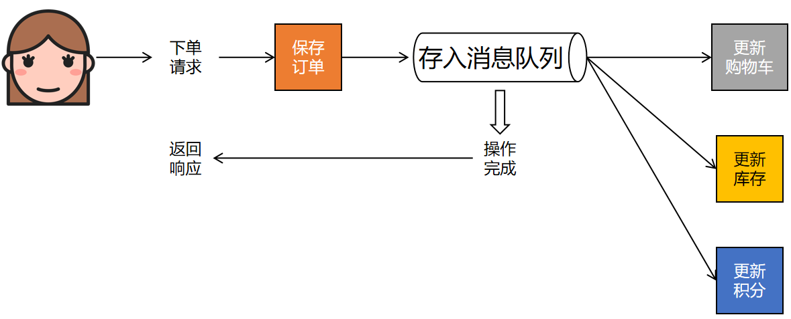

### 3.2 异步处理

场景说明：用户注册后，需要发注册邮件和注册短信，传统的做法有两种

* 串行的方式

* 并行的方式

**(1)** **串行方式：**

将注册信息写入数据库后，发送注册邮件，再发送注册短信，以上三个任务全部完成后才返回给客户端。 这有一个问题是，邮件，短信并不是必须的，它只是一个通知，而这种做法让客户端等待没有必要等待的东西。

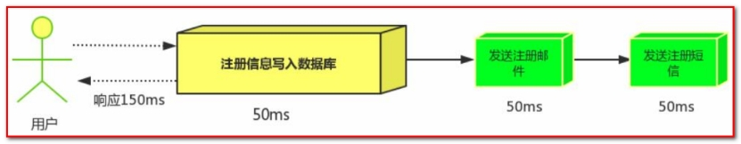 

**(2)** **并行方式：**

将注册信息写入数据库后，发送邮件的同时，发送短信，以上三个任务完成后，返回给客户端，并行的方式能提高处理的时间。

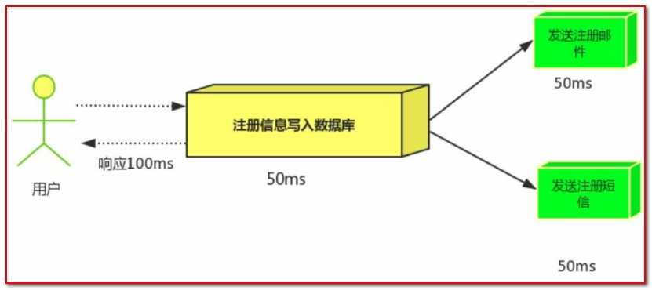 

假设三个业务节点分别使用50ms，串行方式使用时间150ms，并行使用时间100ms。虽然并行已经提高了处理时间，但是，前面说过，邮件和短信对我正常的使用网站没有任何影响，客户端没有必要等着其发送完成才显示注册成功，应该是写入数据库后就返回.

**(3)消息队列**
引入消息队列后，把发送邮件，短信不是必须的业务逻辑异步处理

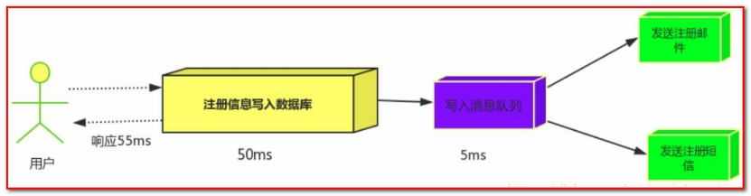 

由此可以看出，引入消息队列后，用户的响应时间就等于写入数据库的时间+写入消息队列的时间(可以忽略不计)，

引入消息队列后处理后，响应时间是串行的3分之1，是并行的2分之1。

**传统模式的缺点：**

· 一些非必要的业务逻辑以同步的方式运行，太耗费时间。

**中间件模式的的优点：**

· 将消息写入消息队列，非必要的业务逻辑以异步的方式运行，加快响应速度


### 3.3 流量削峰

流量削峰一般在秒杀活动中应用广泛

**场景：** 秒杀活动，一般会因为流量过大，导致应用挂掉，为了解决这个问题，一般在应用前端加入消息队列。

**传统模式**

如订单系统，在下单的时候就会往数据库写数据。但是数据库只能支撑每秒1000左右的并发写入，并发量再高就容易宕机。低峰期的时候并发也就100多个，但是在高峰期时候，并发量会突然激增到5000以上，这个时候数据库肯定卡死了。

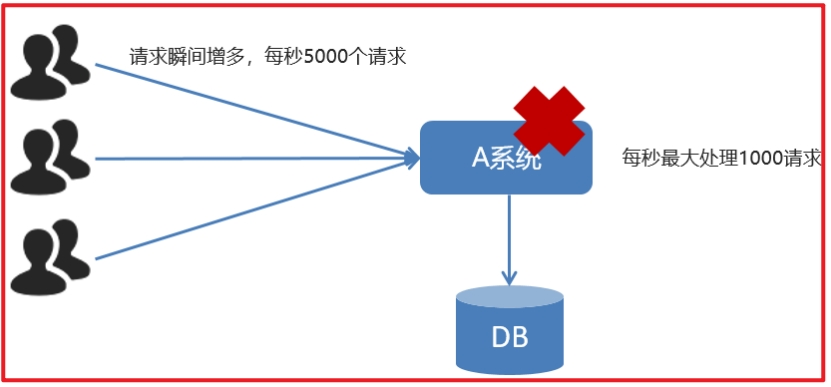 

**传统模式的缺点：**

· 并发量大的时候，所有的请求直接怼到数据库，造成数据库连接异常

**中间件模式：**

消息被MQ保存起来了，然后系统就可以按照自己的消费能力来消费，比如每秒1000个数据，这样慢慢写入数据库，这样就不会卡死数据库了。

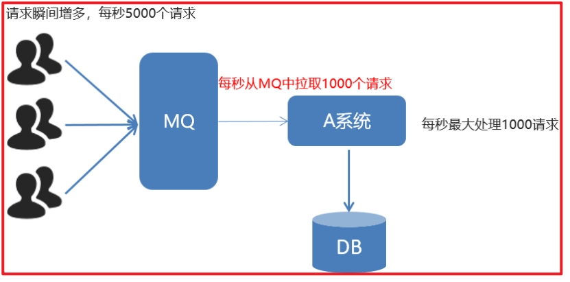 

**中间件模式的的优点：**

系统A慢慢按照数据库能处理的并发量，从消息队列中拉取消息。在生产中，这个短暂的高峰期积压是允许的。

**流量削峰也叫做削峰填谷**

使用了MQ之后，限制消费消息的速度为1000，但是这样一来，高峰期产生的数据势必会被积压在MQ中，高峰就被“削”掉了。但是因为消息积压，在高峰期过后的一段时间内，消费消息的速度还是会维持在 3消费完积压的消息，这就叫做“填谷”


## **4 AMQP 和 JMS**

MQ是消息通信的模型；实现MQ的大致有两种主流方式：AMQP、JMS。

### **4.1. AMQP**

AMQP是一种**高级消息队列协议（Advanced Message Queuing Protocol），更准确的说是一种binary wire-level protocol（**链接协议）。这是其和JMS的本质差别，AMQP不从API层进行限定，而是直接定义网络交换的数据格式。

### **4.2. JMS**

JMS即**Java消息服务（JavaMessage Service）**应用程序接口，是一个Java平台中关于面向消息中间件（MOM）的API，用于在两个应用程序之间，或分布式系统中发送消息，进行异步通信。

### **4.3. AMQP 与 JMS 区别**

· JMS是定义了统一的接口，来对消息操作进行统一；AMQP是通过规定协议来统一数据交互的格式

· JMS限定了必须使用Java语言；AMQP只是协议，不规定实现方式，因此是跨语言的。

· JMS规定了两种消息模式；而AMQP的消息模式更加丰富


## **5 消息队列产品**

市场上常见的消息队列有如下：

· ActiveMQ：基于JMS

· ZeroMQ：基于C语言开发

· Rabbitmq:基于AMQP协议，erlang语言开发，稳定性好

· RocketMQ：基于JMS，阿里巴巴产品

· Kafka：类似MQ的产品；分布式消息系统，高吞吐量

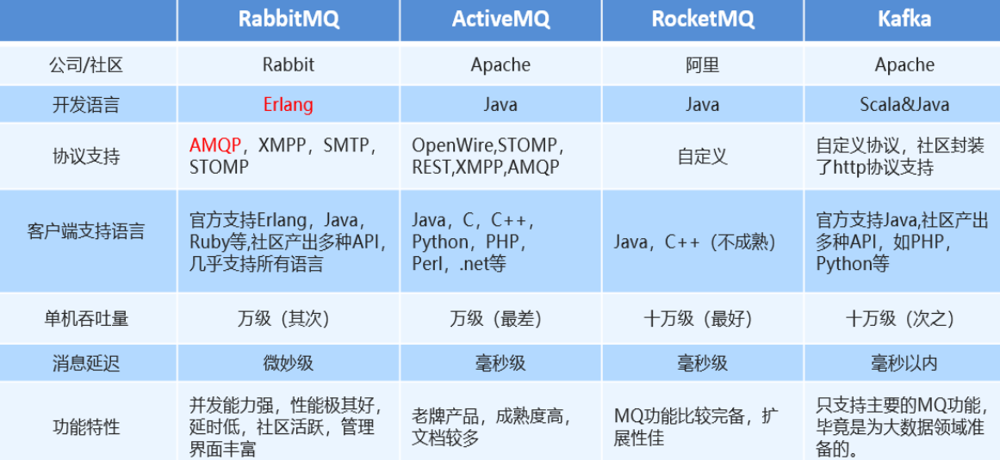


## 6 RabbitMQ介绍

### 6.1 简介

RabbitMQ是由erlang语言开发，基于AMQP（Advanced Message Queue 高级消息队列协议）协议实现的消息队列，它是一种应用程序之间的通信方法，消息队列在分布式系统开发中应用非常广泛。

AMQP，即 Advanced Message Queuing Protocol（高级消息队列协议），是一个网络协议，是应用层协议的一个开放标准，为面向消息的中间件设计。基于此协议的客户端与消息中间件可传递消息，并不受客户端/中间件不同产品，不同的开发语言等条件的限制。2006年，AMQP 规范发布。类比HTTP。 

2007年，Rabbit 技术公司基于 AMQP 标准开发的 RabbitMQ 1.0 发布。RabbitMQ 采用 Erlang 语言开发。Erlang 语言由 Ericson 设计，专门为开发高并发和分布式系统的一种语言，在电信领域使用广泛。

RabbitMQ官方地址：http://www.rabbitmq.com/ 

RabbitMQ提供了**多种工作模式**：简单模式，work模式 ，Publish/Subscribe发布与订阅模式，Routing路由模式，Topics主题模式等

官网对应模式介绍：https://www.rabbitmq.com/getstarted.html 

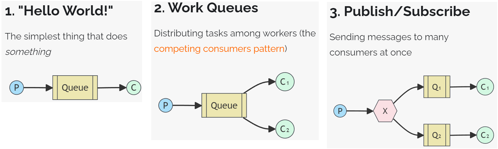

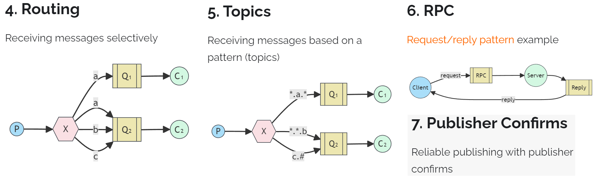


### 6.2 RabbitMQ基础架构

* **基础架构图**

 

* **RabbitMQ相关概念**

**Broker：**接收和分发消息的应用，RabbitMQ Server就是 Message Broker

**Virtual host：**出于多租户和安全因素设计的，把 AMQP 的基本组件划分到一个虚拟的分组中，类似于网络中的 namespace 概念。当多个不同的用户使用同一个 RabbitMQ server 提供的服务时，可以划分出多个vhost，每个用户在自己的 vhost 创建 exchange／queue 等

**Connection：**publisher／consumer 和 broker 之间的 TCP 连接

**Channel：**如果每一次访问 RabbitMQ 都建立一个 Connection，在消息量大的时候建立 TCP Connection的开销将是巨大的，效率也较低。Channel 是在 connection 内部建立的逻辑连接，如果应用程序支持多线程，通常每个thread创建单独的 channel 进行通讯，AMQP method 包含了channel id 帮助客户端和message broker 识别 channel，所以 channel 之间是完全隔离的。Channel 作为轻量级的 Connection 极大减少了操作系统建立 TCP connection 的开销

**Exchange：**message 到达 broker 的第一站，根据分发规则，匹配查询表中的 routing key，分发消息到queue 中去。常用的类型有：**direct (point-to-point)**， **topic (publish-subscribe)** and **fanout (multicast)**

**Queue：**存储消息的容器，消息最终被送到这里，等待 consumer 取走

**Binding：**exchange 和 queue 之间的虚拟连接，binding 中可以包含 routing key。Binding 信息被保存到 exchange 中的查询表中，用于 message 的分发依据


# 二、RabbitMQ安装

## 1 安装

```shell
# 拉取镜像
docker pull rabbitmq:3.12-management

# -d 参数：后台运行 Docker 容器
# --name 参数：设置容器名称
# -p 参数：映射端口号，格式是“宿主机端口号:容器内端口号”。5672供客户端程序访问，15672供后台管理界面访问
# -v 参数：卷映射目录
# -e 参数：设置容器内的环境变量，这里我们设置了登录RabbitMQ管理后台的默认用户和密码
docker run -d \
--name rabbitmq \
-p 5672:5672 \
-p 15672:15672 \
-v rabbitmq-plugin:/plugins \
-e RABBITMQ_DEFAULT_USER=guest \
-e RABBITMQ_DEFAULT_PASS=123456 \
rabbitmq:3.12.0-management
```


## 2 验证

访问后台管理界面：http://192.168.200.100:15672


使用上面创建Docker容器时指定的默认用户名、密码登录：


## 3 可能的问题1：Docker升级

### 3.1 问题现象

在使用Docker拉取RabbitMQ镜像的时候，如果遇到提示：missing signature key，那就说明Docker版本太低了，需要升级

比如我目前的Docker版本如下图所示：

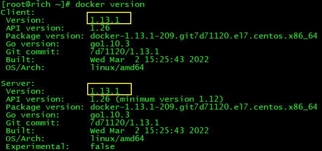


### 3.2 解决办法

> 基于CentOS7

#### ①卸载当前Docker

更好的办法是安装Docker前曾经给服务器拍摄了快照，此时恢复快照；

如果不曾拍摄快照，那只能执行卸载操作了

```shell
yum erase -y docker \
	docker-client \
	docker-client-latest \
	docker-common \
	docker-latest \
	docker-latest-logrotate \
	docker-logrotate \
	docker-selinux \
	docker-engine-selinux \
	docker-engine \
	docker-ce
```


#### ②升级yum库

```shell
yum update -y
```


#### ③安装Docker最新版

```shell
yum install -y docker-ce docker-ce-cli containerd.io docker-buildx-plugin docker-compose-plugin
```


如果这一步看到提示：没有可用软件包 docker-ce，那就添加Docker的yum源：

```shell
yum install -y yum-utils
yum-config-manager --add-repo https://download.docker.com/linux/centos/docker-ce.repo
```


#### ④设置Docker服务

```shell
systemctl start docker
systemctl enable docker
```


### 3.3 验证

上述操作执行完成后，再次查看Docker版本：

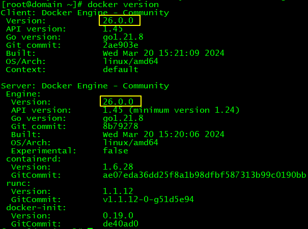


## 4 可能的问题：拉取镜像失败

### 1、问题现象

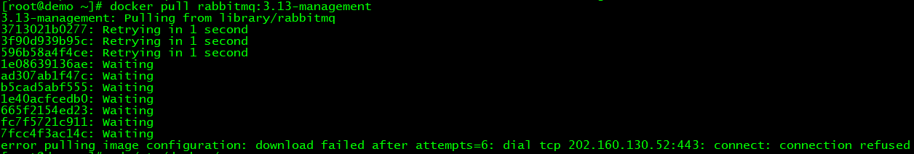


### 2、解决办法

#### ①daemon.json

```shell
# 新建或修改 docker 守护进程配置文件：daemon.json
vim /etc/docker/daemon.json
```


#### ②修改镜像源

```properties
{
  "registry-mirrors": ["https://registry.dockermirror.com"]
}
```


#### ③重启docker服务

```shell
systemctl restart docker
```


#### ④查看修改后的镜像源

```shell
docker info
```

部分内容举例如下：

> …… 
>
> Docker Root Dir: /var/lib/docker
>  Debug Mode: false
>  Experimental: false
>  Insecure Registries:
>   127.0.0.0/8
>  Registry Mirrors:
>   https://registry.dockermirror.com/
>  Live Restore Enabled: fals

最后再尝试重新拉取所需镜像