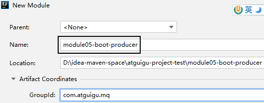
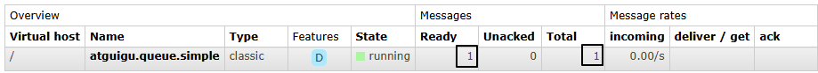

# RabbitMQ入门案例

# 一、目标

生产者发送消息，消费者接收消息，用最简单的方式实现


# 二、创建队列


队列名称：atguigu.queue.simple


# 三、Java 客户端：整合 SpringBoot

## 1、生产者端工程

### ①创建module




### ②配置POM

```xml
<parent>
    <groupId>org.springframework.boot</groupId>
    <artifactId>spring-boot-starter-parent</artifactId>
    <version>3.1.5</version>
</parent>

<dependencies>
    <dependency>
        <groupId>org.springframework.boot</groupId>
        <artifactId>spring-boot-starter-amqp</artifactId>
    </dependency>
    <dependency>
        <groupId>org.springframework.boot</groupId>
        <artifactId>spring-boot-starter-test</artifactId>
    </dependency>
</dependencies>
```


### ③YAML

```yaml
spring: 
  rabbitmq: 
    host: 192.168.47.100
    port: 5672 
    username: guest 
    password: 123456 
    virtual-host: /
```


### ④主启动类

```java
package com.atguigu.mq;  
  
import org.springframework.boot.SpringApplication;  
import org.springframework.boot.autoconfigure.SpringBootApplication;  
  
@SpringBootApplication
public class RabbitMQProducerMainType {

    public static void main(String[] args) {
        SpringApplication.run(RabbitMQProducerMainType.class, args);  
    }

}
```


### ⑤测试程序

```java
package com.atguigu.mq.test;
  
import org.junit.jupiter.api.Test;
import org.springframework.amqp.rabbit.core.RabbitTemplate;
import org.springframework.beans.factory.annotation.Autowired;
import org.springframework.boot.test.context.SpringBootTest;

@SpringBootTest  
public class RabbitMQTest {  
  
    // 在简单模式下，没有用到交换机
    public static final String EXCHANGE_DIRECT = "";
    
    // 在简单模式下，消息直接发送到队列，此时生产者端需要把队列名称从路由键参数这里传入
    public static final String ROUTING_KEY_SIMPLE = "atguigu.queue.simple";
  
    // 注入 RabbitTemplate 执行
    @Autowired  
    private RabbitTemplate rabbitTemplate;
  
    @Test  
    public void testSendMessageSimple() {  
        // 发送消息
        rabbitTemplate.convertAndSend(  
                EXCHANGE_DIRECT,   	// 指定交换机名称
                ROUTING_KEY_SIMPLE, // 指定路由键名称
                "Hello atguigu");   // 消息内容，也就是消息数据本身
    }  
  
}
```


### ⑥测试效果

消息发送到了队列中：




## 2、消费端工程

### ①创建module


### ②配置POM

```xml
<parent>
    <groupId>org.springframework.boot</groupId>
    <artifactId>spring-boot-starter-parent</artifactId>
    <version>3.1.5</version>
</parent>

<dependencies>
    <dependency>
        <groupId>org.springframework.boot</groupId>
        <artifactId>spring-boot-starter-amqp</artifactId>
    </dependency>
</dependencies>
```


### ③YAML

```yaml
spring:
  rabbitmq:
    host: 192.168.47.100
    port: 5672
    username: guest
    password: 123456
    virtual-host: /
```


### ④主启动类

仿照生产者工程的主启动类，改一下类名即可

```java
package com.atguigu.mq;

import org.springframework.boot.SpringApplication;
import org.springframework.boot.autoconfigure.SpringBootApplication;

@SpringBootApplication
public class RabbitMQConsumerMainType {

    public static void main(String[] args) {
        SpringApplication.run(RabbitMQConsumerMainType.class, args);
    }

}
```


### ⑤监听器

- 使用 @RabbitListener 注解设定要监听的队列名称
- 消息数据使用和发送端一样的数据类型接收

```java
package com.atguigu.mq.listener;

import com.rabbitmq.client.Channel;
import org.springframework.amqp.core.Message;
import org.springframework.amqp.rabbit.annotation.RabbitListener;
import org.springframework.stereotype.Component;

@Component
public class MyMessageListener {

    @RabbitListener(queues = {"atguigu.queue.simple"})
    public void processMessage(String messageContent, Message message, Channel channel) {
        System.out.println("messageContent = " + messageContent);
    }

}
```


### ⑥执行测试

监听方法不能直接运行，请大家通过主启动类运行微服务。消费端取走消息之后，队列中就没有消息了：


