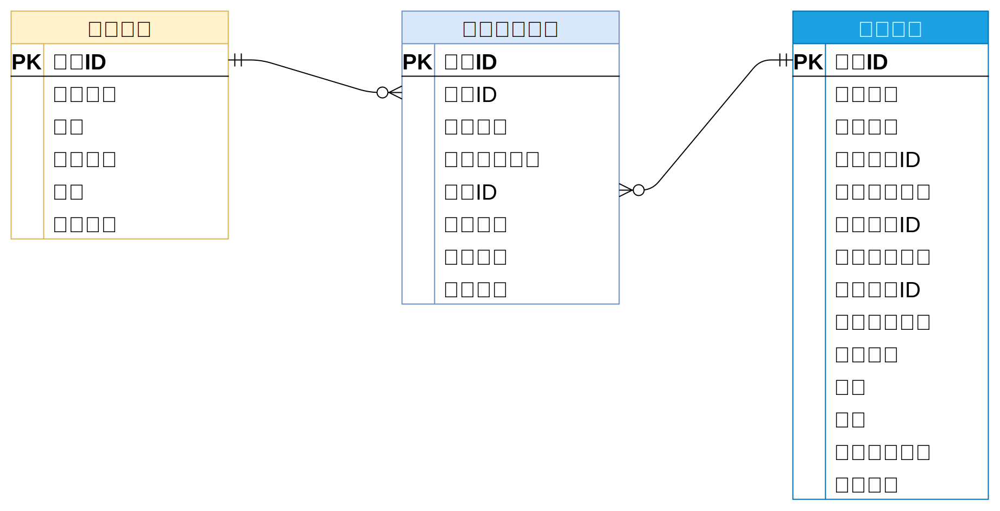

## 尚庭公寓数据库设计

[TOC]

###  一、数据库设计理论

#### 1.1 数据库模型

数据库设计中最常采用的模型为**实体（Entity）关系（Relationship）模型**，简称ER模型。其核心思想是将现实世界中的复杂数据表示为一组实体，并描述这些实体之间的关系。

- **实体**通常对应现实世界中的一个**对象**，例如：学生、班级、教师、课程。

- 每个实体都包含一组**属性**，这些属性用于描述实体，例如学生实体包含姓名、年龄、性别等属性。
- **关系**用于描述各实体之间的联系，例如学生和班级之间存在从属关系。

其中**关系**可分为**一对一**、**一对多**、**多对多**三种，例如学生和班级之间的关系为**一对多**、学生和课程之间的关系为**多对多**。

实体关系模型通常使用实体关系图（ER diagram）进行表示。下图是一个简易的选课系统的实体关系图，其中方框代表实体，方框之间的连线则代表实体间的关系，连线两端的不同符号用于表示一对一、一对多、多对多的关系。

符号说明如下：

|                符号                |   说明   |
| :--------------------------------: | :------: |
|    | 表示0个  |
|  | 表示1个  |
|  | 表示多个 |

上述符号通常是两个**成对**使用，其分别表示**最小值**和**最大值**。例如上述ER图中的**班级**和**学生**之间的连线，**班级**一侧的符号表示**一**（最小值和最大值都是一），**学生**一侧的符号表示**多**（最小值是一，最大值是多），其表达的含义就是班级和学生之间的关系为**一对多**，一个学生只对应一个班级，而一个班级会对应多个学生（且至少对应一个学生）。

#### 1.2  数据库设计流程

传统的数据库设计流程分为三个阶段，分别是**概念模型设计阶段**、**逻辑模型设计阶段**和**物理模型设计阶段**。三个阶段由粗略到详细，由抽象到具体。

##### 1.2.1 **概念模型设计**

概念模型是一个粗略的初步设计，其只关注实体和关系，不体现最终建表所需的各种细节信息（例如实体的属性）。下图便是一个典型的简易**选课系统**数据库的概念模型。

##### 1.2.2 **逻辑模型设计**

相较于概念模型，逻辑模型会包含更多的细节信息，例如实体的属性、用于关联两个实体的字段等等。需要注意的是，逻辑模型并不关注具体的数据库实现（例如MySQL或者Oracle）。下图是上述选课系统数据库的逻辑模型。

##### 1.2.3 **物理模型设计**

相较于逻辑模型，物理模型会包含更多的与所选数据库相关的具体信息，例如存储引擎、字段类型、索引等信息。一般而言，物理模型会包含最终建表所需的所有信息，下图是上述选课系统数据库的物理模型。

### 二、 数据库设计实操

#### 2.1 尚庭公寓概念模型设计

根据原型可得，本项目包含的实体有**公寓**、**房间**、**用户(租客)**、**租约(合同)**、**看房预约**、**浏览历史**和**后台管理系统用户**，各实体间的关系如下

#### 2.2 逻辑模型设计

根据原型明确各实体所需属性并明确各表关联字段，得到的完整的逻辑模型如下图所示。下面逐一分析。

##### 2.2.1 公寓信息

公寓信息包含的属性有`公寓名称`、`公寓简介`、`公寓地址`、`公寓联系方式`、`公寓图片`、`公寓标签`、`公寓杂费`、`公寓发布状态`，这部分的逻辑模型如下图所示

##### 2.2.2 房间信息

房间信息包含的属性有`房间号`、`房间租金`、`房间所属公寓`、`房间可选租期`、`房间可选支付方式`、`房间属性`、`房间标签`、`房间配套`、`房间图片`、`房间发布状态`，这部分的逻辑模型如下图所示

##### 2.2.3 用户信息

用户信息包含的属性有`手机号码`、`密码`、`头像`、`昵称`、`账号状态`，这部分的逻辑模型如下

##### 2.2.4 看房预约信息

看房预约包含的属性有`预约用户信息`、`预约公寓信息`、`预约时间`、`备注信息`、`预约状态`，这部分的逻辑模型如下

##### 2.2.5 租约信息

租约信息包含`签约用户信息`，`签约房间信息`、`租期`、`支付方式`、`租约来源`、`租金`、`押金`，这部分的逻辑模型如下

##### 2.2.6 浏览历史信息

浏览历史指的是用户浏览房间详情的历史，包含的属性有`用户信息`、`房间信息`、`浏览时间`，这部分的逻辑模型如下

##### 2.2.7 后台管理用户信息

后台管理系统用户包含的属性有，这部分的逻辑模型如下

#### 2.3 物理模型设计

本项目采用MySQL数据库，所有表均使用InnoDB存储引擎，完整的物理模型如下图，详细信息可参考资料中的数据库初始化文件`lease.sql`。

**注意**：

- 所有表均省略了`create_time`、`update_time`、`is_deleted`三个字段。
- 所有的状态或类型字段（例如租约状态），均使用数字表示。
