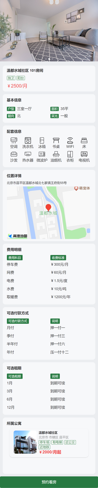

# 尚庭公寓接口定义分析

[TOC]

### 一、后台管理系统接口定义

#### 1.1 公寓信息管理

##### 1.1.1 属性管理

属性管理页面包含公寓和房间各种可选的属性信息，其中包括**房间的可选支付方式**、**房间的可选租期**、**房间的配套**、**公寓的配套**等等。其所需接口如下

- **房间支付方式管理**

  **页面如下**

  

  **所需接口如下**

  - `查询全部支付方式列表`
  - `保存或更新支付方式`
  - `根据ID删除支付方式`

- **房间租期管理**

  **页面如下**

  

  **所需接口如下**

  - `查询全部租期列表`
  - `保存或更新租期`
  - `根据ID删除租期`

- **标签管理**

  **页面如下**

  

  **所需接口如下**

  - `保存或更新标签`
  - `查询标签列表`
  - `根据ID删除标签`

- **配套管理**

  **页面如下**

  

  **所需接口如下**

  - `保存或更新配套`
  - `查询配套列表`
  - `根据ID删除配套`

- **房间基本属性管理**

  **页面如下**

  

  **所需接口如下**

  - `保存或更新属性名称`
  - `保存或更新属性值`
  - `查询全部属性名称和属性值列表`
  - `根据ID删除属性名称`

  - `根据ID删除属性值`

- **公寓杂费管理**

  **页面如下**
  
  
  
  **所需接口如下**
  
  - `保存或更新杂费名称`
  - `保存或更新杂费值`
  - `查询全部杂费名称和杂费值列表`
  - `根据ID删除杂费名称`
  
  - `根据ID删除杂费值`

##### 1.1.2 公寓管理

- **公寓列表页面**
  
  **页面如下**
  
  
  
  **所需接口如下**
  
  - `根据条件分页查询公寓列表`

  - 查询条件所需接口
    - `查询省份列表`
    - `根据省份ID查询城市列表`
    - `根据城市ID查询区县列表`
  - `根据ID修改公寓发布状态`
  - `根据ID删除公寓信息`
  
- **公寓详情页面**
  
  **页面如下**
  
  
  
  **所需接口如下**
  
  - `根据ID查询公寓详细信息`（用作修改时的表单回显）
  - `保存或更新公寓信息`
  - 表单所需接口
  
    - `查询省份列表`
    - `根据省份ID查询城市列表`
    - `根据城市ID查询区县列表`
    - `查询公寓配套列表`
    - `查询公寓标签列表`
    - `查询公寓杂费信息列表`
    - `上传图片`

##### 1.1.3 房间管理

- **房间列表页面**

  **页面如下**

  

  **所需接口如下**

  - `根据条件分页查询房间列表`

  - 查询条件所需接口

    - `查询省份列表`
    - `根据省份ID查询城市列表`
    - `根据城市ID查询区县列表`
    - `根据区县ID查询公寓列表`
  - `根据ID修改房间发布状态`
  - `根据ID删除房间信息`

- **房间详情页面**
  
  **页面如下**
  
  
  
  **所需接口如下**
  
  - `根据ID查询房间详细信息`（用作修改时的表单回显）
  - `保存或更新房间信息`
  - 表单所需接口
    - `查询省份列表`
    - `根据省份ID查询城市列表`
    - `根据城市ID查询区县列表`
    - `根据区县ID查询公寓列表`
    - `查询房间属性列表`
    - `查询房间标签列表`
    - `查询全部支付方式列表`
    - `查询租期列表`
    - `上传图片`

#### 1.2 租赁信息管理

##### 1.2.1 预约看房管理

- **看房预约列表页面**

  **页面如下**

  

  **所需接口如下**

  - `分页查询预约信息列表`

  - 查询条件所需接口

    - `查询省份列表`
    - `根据省份ID查询城市列表`
    - `根据城市ID查询区县列表`
    - `根据区县ID查询公寓列表`
  - `根据ID更新预约状态`

##### 1.2.2 租约管理

- **租约列表页面**

  **页面如下**

  

  **所需接口如下**

  - `根据条件分页查询租约信息列表`
  - 查询条件所需接口

    - `查询省份列表`
    - `根据省份ID查询城市列表`
    - `根据城市ID查询区县列表`
    - `根据区县ID查询公寓列表`
  - `根据ID更新租约状态`
  - `根据ID删除租约信息`

- **租约详情页面**

  **页面如下**
  
  

  **所需接口**
  
  - `根据ID查询租约信息`（用作更新租约时的表单回显）
  - `保存或修改租约信息`
  - 表单所需接口
  
    - `查询省份列表`
    - `根据省份ID查询城市列表`
    - `根据城市ID查询区县列表`
    - `根据区县ID查询公寓列表`
    - `根据公寓ID查询房间列表`
    - `查询可选支付方式列表`
    - `查询可选租期列表`

#### 1.3 用户信息管理

##### 1.3.1 用户列表页面

**页面如下**

**所需接口如下**

- `分页查询用户信息列表`
- `根据用户ID更新账号状态`

#### 1.4 系统管理

##### 1.4.1 系统用户岗位管理

- **岗位列表页面**
  
  **页面如下**
  
  
  
  **所需接口如下**
  
  - `分页查询岗位信息列表`
  - `根据ID修改岗位状态`
  - `根据ID删除岗位`
  
- **岗位详情页面**
  
  **页面如下**
  
  
  
  **所需接口如下**
  
  - `根据ID查询岗位详细信息`（用作修改时的表单回显）
  - `保存或更新岗位信息`

##### 1.4.2 系统用户信息管理

- **系统用户列表页面**
  
  **页面如下**
  
  
  
  **所需接口如下**
  
  - `根据条件分页查询系统用户列表`
  - `根据ID修改用户状态`
  - `根据ID删除系统用户信息`
  
  **所需接口如下**
  
- **系统用户详情页面**

  **页面如下**

  

  **所需接口如下**

  - `根据ID查询系统用户详细信息`
  - `保存或更新系统用户信息`
  - `表单所需接口`
    - 查询岗位列表

#### 1.5 登录管理

##### 1.5.1 登录页面

**页面如下**

**所需接口如下**

- `获取图形验证码`
- `请求登录`
- `获取登录用户信息`

### 二、移动端接口定义

#### 2.1 登录

##### 2.1.1 登录页面

页面如下

所需接口如下

- `获取短信验证码`
- `请求登录`
- `获取登录用户基本信息`

#### 2.2 找房

##### 2.2.1 房间列表页面

页面如下

所需接口如下

- `根据查询条件分页查询房间列表`
- 查询条件所需接口

  - `查询省份列表`
  - `根据省份ID查询城市信息`
  - `根据城市ID查询区县信息`
  - `查询支付方式列表`

##### 2.2.2 房间详情页面

页面如下

所需接口如下

- `根据ID查询房间详细信息`

##### 2.2.3 公寓详情页面

页面如下

所需接口如下

- `根据ID查询公寓详细信息`
- `根据公寓ID查询房间列表`

#### 2.3 个人中心

##### 2.3.1 浏览历史

页面如下

所需接口如下

- `查询登录用户的浏览历史列表`

##### 2.3.2 看房预约

- **看房预约列表页面**
  
  页面如下
  
  
  
  所需接口如下
  
  - `查询登录用户的看房预约列表`
  
- **看房预约详情页面**
  
  页面如下
  
  
  
  所需接口如下
  
  - `根据ID查询看房预约详细信息`
  - `保存或更新看房间预约信息`

##### 2.3.3 租约管理

- **租约列表页面**
  
  页面如下
  
  
  
  所需接口如下
  
  - `查询登录用户的租约列表`
  - `根据ID修改租约状态`
  
- **租约详情页面**
  
  页面如下
  
  
  
  所需接口如下
  
  - `根据ID查询租约详细信息`
  - `保存或修改租约信息`
  - 表单所需接口
    - `根据房间ID查询可选支付方式列表`
    - `根据房间ID查询可选租期列表`

#### 2.4 我的房间

略

#### 2.5 圈子

略

#### 2.6 消息通知