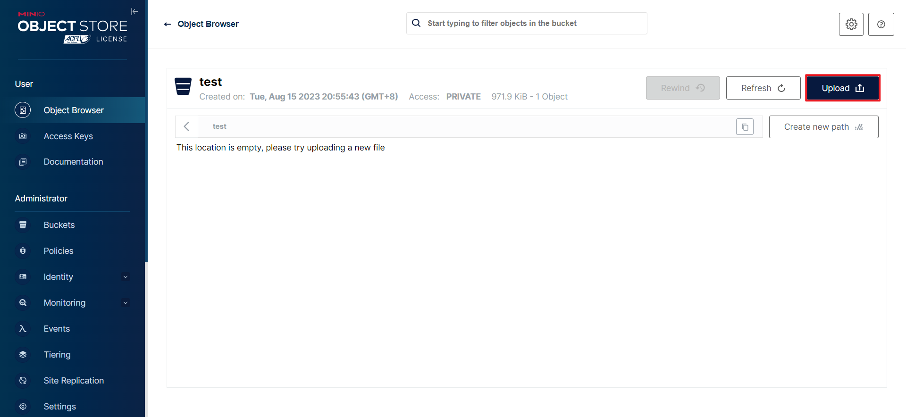
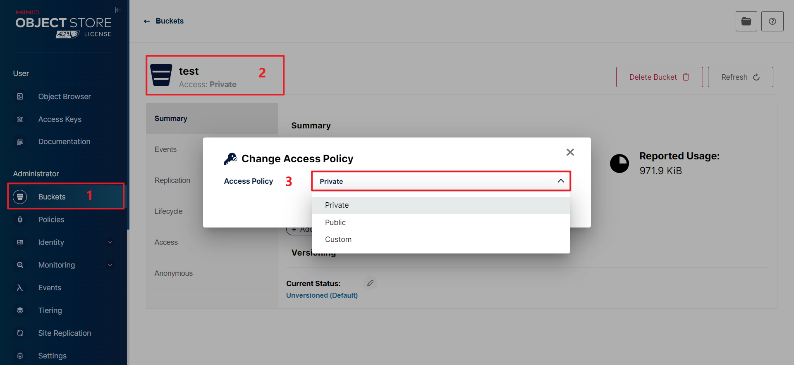
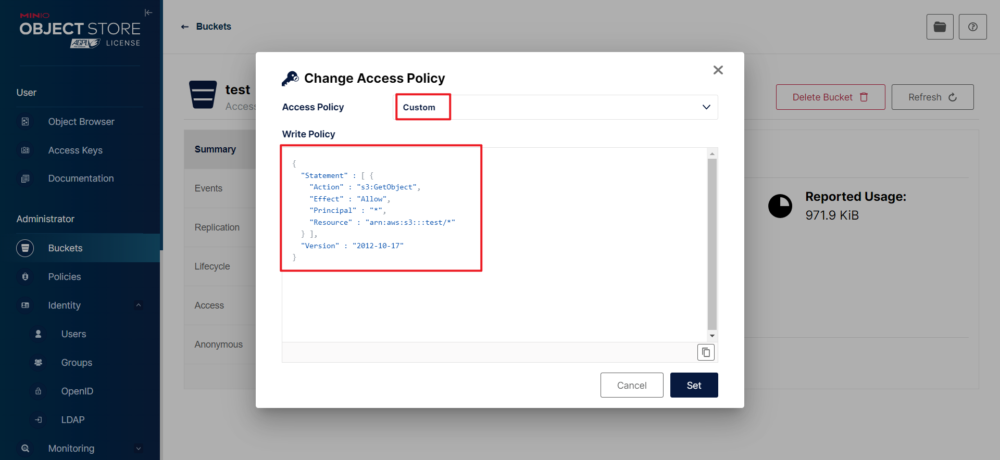

## 尚庭公寓开发准备

[TOC]

### 一 、准备开发环境

项目开发会用到**MySQL**、**Redis**、**MinIO**，本章主要内容就是部署三者，部署环境为Linux虚拟机。

#### 1.1 准备Linux虚拟机

- **操作系统为Centos7**

  > 由于下文的安装步骤都是基于Centos7系统的，所以建议统一使用Centos7系统。

- **网络设置**

  > 虚拟机网络使用NAT模式，且使用静态IP

- **关闭防火墙**

  关闭命令如下

  ```bash
  #关闭防火墙 
  systemctl stop firewalld
  
  #禁止防火墙开机自启
  systemctl disable firewalld
  ```

####  1.2 部署MySQL

> 参考:  linux/服务器环境安装/部署MySQL环境

#### 1.3 部署Redis

>  参考:  redis/安装和启动/redis软件安装和启动

#### 1.4 部署MinIO

在`linux`部署MinIO，安装方式采用rpm离线安装，具体步骤可参考[官方文档](https://min.io/docs/minio/linux/operations/install-deploy-manage/deploy-minio-single-node-single-drive.html#minio-snsd)。

1. **获取MinIO安装包**

   下载地址如下：https://dl.min.io/server/minio/release/linux-amd64/archive/minio-20230809233022.0.0.x86_64.rpm，通过以下命令可直接将安装包下载至服务器

   本地位置: `/资料/软件资料/minio-20230809233022.0.0.x86_64.rpm` 

   ```bash
   wget https://dl.min.io/server/minio/release/linux-amd64/archive/minio-20230809233022.0.0.x86_64.rpm
   ```

   注：若下载缓慢，大家可直接使用课程资料中附带的安装包

2. **安装MinIO**

   ```bash
   rpm -ivh minio-20230809233022.0.0.x86_64.rpm
   ```

3. **集成Systemd**

   - **Systemd概述**

     `Systemd`是一个广泛应用于Linux系统的系统初始化和服务管理器，其可以管理系统中的各种服务和进程，包括启动、停止和重启服务，除此之外，其还可以监测各服务的运行状态，并在服务异常退出时，自动拉起服务，以保证服务的稳定性。系统自带的防火墙服务`firewalld`，我们自己安装的`mysqld`和`redis`均是由`Systemd`进行管理的，此处将MinIO服务也交给Systemd管理。

   - **编写MinIO服务配置文件**

     Systemd所管理的服务需要由一个配置文件进行描述，这些配置文件均位于`/etc/systemd/system/`或者`/usr/lib/systemd/system/`目录下，下面创建MinIO服务的配置文件。

     执行以下命令创建并打开`minio.service`文件

     ```bash
     vim /etc/systemd/system/minio.service
     ```

     内容如下，具体可参考MinIO[官方文档](https://min.io/docs/minio/linux/operations/install-deploy-manage/deploy-minio-single-node-single-drive.html#create-the-systemd-service-file)。

     ```ini
     [Unit]
     Description=MinIO
     Documentation=https://min.io/docs/minio/linux/index.html
     Wants=network-online.target
     After=network-online.target
     AssertFileIsExecutable=/usr/local/bin/minio
     
     [Service]
     WorkingDirectory=/usr/local
     ProtectProc=invisible
     EnvironmentFile=-/etc/default/minio
     ExecStartPre=/bin/bash -c "if [ -z \"${MINIO_VOLUMES}\" ]; then echo \"Variable MINIO_VOLUMES not set in /etc/default/minio\"; exit 1; fi"
     ExecStart=/usr/local/bin/minio server $MINIO_OPTS $MINIO_VOLUMES
     Restart=always
     LimitNOFILE=65536
     TasksMax=infinity
     TimeoutStopSec=infinity
     SendSIGKILL=no
     
     [Install]
     WantedBy=multi-user.target
     ```

     **注意**：

     重点关注上述文件中的以下内容即可

     - `EnvironmentFile`，该文件中可配置MinIO服务所需的各项参数
     - `ExecStart`，该参数用于配置MinIO服务的启动命令，其中`$MINIO_OPTS`、`$MINIO_VOLUMES`，均引用于`EnvironmentFile`中的变量。
       - `MINIO_OPTS`用于配置MinIO服务的启动选项，可省略不配置。
       - `MINIO_VOLUMES`用于配置MinIO服务的数据存储路径。
     - `Restart`，表示自动重启

   - **编写`EnvironmentFile`文件**

     执行以下命令创建并打开`/etc/default/minio`文件

     ```bash
     vim /etc/default/minio
     ```

     内容如下，具体可参考[官方文档](https://min.io/docs/minio/linux/operations/install-deploy-manage/deploy-minio-single-node-single-drive.html#create-the-environment-variable-file)。

     ```ini
     MINIO_ROOT_USER=minioadmin
     MINIO_ROOT_PASSWORD=minioadmin
     MINIO_VOLUMES=/data
     MINIO_OPTS="--console-address :9001"
     ```

     **注意**

     - `MINIO_ROOT_USER`和`MINIO_ROOT_PASSWORD`为用于访问MinIO的用户名和密码，**密码长度至少8位**。

     - `MINIO_VOLUMES`用于指定数据存储路径，需【确保指定的路径是存在的】，可执行以下命令创建该路径。

       ```bash
       mkdir /data
       chmod -R 777 /data
       ```
       
     - `MINIO_OPTS`中的`console-address`,用于指定管理页面的地址。

4. **启动MinIO**

   执行以下命令启动MinIO

   ```bash
   systemctl start minio
   ```
   执行以下命令查询运行状态
   ```bash
   systemctl status minio
   ```

   设置MinIO开机自启

   ```bash
   systemctl enable minio
   ```

5. **访问MinIO管理页面**

   管理页面的访问地址为：`http://192.168.10.101:9001`

   **注意**：

   `ip`需要根据实际情况做出修改

### 二、 技术储备

#### 2.1 MyBatis Plus全自动持久层框架

##### 2.1.1 框架概述

MyBatis-Plus（简称 MP）是一个MyBatis 的增强工具，在 MyBatis 的基础上只做增强不做改变，为简化开发、提高效率而生。其突出的特性如下：

- **无侵入**：只做增强不做改变，引入它不会对现有工程产生影响，如丝般顺滑
- **强大的 CRUD 操作**：内置通用 Mapper、通用 Service，提供了大量的通用的CRUD方法，因此可以省去大量手写sql的语句的工作。
- **条件构造器**：提供了强大的条件构造器，可以构造各种复杂的查询条件，以应对各种复杂查询。
- **内置分页插件**：配置好插件之后，写分页等同于普通 List 查询，无需关注分页逻辑。

下面通过一个简单案例快速熟悉MyBatis Plus的基本使用

##### 2.1.2 数据库准备

首先在数据库中准备一张表，为后序的学习做准备。

1. **创建数据库**

   在MySQL中创建一个数据库`hello_mp`

   ```sql
   CREATE DATABASE hello_mp CHARACTER SET utf8mb4 COLLATE utf8mb4_general_ci;
   ```

2. **创建表**

   在`hello-mp`库中创建一个表`user`

   ```sql
   DROP TABLE IF EXISTS user;
   CREATE TABLE user
   (
       id BIGINT(20) NOT NULL AUTO_INCREMENT COMMENT '主键ID',
       name VARCHAR(30) NULL DEFAULT NULL COMMENT '姓名',
       age INT(11) NULL DEFAULT NULL COMMENT '年龄',
       email VARCHAR(50) NULL DEFAULT NULL COMMENT '邮箱',
       PRIMARY KEY (id)
   );
   ```

3. **插入数据**

   ```bash
   INSERT INTO user (id, name, age, email) VALUES
   (1, 'Jone', 18, 'test1@baomidou.com'),
   (2, 'Jack', 20, 'test2@baomidou.com'),
   (3, 'Tom', 28, 'test3@baomidou.com'),
   (4, 'Sandy', 21, 'test4@baomidou.com'),
   (5, 'Billie', 24, 'test5@baomidou.com');
   ```

##### 2.1.3 与SpringBoot集成

Mybatis Plus与SpringBoot的集成十分简单，具体操作如下

1. **引入Maven 依赖**

   提前创建好一个SpringBoot项目，然后在项目中引入MyBatis Plus依赖

   ```xml
   <dependency>
       <groupId>com.baomidou</groupId>
       <artifactId>mybatis-plus-spring-boot3-starter</artifactId>
       <version>3.5.10.1</version>
   </dependency>
   ```

   本案例完整的`pom.xml`文件如下

   ```xml
   <?xml version="1.0" encoding="UTF-8"?>
   <project xmlns="http://maven.apache.org/POM/4.0.0" xmlns:xsi="http://www.w3.org/2001/XMLSchema-instance"
            xsi:schemaLocation="http://maven.apache.org/POM/4.0.0 https://maven.apache.org/xsd/maven-4.0.0.xsd">
       <modelVersion>4.0.0</modelVersion>
       <parent>
           <groupId>org.springframework.boot</groupId>
           <artifactId>spring-boot-starter-parent</artifactId>
           <version>3.0.5</version>
           <relativePath/> <!-- lookup parent from repository -->
       </parent>
       <groupId>com.atguigu</groupId>
       <artifactId>hello-mp</artifactId>
       <version>0.0.1-SNAPSHOT</version>
       <name>hello-mp</name>
       <description>hello-mp</description>
       <properties>
           <java.version>17</java.version>
       </properties>
       <dependencies>
           <dependency>
               <groupId>org.springframework.boot</groupId>
               <artifactId>spring-boot-starter-web</artifactId>
           </dependency>
   
           <dependency>
               <groupId>com.mysql</groupId>
               <artifactId>mysql-connector-j</artifactId>
               <scope>runtime</scope>
           </dependency>
           <dependency>
               <groupId>org.projectlombok</groupId>
               <artifactId>lombok</artifactId>
               <optional>true</optional>
           </dependency>
           <dependency>
               <groupId>org.springframework.boot</groupId>
               <artifactId>spring-boot-starter-test</artifactId>
               <scope>test</scope>
           </dependency>
           <dependency>
               <groupId>com.baomidou</groupId>
               <artifactId>mybatis-plus-spring-boot3-starter</artifactId>
               <version>3.5.10.1</version>
           </dependency>
       </dependencies>
   
       <build>
           <plugins>
               <plugin>
                   <groupId>org.springframework.boot</groupId>
                   <artifactId>spring-boot-maven-plugin</artifactId>
               </plugin>
           </plugins>
       </build>
   
   </project>
   ```
   
2. **配置`application.yml`文件**

   配置数据库相关内容如下

   ```yml
   spring:
     datasource:
       driver-class-name: com.mysql.cj.jdbc.Driver
       username: root
       password: Atguigu.123
       url: jdbc:mysql://192.168.10.101:3306/hello_mp?useUnicode=true&characterEncoding=utf-8&serverTimezone=GMT%2b8
   ```

##### 2.1.4 创建实体类

创建与`user`表相对应的实体类，如下

```java
@Data
@TableName("user")
public class User {

    @TableId(value = "id", type = IdType.AUTO)
    private Long id;

    @TableField("name")
    private String name;

    @TableField("age")
    private Integer age;

    @TableField("email")
    private String email;
}
```

**知识点**：

实体类中的三个注解的含义如下

- `@TableName`：表名注解，用于标识实体类所对应的表
  - `value`：用于声明表名

- `@TableId`：主键注解，用于标识主键字段
  - `value`：用于声明主键的字段名
  - `type`：用于声明主键的生成策略，常用的策略有`AUTO`、`ASSIGN_UUID`、`INPUT`等等

- `@TableField`：普通字段注解，用于标识属性所对应的表字段
  - `value`：用于声明普通字段的字段名

##### 2.1.5 通用Mapper

通用Mapper提供了通用的CRUD方法，使用它可以省去大量编写简单重复的SQL语句的工作，具体用法如下

1. **创建Mapper接口**

   创建`UserMapper`接口，并继承由Mybatis Plus提供的`BaseMapper<T>`接口，如下

   ```java
   public interface UserMapper extends BaseMapper<User> {
   }
   ```

   **知识点**：

   若Mapper接口过多，可不用逐一配置`@Mapper`注解，而使用`@MapperScan`注解指定包扫描路径进行统一管理，例如

   ```java
   @SpringBootApplication
   @MapperScan("com.atguigu.hellomp.mapper")
   public class HelloMpApplication {
   
       public static void main(String[] args) {
           SpringApplication.run(HelloMpApplication.class, args);
       }
   }
   ```

2. **测试通用Mapper**

   创建`userMapperTest`测试类型，内容如下

   ```java
   @SpringBootTest
   class UserMapperTest {
   
       @Autowired
       private UserMapper userMapper;
   
       @Test
       public void testSelectList() {
           List<User> users = userMapper.selectList(null);
           users.forEach(System.out::println);
       }
   
       @Test
       public void testSelectById() {
           User user = userMapper.selectById(1);
           System.out.println(user);
       }
   
       @Test
       public void testInsert() {
           User user = new User();
           user.setName("zhangsan");
           user.setAge(11);
           user.setEmail("test@test.com");
           userMapper.insert(user);
       }
   
       @Test
       public void testUpdateById() {
           User user = userMapper.selectById(1);
           user.setName("xiaoming");
           userMapper.updateById(user);
       }
       
       @Test
       public void testDeleteById() {
           userMapper.deleteById(1);
       }
   }
   ```

##### 2.1.6 通用Service

通用Service进一步封装了通用Mapper的CRUD方法，并提供了例如`saveOrUpdate`、`saveBatch`等高级方法。

1. **创建Service接口**

   创建`UserService`，内容如下

   ```java
   public interface UserService extends IService<User> {
   }
   ```

2. **创建Service实现类**

   创建`UserServiceImpl`，内容如下

   ```java
   @Service
   public class UserServiceImpl extends ServiceImpl<UserMapper, User> implements UserService {
   }
   ```

3. **测试通用Service**

   创建`UserServiceImplTest`测试类，内容如下

   ```java
   @SpringBootTest
   class UserServiceImplTest {
   
   
       @Autowired
       private UserService userService;
   
       @Test
       public void testSaveOrUpdate() {
           User user1 = userService.getById(2);
           user1.setName("xiaohu");
   
           User user2 = new User();
           user2.setName("lisi");
           user2.setAge(27);
           user2.setEmail("lisi@email.com");
           userService.saveOrUpdate(user1);
           userService.saveOrUpdate(user2);
       }
   
   
       @Test
       public void testSaveBatch() {
           User user1 = new User();
           user1.setName("dongdong");
           user1.setAge(49);
           user1.setEmail("dongdong@email.com");
   
           User user2 = new User();
           user2.setName("nannan");
           user2.setAge(29);
           user2.setEmail("nannan@email.com");
   
           List<User> users = List.of(user1, user2);
           userService.saveBatch(users);
       }
   }
   ```

##### 2.1.7 条件构造器

条件构造器用于构造复杂的查询条件，例如获取`name='zhangsan'`的用户。MyBatis Plus共提供了两类构造器，分别是`QueryWrapper`和`UpdateWrapper`。其中`QueryWrapper`主要用于查询、删除操作，`UpdateWrapper`主要用于更新操作，下面通过几个案例学习条件构造器的基础用法。

1. 创建`WrapperTest`测试类，内容如下

   ```java
   @SpringBootTest
   public class WrapperTest {
   
       @Autowired
       private UserService userService;
   
       @Test
       public void testQueryWrapper() {
   
           //查询name=Tom的所有用户
           QueryWrapper<User> queryWrapper1 = new QueryWrapper<>();
           queryWrapper1.eq("name", "Tom");
   
           //查询邮箱域名为baomidou.com的所有用户
           QueryWrapper<User> queryWrapper2 = new QueryWrapper<>();
           queryWrapper2.like("email", "baomidou.com");
   
           //查询所有用户信息并按照age字段降序排序
           QueryWrapper<User> queryWrapper3 = new QueryWrapper<>();
           queryWrapper3.orderByDesc("age");
           
           //查询age介于[20,30]的所有用户
           QueryWrapper<User> queryWrapper4 = new QueryWrapper<>();
           queryWrapper4.between("age", 20, 30);
           
           //查询age小于20或大于30的用户
           QueryWrapper<User> queryWrapper5 = new QueryWrapper<>();
           queryWrapper5.lt("age", 20).or().gt("age", 30);
   
           //邮箱域名为baomidou.com且年龄小于30或大于40且的用户
           QueryWrapper<User> queryWrapper6 = new QueryWrapper<>();
           queryWrapper6.like("email", "baomidou.com").and(wrapper -> wrapper.lt("age", 30).or().gt("age", 40));
           
           List<User> list = userService.list(queryWrapper6);
           list.forEach(System.out::println);
       }
   
       @Test
       public void testUpdateWrapper() {
   
           //将name=Tom的用户的email改为Tom@baobidou.com
           UpdateWrapper<User> updateWrapper = new UpdateWrapper<>();
           updateWrapper.eq("name", "Tom");
           updateWrapper.set("email", "Tom@baobidou.com");
   
           userService.update(updateWrapper);
       }
   }
   ```
   
2. 创建`LambdaWrapperTest`测试类，内容如下

   上述的`QueryWrapper`和`UpdateWrapper`均有一个`Lambda`版本，也就是`LambdaQueryWrapper`和`LambdaUpdateWrapper`，`Lambda`版本的优势在于，可以省去字段名的硬编码，具体案例如下：

   ```java
   @SpringBootTest
   public class LambdaWrapperTest {
   
       @Autowired
       private UserService userService;
   
       @Test
       public void testLambdaQueryWrapper() {
           //查询name=Tom的所有用户
           LambdaQueryWrapper<User> lambdaQueryWrapper = new LambdaQueryWrapper<>();
           lambdaQueryWrapper.eq(User::getName, "Tom");
   
           List<User> list = userService.list(lambdaQueryWrapper);
           list.forEach(System.out::println);
   
       }
   
       @Test
       public void testLambdaUpdateWrapper() {
           //将name=Tom的用户的邮箱改为Tom@tom.com
           LambdaUpdateWrapper<User> lambdaUpdateWrapper = new LambdaUpdateWrapper<>();
           lambdaUpdateWrapper.eq(User::getName, "Tom");
           lambdaUpdateWrapper.set(User::getEmail, "Tom@Tom.com");
   
           userService.update(lambdaUpdateWrapper);
       }
   }
   ```

##### 2.1.8 逻辑删除

逻辑删除，可以方便地实现对数据库记录的逻辑删除而不是物理删除。逻辑删除是指通过更改记录的状态或添加标记字段来模拟删除操作，从而保留了删除前的数据，便于后续的数据分析和恢复。

- 物理删除：真实删除，将对应数据从数据库中删除，之后查询不到此条被删除的数据
- 逻辑删除：假删除，将对应数据中代表是否被删除字段的状态修改为“被删除状态”，之后在数据库中仍旧能看到此条数据记录

1. 数据库和实体类添加逻辑删除字段 
   1. 表添加逻辑删除字段

      可以是一个布尔类型、整数类型或枚举类型。

      ``` sql
      ALTER TABLE USER ADD deleted INT DEFAULT 0 ;  # int 类型 1 逻辑删除 0 未逻辑删除
      ```

   2. 实体类添加属性

      ```java
      @Data
      public class User {
      
         // @TableId
          private Integer id;
          private String name;
          private Integer age;
          private String email;
          
          @TableLogic
          //逻辑删除字段 int mybatis-plus下,默认 逻辑删除值为1 未逻辑删除 0 
          private Integer deleted;
      }
      ```

2.指定逻辑删除字段和属性值 

1. 单一指定

   ``` java
   @Data
   public class User {
   
      // @TableId
       private Integer id;
       private String name;
       private Integer age;
       private String email;
        @TableLogic
       //逻辑删除字段 int mybatis-plus下,默认 逻辑删除值为1 未逻辑删除 0
       private Integer deleted;
   }
   ```

2. 全局配置

   ``` yaml
   mybatis-plus:
     global-config:
       db-config:
         logic-delete-field: deleted #列名
         logic-delete-value: 1 # 逻辑已删除值(默认为 1)
         logic-not-delete-value: 0 # 逻辑未删除值(默认为 0)
   ```


3.演示逻辑删除操作

> 逻辑删除以后，没有真正的删除语句，删除改为修改语句!

删除代码:

```Java
//逻辑删除
@Test
public void testQuick5(){
    //逻辑删除
    userMapper.deleteById(5);
}

```

执行效果:

JDBC Connection [com.alibaba.druid.proxy.jdbc.ConnectionProxyImpl@5871a482] will not be managed by Spring

==> Preparing: UPDATE user SET deleted=1 WHERE id=? AND deleted=0 ==> Parameters: 5(Integer) <==    Updates: 1 

4. 测试查询数据

```Java
@Test
public void testQuick6(){
    //正常查询.默认查询非逻辑删除数据
    userMapper.selectList(null);
}

//SELECT id,name,age,email,deleted FROM user WHERE deleted=0
```

##### 2.1.9 分页插件

分页查询是一个很常见的需求，故Mybatis-Plus提供了一个分页插件，使用它可以十分方便的完成分页查询。下面介绍Mybatis-Plus分页插件的用法，详细信息可参考[官方文档](https://baomidou.com/pages/97710a/)。

配置分页插件

增加依赖：3.5.9起分页插件独立开来，需要单独引用依赖

```pom
       <!-- jdk 11+ 引入可选模块 -->
        <dependency>
            <groupId>com.baomidou</groupId>
            <artifactId>mybatis-plus-jsqlparser</artifactId>
            <version>3.5.10.1</version>
        </dependency>
```

创建`com.atguigu.hellomp.config.MPConfiguration`配置类，增加如下内容

```java
@Configuration
public class MPConfiguration {

    @Bean
    public MybatisPlusInterceptor mybatisPlusInterceptor() {
        MybatisPlusInterceptor interceptor = new MybatisPlusInterceptor();
        interceptor.addInnerInterceptor(new PaginationInnerInterceptor(DbType.MYSQL));
        return interceptor;
    }
}
```

分页插件使用说明

- 构造分页对象

  分页对象包含了分页的各项信息，其核心属性如下：

  
  | 属性名  | 类型 | 默认值    | 描述                   |
  | ------- | ---- | --------- | ---------------------- |
  | records | List | emptyList | 查询数据列表           |
  | total   | Long | 0         | 查询列表总记录数       |
  | size    | Long | 10        | 每页显示条数，默认`10` |
  | current | Long | 1         | 当前页                 |

  分页对象既作为分页查询的参数，也作为分页查询的返回结果，当作为查询参数时，通常只需提供`current`和`size`属性，如下
  
  ```java
  IPage<T> page = new Page<>(current, size);
  ```
  
  注：`IPage`为分页接口，`Page`为`IPage`接口的一个实现类。


- 分页查询

  Mybatis Plus的`BaseMapper`和`ServiceImpl`均提供了常用的分页查询的方法，例如：

  - `BaseMapper`的分页查询：

    ```java
    IPage<T> selectPage(IPage<T> page,Wrapper<T> queryWrapper);
    ```

  - `ServiceImpl`的分页查询：

    ```java
    // 无条件分页查询
    IPage<T> page(IPage<T> page);
    // 条件分页查询
    IPage<T> page(IPage<T> page, Wrapper<T> queryWrapper);
    ```

  - 自定义Mapper

      对于自定义SQL，也可以十分方便的完成分页查询，如下

      `Mapper`接口：

      ```java
      IPage<UserVo> selectPageVo(IPage<?> page, Integer state);
      ```

      `Mapper.xml`：

      ```java
      <select id="selectPageVo" resultType="xxx.xxx.xxx.UserVo">
          SELECT id,name FROM user WHERE state=#{state}
      </select>
      ```

      **注意**：`Mapper.xml`中的SQL只需实现查询`list`的逻辑即可，无需关注分页的逻辑。

案例实操

分页查询案例如下：

创建`PageTest`测试类，内容如下

```java
@SpringBootTest
public class PageTest {

    @Autowired
    private UserService userService;

    @Autowired
    private UserMapper userMapper;

    //通用Service分页查询
    @Test
    public void testPageService() {
        Page<User> page = new Page<>(2, 3);
        Page<User> userPage = userService.page(page);
        userPage.getRecords().forEach(System.out::println);
    }

    //通用Mapper分页查询
    @Test
    public void testPageMapper() {
        IPage<User> page = new Page<>(2, 3);
        IPage<User> userPage = userMapper.selectPage(page, null);
        userPage.getRecords().forEach(System.out::println);
    }

    //自定义SQL分页查询
    @Test
    public void testCustomMapper() {
        IPage<User> page = new Page<>(2, 3);
        IPage<User> userPage = userMapper.selectUserPage(page);
        userPage.getRecords().forEach(System.out::println);
    }
}
```

在UserMapper中声明分页查询方法如下

```java
IPage<User> selectUserPage(IPage<User> page);
```

创建`resources/mapper/UserMapper.xml`文件，内容如下

```xml
<?xml version="1.0" encoding="UTF-8"?>
<!DOCTYPE mapper
        PUBLIC "-//mybatis.org//DTD Mapper 3.0//EN"
        "http://mybatis.org/dtd/mybatis-3-mapper.dtd">
<mapper namespace="com.atguigu.hellomp.mapper.UserMapper">
    <select id="selectUserPage" resultType="com.atguigu.hellomp.entity.User">
        select *
        from user
    </select>
</mapper>
```

**注意**：

Mybatis-Plus中`Mapper.xml`文件路径默认为：`classpath*:/mapper/**/*.xml`，可在`application.yml`中配置以下参数进行修改

```yml
   mybatis-plus:
     mapper-locations: classpath*:/mapper/**/*.xml
```

##### 2.1.9 MyBatisX插件

MyBatis Plus提供了一个IDEA插件——`MybatisX`，使用它可根据数据库快速生成`Entity`、`Mapper`、`Mapper.xml`、`Service`、`ServiceImpl`等代码，使用户更专注于业务。

下面演示具体用法

1. **安装插件**

   在IDEA插件市场搜索`MyBatisX`，进行在线安装

   

2. **配置数据库连接**

   在IDEA中配置数据库连接

   

3. **生成代码**

   首先将之前编写的`User`、`UserMapper`、`UserServcie`、`UserServiceImpl`全部删除，然后按照下图指示使用插件生成代码

   

   配置实体类相关信息

   

   配置代码模版信息

   

   点击Finish然后查看生成的代码。

#### 2.2 MinIO快速入门

##### 2.2.1 MinIO核心概念

下面介绍MinIO中的几个核心概念，这些概念在所有的对象存储服务中也都是通用的。

- **对象（Object）** 

  对象是实际的数据单元，例如我们上传的一个图片。

- **存储桶（Bucket）**

  存储桶是用于组织对象的命名空间，类似于文件夹。每个存储桶可以包含多个对象。

- **端点（Endpoint）** 

  端点是MinIO服务器的网络地址，用于访问存储桶和对象，例如`http://192.168.10.101:9000`

  **注意：**

  `9000`为MinIO的API的默认端口，前边配置的`9001`以为管理页面端口。

- **Access Key 和 Secret Key**

  **Access Key**是用于标识和验证访问者身份的唯一标识符，相当于用户名。

  **Secret Key**是与**Access Key**关联的密码，用于验证访问者的身份。

##### 2.2.2 MinIO管理页面操作

1. **登录**

   管理页面的地址为http://192.168.10.101:9001，登录的用户名和密码为部署时在`EnvironmentFile`文件中配置的如下参数

   ```ini
   MINIO_ROOT_USER=minioadmin
   MINIO_ROOT_PASSWORD=minioadmin
   ```

2. **创建存储桶**

   

3. **上传图片**

   - 找到目标桶

     

   - 上传图片

     

4. **访问图片**

   - **图片URL**

     由于MinIO提供了HTTP访问功能，所以可以通过浏览器直接访问对象。对象URL为MinIO的`Endpoint`+`对象的存储路径`，例如下图中的图片对象的URL为[http://192.168.10.101:9000/test/公寓-外观.jpg](http:192.168.10.101:9000/test/公寓-外观.jpg)。

     

   - **访问权限**

     不出意外的话，使用浏览器访问上述URL，会得到如下响应，很显然是没有访问权限。

     ```xml
     <Error>
         <Code>AccessDenied</Code>
         <Message>Access Denied.</Message>
         <Key>公寓-外观.jpg</Key>
         <BucketName>test</BucketName>
         <Resource>/test/公寓-外观.jpg</Resource>
         <RequestId>177BC92022FC5684</RequestId>
         <HostId>dd9025bab4ad464b049177c95eb6ebf374d3b3fd1af9251148b658df7ac2e3e8</HostId>
     </Error>
     ```

     若想继续访问图片，需要修改图片**所在桶**的访问权限，如下图所示

     

     如上图所示，可选的访问权限共有三个选项，分别是`Private`、`Public`和`Custom`，具体说明如下

     - `Private`

       只允许桶的所有者对该桶进行读写。

     - `Public`

       允许所有人对该桶进行读写。

     - `Custom`

       自定义访问权限。

     若想将权限设置为只允许所有者写，但允许所有人读，就需要自定义访问权限。自定义访问权限，需要使用一个规定格式的JSON字符串进行描述，具体格式可参考[官方文档](https://min.io/docs/minio/linux/administration/identity-access-management/policy-based-access-control.html#policy-document-structure)。

     例如以下JSON字符串表达的含义是：允许(`Allow`)所有人(`*`)读取(`s3:GetObject`)指定桶(`test`)的所有内容。

     ```json
     {
       "Statement" : [ {
         "Action" : "s3:GetObject",
         "Effect" : "Allow",
         "Principal" : "*",
         "Resource" : "arn:aws:s3:::test/*"
       } ],
       "Version" : "2012-10-17"
     }
     ```

     将`test`桶访问权限设置为`Custom`，并添加上述内容，改成自己的桶名！！

     

     重新访问[http://192.168.10.101:9000/test/公寓-外观.jpg](http://192.168.10.101:9000/test/公寓-外观.jpg)，观察是否正常。

##### 2.2.3 MinIO Java SDK

MinIO提供了多种语言的SDK供开发者使用，本项目需要用到Java SDK，下面通过一个简单案例熟悉一下其基本用法，具体内容可参考[官方文档](https://www.minio.org.cn/docs/minio/linux/developers/java/minio-java.html#)。

1. **创建一个Maven项目**

2. **引入如下依赖**

   ```xml
   <dependency>
       <groupId>io.minio</groupId>
       <artifactId>minio</artifactId>
       <version>8.5.3</version>
   </dependency>
   ```

3. **编写如下内容**

   ```java
   public class App {
       public static void main(String[] args) throws IOException, NoSuchAlgorithmException, InvalidKeyException {
   
           try {
               //构造MinIO Client
               MinioClient minioClient = MinioClient.builder()
                       .endpoint("http://192.168.10.101:9000")
                       .credentials("minioadmin", "minioadmin")
                       .build();
               
               //创建hello-minio桶
               boolean found = minioClient.bucketExists(BucketExistsArgs.builder().bucket("hello-minio").build());
               if (!found) {
                   //创建hello-minio桶
                   minioClient.makeBucket(MakeBucketArgs.builder().bucket("hello-minio").build());
                   //设置hello-minio桶的访问权限
                   String policy = """
                           {
                             "Statement" : [ {
                               "Action" : "s3:GetObject",
                               "Effect" : "Allow",
                               "Principal" : "*",
                               "Resource" : "arn:aws:s3:::hello-minio/*"
                             } ],
                             "Version" : "2012-10-17"
                           }""";
                   minioClient.setBucketPolicy(SetBucketPolicyArgs.builder().bucket("hello-minio").config(policy).build());
               } else {
                   System.out.println("Bucket 'hello-minio' already exists.");
               }
   
               //上传图片
               minioClient.uploadObject(
                       UploadObjectArgs.builder()
                               .bucket("hello-minio")
                               .object("公寓-外观.jpg")
                               .filename("D:\\workspace\\hello-minio\\src\\main\\resources\\公寓-外观.jpg")
                               .build());
               System.out.println("上传成功");
           } catch (MinioException e) {
               System.out.println("Error occurred: " + e);
           }
       }
   }
   ```
   
4. **运行测试**

   运行上述代码，然后查看MinIO管理页面，观察是否上传成功。

#### 2.3 Knife4j快速入门

##### 2.3.1 概述

Knife4j是一个用于生成和展示API(apipost)文档的工具，同时它还提供了在线调试的功能，下图是其工作界面。


**了解**：

- Knife4j有多个版本，最新版的Knife4j基于开源项目`springdoc-openapi`，这个开源项目的核心功能就是根据SpringBoot项目中的代码自动生成符合OpenAPI规范的接口信息。
- OpenAPI规范定义接口文档的内容和格式，其前身是`Swagger`规范，`Knife4j`是对`Swagger`的增强!

##### 2.3.2 与SpringBoot集成

与SpringBoot的集成相对简单，具体操作如下

1. **创建SpringBoot项目**

2. **引入Maven 依赖**

   Knife4j的依赖如下

   ```xml
   <dependency>
       <groupId>com.github.xiaoymin</groupId>
       <artifactId>knife4j-openapi3-jakarta-spring-boot-starter</artifactId>
       <version>4.3.0</version>
   </dependency>
   ```

   项目完整的pom.xml文件如下

   ```xml
   <?xml version="1.0" encoding="UTF-8"?>
   <project xmlns="http://maven.apache.org/POM/4.0.0" xmlns:xsi="http://www.w3.org/2001/XMLSchema-instance"
            xsi:schemaLocation="http://maven.apache.org/POM/4.0.0 https://maven.apache.org/xsd/maven-4.0.0.xsd">
       <modelVersion>4.0.0</modelVersion>
       <parent>
           <groupId>org.springframework.boot</groupId>
           <artifactId>spring-boot-starter-parent</artifactId>
           <version>3.0.9</version>
           <relativePath/> <!-- lookup parent from repository -->
       </parent>
       <groupId>com.atguigu</groupId>
       <artifactId>hello-knife4j</artifactId>
       <version>0.0.1-SNAPSHOT</version>
       <name>hello-knife4j</name>
       <description>hello-knife4j</description>
       <properties>
           <java.version>17</java.version>
       </properties>
       <dependencies>
           <dependency>
               <groupId>org.springframework.boot</groupId>
               <artifactId>spring-boot-starter-web</artifactId>
           </dependency>
   
           <dependency>
               <groupId>org.projectlombok</groupId>
               <artifactId>lombok</artifactId>
               <optional>true</optional>
           </dependency>
           <dependency>
               <groupId>com.github.xiaoymin</groupId>
               <artifactId>knife4j-openapi3-jakarta-spring-boot-starter</artifactId>
               <version>4.3.0</version>
           </dependency>
       </dependencies>
   
       <build>
           <plugins>
               <plugin>
                   <groupId>org.springframework.boot</groupId>
                   <artifactId>spring-boot-maven-plugin</artifactId>
               </plugin>
           </plugins>
       </build>
   </project>
   ```
   
3. **创建配置类**

   创建`com.atguigu.helloknife4j.config.Knife4jConfiguration`，内容如下

   ```java
   @Configuration
   public class Knife4jConfiguration {
   
       @Bean
       public OpenAPI openAPI() {
           return new OpenAPI()
                   .info(new Info()
                           .title("hello-knife4j项目API")
                           .version("1.0")
                           .description("hello-knife4j项目的接口文档"));
       }
       
       @Bean
       public GroupedOpenApi userAPI() {
           return GroupedOpenApi.builder().group("用户信息管理").
                   pathsToMatch("/user/**").
                   build();
       }
   
       @Bean
       public GroupedOpenApi systemAPI() {
           return GroupedOpenApi.builder().group("产品信息管理").
                   pathsToMatch("/product/**").
                   build();
       }
   }
   ```

4. **启动项目**

   启动SpringBoot项目，访问http://localhost:8080/doc.html，观察接口文档。

##### 2.3.3 基本使用

Knife4j的使用也十分简单，我们只需使用几个简单注解，对接口进行描述，Knife4j就能自动生成API文档了。具体操作如下

1. **描述实体类**

   创建`com.atguigu.helloknife4j.entity.User`，内容如下

   ```java
   @Data
   @Schema(description = "用户信息实体")
   public class User {
   
       @Schema(description = "编号")
       private Long id;
   
       @Schema(description = "用户姓名")
       private String name;
   
       @Schema(description = "用户年龄")
       private Integer age;
   
       @Schema(description = "用户邮箱")
       private String email;
   }
   ```

   

2. **描述Controller接口**

   创建`com.atguigu.helloknife4j.controller.HelloController`，内容如下

   ```java
   @RestController
   @RequestMapping("/user")
   @Tag(name = "用户信息管理")
   public class HelloController {
   
   
       @Operation(summary = "根据id获取用户信息")
       @GetMapping("getById")
       public User getUserById(@Parameter(description = "用户id") @RequestParam Long id) {
           User user = new User();
           user.setId(id);
           user.setName("zhangsan");
           user.setAge(11);
           user.setEmail("zhangsan@email.com");
           return user;
       }
   }
   ```
   
   **知识点**：
   
   `@Tag(name="")`  注解用于对接口进行分类，相同`Tag`的接口会放在同一个菜单。
   
   `@Operation(summary="")`用于对接口进行描述。

   `@Parameter(description="")`用于对HTTP请求参数进行描述
   
   `@Schema(desctipion="")`注解用于描述作为接口参数或者返回值的实体类的数据结构。
