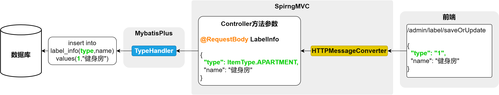
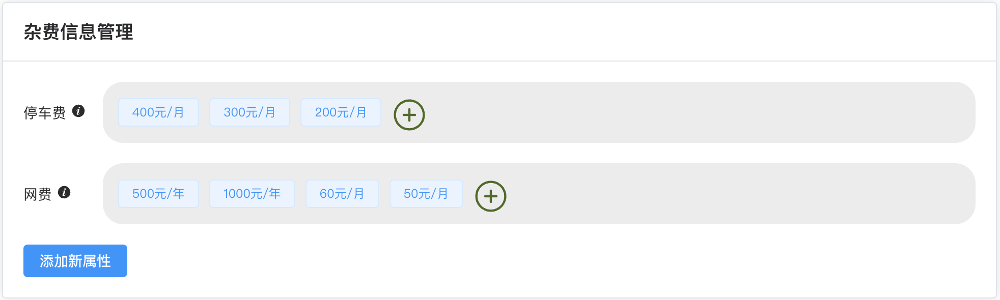
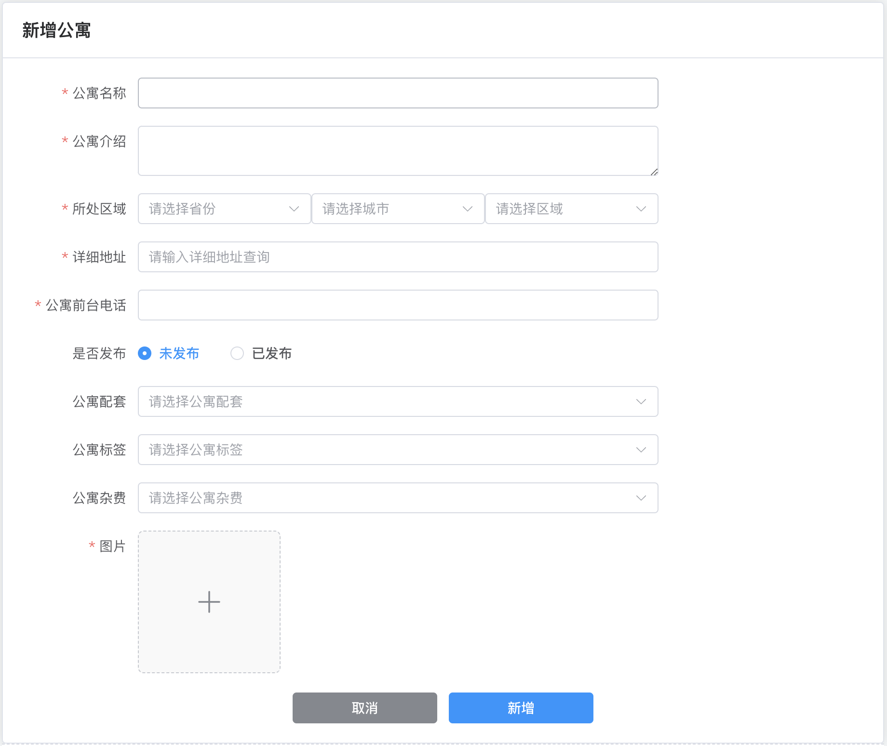

##  1尚庭公寓项目/公寓管理模块

[TOC]

### 一、属性管理

> 属性管理页面包含公寓和房间各种可选的属性信息，其中包括**房间的可选支付方式**、**房间的可选租期**、**房间的配套**、**公寓的配套**等等。其所需接口如下

#### 1.1 房间支付方式管理


房间支付方式管理共有三个接口，分别是**查询全部支付方式列表**、**保存或更新支付方式**和**根据ID删除支付方式**，下面逐一实现。

首先在`PaymentTypeController`中注入`PaymentTypeService`依赖，如下

```java
@Tag(name = "支付方式管理")
@RequestMapping("/admin/payment")
@RestController
public class PaymentTypeController {

    @Autowired
    private PaymentTypeService service;
}
```

##### 1.1.1  查询全部支付方式列表

在`PaymentTypeController`中增加如下内容

```java
@Operation(summary = "查询全部支付方式列表")
@GetMapping("list")
public Result<List<PaymentType>> listPaymentType() {
    List<PaymentType> list = service.list();
    return Result.ok(list);
}
```

**知识点**：

- **逻辑删除功能**

  由于数据库中所有表均采用逻辑删除策略，所以查询数据时均需要增加过滤条件`is_deleted=0`。

  上述操作虽不难实现，但是每个查询接口都要考虑到，也显得有些繁琐。为简化上述操作，可以使用Mybatis-Plus提供的逻辑删除功能，它可以自动为查询操作增加`is_deleted=0`过滤条件，并将删除操作转为更新语句。具体配置如下，详细信息可参考[官方文档](https://baomidou.com/pages/6b03c5/#%E4%BD%BF%E7%94%A8%E6%96%B9%E6%B3%95)。

  - 步骤一：在`application.yml`中增加如下内容

    ```yml
    mybatis-plus:
      global-config:
        db-config:
          logic-delete-field: is_deleted # 全局逻辑删除的实体字段名(配置后可以忽略不配置步骤二)
          logic-delete-value: 1 # 逻辑已删除值(默认为 1)
          logic-not-delete-value: 0 # 逻辑未删除值(默认为 0)
    ```

  - 步骤二：在实体类中的删除标识字段上增加`@TableLogic`注解

    ```java
    @Data
    public class BaseEntity {
    
        @Schema(description = "主键")
        @TableId(value = "id", type = IdType.AUTO)
        private Long id;
    
        @Schema(description = "创建时间")
        @JsonIgnore
        private Date createTime;
    
        @Schema(description = "更新时间")
        @JsonIgnore
        private Date updateTime;
    
        @Schema(description = "逻辑删除")
        @JsonIgnore
        @TableLogic
        @TableField("is_deleted")
        private Byte isDeleted;
    
    }
    ```

    **注意**：

    ==逻辑删除功能只对Mybatis-Plus自动注入的sql起效，也就是说，对于手动在`Mapper.xml`文件配置的sql不会生效，需要单独考虑。==

- **忽略特定字段（扩展）**

  通常情况下接口响应的Json对象中并不需要`create_time`、`update_time`、`is_deleted`等字段，这时只需在实体类中的相应字段添加`@JsonIgnore`注解，该字段就会在序列化时被忽略。

  具体配置如下，详细信息可参考Jackson[官方文档](https://github.com/FasterXML/jackson-annotations#annotations-for-ignoring-properties)。

  ```java
  @Data
  public class BaseEntity {
  
      @Schema(description = "主键")
      @TableId(value = "id", type = IdType.AUTO)
      private Long id;
  
      @Schema(description = "创建时间")
      @JsonIgnore
      @TableField(value = "create_time")
      private Date createTime;
  
      @Schema(description = "更新时间")
      @JsonIgnore
      @TableField(value = "update_time")
      private Date updateTime;
  
      @Schema(description = "逻辑删除")
      @JsonIgnore
      @TableField("is_deleted")
      private Byte isDeleted;
  
  }
  ```


##### 1.1.2 保存或更新支付方式

在`PaymentTypeController`中增加如下内容

```java
@Operation(summary = "保存或更新支付方式")
@PostMapping("saveOrUpdate")
public Result saveOrUpdatePaymentType(@RequestBody PaymentType paymentType) {
    service.saveOrUpdate(paymentType);
    return Result.ok();
}
```

**知识点**：

保存或更新数据时，前端通常不会传入`isDeleted`、`createTime`、`updateTime`这三个字段，因此我们需要手动赋值。但是数据库中几乎每张表都有上述字段，所以手动去赋值就显得有些繁琐。为简化上述操作，我们可采取以下措施。

- `is_deleted`字段：可将数据库中该字段的默认值设置为`0`。

- `create_time`和`update_time`：可使用mybatis-plus的自动填充功能，所谓自动填充，就是通过统一配置，在插入或更新数据时，自动为某些字段赋值，具体配置如下，详细信息可参考[官方文档](https://baomidou.com/pages/4c6bcf/)。

  - 为相关字段配置触发填充的时机，例如`create_time`需要在插入数据时填充，而`update_time`需要在更新数据时填充。具体配置如下，观察`@TableField`注解中的`fill`属性。

    ```java
    @Data
    public class BaseEntity {
    
        @Schema(description = "主键")
        @TableId(value = "id", type = IdType.AUTO)
        private Long id;
    
        @Schema(description = "创建时间")
        @JsonIgnore
        @TableField(value = "create_time", fill = FieldFill.INSERT)
        private Date createTime;
    
        @Schema(description = "更新时间")
        @JsonIgnore
        @TableField(value = "update_time", fill = FieldFill.UPDATE)
        private Date updateTime;
    
        @Schema(description = "逻辑删除")
        @JsonIgnore
        @TableLogic
        @TableField("is_deleted")
        private Byte isDeleted;
    
    }
    ```
  
  - 配置自动填充的内容，具体配置如下
  
    在**common模块**下创建`com.atguigu.lease.common.mybatisplus.MybatisMetaObjectHandler`类，内容如下：
  
    ```java
    @Component
    public class MybatisMetaObjectHandler implements MetaObjectHandler {
        @Override
        public void insertFill(MetaObject metaObject) {
            this.strictInsertFill(metaObject, "createTime", Date.class, new Date());
        }
    
        @Override
        public void updateFill(MetaObject metaObject) {
            this.strictUpdateFill(metaObject, "updateTime", Date.class, new Date());
        }
    }
    ```
  
  在做完上述配置后，当写入数据时，Mybatis-Plus会自动将实体对象的`create_time`字段填充为当前时间，当更新数据时，则会自动将实体对象的`update_time`字段填充为当前时间。

##### 1.1.3 根据ID删除支付方式

在`PaymentTypeController`中增加如下内容

```java
@Operation(summary = "根据ID删除支付方式")
@DeleteMapping("deleteById")
public Result deletePaymentById(@RequestParam Long id) {
    service.removeById(id);
    return Result.ok();
}
```

**知识点**：

`MybatisPlus`逻辑删除功能的使用。

`Jackson`忽略字段

`MyBatisPlus`自动填充字段

#### 1.2 房间租期管理(作业)

**房间租期管理**共有三个接口，分别是**查询全部租期列表**、**保存或更新租期信息**和**根据ID删除租期**，具体实现如下。


在`LeaseTermController`中增加如下内容

```java
@Tag(name = "租期管理")
@RequestMapping("/admin/term")
@RestController
public class LeaseTermController {

    @Autowired
    private LeaseTermService service;

    @GetMapping("list")
    @Operation(summary = "查询全部租期列表")
    public Result<List<LeaseTerm>> listLeaseTerm() {
        List<LeaseTerm> list = service.list();
        return Result.ok(list);
    }

    @PostMapping("saveOrUpdate")
    @Operation(summary = "保存或更新租期信息")
    public Result saveOrUpdate(@RequestBody LeaseTerm leaseTerm) {
        service.saveOrUpdate(leaseTerm);
        return Result.ok();
    }

    @DeleteMapping("deleteById")
    @Operation(summary = "根据ID删除租期")
    public Result deleteLeaseTermById(@RequestParam Long id) {
        service.removeById(id);
        return Result.ok();
    }
}
```

#### 1.3 标签管理

**标签管理**共有三个接口，分别是**[根据类型]查询标签列表**、**保存或更新标签信息**和**根据ID删除标签**，下面逐一实现。


首先在`LabelController`中注入`LabelInfoService`依赖，如下

```java
@Tag(name = "标签管理")
@RestController
@RequestMapping("/admin/label")
public class LabelController {

    @Autowired
    private LabelInfoService service;
}
```

##### 1.3.1 [根据类型]查询标签列表

在`LabelController`中增加如下内容

```java
@Operation(summary = "（根据类型）查询标签列表")
@GetMapping("list")
public Result<List<LabelInfo>> labelList(@RequestParam(required = false) ItemType type) {
    LambdaQueryWrapper<LabelInfo> queryWrapper = new LambdaQueryWrapper<>();
    queryWrapper.eq(type != null, LabelInfo::getType, type);
    List<LabelInfo> list = service.list(queryWrapper);
    return Result.ok(list);
}
```

**知识点**：

上述接口的功能是根据**type**（公寓/房间），查询标签列表。由于这个**type**字段在数据库、实体类、前后端交互的过程中有多种不同的形式，因此在请求和响应的过程中，**type**字段会涉及到多次类型转换。

首先明确一下**type**字段的各种形式：

- **数据库中**

  数据库中的**type**字段为`tinyint`类型

  ```
  +-------------+--------------+
  | Field       | Type         |
  +-------------+--------------+
  | id          | bigint       |
  | type        | tinyint      |
  | name        | varchar(255) |
  | create_time | timestamp    |
  | update_time | timestamp    |
  | is_deleted  | tinyint      |
  +-------------+--------------+
  ```

- **实体类**

  实体类中的**type**字段为`ItemType`枚举类型

  `LabelInfo`实体类如下

  ```java
  @Schema(description = "标签信息表")
  @TableName(value = "label_info")
  @Data
  public class LabelInfo extends BaseEntity {
  
      private static final long serialVersionUID = 1L;
  
      @Schema(description = "类型")
      @TableField(value = "type")
      private ItemType type;
  
      @Schema(description = "标签名称")
      @TableField(value = "name")
      private String name;
  }
  ```

  `ItemType`枚举类如下

  ```java
  public enum ItemType {
  
      APARTMENT(1, "公寓"),
      ROOM(2, "房间");
  
      private Integer code;
      private String name;
  
      ItemType(Integer code, String name) {
          this.code = code;
          this.name = name;
      }
  }
  ```

- **前后端交互中**

  前后端交互所传递的数据中**type**字段为**数字**（1/2）。
  
  

具体转换过程如下图所示：

- **请求流程**

  

  **说明**

  - SpringMVC中的`WebDataBinder`组件负责将HTTP的请求参数绑定到Controller方法的参数，并实现参数类型的转换。
  - Mybatis中的`TypeHandler`用于处理Java中的实体对象与数据库之间的数据类型转换。

- **响应流程**

  

  **说明**

  - SpringMVC中的`HTTPMessageConverter`组件负责将Controller方法的返回值（Java对象）转换为HTTP响应体中的JSON字符串，或者将请求体中的JSON字符串转换为Controller方法中的参数（Java对象），例如下一个接口**保存或更新标签信息**

  

下面介绍一下每个环节的类型转换原理

- **WebDataBinder枚举类型转换**

  `WebDataBinder`依赖于[`Converter`](https://docs.spring.io/spring-framework/reference/core/validation/convert.html)实现类型转换，若Controller方法声明的`@RequestParam`参数的类型不是`String`，`WebDataBinder`就会自动进行数据类型转换。SpringMVC提供了常用类型的转换器，例如`String`到`Integer`、`String`到`Date`，`String`到`Boolean`等等，其中也包括`String`到枚举类型，但是`String`到枚举类型的默认转换规则是根据实例名称（"APARTMENT"）转换为枚举对象实例（ItemType.APARTMENT）。若想实现`code`属性到枚举对象实例的转换，需要自定义`Converter`，代码如下，具体内容可参考[官方文档](https://docs.spring.io/spring-framework/reference/core/validation/convert.html#core-convert-Converter-API)。

  - 在**web-admin模块**自定义`com.atguigu.lease.web.admin.custom.converter.StringToItemTypeConverter`

    ```java
    @Component
    public class StringToItemTypeConverter implements Converter<String, ItemType> {
        @Override
        public ItemType convert(String code) {
    
            for (ItemType value : ItemType.values()) {
                if (value.getCode().equals(Integer.valueOf(code))) {
                    return value;
                }
            }
            throw new IllegalArgumentException("code非法");
        }
    }
    ```

  - 注册上述的`StringToItemTypeConverter`，在**web-admin模块**创建`com.atguigu.lease.web.admin.custom.config.WebMvcConfiguration`，内容如下：

    ```java
    @Configuration
    public class WebMvcConfiguration implements WebMvcConfigurer {
    
        @Autowired
        private StringToItemTypeConverter stringToItemTypeConverter;
    
        @Override
        public void addFormatters(FormatterRegistry registry) {
            registry.addConverter(this.stringToItemTypeConverter);
        }
    }
    ```

  但是我们有很多的枚举类型都需要考虑类型转换这个问题，按照上述思路，我们需要为每个枚举类型都定义一个Converter，并且每个Converter的转换逻辑都完全相同，针对这种情况，我们使用[`ConverterFactory`](https://docs.spring.io/spring-framework/reference/core/validation/convert.html#core-convert-ConverterFactory-SPI)接口更为合适，这个接口可以将同一个转换逻辑应用到一个接口的所有实现类，因此我们可以定义一个`BaseEnum`接口，然后另所有的枚举类都实现该接口，然后就可以自定义`ConverterFactory`，集中编写各枚举类的转换逻辑了。具体实现如下：

  - 在**model模块**定义`com.atguigu.lease.model.enums.BaseEnum`接口

    ```java
    public interface BaseEnum {
        Integer getCode();
        String getName();
    }
    ```

  - 令所有`com.atguigu.lease.model.enums`包下的枚举类都实现`BaseEnun`接口

  - 在**web-admin模块**自定义`com.atguigu.lease.web.admin.custom.converter.StringToBaseEnumConverterFactory`

    ```java
    @Component
    public class StringToBaseEnumConverterFactory implements ConverterFactory<String, BaseEnum> {
        
        @Override
        public <T extends BaseEnum> Converter<String, T> getConverter(Class<T> targetType) {
            return new Converter<String, T>() {
                @Override
                public T convert(String source) {
    				//Class.getEnumConstants() 方法是 Java 反射 API 中的一个方法，用于获取表示枚举类型的 Class 对象中所有枚举常量的数组
                    for (T enumConstant : targetType.getEnumConstants()) {
                        if (enumConstant.getCode().equals(Integer.valueOf(source))) {
                            return enumConstant;
                        }
                    }
                    throw new IllegalArgumentException("非法的枚举值:" + source);
                }
            };
        }
    }
    ```

  - 注册上述的`ConverterFactory`，在**web-admin模块**创建`com.atguigu.lease.web.admin.custom.config.WebMvcConfiguration`，内容如下：

    ```java
    @Configuration
    public class WebMvcConfiguration implements WebMvcConfigurer {
    
        @Autowired
        private StringToBaseEnumConverterFactory stringToBaseEnumConverterFactory;
    
        @Override
        public void addFormatters(FormatterRegistry registry) {
            registry.addConverterFactory(this.stringToBaseEnumConverterFactory);
        }
    }
    ```
    
    **注意：**
    
    最终采用的是`ConverterFactory`方案，因此`StringToItemTypeConverter`相关代码可以直接删除。

- **TypeHandler枚举类型转换**

  Mybatis预置的`TypeHandler`可以处理常用的数据类型转换，例如`String`、`Integer`、`Date`等等，其中也包含枚举类型，但是枚举类型的默认转换规则是枚举对象实例（ItemType.APARTMENT）和实例名称（"APARTMENT"）相互映射。若想实现`code`属性到枚举对象实例的相互映射，需要自定义`TypeHandler`。

  不过MybatisPlus提供了一个[通用的处理枚举类型的TypeHandler](https://baomidou.com/pages/8390a4/)。其使用十分简单，只需在`ItemType`枚举类的`code`属性上增加一个注解`@EnumValue`，Mybatis-Plus便可完成从`ItemType`对象到`code`属性之间的相互映射，具体配置如下。

  ```java
  public enum ItemType {
  
      APARTMENT(1, "公寓"),
      ROOM(2, "房间");
  
      @EnumValue
      private Integer code;
      private String name;
  
      ItemType(Integer code, String name) {
          this.code = code;
          this.name = name;
      }
  }
  ```

- **HTTPMessageConverter枚举类型转换**

  `HttpMessageConverter`依赖于Json序列化框架（默认使用Jackson）。其对枚举类型的默认处理规则也是枚举对象实例（ItemType.APARTMENT）和实例名称（"APARTMENT"）相互映射。不过其提供了一个注解`@JsonValue`，同样只需在`ItemType`枚举类的`code`属性上增加一个注解`@JsonValue`，Jackson便可完成从`ItemType`对象到`code`属性之间的互相映射。具体配置如下，详细信息可参考Jackson[官方文档](https://fasterxml.github.io/jackson-annotations/javadoc/2.8/com/fasterxml/jackson/annotation/JsonValue.html)。

  ```java
  @Getter
  public enum ItemType {
  
      APARTMENT(1, "公寓"),
      ROOM(2, "房间");
  
      @EnumValue
    	@JsonValue
      private Integer code;
      private String name;
  
      ItemType(Integer code, String name) {
          this.code = code;
          this.name = name;
      }
  }
  ```

##### 1.3.2 保存或更新标签信息

在`LabelController`中增加如下内容

```java
@Operation(summary = "保存或更新标签信息")
@PostMapping("saveOrUpdate")
public Result saveOrUpdateLabel(@RequestBody LabelInfo labelInfo) {
    service.saveOrUpdate(labelInfo);
    return Result.ok();
}
```

##### 1.3.3 根据ID删除标签

在`LabelController`中增加如下内容

```java
@Operation(summary = "根据id删除标签信息")
@DeleteMapping("deleteById")
public Result deleteLabelById(@RequestParam Long id) {
    service.removeById(id);
    return Result.ok();
}
```

#### 1.4 配套管理(作业)

**配套管理**共有三个接口，分别是**[根据类型]查询配套列表**、**保存或更新配套信息**和**根据ID删除配套**，具体实现如下。


在`FacilityController`中增加如下内容

```java
@Tag(name = "配套管理")
@RestController
@RequestMapping("/admin/facility")
public class FacilityController {

    @Autowired
    private FacilityInfoService service;

    @Operation(summary = "[根据类型]查询配套信息列表")
    @GetMapping("list")
    public Result<List<FacilityInfo>> listFacility(@RequestParam(required = false) ItemType type) {
        LambdaQueryWrapper<FacilityInfo> queryWrapper = new LambdaQueryWrapper<>();
        queryWrapper.eq(type != null, FacilityInfo::getType, type);
        List<FacilityInfo> list = service.list(queryWrapper);
        return Result.ok(list);
    }

    @Operation(summary = "新增或修改配套信息")
    @PostMapping("saveOrUpdate")
    public Result saveOrUpdate(@RequestBody FacilityInfo facilityInfo) {
        service.saveOrUpdate(facilityInfo);
        return Result.ok();
    }

    @Operation(summary = "根据id删除配套信息")
    @DeleteMapping("deleteById")
    public Result removeFacilityById(@RequestParam Long id) {
        service.removeById(id);
        return Result.ok();
    }

}
```

#### 1.5 基本属性管理

房间基本属性管理共有五个接口，分别是**保存或更新属性名称**、**保存或更新属性值**、**查询全部属性名称和属性值列表**、**根据ID删除属性名称**、**根据ID删除属性值**。下面逐一是实现。


首先在`AttrController`中注入`AttrKeyService`和`AttrValueService`，如下：

```java
@Tag(name = "房间属性管理")
@RestController
@RequestMapping("/admin/attr")
public class AttrController {

    @Autowired
    private AttrKeyService attrKeyService;

    @Autowired
    private AttrValueService attrValueService;
}
```

##### 1.5.1  保存或更新属性名称

在`AttrController`增加如下内容

```java
@Operation(summary = "保存或更新属性名称")
@PostMapping("key/saveOrUpdate")
public Result saveOrUpdateAttrKey(@RequestBody AttrKey attrKey) {

    attrKeyService.saveOrUpdate(attrKey);
    return Result.ok();
}
```

##### 1.5.2 保存或更新属性值

在`AttrController`中增加如下内容

```java
@Operation(summary = "保存或更新属性值")
@PostMapping("value/saveOrUpdate")
public Result saveOrUpdateAttrValue(@RequestBody AttrValue attrValue) {

    attrValueService.saveOrUpdate(attrValue);
    return Result.ok();
}
```

##### 1.5.3 查询全部属性名称和属性值列表

- **多领域模型介绍**

  - **POJO** ： POJO指的是普通的Java对象，没有任何特殊限制或要求，不依赖于特定的框架或接口。它通常用于表示简单的数据对象，只包含私有字段、对应的`getter`和`setter`方法以及一些业务逻辑。
  - **Entity**:    Entity表示系统中具有独特身份的业务对象。它通常映射到数据库表中的记录，有唯一的标识符（ID）并包含与业务相关的数据和行为。
  - **VO**: VO(Value Object)是一种用于表示值的对象，通常是不可变的，只包含数据而没有业务行为。它用于封装一组相关的数据，常用于传递数据结构。
  
- **查看响应的数据结构**

  查看**web-admin模块**下的`com.atguigu.lease.web.admin.vo.attr.AttrKeyVo`，内容如下：

  ```java
  @Data
  public class AttrKeyVo extends AttrKey {
  
      @Schema(description = "属性值列表")
      private List<AttrValue> attrValueList;
  }
  ```

- **编写Controller层逻辑**

  在`AttrController`中添加如下内容

  ```java
  @Operation(summary = "查询全部属性名称和属性值列表")
  @GetMapping("list")
  public Result<List<AttrKeyVo>> listAttrInfo() {
  
      List<AttrKeyVo> list = attrKeyService.listAttrInfo();
      return Result.ok(list);
  }
  ```

- **编写Service层逻辑**

  在`AttrKeyService`中增加如下内容

  ```java
  List<AttrKeyVo> listAttrInfo();
  ```

  在`AttrKeyServiceImpl`中增加如下内容

  ```java
  @Autowired
  private AttrKeyMapper mapper;
  
  @Override
  public List<AttrKeyVo> listAttrInfo() {
      return mapper.listAttrInfo();
  }
  ```

- **编写Mapper层逻辑**

  在`AttrKeyMapper`中增加如下内容

  ```java
  List<AttrKeyVo> listAttrInfo();
  ```

  对应的在`AttrKeyMapper.xml`中增加如下内容

  ```xml
  <resultMap id="BaseResultMap" type="com.atguigu.lease.web.admin.vo.attr.AttrKeyVo">
      <id property="id" column="id"/>
      <result property="name" column="key_name"/>
      <collection property="attrValueList" ofType="com.atguigu.lease.model.entity.AttrValue">
          <id column="value_id" property="id"/>
          <result column="value_name" property="name"/>
          <result column="key_id" property="attrKeyId"/>
      </collection>
  </resultMap>
  <select id="listAttrInfo" resultMap="BaseResultMap">
      select k.id,
             k.name        key_name,
             v.id          value_id,
             v.name        value_name,
             v.attr_key_id key_id
      from attr_key k
               left join attr_value v on k.id = v.attr_key_id and v.is_deleted = 0
      where k.is_deleted = 0
  </select>
  ```

##### 1.5.4 根据ID删除属性名称

在`AttrController`中增加如下内容，注意删除属性名称时，会一并删除其下的所有属性值

```java
@Operation(summary = "根据id删除属性名称")
@DeleteMapping("key/deleteById")
public Result removeAttrKeyById(@RequestParam Long attrKeyId) {

    //删除attrKey
    attrKeyService.removeById(attrKeyId);
    //删除attrValue
    LambdaQueryWrapper<AttrValue> queryWrapper = new LambdaQueryWrapper<>();
    queryWrapper.eq(AttrValue::getAttrKeyId, attrKeyId);
    attrValueService.remove(queryWrapper);
    return Result.ok();
}
```

##### 1.5.5 根据ID删除属性值

在`AttrController`中增加如下内容

```java
@Operation(summary = "根据id删除属性值")
@DeleteMapping("value/deleteById")
public Result removeAttrValueById(@RequestParam Long id) {

    attrValueService.removeById(id);
    return Result.ok();
}
```

#### 1.6 公寓杂费管理(作业)

房间基本属性管理共有五个接口，分别是**保存或更新杂费名称**、**保存或更新杂费值**、**查询全部杂费名称和杂费值列表**、**根据ID删除杂费名称**、**根据ID删除杂费值**。下面逐一实现!



首先在`FeeController`中注入`FeeKeyService`和`FeeValueService`，如下

```java
@Tag(name = "房间杂费管理")
@RestController
@RequestMapping("/admin/fee")
public class FeeController {

    @Autowired
    private FeeKeyService feeKeyService;

    @Autowired
    private FeeValueService feeValueService;
}
```

##### 1.6.1 保存或更新杂费名称

在`FeeController`中增加如下内容

```java
@Operation(summary = "保存或更新杂费名称")
@PostMapping("key/saveOrUpdate")
public Result saveOrUpdateFeeKey(@RequestBody FeeKey feeKey) {
    feeKeyService.saveOrUpdate(feeKey);
    return Result.ok();
}
```

##### 1.6.2 保存或更新杂费值

在`FeeController`中增加如下内容

```java
@Operation(summary = "保存或更新杂费值")
@PostMapping("value/saveOrUpdate")
public Result saveOrUpdateFeeValue(@RequestBody FeeValue feeValue) {
    feeValueService.saveOrUpdate(feeValue);
    return Result.ok();
}
```

##### 1.6.3 查询全部杂费名称和杂费值列表

- **查看响应的数据结构**

  查看**web-admin模块**下创的`com.atguigu.lease.web.admin.vo.fee.FeeKeyVo`，内容如下

  ```java
  @Data
  public class FeeKeyVo extends FeeKey {
  
      @Schema(description = "杂费value列表")
      private List<FeeValue> feeValueList;
  }
  ```

- **编写Controller层逻辑**

  在`FeeController`中增加如下内容

  ```java
  @Operation(summary = "查询全部杂费名称和杂费值列表")
  @GetMapping("list")
  public Result<List<FeeKeyVo>> feeInfoList() {
  
      List<FeeKeyVo> list = feeKeyService.listFeeInfo();
      return Result.ok(list);
  }
  ```

- **编写Service层逻辑**

  - 在`FeeKeyService`中增加如下内容

    ```java
    List<FeeKeyVo> listFeeInfo();
    ```

  - 在`FeeKeyServiceImpl`中增加如下内容

    ```java
    @Autowired
    private FeeKeyMapper mapper;
    
    @Override
    public List<FeeKeyVo> listFeeInfo() {
    
        return mapper.listFeeInfo();
    }
    ```

- **编写Mapper层逻辑**

  - 在`FeeKeyMapper`中增加如下内容

    ```java
    List<FeeKeyVo> listFeeInfo();
    ```

  - 在`FeeKeyMapper.xml`中增加如下内容

    ```xml
    <resultMap id="FeeInfoList" type="com.atguigu.lease.web.admin.vo.fee.FeeKeyVo">
        <id property="id" column="id"/>
        <result property="name" column="key_name"/>
        <collection property="feeValueList" ofType="com.atguigu.lease.model.entity.FeeValue">
            <id column="value_id" property="id"/>
            <result column="value_name" property="name"/>
            <result column="value_unit" property="unit"/>
            <result column="key_id" property="feeKeyId"/>
        </collection>
    </resultMap>
    
    <select id="listFeeInfo" resultMap="FeeInfoList">
        select k.id,
               k.name       key_name,
               v.id         value_id,
               v.name       value_name,
               v.unit       value_unit,
               v.fee_key_id key_id
        from fee_key k
                 left join fee_value v on k.id = v.fee_key_id and v.is_deleted = 0
        where k.is_deleted = 0
    </select>
    ```

##### 1.6.4 根据ID删除杂费名称

在`FeeController`中增加如下内容

```java
@Operation(summary = "根据id删除杂费名称")
@DeleteMapping("key/deleteById")
public Result deleteFeeKeyById(@RequestParam Long feeKeyId) {

    //删除杂费名称
    feeKeyService.removeById(feeKeyId);
    //删除杂费名称下的杂费值
    LambdaQueryWrapper<FeeValue> queryWrapper = new LambdaQueryWrapper<>();
    queryWrapper.eq(FeeValue::getFeeKeyId, feeKeyId);
    feeValueService.remove(queryWrapper);
    return Result.ok();
}
```

##### 1.6.5 根据ID删除杂费值

在`FeeController`中增加如下内容

```java
@Operation(summary = "根据id删除杂费值")
@DeleteMapping("value/deleteById")
public Result deleteFeeValueById(@RequestParam Long id) {
    feeValueService.removeById(id);
    return Result.ok();
}
```


### 二、公寓信息管理

> 主要包含公寓的六个接口，以及地区和文件处理接口！！！

#### 2.1 地区信息管理(作业)


地区信息管理共有三个接口，分别是**查询省份信息列表**，**根据省份ID查询城市信息列表**和**根据城市ID查询区县信息列表**，具体实现如下!

在`RegionInfoController`中增加如下内容

```java
@Tag(name = "地区信息管理")
@RestController
@RequestMapping("/admin/region")
public class RegionInfoController {

    @Autowired
    private ProvinceInfoService provinceInfoService;

    @Autowired
    private CityInfoService cityInfoService;

    @Autowired
    private DistrictInfoService districtInfoService;

    @Operation(summary = "查询省份信息列表")
    @GetMapping("province/list")
    public Result<List<ProvinceInfo>> listProvince() {
        List<ProvinceInfo> list = provinceInfoService.list();
        return Result.ok(list);
    }

    @Operation(summary = "根据省份id查询城市信息列表")
    @GetMapping("city/listByProvinceId")
    public Result<List<CityInfo>> listCityInfoByProvinceId(@RequestParam Long id) {
        LambdaQueryWrapper<CityInfo> queryWrapper = new LambdaQueryWrapper<>();
        queryWrapper.eq(CityInfo::getProvinceId, id);
        List<CityInfo> list = cityInfoService.list(queryWrapper);
        return Result.ok(list);
    }

    @GetMapping("district/listByCityId")
    @Operation(summary = "根据城市id查询区县信息")
    public Result<List<DistrictInfo>> listDistrictInfoByCityId(@RequestParam Long id) {
        LambdaQueryWrapper<DistrictInfo> queryWrapper = new LambdaQueryWrapper<>();
        queryWrapper.eq(DistrictInfo::getCityId, id);
        List<DistrictInfo> list = districtInfoService.list(queryWrapper);
        return Result.ok(list);
    }
}
```

#### 2.2 图片上传管理

由于公寓、房间等实体均包含图片信息，所以在新增或修改公寓、房间信息时，需要上传图片，因此我们需要实现一个上传图片的接口。


**1. 图片上传流程**

下图展示了新增房间或公寓时，上传图片的流程。


可以看出图片上传接口接收的是图片文件，返回的Minio对象的URL。

**2. 图片上传接口开发**

下面为该接口的具体实现

- **配置Minio Client**

  - 引入Minio Maven依赖

    在**common模块**的`pom.xml`文件增加如下内容：

    ```xml
    <dependency>
        <groupId>io.minio</groupId>
        <artifactId>minio</artifactId>
    </dependency>
    ```

  - 配置Minio相关参数

    在`application.yml`中配置Minio的`endpoint`、`accessKey`、`secretKey`、`bucketName`等参数

    ```yml
    minio:
      endpoint: http://<hostname>:<port>
      access-key: <access-key>
      secret-key: <secret-key>
      bucket-name: <bucket-name>
    ```

    **注意**：上述`<hostname>`、`<port>`等信息需根据实际情况进行修改。

  - 在**common模块**中创建`com.atguigu.lease.common.minio.MinioProperties`，内容如下

    ```java
    @ConfigurationProperties(prefix = "minio")
    @Data
    public class MinioProperties {
    
        private String endpoint;
    
        private String accessKey;
    
        private String secretKey;
        
        private String bucketName;
    }
    ```

  - 在**common模块**中创建`com.atguigu.lease.common.minio.MinioConfiguration`，内容如下
  
    ```java
    @Configuration
    @EnableConfigurationProperties(MinioProperties.class)
    public class MinioConfiguration {
    
        @Autowired
        private MinioProperties properties;
    
        @Bean
        public MinioClient minioClient() {
            return MinioClient.builder().endpoint(properties.getEndpoint()).credentials(properties.getAccessKey(), properties.getSecretKey()).build();
        }
    }
    ```
  
- **开发图片上传接口**

  - 编写Controller层逻辑

    在`FileUploadController`中增加如下内容

    ```java
    @Tag(name = "文件管理")
    @RequestMapping("/admin/file")
    @RestController
    public class FileUploadController {
    
        @Autowired
        private FileService service;
    
        @Operation(summary = "上传文件")
        @PostMapping("upload")
        public Result<String> upload(@RequestParam MultipartFile file) {
    
            String url = service.upload(file);
            return Result.ok(url);
        }
    }
    ```

    **说明：**`MultipartFile`是Spring框架中用于处理文件上传的类，它包含了上传文件的信息（如文件名、文件内容等）。

  - 编写Service层逻辑

    - 在`FileService`中增加如下内容
  
      ```java
      String upload(MultipartFile file);
      ```

    - 在`FileServiceImpl`中增加如下内容
  
      ```java
      @Autowired
      private MinioProperties properties;
      
      @Autowired
      private MinioClient client;
      
      @Override
      public String upload(MultipartFile file) {
      
          try {
              boolean bucketExists = client.bucketExists(BucketExistsArgs.builder().bucket(properties.getBucketName()).build());
              if (!bucketExists) {
                  client.makeBucket(MakeBucketArgs.builder().bucket(properties.getBucketName()).build());
                  client.setBucketPolicy(SetBucketPolicyArgs.builder().bucket(properties.getBucketName()).config(createBucketPolicyConfig(properties.getBucketName())).build());
              }
      
              String filename = new SimpleDateFormat("yyyyMMdd").format(new Date()) + "/" + UUID.randomUUID() + "-" + file.getOriginalFilename();
              client.putObject(PutObjectArgs.builder().
                      bucket(properties.getBucketName()).
                      object(filename).
                      stream(file.getInputStream(), file.getSize(), -1).
                      contentType(file.getContentType()).build());
      
              return String.join("/", properties.getEndpoint(), properties.getBucketName(), filename);
      
          } catch (Exception e) {
              e.printStackTrace();
          }
          return null;
      }
      
      private String createBucketPolicyConfig(String bucketName) {
      
          return """
                  {
                    "Statement" : [ {
                      "Action" : "s3:GetObject",
                      "Effect" : "Allow",
                      "Principal" : "*",
                      "Resource" : "arn:aws:s3:::%s/*"
                    } ],
                    "Version" : "2012-10-17"
                  }
                  """.formatted(bucketName);
      }
      ```
      
      **注意**：
      
      上述`createBucketPolicyConfig`方法的作用是生成用于描述指定bucket访问权限的JSON字符串。最终生成的字符串格式如下，其表示，允许(`Allow`)所有人(`*`)获取(`s3:GetObject`)指定桶(`<bucket-name>`)的内容。
      
      ```json
      {
        "Statement" : [ {
          "Action" : "s3:GetObject",
          "Effect" : "Allow",
          "Principal" : "*",
          "Resource" : "arn:aws:s3:::<bucket-name>/*"
        } ],
        "Version" : "2012-10-17"
      }
      ```
      
      由于公寓、房间的图片为公开信息，所以将其设置为所有人可访问。
      
      默认servlet限制上传数据大小为1MB,修改添加如何配置：
      
      ``` yaml
      spring:      
        servlet:
          multipart:
            max-file-size: 100MB
            max-request-size: 150MB    
      ```
      
    - **异常处理**
    
      - **问题说明**
    
        上述代码只是对`MinioClient`方法抛出的各种异常进行了捕获，然后打印了异常信息，目前这种处理逻辑，无论Minio是否发生异常，前端在上传文件时，总是会受到成功的响应信息。可按照以下步骤进行操作，查看具体现象
    
        关闭虚拟机中的Minio服务
    
        ```bash
        systemctl stop minio
        ```
    
        启动项目，并上传文件，观察接收的响应信息
    
      - **问题解决思路**
    
        为保证前端能够接收到正常的错误提示信息，应该将Service方法的异常抛出到Controller方法中，然后在Controller方法中对异常进行捕获并处理。具体操作如下
    
        **Service层代码**
    
        ```java
        @Override
        public String upload(MultipartFile file) throws ServerException, InsufficientDataException, ErrorResponseException, IOException, NoSuchAlgorithmException, InvalidKeyException, InvalidResponseException, XmlParserException, InternalException{
        
            boolean bucketExists = minioClient.bucketExists(
                    BucketExistsArgs.builder()
                            .bucket(properties.getBucketName())
                            .build());
            if (!bucketExists) {
                minioClient.makeBucket(
                        MakeBucketArgs.builder()
                                .bucket(properties.getBucketName())
                                .build());
                minioClient.setBucketPolicy(
                        SetBucketPolicyArgs.builder()
                                .bucket(properties.getBucketName())
                                .config(createBucketPolicyConfig(properties.getBucketName()))
                                .build());
            }
            String filename = new SimpleDateFormat("yyyyMMdd").format(new Date()) +
                    "/" + UUID.randomUUID() + "-" + file.getOriginalFilename();
            minioClient.putObject(
                    PutObjectArgs.builder()
                            .bucket(properties.getBucketName())
                            .stream(file.getInputStream(), file.getSize(), -1)
                            .object(filename)
                            .contentType(file.getContentType())
                            .build());
        
            return String.join("/",properties.getEndpoint(),properties.getBucketName(),filename);
        }
        ```
    
        **Controller层代码**
    
        ```java
        public Result<String> upload(@RequestParam MultipartFile file) {
            try {
                String url = service.upload(file);
                return Result.ok(url);
            } catch (Exception e) {
                e.printStackTrace();
                return Result.fail();
            }
        }
        ```
    
      - **全局异常处理**
    
        按照上述写法，所有的Controller层方法均需要增加`try-catch`逻辑，使用Spring MVC提供的**全局异常处理**功能，可以将所有处理异常的逻辑集中起来，进而统一处理所有异常，使代码更容易维护。
    
        具体用法如下，详细信息可参考[官方文档](https://docs.spring.io/spring-framework/reference/web/webmvc/mvc-controller/ann-exceptionhandler.html)：
    
        在**common模块**中创建`com.atguigu.lease.common.exception.GlobalExceptionHandler`类，内容如下
    
        ```java
        @ControllerAdvice
        public class GlobalExceptionHandler {
        
            @ExceptionHandler(Exception.class)
            @ResponseBody
            public Result error(Exception e){
                e.printStackTrace();
                return Result.fail();
            }
        }
        ```
    
        上述代码中的关键注解的作用如下
    
        `@ControllerAdvice`用于声明处理全局Controller方法异常的类
    
        `@ExceptionHandler`用于声明处理异常的方法，`value`属性用于声明该方法处理的异常类型
    
        `@ResponseBody`表示将方法的返回值作为HTTP的响应体
    
        **注意：**
    
        全局异常处理功能由SpringMVC提供，因此需要在**common模块**的`pom.xml`中引入如下依赖
    
        ```xml
        <!--spring-web-->
        <dependency>
            <groupId>org.springframework.boot</groupId>
            <artifactId>spring-boot-starter-web</artifactId>
        </dependency>
        ```
    
      - **修改Controller层代码**
    
        由于前文的`GlobalExceptionHandler`会处理所有Controller方法抛出的异常，因此Controller层就无需关注异常的处理逻辑了，因此Controller层代码可做出如下调整。
    
        ```java
        public Result<String> upload(@RequestParam MultipartFile file) throws ServerException, InsufficientDataException, ErrorResponseException, IOException, NoSuchAlgorithmException, InvalidKeyException, InvalidResponseException, XmlParserException, InternalException {
            String url = service.upload(file);
          return Result.ok(url);
        }
        ```

#### 2.3 公寓管理

公寓管理共有六个接口，下面逐一实现。




首先在`ApartmentController`中注入`ApartmentInfoService`，如下

```java
@Tag(name = "公寓信息管理")
@RestController
@RequestMapping("/admin/apartment")
public class ApartmentController {

    @Autowired
    private ApartmentInfoService service;
}
```

##### 2.3.1 保存或更新公寓信息

- **查看请求的数据结构**

  查看**web-admin模块**中的`com.atguigu.lease.web.admin.vo.apartment.ApartmentSubmitVo`类，内容如下：

  ```java
  @Schema(description = "公寓信息")
  @Data
  public class ApartmentSubmitVo extends ApartmentInfo {
  
      @Schema(description="公寓配套id")
      private List<Long> facilityInfoIds;
  
      @Schema(description="公寓标签id")
      private List<Long> labelIds;
  
      @Schema(description="公寓杂费值id")
      private List<Long> feeValueIds;
  
      @Schema(description="公寓图片id")
      private List<GraphVo> graphVoList;
  
  }
  ```

- **编写Controller层逻辑**

  在`ApartmentController`中增加如下内容

  ```java
  @Operation(summary = "保存或更新公寓信息")
  @PostMapping("saveOrUpdate")
  public Result saveOrUpdate(@RequestBody ApartmentSubmitVo apartmentSubmitVo) {
      service.saveOrUpdateApartment(apartmentSubmitVo);
      return Result.ok();
  }
  ```

- **编写Service层逻辑**

  - 在`ApartmentInfoService`中增加如下内容

    ```java
    void saveOrUpdateApartment(ApartmentSubmitVo apartmentSubmitVo);
    ```

  - 在`ApartmentInfoServiceImpl`中增加如下内容

    **注意**：所需`Service`和`Mapper`的注入语句省略未写。

    ```java
    @Override
    public void saveOrUpdateApartment(ApartmentSubmitVo apartmentSubmitVo) {
        boolean isUpdate = apartmentSubmitVo.getId()!=null;
        super.saveOrUpdate(apartmentSubmitVo);
    
        if (isUpdate){
            //1.删除图片列表
            LambdaQueryWrapper<GraphInfo> graphQueryWrapper = new LambdaQueryWrapper<>();
            graphQueryWrapper.eq(GraphInfo::getItemType, ItemType.APARTMENT);
            graphQueryWrapper.eq(GraphInfo::getItemId,apartmentSubmitVo.getId());
            graphInfoService.remove(graphQueryWrapper);
    
            //2.删除配套列表
            LambdaQueryWrapper<ApartmentFacility> facilityQueryWrapper = new LambdaQueryWrapper<>();
            facilityQueryWrapper.eq(ApartmentFacility::getApartmentId,apartmentSubmitVo.getId());
            apartmentFacilityService.remove(facilityQueryWrapper);
    
            //3.删除标签列表
            LambdaQueryWrapper<ApartmentLabel> labelQueryWrapper = new LambdaQueryWrapper<>();
            labelQueryWrapper.eq(ApartmentLabel::getApartmentId,apartmentSubmitVo.getId());
            apartmentLabelService.remove(labelQueryWrapper);
    
            //4.删除杂费列表
            LambdaQueryWrapper<ApartmentFeeValue> feeQueryWrapper = new LambdaQueryWrapper<>();
            feeQueryWrapper.eq(ApartmentFeeValue::getApartmentId,apartmentSubmitVo.getId());
            apartmentFeeValueService.remove(feeQueryWrapper);
    
        }
    
        //1.插入图片列表
        List<GraphVo> graphVoList = apartmentSubmitVo.getGraphVoList();
        if (!CollectionUtils.isEmpty(graphVoList)){
            ArrayList<GraphInfo> graphInfoList = new ArrayList<>();
            for (GraphVo graphVo : graphVoList) {
                GraphInfo graphInfo = new GraphInfo();
                graphInfo.setItemType(ItemType.APARTMENT);
                graphInfo.setItemId(apartmentSubmitVo.getId());
                graphInfo.setName(graphVo.getName());
                graphInfo.setUrl(graphVo.getUrl());
                graphInfoList.add(graphInfo);
            }
            graphInfoService.saveBatch(graphInfoList);
        }
    
    
        //2.插入配套列表
        List<Long> facilityInfoIdList = apartmentSubmitVo.getFacilityInfoIds();
        if (!CollectionUtils.isEmpty(facilityInfoIdList)){
            ArrayList<ApartmentFacility> facilityList = new ArrayList<>();
            for (Long facilityId : facilityInfoIdList) {
                ApartmentFacility apartmentFacility = new ApartmentFacility();
                apartmentFacility.setApartmentId(apartmentSubmitVo.getId());
                apartmentFacility.setFacilityId(facilityId);
                facilityList.add(apartmentFacility);
            }
            apartmentFacilityService.saveBatch(facilityList);
        }
    
    
        //3.插入标签列表
        List<Long> labelIds = apartmentSubmitVo.getLabelIds();
        if (!CollectionUtils.isEmpty(labelIds)) {
            List<ApartmentLabel> apartmentLabelList = new ArrayList<>();
            for (Long labelId : labelIds) {
                ApartmentLabel apartmentLabel = new ApartmentLabel();
                apartmentLabel.setApartmentId(apartmentSubmitVo.getId());
                apartmentLabel.setLabelId(labelId);
                apartmentLabelList.add(apartmentLabel);
            }
            apartmentLabelService.saveBatch(apartmentLabelList);
        }
    
    
        //4.插入杂费列表
        List<Long> feeValueIds = apartmentSubmitVo.getFeeValueIds();
        if (!CollectionUtils.isEmpty(feeValueIds)) {
            ArrayList<ApartmentFeeValue> apartmentFeeValueList = new ArrayList<>();
            for (Long feeValueId : feeValueIds) {
                ApartmentFeeValue apartmentFeeValue = new ApartmentFeeValue();
                apartmentFeeValue.setApartmentId(apartmentSubmitVo.getId());
                apartmentFeeValue.setFeeValueId(feeValueId);
                apartmentFeeValueList.add(apartmentFeeValue);
            }
            apartmentFeeValueService.saveBatch(apartmentFeeValueList);
        }
    }
    ```
    
  
  <font color='red'>注意:此接口前端不会传递城市名和省份名，需要自行查询和处理(联调测试)</font>  

##### 2.3.2 根据条件分页查询公寓列表

- **查看请求和响应的数据结构**

  - **请求数据结构**

    - `current`和`size`为分页相关参数，分别表示**当前所处页面**和**每个页面的记录数**。

    - `ApartmentQueryVo`为公寓的查询条件，详细结构如下：

      ```java
      @Data
      @Schema(description = "公寓查询实体")
      public class ApartmentQueryVo {
      
          @Schema(description = "省份id")
          private Long provinceId;
      
          @Schema(description = "城市id")
          private Long cityId;
      
          @Schema(description = "区域id")
          private Long districtId;
      }
      ```

  - **响应数据结构**

    单个公寓信息记录可查看`com.atguigu.lease.web.admin.vo.apartment.ApartmentItemVo`，内容如下：

    ```java
    @Data
    @Schema(description = "后台管理系统公寓列表实体")
    public class ApartmentItemVo extends ApartmentInfo {
    
        @Schema(description = "房间总数")
        private Long totalRoomCount;
    
        @Schema(description = "空闲房间数")
        private Long freeRoomCount;
    
    }
    ```

- **配置Mybatis-Plus分页插件**

  在**common模块**中的`com.atguigu.lease.common.mybatisplus.MybatisPlusConfiguration`中增加如下内容：

  ```java
  @Bean
  public MybatisPlusInterceptor mybatisPlusInterceptor() {
      MybatisPlusInterceptor interceptor = new MybatisPlusInterceptor();
      interceptor.addInnerInterceptor(new PaginationInnerInterceptor(DbType.MYSQL));
      return interceptor;
  }
  ```
  
- **接口实现**

  - **编写Controller层逻辑**

    在`ApartmentController`中增加如下内容：

    ```java
    @Operation(summary = "根据条件分页查询公寓列表")
    @GetMapping("pageItem")
    public Result<IPage<ApartmentItemVo>> pageItem(@RequestParam long current, @RequestParam long size, ApartmentQueryVo queryVo) {
    
        IPage<ApartmentItemVo> page = new Page<>(current, size);
        IPage<ApartmentItemVo> list = service.pageApartmentItemByQuery(page, queryVo);
        return Result.ok(list);
    }
    ```

  - **编写Service层逻辑**

    - 在`ApartmentInfoService`中增加如下内容

      ```java
      IPage<ApartmentItemVo> pageApartmentItemByQuery(IPage<ApartmentItemVo> page, ApartmentQueryVo queryVo);
      ```

    - 在`ApartmentInfoServiceImpl`中增加如下内容

      ```java
      @Override
      public IPage<ApartmentItemVo> pageApartmentItemByQuery(IPage<ApartmentItemVo> page, ApartmentQueryVo queryVo) {
      
          return apartmentInfoMapper.pageApartmentItemByQuery(page, queryVo);
      }
      ```

  - **编写Mapper层逻辑**

    - 在`ApartmentInfoMapper`中增加如下内容

      ```java
      IPage<ApartmentItemVo> pageApartmentItemByQuery(IPage<ApartmentItemVo> page, ApartmentQueryVo queryVo);
      ```
      
    - 在`ApartmentInfoMapper.xml`中增加如下内容
    
      ```xml
      <select id="pageApartmentItemByQuery" resultType="com.atguigu.lease.web.admin.vo.apartment.ApartmentItemVo">
          select ai.id,
                 ai.name,
                 ai.introduction,
                 ai.district_id,
                 ai.district_name,
                 ai.city_id,
                 ai.city_name,
                 ai.province_id,
                 ai.province_name,
                 ai.address_detail,
                 ai.latitude,
                 ai.longitude,
                 ai.phone,
                 ai.is_release,
                 ifnull(tc.cnt,0) total_room_count,
                 ifnull(tc.cnt,0) - ifnull(cc.cnt,0) free_room_count
          from (select id,
                       name,
                       introduction,
                       district_id,
                       district_name,
                       city_id,
                       city_name,
                       province_id,
                       province_name,
                       address_detail,
                       latitude,
                       longitude,
                       phone,
                       is_release
                from apartment_info
                  <where>
                      is_deleted=0
                      <if test="queryVo.provinceId != null">
                          and province_id=#{queryVo.provinceId}
                      </if>
                      <if test="queryVo.cityId != null">
                          and city_id=#{queryVo.cityId}
                      </if>
                      <if test="queryVo.districtId != null">
                          and district_id=#{queryVo.districtId}
                      </if>
                  </where>
                ) ai
                   left join
               (select apartment_id,
                       count(*) cnt
                from room_info
                where is_deleted = 0
                  and is_release = 1
                group by apartment_id) tc
               on ai.id = tc.apartment_id
                   left join
               (select apartment_id,
                       count(*) cnt
                from lease_agreement
                where is_deleted = 0
                  and status in (2, 5)
                group by apartment_id) cc
               on ai.id = cc.apartment_id
      
      </select>
      ```
      
  
  **注意：**
  
  默认情况下Knife4j为该接口生成的接口文档如下图所示，其中的queryVo参数不方便调试
  
  
  
  可在application.yml文件中增加如下配置，将queryVo做打平处理
  
  ```yml
  springdoc:
    default-flat-param-object: true
  ```
  
  将`spring.default-flat-param-object`参数设置为`true`后，效果如下。
  
  

##### 2.3.3 根据ID获取公寓详细信息

- **查看响应数据结构**

  查看**web-admin**下的`com.atguigu.lease.web.admin.vo.apartment.ApartmentDetailVo`，内容如下

  ```java
  @Schema(description = "公寓信息")
  @Data
  public class ApartmentDetailVo extends ApartmentInfo {
  
      @Schema(description = "图片列表")
      private List<GraphVo> graphVoList;
  
      @Schema(description = "标签列表")
      private List<LabelInfo> labelInfoList;
  
      @Schema(description = "配套列表")
      private List<FacilityInfo> facilityInfoList;
  
      @Schema(description = "杂费列表")
      private List<FeeValueVo> feeValueVoList;
  }
  ```

- **编写Controller层逻辑**

  在`ApartmentController`中增加如下内容

  ```java
  @Operation(summary = "根据ID获取公寓详细信息")
  @GetMapping("getDetailById")
  public Result<ApartmentDetailVo> getDetailById(@RequestParam Long id) {
  
      ApartmentDetailVo apartmentInfo = service.getApartmentDetailById(id);
      return Result.ok(apartmentInfo);
  }
  ```

- **编写Service层逻辑**

  - 在`ApartmentInfoService`中增加如下内容

    ```java
    ApartmentDetailVo getApartmentDetailById(Long id);
    ```

  - 在`ApartmentInfoServiceImpl`中增加如下内容

    ```java
    @Override
    public ApartmentDetailVo getApartmentDetailById(Long id) {
        //1.查询ApartmentInfo
        ApartmentInfo apartmentInfo = this.getById(id);
        if (apartmentInfo == null) {
            return null;
        }
    
        //2.查询GraphInfo
        List<GraphVo> graphVoList = graphInfoMapper.selectListByItemTypeAndId(ItemType.APARTMENT, id);
    
        //3.查询LabelInfo
        List<LabelInfo> labelInfoList = labelInfoMapper.selectListByApartmentId(id);
    
        //4.查询FacilityInfo
        List<FacilityInfo> facilityInfoList = facilityInfoMapper.selectListByApartmentId(id);
    
        //5.查询FeeValue
        List<FeeValueVo> feeValueVoList = feeValueMapper.selectListByApartmentId(id);
    
        ApartmentDetailVo adminApartmentDetailVo = new ApartmentDetailVo();
    
        BeanUtils.copyProperties(apartmentInfo, adminApartmentDetailVo);
        adminApartmentDetailVo.setGraphVoList(graphVoList);
        adminApartmentDetailVo.setLabelInfoList(labelInfoList);
        adminApartmentDetailVo.setFacilityInfoList(facilityInfoList);
        adminApartmentDetailVo.setFeeValueVoList(feeValueVoList);
    
        return adminApartmentDetailVo;
    }
    ```

- **编写Mapper层逻辑**

  - 编写公寓图片查询逻辑

    - 在`GraphInfoMapper`中增加如下内容

      ```java
      List<GraphVo> selectListByItemTypeAndId(ItemType itemType, Long itemId);
      ```

    - 在`GraphInfoMapper.xml`中增加如下内容

      ```java
      <select id="selectListByItemTypeAndId" resultType="com.atguigu.lease.web.admin.vo.graph.GraphVo">
          select
              name,
              url
          from graph_info
          where is_deleted=0
          and item_type=#{itemType}
          and item_id=#{itemId}
      </select>
      ```

  - 编写公寓标签查询逻辑

    - 在`LabelInfoMapper`中增加如下内容

      ```java
      List<LabelInfo> selectListByApartmentId(Long id);
      ```

    - 在`LabelInfoMapper.xml`中增加如下内容

      ```java
      <select id="selectListByApartmentId" resultType="com.atguigu.lease.model.entity.LabelInfo">
          select id,
                 type,
                 name
          from label_info
          where is_deleted = 0
            and id in
                (select label_id
                 from apartment_label
                 where is_deleted = 0
                   and apartment_id = #{id})
      </select>
      ```

  - 编写公寓配套查询逻辑

    - 在`FacilityInfoMapper`中增加如下内容

      ```java
      List<FacilityInfo> selectListByApartmentId(Long id);
      ```

    - 在`FacilityInfoMapper.xml`中增加如下内容

      ```java
      <select id="selectListByApartmentId" resultType="com.atguigu.lease.model.entity.FacilityInfo">
          select id,
                 type,
                 name,
                 icon
          from facility_info
          where is_deleted = 0
            and id in
                (select facility_id
                 from apartment_facility
                 where is_deleted = 0
                   and apartment_id = #{id})
      </select>
      ```

  - 编写公寓杂费查询逻辑

    - 在`FeeValueMapper`中增加如下内容

      ```java
      List<FeeValueVo> selectListByApartmentId(Long id);
      ```

    - 在`FeeValueMapper.xml`中增加如下内容

      ```java
      <select id="selectListByApartmentId" resultType="com.atguigu.lease.web.admin.vo.fee.FeeValueVo">
          SELECT fv.id,
                 fv.name,
                 fv.unit,
                 fv.fee_key_id,
                 fk.name AS fee_key_name
          FROM fee_value fv
                   JOIN fee_key fk ON fv.fee_key_id = fk.id
          WHERE fv.is_deleted = 0
            AND fk.is_deleted = 0
            and fv.id in (select fee_value_id
                          from apartment_fee_value
                          where is_deleted = 0
                            and apartment_id = #{id})
      </select>
      ```

##### 2.3.4 根据ID删除公寓信息

- **编写Controller层逻辑**

  在`ApartmentController`中增加如下内容

  ```java
  @Operation(summary = "根据id删除公寓信息")
  @DeleteMapping("removeById")
  public Result removeById(@RequestParam Long id) {
  
      service.removeApartmentById(id);
      return Result.ok();
  }
  ```

- **编写Service层逻辑**

  - 在`ApartmentInfoService`中增加如下内容

    ```java
    void removeApartmentById(Long id);
    ```

  - 在`ApartmentInfoServiceImpl`中增加如下内容

    ```java
    @Override
    public void removeApartmentById(Long id) {
        
        super.removeById(id);
        
        //1.删除GraphInfo
        LambdaQueryWrapper<GraphInfo> graphQueryWrapper = new LambdaQueryWrapper<>();
        graphQueryWrapper.eq(GraphInfo::getItemType, ItemType.APARTMENT);
        graphQueryWrapper.eq(GraphInfo::getItemId, id);
        graphInfoService.remove(graphQueryWrapper);
    
        //2.删除ApartmentLabel
        LambdaQueryWrapper<ApartmentLabel> labelQueryWrapper = new LambdaQueryWrapper<>();
        labelQueryWrapper.eq(ApartmentLabel::getApartmentId, id);
        apartmentLabelService.remove(labelQueryWrapper);
    
        //3.删除ApartmentFacility
        LambdaQueryWrapper<ApartmentFacility> facilityQueryWrapper = new LambdaQueryWrapper<>();
        facilityQueryWrapper.eq(ApartmentFacility::getApartmentId, id);
        apartmentFacilityService.remove(facilityQueryWrapper);
    
        //4.删除ApartmentFeeValue
        LambdaQueryWrapper<ApartmentFeeValue> feeQueryWrapper = new LambdaQueryWrapper<>();
        feeQueryWrapper.eq(ApartmentFeeValue::getApartmentId, id);
        apartmentFeeValueService.remove(feeQueryWrapper);
    
    }
    ```
    
    **知识点**：
    
    由于公寓下会包含房间信息，因此在删除公寓时最好先判断一下该公寓下是否存在房间信息，若存在，则提醒用户先删除房间信息后再删除公寓信息，判断逻辑如下
    
    ```java
    LambdaQueryWrapper<RoomInfo> roomQueryWrapper = new LambdaQueryWrapper<>();
    roomQueryWrapper.eq(RoomInfo::getApartmentId, id);
    Long count = roomInfoMapper.selectCount(roomQueryWrapper);
    if (count > 0) {
        //直接为前端返回如下响应：先删除房间信息再删除公寓信息
    }
    ```
    
    想要直接为前端返回响应，可利用前边配置的全局异常处理功能（此处直接抛出异常，全局异常处理器捕获到异常后，便会直接为前端返回响应结果）。
    
    为灵活设置响应信息，可自定义异常类，如下
    
    在**common模块**创建`com.atguigu.lease.common.exception.LeaseException`类，内容如下：
    
    ```java
    @Data
    public class LeaseException extends RuntimeException {
    
        //异常状态码
        private Integer code;
        /**
         * 通过状态码和错误消息创建异常对象
         * @param message
         * @param code
         */
        public LeaseException(String message, Integer code) {
            super(message);
            this.code = code;
        }
    
        /**
         * 根据响应结果枚举对象创建异常对象
         * @param resultCodeEnum
         */
        public LeaseException(ResultCodeEnum resultCodeEnum) {
            super(resultCodeEnum.getMessage());
            this.code = resultCodeEnum.getCode();
        }
    
        @Override
        public String toString() {
            return "LeaseException{" +
                    "code=" + code +
                    ", message=" + this.getMessage() +
                    '}';
        }
    }
    ```
    
    在**common模块**的`com.atguigu.lease.common.exception.GlobalExceptionHandler`类中，增加自定义异常类的处理逻辑
    
    ```java
    @ExceptionHandler(LeaseException.class)
    @ResponseBody
    public Result error(LeaseException e){
        e.printStackTrace();
        return Result.fail(e.getCode(), e.getMessage());
    }
    ```
    
    为Result新增一个构造方法，如下
    
    ```java
    public static <T> Result<T> fail(Integer code, String message) {
        Result<T> result = build(null);
        result.setCode(code);
        result.setMessage(message);
        return result;
    }
    ```
    
    `removeApartmentById`方法的最终实现如下
    
    ```java
    @Override
    public void removeApartmentById(Long id) {
        
        LambdaQueryWrapper<RoomInfo> roomQueryWrapper = new LambdaQueryWrapper<>();
        roomQueryWrapper.eq(RoomInfo::getApartmentId, id);
        Long count = roomInfoMapper.selectCount(roomQueryWrapper);
        if (count > 0) {
            throw new LeaseException(ResultCodeEnum.DELETE_ERROR);
        }
    
        //1.删除GraphInfo
        LambdaQueryWrapper<GraphInfo> graphQueryWrapper = new LambdaQueryWrapper<>();
        graphQueryWrapper.eq(GraphInfo::getItemType, ItemType.APARTMENT);
        graphQueryWrapper.eq(GraphInfo::getItemId, id);
        graphInfoService.remove(graphQueryWrapper);
    
        //2.删除ApartmentLabel
        LambdaQueryWrapper<ApartmentLabel> labelQueryWrapper = new LambdaQueryWrapper<>();
        labelQueryWrapper.eq(ApartmentLabel::getApartmentId, id);
        apartmentLabelService.remove(labelQueryWrapper);
    
        //3.删除ApartmentFacility
        LambdaQueryWrapper<ApartmentFacility> facilityQueryWrapper = new LambdaQueryWrapper<>();
        facilityQueryWrapper.eq(ApartmentFacility::getApartmentId, id);
        apartmentFacilityService.remove(facilityQueryWrapper);
    
        //4.删除ApartmentFeeValue
        LambdaQueryWrapper<ApartmentFeeValue> feeQueryWrapper = new LambdaQueryWrapper<>();
        feeQueryWrapper.eq(ApartmentFeeValue::getApartmentId, id);
        apartmentFeeValueService.remove(feeQueryWrapper);
    
        //5.删除ApartmentInfo
        super.removeById(id);
    }
    ```

##### 2.3.5 根据ID修改公寓发布状态

在`ApartmentController`中增加如下内容：

```java
@Operation(summary = "根据id修改公寓发布状态")
@PostMapping("updateReleaseStatusById")
public Result updateReleaseStatusById(@RequestParam Long id, @RequestParam ReleaseStatus status) {

    LambdaUpdateWrapper<ApartmentInfo> updateWrapper = new LambdaUpdateWrapper<>();
    updateWrapper.eq(ApartmentInfo::getId, id);
    updateWrapper.set(ApartmentInfo::getIsRelease, status);
    service.update(updateWrapper);
    return Result.ok();
}
```

##### 2.3.6 根据区县ID查询公寓信息列表

在`ApartmentController`中增加如下内容：

```java
@Operation(summary = "根据区县id查询公寓信息列表")
@GetMapping("listInfoByDistrictId")
public Result<List<ApartmentInfo>> listInfoByDistrictId(@RequestParam Long id) {

    LambdaQueryWrapper<ApartmentInfo> queryWrapper = new LambdaQueryWrapper<>();
    queryWrapper.eq(ApartmentInfo::getDistrictId, id);
    List<ApartmentInfo> list = service.list(queryWrapper);
    return Result.ok(list);
}
```

### 三、房间管理

> 主要包含房间管理的六个接口！！

#### 3.1 房间管理实现

房间管理共有六个接口，下面逐一实现


首先在`RoomController`中注入`RoomInfoService`，如下

```java
@Tag(name = "房间信息管理")
@RestController
@RequestMapping("/admin/room")
public class RoomController {

    @Autowired
    private RoomInfoService service;
}
```

##### 3.1.1 保存或更新房间信息


- **查看请求的数据结构**

  查看**web-admin模块**中的`com.atguigu.lease.web.admin.vo.room.RoomSubmitVo`，内容如下

  ```java
  @Data
  @Schema(description = "房间信息")
  public class RoomSubmitVo extends RoomInfo {
  
      @Schema(description = "图片列表")
      private List<GraphVo> graphVoList;
  
      @Schema(description = "属性信息列表")
      private List<Long> attrValueIds;
  
      @Schema(description = "配套信息列表")
      private List<Long> facilityInfoIds;
  
      @Schema(description = "标签信息列表")
      private List<Long> labelInfoIds;
  
      @Schema(description = "支付方式列表")
      private List<Long> paymentTypeIds;
  
      @Schema(description = "可选租期列表")
      private List<Long> leaseTermIds;
  }
  ```

- **编写Controller层逻辑**

  在`RoomController`中增加如下内容

  ```java
  @Operation(summary = "保存或更新房间信息")
  @PostMapping("saveOrUpdate")
  public Result saveOrUpdate(@RequestBody RoomSubmitVo roomSubmitVo) {
      service.saveOrUpdateRoom(roomSubmitVo);
      return Result.ok();
  }
  ```
  
- **编写Service 层逻辑**

  在`RoomInfoService`中增加如下内容

  ```java
  void saveOrUpdateRoom(RoomSubmitVo roomSubmitVo);
  ```

  在`RoomInfoServiceImpl`中增加如下内容

  ```java
  @Override
  public void saveOrUpdateRoom(RoomSubmitVo roomSubmitVo) {
      boolean isUpdate = roomSubmitVo.getId() != null;
      super.saveOrUpdate(roomSubmitVo);
  
      //若为更新操作，则先删除与Room相关的各项信息列表
      if (isUpdate) {
          //1.删除原有graphInfoList
          LambdaQueryWrapper<GraphInfo> graphQueryWrapper = new LambdaQueryWrapper<>();
          graphQueryWrapper.eq(GraphInfo::getItemType, ItemType.ROOM);
          graphQueryWrapper.eq(GraphInfo::getItemId, roomSubmitVo.getId());
          graphInfoService.remove(graphQueryWrapper);
  
          //2.删除原有roomAttrValueList
          LambdaQueryWrapper<RoomAttrValue> attrQueryMapper = new LambdaQueryWrapper<>();
          attrQueryMapper.eq(RoomAttrValue::getRoomId, roomSubmitVo.getId());
          roomAttrValueService.remove(attrQueryMapper);
  
          //3.删除原有roomFacilityList
          LambdaQueryWrapper<RoomFacility> facilityQueryWrapper = new LambdaQueryWrapper<>();
          facilityQueryWrapper.eq(RoomFacility::getRoomId, roomSubmitVo.getId());
          roomFacilityService.remove(facilityQueryWrapper);
  
          //4.删除原有roomLabelList
          LambdaQueryWrapper<RoomLabel> labelQueryWrapper = new LambdaQueryWrapper<>();
          labelQueryWrapper.eq(RoomLabel::getRoomId, roomSubmitVo.getId());
          roomLabelService.remove(labelQueryWrapper);
  
          //5.删除原有paymentTypeList
          LambdaQueryWrapper<RoomPaymentType> paymentQueryWrapper = new LambdaQueryWrapper<>();
          paymentQueryWrapper.eq(RoomPaymentType::getRoomId, roomSubmitVo.getId());
          roomPaymentTypeService.remove(paymentQueryWrapper);
  
  
          //6.删除原有leaseTermList
          LambdaQueryWrapper<RoomLeaseTerm> termQueryWrapper = new LambdaQueryWrapper<>();
          termQueryWrapper.eq(RoomLeaseTerm::getRoomId, roomSubmitVo.getId());
          roomLeaseTermService.remove(termQueryWrapper);
      }
  
      //1.保存新的graphInfoList
      List<GraphVo> graphVoList = roomSubmitVo.getGraphVoList();
      if (!CollectionUtils.isEmpty(graphVoList)) {
          ArrayList<GraphInfo> graphInfoList = new ArrayList<>();
          for (GraphVo graphVo : graphVoList) {
              GraphInfo graphInfo = new GraphInfo();
              graphInfo.setItemType(ItemType.ROOM);
              graphInfo.setItemId(roomSubmitVo.getId());
              graphInfo.setName(graphVo.getName());
              graphInfo.setUrl(graphVo.getUrl());
              graphInfoList.add(graphInfo);
          }
          graphInfoService.saveBatch(graphInfoList);
      }
  
      //2.保存新的roomAttrValueList
      List<Long> attrValueIds = roomSubmitVo.getAttrValueIds();
      if (!CollectionUtils.isEmpty(attrValueIds)) {
          List<RoomAttrValue> roomAttrValueList = new ArrayList<>();
          for (Long attrValueId : attrValueIds) {
              RoomAttrValue roomAttrValue = RoomAttrValue.builder().roomId(roomSubmitVo.getId()).attrValueId(attrValueId).build();
              roomAttrValueList.add(roomAttrValue);
          }
          roomAttrValueService.saveBatch(roomAttrValueList);
      }
  
      //3.保存新的facilityInfoList
      List<Long> facilityInfoIds = roomSubmitVo.getFacilityInfoIds();
      if (!CollectionUtils.isEmpty(facilityInfoIds)) {
          List<RoomFacility> roomFacilityList = new ArrayList<>();
          for (Long facilityInfoId : facilityInfoIds) {
              RoomFacility roomFacility = RoomFacility.builder().roomId(roomSubmitVo.getId()).facilityId(facilityInfoId).build();
              roomFacilityList.add(roomFacility);
          }
          roomFacilityService.saveBatch(roomFacilityList);
      }
  
      //4.保存新的labelInfoList
      List<Long> labelInfoIds = roomSubmitVo.getLabelInfoIds();
      if (!CollectionUtils.isEmpty(labelInfoIds)) {
          ArrayList<RoomLabel> roomLabelList = new ArrayList<>();
          for (Long labelInfoId : labelInfoIds) {
              RoomLabel roomLabel = RoomLabel.builder().roomId(roomSubmitVo.getId()).labelId(labelInfoId).build();
              roomLabelList.add(roomLabel);
          }
          roomLabelService.saveBatch(roomLabelList);
      }
  
      //5.保存新的paymentTypeList
      List<Long> paymentTypeIds = roomSubmitVo.getPaymentTypeIds();
      if (!CollectionUtils.isEmpty(paymentTypeIds)) {
          ArrayList<RoomPaymentType> roomPaymentTypeList = new ArrayList<>();
          for (Long paymentTypeId : paymentTypeIds) {
              RoomPaymentType roomPaymentType = RoomPaymentType.builder().roomId(roomSubmitVo.getId()).paymentTypeId(paymentTypeId).build();
              roomPaymentTypeList.add(roomPaymentType);
          }
          roomPaymentTypeService.saveBatch(roomPaymentTypeList);
      }
  
      //6.保存新的leaseTermList
      List<Long> leaseTermIds = roomSubmitVo.getLeaseTermIds();
      if (!CollectionUtils.isEmpty(leaseTermIds)) {
          ArrayList<RoomLeaseTerm> roomLeaseTerms = new ArrayList<>();
          for (Long leaseTermId : leaseTermIds) {
              RoomLeaseTerm roomLeaseTerm = RoomLeaseTerm.builder().roomId(roomSubmitVo.getId()).leaseTermId(leaseTermId).build();
              roomLeaseTerms.add(roomLeaseTerm);
          }
          roomLeaseTermService.saveBatch(roomLeaseTerms);
      }
  }
  ```

##### 3.1.2 根据条件分页查询房间列表

- **查看请求和响应的数据结构**

  - **请求数据结构**

    - `current`和`size`为分页相关参数，分别表示**当前所处页面**和**每个页面的记录数**。

    - `RoomQueryVo`为房间的查询条件，详细结构如下：

      ```java
      @Schema(description = "房间查询实体")
      @Data
      public class RoomQueryVo {
      
          @Schema(description = "省份Id")
          private Long provinceId;
      
          @Schema(description = "城市Id")
          private Long cityId;
      
          @Schema(description = "区域Id")
          private Long districtId;
      
          @Schema(description = "公寓Id")
          private Long apartmentId;
      }
      ```

  - **响应数据结构**

    单个房间信息记录可查看`com.atguigu.lease.web.admin.vo.room.RoomItemVo`，内容如下：

    ```java
    @Data
    @Schema(description = "房间信息")
    public class RoomItemVo extends RoomInfo {
    
        @Schema(description = "租约结束日期")
        private Date leaseEndDate;
    
        @Schema(description = "当前入住状态")
        private Boolean isCheckIn;
    
        @Schema(description = "所属公寓信息")
        private ApartmentInfo apartmentInfo;
    }
    ```

- **编写Controller层逻辑**

  在`RoomController`中增加如下内容

  ```java
  @Operation(summary = "根据条件分页查询房间列表")
  @GetMapping("pageItem")
  public Result<IPage<RoomItemVo>> pageItem(@RequestParam long current, @RequestParam long size, RoomQueryVo queryVo) {
      IPage<RoomItemVo> page = new Page<>(current, size);
      IPage<RoomItemVo> result = service.pageRoomItemByQuery(page, queryVo);
      return Result.ok(result);
  }
  ```

- **编写Service 层逻辑**

  - 在`RoomInfoService`中增加如下内容

    ```java
    IPage<RoomItemVo> pageRoomItemByQuery(IPage<RoomItemVo> page, RoomQueryVo queryVo);
    ```

  - 在`RoomInfoServiceImpl`中增加如下内容

    ```java
    @Override
    public IPage<RoomItemVo> pageRoomItemByQuery(IPage<RoomItemVo> page, RoomQueryVo queryVo) {
        return roomInfoMapper.pageRoomItemByQuery(page, queryVo);
    }
    ```
  
- **编写Mapper层逻辑**

  - 在`RoomInfoMapper`中增加如下内容

    ```java
    IPage<RoomItemVo> pageRoomItemByQuery(IPage<RoomItemVo> page, RoomQueryVo queryVo);
    ```

  - 在`RoomInfoMapper.xml`中增加如下内容

    ```java
    <resultMap id="RoomItemVoMap" type="com.atguigu.lease.web.admin.vo.room.RoomItemVo" >
        <id property="id" column="id"/>
        <association property="apartmentInfo" javaType="com.atguigu.lease.model.entity.ApartmentInfo" >
            <id property="id" column="apart_id"/>
            <result property="isRelease" column="apart_is_release"/>
        </association>
    </resultMap>
    <!-- 2,5是代表正在出租的房子-->
    <select id="pageRoomItemByQuery" resultMap="RoomItemVoMap">
        select ri.*,
               la.room_id is not null is_check_in,
               la.lease_end_date,
               ai.id                  apart_id,
               ai.name,
               ai.introduction,
               ai.district_id,
               ai.district_name,
               ai.city_id,
               ai.city_name,
               ai.province_id,
               ai.province_name,
               ai.address_details
               ai.latitude,
               ai.longitude,
               ai.phone,
               ai.is_release          apart_is_release
        from room_info ri
                 left join lease_agreement la
                           on ri.id = la.room_id
                               and la.is_deleted = 0
                               and la.status in (2,5)
                 left join apartment_info ai
                           on ri.apartment_id = ai.id
                               and ai.is_deleted = 0
        <where>
            ri.is_deleted = 0
            <if test="queryVo.provinceId != null">
                ai.province_id = #{queryVo.provinceId}
            </if>
            <if test="queryVo.cityId != null">
                and ai.city_id = #{queryVo.cityId}
            </if>
            <if test="queryVo.districtId != null">
                and ai.district_id = #{queryVo.districtId}
            </if>
            <if test="queryVo.apartmentId != null">
                and ri.apartment_id = #{queryVo.apartmentId}
            </if>
        </where>
    </select>
    ```

```yaml
mybatis-plus:
  configuration:
    log-impl: org.apache.ibatis.logging.stdout.StdOutImpl
    auto-mapping-behavior: full #自动映射
```

##### 3.1.3 根据ID获取房间详细信息

- **查看响应数据结构**

  查看**web-admin**下的`com.atguigu.lease.web.admin.vo.room.RoomDetailVo`，内容如下

  ```java
  @Schema(description = "房间信息")
  @Data
  public class RoomDetailVo extends RoomInfo {
  
      @Schema(description = "所属公寓信息")
      private ApartmentInfo apartmentInfo;
  
      @Schema(description = "图片列表")
      private List<GraphVo> graphVoList;
  
      @Schema(description = "属性信息列表")
      private List<AttrValueVo> attrValueVoList;
  
      @Schema(description = "配套信息列表")
      private List<FacilityInfo> facilityInfoList;
  
      @Schema(description = "标签信息列表")
      private List<LabelInfo> labelInfoList;
  
      @Schema(description = "支付方式列表")
      private List<PaymentType> paymentTypeList;
  
      @Schema(description = "可选租期列表")
      private List<LeaseTerm> leaseTermList;
  }
  ```

- **编写Controller层逻辑**

  在`RoomController`中增加如下内容

  ```java
  @Operation(summary = "根据id获取房间详细信息")
  @GetMapping("getDetailById")
  public Result<RoomDetailVo> getDetailById(@RequestParam Long id) {
      RoomDetailVo roomInfo = service.getRoomDetailById(id);
      return Result.ok(roomInfo);
  }
  ```

- **编写Service 层逻辑**

  - 在`RoomInfoService`中增加如下内容

    ```java
    RoomDetailVo getRoomDetailById(Long id);
    ```

  - 在`RoomInfoServiceImpl`中增加如下内容

    ```java
    @Override
    public RoomDetailVo getRoomDetailById(Long id) {
    
        //1.查询RoomInfo
        RoomInfo roomInfo = roomInfoMapper.selectById(id);
    
        //2.查询所属公寓信息
        ApartmentInfo apartmentInfo = apartmentInfoMapper.selectById(roomInfo.getApartmentId());
    
        //3.查询graphInfoList
        List<GraphVo> graphVoList = graphInfoMapper.selectListByItemTypeAndId(ItemType.ROOM, id);
    
        //4.查询attrValueList
        List<AttrValueVo> attrvalueVoList = attrValueMapper.selectListByRoomId(id);
    
        //5.查询facilityInfoList
        List<FacilityInfo> facilityInfoList = facilityInfoMapper.selectListByRoomId(id);
    
        //6.查询labelInfoList
        List<LabelInfo> labelInfoList = labelInfoMapper.selectListByRoomId(id);
    
        //7.查询paymentTypeList
        List<PaymentType> paymentTypeList = paymentTypeMapper.selectListByRoomId(id);
    
        //8.查询leaseTermList
        List<LeaseTerm> leaseTermList = leaseTermMapper.selectListByRoomId(id);
    
    
        RoomDetailVo adminRoomDetailVo = new RoomDetailVo();
        BeanUtils.copyProperties(roomInfo, adminRoomDetailVo);
    
        adminRoomDetailVo.setApartmentInfo(apartmentInfo);
        adminRoomDetailVo.setGraphVoList(graphVoList);
        adminRoomDetailVo.setAttrValueVoList(attrvalueVoList);
        adminRoomDetailVo.setFacilityInfoList(facilityInfoList);
        adminRoomDetailVo.setLabelInfoList(labelInfoList);
        adminRoomDetailVo.setPaymentTypeList(paymentTypeList);
        adminRoomDetailVo.setLeaseTermList(leaseTermList);
    
        return adminRoomDetailVo;
    }
    ```
  
- **编写Mapper层逻辑**

  - 编写房间属性查询逻辑

    - 在`AttrValueMapper`中增加如下内容

      ```java
      List<AttrValueVo> selectListByRoomId(Long id);
      ```

    - 在`AttrValueMapper.xml`中增加如下内容

      ```java
      <select id="selectListByRoomId" resultType="com.atguigu.lease.web.admin.vo.attr.AttrValueVo">
          select v.id,
                 v.name,
                 v.attr_key_id,
                 k.name attr_key_name
          from attr_value v
                   join attr_key k on v.attr_key_id = k.id
          where v.is_deleted = 0
            and k.is_deleted = 0
            and v.id in (select attr_value_id
                         from room_attr_value
                         where is_deleted = 0
                           and room_id = #{id})
      </select>
      ```
    
  - 编写房间配套查询逻辑
  
    - 在`FacilityInfoMapper`中增加如下内容
  
      ```java
      List<FacilityInfo> selectListByRoomId(Long id);
      ```

    - 在`FacilityInfoMapper.xml`中增加如下内容

      ```java
      <select id="selectListByRoomId" resultType="com.atguigu.lease.model.entity.FacilityInfo">
          select id,
                 type,
                 name,
                 icon
          from facility_info
          where is_deleted = 0
            and id in
                (select facility_id
                 from room_facility
                 where is_deleted = 0
                   and room_id = #{id})
      </select>
      ```
  
  - 编写房间标签查询逻辑
  
    - 在`LabelInfoMapper`中增加如下内容
  
      ```java
      List<LabelInfo> selectListByRoomId(Long id);
      ```

    - 在`LabelInfoMapper.xml`中增加如下内容

      ```java
      <select id="selectListByRoomId" resultType="com.atguigu.lease.model.entity.LabelInfo">
          select id,
                 type,
                 name
          from label_info
          where is_deleted = 0
            and id in
                (select label_id
                 from room_label
                 where is_deleted = 0
                   and room_id = #{id})
      </select>
      ```
  
  - 编写房间可选支付方式查询逻辑
  
    - 在`PaymentTypeMapper`中增加如下内容
  
      ```java
      List<PaymentType> selectListByRoomId(Long id);
      ```

    - 在`PaymentTypeMapper.xml`中增加如下内容

      ```java
      <select id="selectListByRoomId" resultType="com.atguigu.lease.model.entity.PaymentType">
          select id,
                 name,
                 pay_month_count,
                 additional_info
          from payment_type
          where is_deleted = 0
            and id in
                (select payment_type_id
                 from room_payment_type
                 where is_deleted = 0
                   and room_id = #{id})
      </select> 
      ```
    
  - 编写房间可选租期查询逻辑
  
    - 在`Mapper`中增加如下内容
  
      ```java
      List<LeaseTerm> selectListByRoomId(Long id);
      ```
  
    - 在`Mapper.xml`中增加如下内容
  
      ```java
      <select id="selectListByRoomId" resultType="com.atguigu.lease.model.entity.LeaseTerm">
          select id,
                 month_count,
                 unit
          from lease_term
          where is_deleted = 0
            and id in (select lease_term_id
                       from room_lease_term
                       where is_deleted = 0
                         and room_id = #{id})
      </select>
      ```

##### 3.1.4 根据ID删除房间信息

- **编写Controller层逻辑**

  在`RoomController`中增加如下内容

  ```java
  @Operation(summary = "根据id删除房间信息")
  @DeleteMapping("removeById")
  public Result removeById(@RequestParam Long id) {
      service.removeRoomById(id);
      return Result.ok();
  }
  ```

- **编写Service 层逻辑**

  - 在`RoomInfoService`中增加如下内容

    ```java
    void removeRoomById(Long id);
    ```

  - 在`RoomInfoServiceImpl`中增加如下内容

    ```java
    @Override
    public void removeRoomById(Long id) {
        //1.删除RoomInfo
        removeById(id);
    
        //2.删除graphInfoList
        LambdaQueryWrapper<GraphInfo> graphQueryWrapper = new LambdaQueryWrapper<>();
        graphQueryWrapper.eq(GraphInfo::getItemType, ItemType.ROOM);
        graphQueryWrapper.eq(GraphInfo::getItemId, id);
        graphInfoService.remove(graphQueryWrapper);
    
        //3.删除attrValueList
        LambdaQueryWrapper<RoomAttrValue> attrQueryWrapper = new LambdaQueryWrapper<>();
        attrQueryWrapper.eq(RoomAttrValue::getRoomId, id);
        roomAttrValueService.remove(attrQueryWrapper);
    
        //4.删除facilityInfoList
        LambdaQueryWrapper<RoomFacility> facilityQueryWrapper = new LambdaQueryWrapper<>();
        facilityQueryWrapper.eq(RoomFacility::getRoomId, id);
        roomFacilityService.remove(facilityQueryWrapper);
    
        //5.删除labelInfoList
        LambdaQueryWrapper<RoomLabel> labelQueryWrapper = new LambdaQueryWrapper<>();
        labelQueryWrapper.eq(RoomLabel::getRoomId, id);
        roomLabelService.remove(labelQueryWrapper);
    
        //6.删除paymentTypeList
        LambdaQueryWrapper<RoomPaymentType> paymentQueryWrapper = new LambdaQueryWrapper<>();
        paymentQueryWrapper.eq(RoomPaymentType::getRoomId, id);
        roomPaymentTypeService.remove(paymentQueryWrapper);
    
        //7.删除leaseTermList
        LambdaQueryWrapper<RoomLeaseTerm> termQueryWrapper = new LambdaQueryWrapper<>();
        termQueryWrapper.eq(RoomLeaseTerm::getRoomId, id);
        roomLeaseTermService.remove(termQueryWrapper);
    }
    ```

##### 3.1.5 根据id修改房间发布状态

在`RoomController`中增加如下内容

```java
@Operation(summary = "根据id修改房间发布状态")
@PostMapping("updateReleaseStatusById")
public Result updateReleaseStatusById(Long id, ReleaseStatus status) {
    LambdaUpdateWrapper<RoomInfo> updateWrapper = new LambdaUpdateWrapper<>();
    updateWrapper.eq(RoomInfo::getId, id);
    updateWrapper.set(RoomInfo::getIsRelease, status);
    service.update(updateWrapper);
    return Result.ok();
}
```

##### 3.1.6 根据公寓ID查询房间列表

在`RoomController`中增加如下内容

```java
@GetMapping("listBasicByApartmentId")
@Operation(summary = "根据公寓id查询房间列表")
public Result<List<RoomInfo>> listBasicByApartmentId(Long id) {
    LambdaQueryWrapper<RoomInfo> queryWrapper = new LambdaQueryWrapper<>();
    queryWrapper.eq(RoomInfo::getApartmentId, id);
    queryWrapper.eq(RoomInfo::getIsRelease, ReleaseStatus.RELEASED);
    List<RoomInfo> roomInfoList = service.list(queryWrapper);
    return Result.ok(roomInfoList);
}
```
