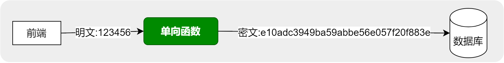
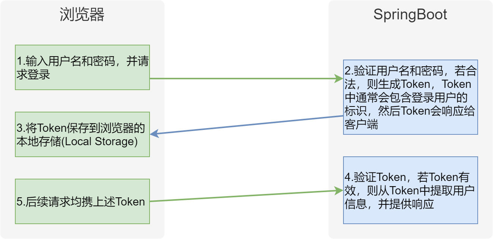
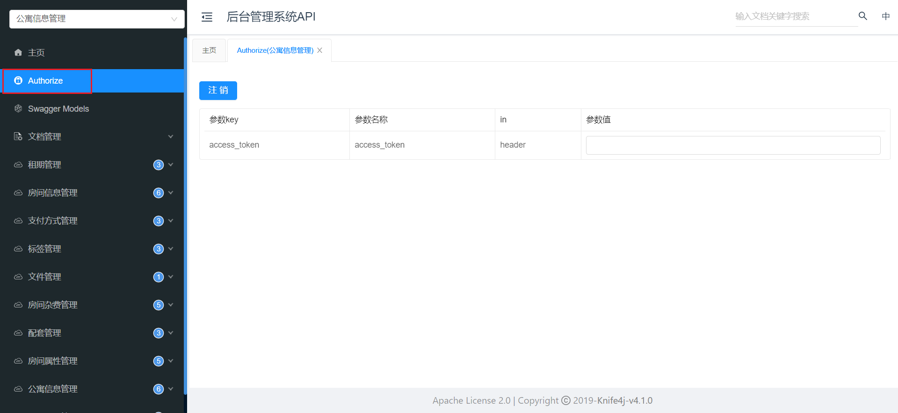

##  尚庭公寓项目/用户以及登录模块

[TOC]

> 租房项目的后台管理功能全部代码实现，后台管理程序!
>
> 共计包含五大模块: **公寓信息管理\租赁信息管理\用户信息管理\系统管理\登录管理**!!!

### 一、平台用户管理

#### 1.1 用户管理介绍

用户管理共包含两个接口，分别是**根据条件分页查询用户列表**和**根据ID更新用户状态**，下面逐一实现！


首先在`UserInfoController`中注入`UserInfoService`，如下

```java
@Tag(name = "用户信息管理")
@RestController
@RequestMapping("/admin/user")
public class UserInfoController {

    @Autowired
    private UserInfoService service;
}
```

#### 1.2 根据条件分页查询用户列表

- **查看请求的数据结构**

  - `current`和`size`为分页相关参数，分别表示**当前所处页面**和**每个页面的记录数**。

  - `UserInfoQueryVo`为用户的查询条件，详细结构如下：

    ```java
    @Schema(description = "用户信息查询实体")
    @Data
    public class UserInfoQueryVo {
    
        @Schema(description = "用户手机号码")
        private String phone;
    
        @Schema(description = "用户账号状态")
        private BaseStatus status;
    }
    ```

- **编写Controller层逻辑**

  在`UserInfoController`中增加如下内容

  ```java
  @Operation(summary = "分页查询用户信息")
  @GetMapping("page")
  public Result<IPage<UserInfo>> pageUserInfo(@RequestParam long current, @RequestParam long size, UserInfoQueryVo queryVo) {
  
      IPage<UserInfo> page = new Page<>(current, size);
      LambdaQueryWrapper<UserInfo> queryWrapper = new LambdaQueryWrapper<>();
      queryWrapper.like(queryVo.getPhone() != null, UserInfo::getPhone, queryVo.getPhone());
      queryWrapper.eq(queryVo.getStatus() != null, UserInfo::getStatus, queryVo.getStatus());
      IPage<UserInfo> list = service.page(page, queryWrapper);
      return Result.ok(list);
  }
  ```
  
  **知识点**：
  
  `password`字段属于敏感信息，因此在查询时应过滤掉，可在`UserInfo`实体的`password`字段的`@TableField`注解中增加一个参数`select=false`来实现。
  
  **注意：** 一旦`@TableField`注解增加一个参数`select=false`，后续的所有查询都无法查询密码！可能会影响登录，所以可以查询的时候，自己编写sql语句，放弃密码列查询！

#### 1.3 根据ID更新用户状态

在`UserInfoController`中增加如下内容

```java
@Operation(summary = "根据用户id更新账号状态")
@PostMapping("updateStatusById")
public Result updateStatusById(@RequestParam Long id, @RequestParam BaseStatus status) {

    LambdaUpdateWrapper<UserInfo> updateWrapper = new LambdaUpdateWrapper<>();
    updateWrapper.eq(UserInfo::getId, id);
    updateWrapper.set(UserInfo::getStatus, status);
    service.update(updateWrapper);
    return Result.ok();
}
```


### 二、系统管理

#### 2.1 岗位管理

##### 2.1.1 后台用户岗位管理介绍

后台用户岗位管理共有六个接口，下面逐一实现


首先在`SystemPostController`中注入`SystemPostService`，如下

```java
@RestController
@Tag(name = "后台用户岗位管理")
@RequestMapping("/admin/system/post")
public class SystemPostController {

    @Autowired
    private SystemPostService service;
}
```

##### 2.1.2 分页查询岗位信息

在`SystemPostController`中增加如下内容

```java
@Operation(summary = "分页获取岗位信息")
@GetMapping("page")
private Result<IPage<SystemPost>> page(@RequestParam long current, @RequestParam long size) {

    IPage<SystemPost> page = new Page<>(current, size);
    IPage<SystemPost> systemPostPage = service.page(page);
    return Result.ok(systemPostPage);
}
```

##### 2.1.3  保存或更新岗位信息

在`SystemPostController`中增加如下内容

```java
@Operation(summary = "保存或更新岗位信息")
@PostMapping("saveOrUpdate")
public Result saveOrUpdate(@RequestBody SystemPost systemPost) {

    service.saveOrUpdate(systemPost);
    return Result.ok();
}
```

##### 2.1.4 根据ID删除岗位信息

在`SystemPostController`中增加如下内容

```java
@DeleteMapping("deleteById")
@Operation(summary = "根据id删除岗位")
public Result removeById(@RequestParam Long id) {

    service.removeById(id);
    return Result.ok();
}
```

##### 2.1.5 获取全部岗位列表

在`SystemPostController`增加入下内容

```java
@Operation(summary = "获取全部岗位列表")
@GetMapping("list")
public Result<List<SystemPost>> list() {
    List<SystemPost> list = service.list();
    return Result.ok(list);
}
```

##### 2.1.6 根据ID获取岗位信息

在`SystemPostController`中增加如下内容

```java
@GetMapping("getById")
@Operation(summary = "根据id获取岗位信息")
public Result<SystemPost> getById(@RequestParam Long id) {
    SystemPost systemPost = service.getById(id);
    return Result.ok(systemPost);
}
```

##### 2.1.7 根据ID修改岗位状态

在`SystemPostController`中增加如下内容

```java
@Operation(summary = "根据岗位id修改状态")
@PostMapping("updateStatusByPostId")
public Result updateStatusByPostId(@RequestParam Long id, @RequestParam BaseStatus status) {
    LambdaUpdateWrapper<SystemPost> updateWrapper = new LambdaUpdateWrapper<>();
    updateWrapper.eq(SystemPost::getId, id);
    updateWrapper.set(SystemPost::getStatus, status);
    service.update(updateWrapper);
    return Result.ok();    
}
```

#### 2.2 后台用户管理

##### 2.2.1 后台用户信息管理介绍

后台用户信息管理共有六个接口，下面逐一实现


首先在`SystemUserController`中注入`SystemUserService`，如下

```java
@Tag(name = "后台用户信息管理")
@RestController
@RequestMapping("/admin/system/user")
public class SystemUserController {

    @Autowired
    SystemUserService service;
}
```

##### 2.2.2 根据条件分页查询后台用户列表

- **查看请求和响应的数据结构**

  - **请求的数据结构**

    - `current`和`size`为分页相关参数，分别表示**当前所处页面**和**每个页面的记录数**。

    - `SystemUserQueryVo`为房间的查询条件，详细结构如下：

      ```java
      @Data
      @Schema(description = "员工查询实体")
      public class SystemUserQueryVo {
      
          @Schema(description= "员工姓名")
          private String name;
      
          @Schema(description= "手机号码")
          private String phone;
      }
      ```

  - **响应的数据结构**

    单个系统用户信息的结构可查看**web-admin**模块下的`com.atguigu.lease.web.admin.vo.system.user.SystemUserItemVo`，具体内容如下：

    ```java
    @Data
    @Schema(description = "后台管理系统用户基本信息实体")
    public class SystemUserItemVo extends SystemUser {
    
        @Schema(description = "岗位名称")
        @TableField(value = "post_name")
        private String postName;
    }
    ```

- **编写Controller层逻辑**

  在`SystemUserController`中增加如下内容

  ```java
  @Operation(summary = "根据条件分页查询后台用户列表")
  @GetMapping("page")
  public Result<IPage<SystemUserItemVo>> page(@RequestParam long current, @RequestParam long size, SystemUserQueryVo queryVo) {
      IPage<SystemUser> page = new Page<>(current, size);
      IPage<SystemUserItemVo> systemUserPage = service.pageSystemUserByQuery(page, queryVo);
      return Result.ok(systemUserPage);
  }
  ```

- **编写Service层逻辑**

  - 在`SystemUserService`中增加如下内容

    ```java
    IPage<SystemUserItemVo> pageSystemUserByQuery(IPage<SystemUser> page, SystemUserQueryVo queryVo);
    ```

  - 在`SystemUserServiceImpl`中增加如下内容

    ```java
    @Override
    public IPage<SystemUserItemVo> pageSystemUserByQuery(IPage<SystemUser> page, SystemUserQueryVo queryVo) {
        return systemUserMapper.pageSystemUserByQuery(page, queryVo);
    }
    ```

- **编写Mapper层逻辑**

  - 在`SystemUserMapper`中增加如下内容

    ```java
    IPage<SystemUserItemVo> pageSystemUserByQuery(IPage<SystemUser> page, SystemUserQueryVo queryVo);
    ```

  - 在`SystemUserMapper.xml`中增加如下内容

    ```java
    <select id="pageSystemUserByQuery"
            resultType="com.atguigu.lease.web.admin.vo.system.user.SystemUserItemVo">
        select su.id,
               username,
               su.name,
               type,
               phone,
               avatar_url,
               additional_info,
               post_id,
               sp.name post_name
        from system_user su
                 left join system_post sp on su.post_id = sp.id and sp.is_deleted = 0
        <where>
            su.is_deleted = 0
            <if test="queryVo.name != null and queryVo.name != ''">
                and su.name like concat('%',#{queryVo.name},'%')
            </if>
            <if test="queryVo.phone !=null and queryVo.phone != ''">
                and su.phone like concat('%',#{queryVo.phone},'%')
            </if>
        </where>
    </select>
    ```
    
    **知识点**
    
    `password`字段不要查询。

##### 2.2.3 根据ID查询后台用户信息

- **编写Controller层逻辑**

  在`SystemUserController`中增加如下内容

  ```java
  @Operation(summary = "根据ID查询后台用户信息")
  @GetMapping("getById")
  public Result<SystemUserItemVo> getById(@RequestParam Long id) {
  
      SystemUserItemVo systemUser = service.getSystemUserById(id);
      return Result.ok(systemUser);
  }
  ```

- **编写Service层逻辑**

  - 在`SystemUserServcie`中增加如下内容

    ```java
    SystemUserItemVo getSystemUserById(Long id);
    ```

  - 在`SystemUserServcieImpl`中增加如下内容

    ```java
    @Override
    public SystemUserItemVo getSystemUserById(Long id) {
    
        SystemUser systemUser = getById(id);
        systemUser.setPassword(null);
        //密码是会查询到的!  select = false | mapper service password = null | 自定义方法 select 不写password
        SystemPost systemPost = systemPostService.getById(systemUser.getPostId());
    
        SystemUserItemVo systemUserItemVo = new SystemUserItemVo();
        BeanUtils.copyProperties(systemUser,systemUserItemVo);
        systemUserItemVo.setPostName(systemPost.getName());
        return systemUserItemVo;
    }
    ```
    
    **知识点**
    
    `system_user`表中的`password`字段不应查询，需要在`SystemUser`的`password`字段的`@TableField`注解中增加`select=false`参数。

##### 2.2.4 保存或更新后台用户信息

- **编写Controller层逻辑**

  在`SystemUserController`中增加如下内容

  ```java
  @Operation(summary = "保存或更新后台用户信息")
  @PostMapping("saveOrUpdate")
  public Result saveOrUpdate(@RequestBody SystemUser systemUser) {
      //添加用户检查
      if(systemUser.getPassword() != null){
          systemUser.setPassword(DigestUtils.md5Hex(systemUser.getPassword()));
      }
      service.saveOrUpdate(systemUser);
      return Result.ok();
  }
  ```

**知识点**：

- **密码处理**
  
  用户的密码通常不会直接以明文的形式保存到数据库中，而是会先经过处理，然后将处理之后得到的"密文"保存到数据库，这样能够降低数据库泄漏导致的用户账号安全问题。
  
  密码通常会使用一些单向函数进行处理，如下图所示
  
  
  
  常用于处理密码的单向函数（算法）有MD5、SHA-256等，**Apache Commons**提供了一个工具类`DigestUtils`，其中就包含上述算法的实现。
  
  > **Apache Commons**是Apache软件基金会下的一个项目，其致力于提供可重用的开源软件，其中包含了很多易于使用的现成工具。
  
  使用该工具类需引入`commons-codec`依赖，在**common模块**的pom.xml中增加如下内容
  
    ```xml
    <dependency>
        <groupId>commons-codec</groupId>
        <artifactId>commons-codec</artifactId>
    </dependency>
    ```

- **Mybatis-Plus update strategy**
  
  使用Mybatis-Plus提供的更新方法时，若实体中的字段为`null`，默认情况下，最终生成的update语句中，不会包含该字段。若想改变默认行为，可做以下配置。
  
  - 全局配置
  
    在`application.yml`中配置如下参数
  
      ```xml
      mybatis-plus:
        global-config:
          db-config:
            update-strategy: <strategy>
      ```
  
    **注**：上述`<strategy>`可选值有：`ignore`、`not_null`、`not_empty`、`never`，默认值为`not_null`
  
    - `ignore`：忽略空值判断，不管字段是否为空，都会进行更新
  
    - `not_null`：进行非空判断，字段非空才会进行更新
  
    - `not_empty`：进行非空判断，并进行非空串（""）判断，主要针对字符串类型
  
    - `never`：从不进行更新，不管该字段为何值，都不更新
  
  - 局部配置
  
    在实体类中的具体字段通过`@TableField`注解进行配置，如下：
  
      ```java
      @Schema(description = "密码")
      @TableField(value = "password", updateStrategy = FieldStrategy.NOT_EMPTY)
      private String password;
      ```

##### 2.2.5 判断后台用户名是否可用

在`SystemUserController`中增加如下内容

```java
@Operation(summary = "判断后台用户名是否可用")
@GetMapping("isUserNameAvailable")
public Result<Boolean> isUsernameExists(@RequestParam String username) {
    LambdaQueryWrapper<SystemUser> queryWrapper = new LambdaQueryWrapper<>();
    queryWrapper.eq(SystemUser::getUsername, username);
    long count = service.count(queryWrapper);
    return Result.ok(count == 0);
}
```
##### 2.2.6 根据ID删除后台用户信息

在`SystemUserController`中增加如下内容

```java
@DeleteMapping("deleteById")
@Operation(summary = "根据ID删除后台用户信息")
public Result removeById(@RequestParam Long id) {
    service.removeById(id);
    return Result.ok();
}
```

##### 2.2.7 根据ID修改后台用户状态

在`SystemUserController`中增加如下内容

```java
@Operation(summary = "根据ID修改后台用户状态")
@PostMapping("updateStatusByUserId")
public Result updateStatusByUserId(@RequestParam Long id, @RequestParam BaseStatus status) {
    LambdaUpdateWrapper<SystemUser> updateWrapper = new LambdaUpdateWrapper<>();
    updateWrapper.eq(SystemUser::getId, id);
    updateWrapper.set(SystemUser::getStatus, status);
    service.update(updateWrapper);
    return Result.ok();
}
```


### 三、后台管理登录

#### 3.1 背景知识

**1. 认证方案概述**

有两种常见的认证方案，分别是基于**Session**的认证和基于**Token**的认证，下面逐一进行介绍

- **基于Session**

  基于Session的认证流程如下图所示

  

  该方案的特点

  - 登录用户信息保存在服务端内存中，若访问量增加，单台节点压力会较大
  - 随用户规模增大，若后台升级为集群，则需要解决集群中各服务器登录状态共享的问题。

- **基于Token（令牌）**

  基于Token的认证流程如下图所示

  

  该方案的特点

  - 登录状态保存在客户端，服务器没有存储开销
  - 客户端发起的每个请求自身均携带登录状态，所以即使后台为集群，也不会面临登录状态共享的问题。

**2. Token详解**

(Token)**令牌**是一个代表用户身份和权限的字符串，用于在客户端和服务器之间进行身份验证和授权。令牌可以是任何形式的字符串，由服务器生成并在客户端存储。令牌可以包含有关用户身份、访问权限、过期时间等信息。

我们所说的Token，通常指**JWT**（JSON Web TOKEN）。JWT是一种轻量级的安全传输方式，用于在两个实体之间传递信息，通常用于身份验证和信息传递。

JWT是一个字符串，如下图所示，该字符串由三部分组成，三部分由`.`分隔。三个部分分别被称为

- `header`（头部）：可以携带算法名称，JWT版本信息等
- `payload`（负载）： token是可以携带一些信息，账号 账号id等
- `signature`（签名）: 用于验证真伪。


各部分的作用如下

- **Header（头部）**

  Header部分是由一个JSON对象经过`base64url`编码得到的，这个JSON对象用于保存JWT 的类型（`type`）、签名算法（`alg`）等元信息，例如

  ```json
  {
    "alg": "HS256",
    "typ": "JWT"
  }
  ```

- **Payload（负载）**

  也称为 Claims（声明），也是由一个JSON对象经过`base64url`编码得到的，用于保存要传递的具体信息。JWT规范定义了7个官方字段，如下：

  - iss (issuer)：签发人
  - exp (expiration time)：过期时间
  - sub (subject)：主题
  - aud (audience)：受众
  - nbf (Not Before)：生效时间
  - iat (Issued At)：签发时间
  - jti (JWT ID)：编号

  除此之外，我们还可以自定义任何字段，例如

  ```json
  {
    "sub": "1234567890",
    "name": "John Doe",
    "iat": 1516239022
  }
  ```

- **Signature（签名）**

  由头部、负载和秘钥一起经过（header中指定的签名算法）计算得到的一个字符串，用于防止消息被篡改。

#### 3.2 登录流程

后台管理系统的登录流程如下图所示



根据上述登录流程，可分析出，登录管理共需三个接口，分别是**获取图形验证码**、**登录**、**获取登录用户个人信息**，除此之外，我们还需为所有受保护的接口增加验证JWT合法性的逻辑，这一功能可通过`HandlerInterceptor`来实现。

#### 3.3 接口开发

首先在`LoginController`中注入`LoginService`，如下

```java
@Tag(name = "后台管理系统登录管理")
@RestController
@RequestMapping("/admin")
public class LoginController {

    @Autowired
    private LoginService service;
}
```

##### 3.3.1 获取图形验证码

- **查看响应的数据结构**

  查看**web-admin模块**下的`com.atguigu.lease.web.admin.vo.login.CaptchaVo`，内容如下

  ```java
  @Data
  @Schema(description = "图像验证码")
  @AllArgsConstructor
  public class CaptchaVo {
  
      @Schema(description="验证码图片信息")
      private String image;
  
      @Schema(description="验证码key")
      private String key;
  }
  ```

- **配置所需依赖**

  - **验证码生成工具**

    本项目使用开源的验证码生成工具**EasyCaptcha**，其支持多种类型的验证码，例如gif、中文、算术等，并且简单易用，具体内容可参考其[官方文档](https://gitee.com/ele-admin/EasyCaptcha)。

    在**common模块**的pom.xml文件中增加如下内容

    ```xml
    <dependency>
        <groupId>com.github.whvcse</groupId>
        <artifactId>easy-captcha</artifactId>
    </dependency>
    ```

  - **Redis**

    在**common模块**的pom.xml中增加如下内容

    ```xml
    <dependency>
        <groupId>org.springframework.boot</groupId>
        <artifactId>spring-boot-starter-data-redis</artifactId>
    </dependency>
    ```

    在`application.yml`中增加如下配置

    ```yml
    spring:
      data:
        redis:
          host: <hostname>
          port: <port>
          database: 0
    ```

    **注意**：上述`hostname`和`port`需根据实际情况进行修改

- **编写Controller层逻辑**

  在`LoginController`中增加如下内容

  ```java
  @Operation(summary = "获取图形验证码")
  @GetMapping("login/captcha")
  public Result<CaptchaVo> getCaptcha() {
      CaptchaVo captcha = service.getCaptcha();
      return Result.ok(captcha);
  }
  ```

- **编写Service层逻辑**

  - 在`LoginService`中增加如下内容

    ```java
    CaptchaVo getCaptcha();
    ```

  - 在`LoginServiceImpl`中增加如下内容

    ```java
    @Autowired
    private StringRedisTemplate redisTemplate;
    
    @Override
    public CaptchaVo getCaptcha() {
        SpecCaptcha specCaptcha = new SpecCaptcha(130, 48, 4);
        specCaptcha.setCharType(Captcha.TYPE_DEFAULT);
    
        String code = specCaptcha.text().toLowerCase();
        String key = RedisConstant.ADMIN_LOGIN_PREFIX + UUID.randomUUID();
        String image = specCaptcha.toBase64();
        redisTemplate.opsForValue().set(key, code, RedisConstant.ADMIN_LOGIN_CAPTCHA_TTL_SEC, TimeUnit.SECONDS);
    
        return new CaptchaVo(image, key);
    }
    ```

     **知识点**：

    - `spring-boot-starter-data-redis`已经完成了`StringRedisTemplate`的自动配置，我们直接注入即可。

    - 为方便管理，可以将Reids相关的一些值定义为常量，例如key的前缀、TTL时长，内容如下。大家可将这些常量统一定义在**common模块**下的`com.atguigu.lease.common.constant.RedisConstant`类中

        ```java
        public class RedisConstant {
            public static final String ADMIN_LOGIN_PREFIX = "admin:login:";
            public static final Integer ADMIN_LOGIN_CAPTCHA_TTL_SEC = 60;
            public static final String APP_LOGIN_PREFIX = "app:login:";
            public static final Integer APP_LOGIN_CODE_RESEND_TIME_SEC = 60;
            public static final Integer APP_LOGIN_CODE_TTL_SEC = 60 * 10;
        }
        ```

##### 3.3.2 登录接口

- **登录校验逻辑**

  用户登录的校验逻辑分为三个主要步骤，分别是**校验验证码**，**校验用户状态**和**校验密码**，具体逻辑如下

  - 前端发送`username`、`password`、`captchaKey`、`captchaCode`请求登录。
  - 判断`captchaCode`是否为空，若为空，则直接响应`验证码为空`；若不为空进行下一步判断。
  - 根据`captchaKey`从Redis中查询之前保存的`code`，若查询出来的`code`为空，则直接响应`验证码已过期`；若不为空进行下一步判断。
  - 比较`captchaCode`和`code`，若不相同，则直接响应`验证码不正确`；若相同则进行下一步判断。
  - 根据`username`查询数据库，若查询结果为空，则直接响应`账号不存在`；若不为空则进行下一步判断。
  - 查看用户状态，判断是否被禁用，若禁用，则直接响应`账号被禁`；若未被禁用，则进行下一步判断。
  - 比对`password`和数据库中查询的密码，若不一致，则直接响应`账号或密码错误`，若一致则进行入最后一步。
  - 创建JWT，并响应给浏览器。
  
- **接口逻辑实现**

  - **查看请求数据结构**

    查看**web-admin**模块下的`com.atguigu.lease.web.admin.vo.login.LoginVo`，具体内容如下

    ```java
    @Data
    @Schema(description = "后台管理系统登录信息")
    public class LoginVo {
    
        @Schema(description="用户名")
        private String username;
    
        @Schema(description="密码")
        private String password;
    
        @Schema(description="验证码key")
        private String captchaKey;
    
        @Schema(description="验证码code")
        private String captchaCode;
    }
    ```
    
  - **配置所需依赖**
  
    登录接口需要为登录成功的用户创建并返回JWT，本项目使用开源的JWT工具**Java-JWT**，配置如下，具体内容可参考[官方文档](https://github.com/jwtk/jjwt)。
  
    - **引入Maven依赖**
  
      在**common模块**的pom.xml文件中增加如下内容
  
      ```xml
      <dependency>
          <groupId>io.jsonwebtoken</groupId>
          <artifactId>jjwt-api</artifactId>
      </dependency>
      
      <dependency>
          <groupId>io.jsonwebtoken</groupId>
          <artifactId>jjwt-impl</artifactId>
          <scope>runtime</scope>
      </dependency>
      
      <dependency>
          <groupId>io.jsonwebtoken</groupId>
          <artifactId>jjwt-jackson</artifactId>
          <scope>runtime</scope>
      </dependency>
      
      <dependency>
          <groupId>commons-codec</groupId>
          <artifactId>commons-codec</artifactId>
      </dependency>
      ```
  
    - **创建JWT工具类**
  
      在**common模块**下创建`com.atguigu.lease.common.utils.JwtUtil`工具类，内容如下
  
      ```java
      public class JwtUtil {
      
          private static long tokenExpiration = 60 * 60 * 1000L;
          private static SecretKey tokenSignKey = Keys.hmacShaKeyFor("M0PKKI6pYGVWWfDZw90a0lTpGYX1d4AQ".getBytes());
      
          public static String createToken(Long userId, String username) {
              String token = Jwts.builder().
                      setSubject("USER_INFO").
                      setExpiration(new Date(System.currentTimeMillis() + tokenExpiration)).
                      claim("userId", userId).
                      claim("username", username).
                      signWith(tokenSignKey).
                      compressWith(CompressionCodecs.GZIP).
                      compact();
              return token;
          }
      
          public static Claims parseToken(String token) {
              try {
                  Jws<Claims> claimsJws = Jwts.parserBuilder().
                          setSigningKey(tokenSignKey).
                          build().parseClaimsJws(token);
                  return claimsJws.getBody();
      
              } catch (ExpiredJwtException e) {
                  throw new LeaseException(ResultCodeEnum.PARAM_ERROR.getCode(), ResultCodeEnum.TOKEN_EXPIRED.getMessage());
              } catch (JwtException e) {
                  throw new LeaseException(ResultCodeEnum.TOKEN_INVALID.getCode(), ResultCodeEnum.TOKEN_INVALID.getMessage());
              }
          }
      }
      ```
  
  - **编写Controller层逻辑**
  
    在`LoginController`中增加如下内容
  
    ```java
    @Operation(summary = "登录")
    @PostMapping("login")
    public Result<String> login(@RequestBody LoginVo loginVo) {
        String token = service.login(loginVo);
        return Result.ok(token);
    }
    ```
  
  - **编写Service层逻辑**
  
    - 在`LoginService`中增加如下内容
  
      ```java
      String login(LoginVo loginVo);
      ```
  
    - 在`LoginServiceImpl`中增加如下内容
  
      ```java
      @Override
      public String login(LoginVo loginVo) {
          //1.判断是否输入了验证码
          if (!StringUtils.hasText(loginVo.getCaptchaCode())) {
              throw new LeaseException(ResultCodeEnum.ADMIN_CAPTCHA_CODE_NOT_FOUND);
          }
      
          //2.校验验证码
          String code = redisTemplate.opsForValue().get(loginVo.getCaptchaKey());
          if (code == null) {
              throw new LeaseException(ResultCodeEnum.ADMIN_CAPTCHA_CODE_EXPIRED);
          }
      
          if (!code.equals(loginVo.getCaptchaCode().toLowerCase())) {
              throw new LeaseException(ResultCodeEnum.ADMIN_CAPTCHA_CODE_ERROR);
          }
      
          //3.校验用户是否存在
          LambdaQueryWrapper<SystemUser> queryWrapper = new LambdaQueryWrapper<>();
          queryWrapper.eq(SystemUser::getUsername, loginVo.getUsername());
          SystemUser systemUser = systemUserMapper.selectOne(queryWrapper);
          if (systemUser == null) {
              throw new LeaseException(ResultCodeEnum.ADMIN_ACCOUNT_NOT_EXIST_ERROR);
          }
      
          //4.校验用户是否被禁
          if (systemUser.getStatus() == BaseStatus.DISABLE) {
              throw new LeaseException(ResultCodeEnum.ADMIN_ACCOUNT_DISABLED_ERROR);
          }
      
          //5.校验用户密码
          if (!systemUser.getPassword().equals(DigestUtils.md5Hex(loginVo.getPassword()))) {
              throw new LeaseException(ResultCodeEnum.ADMIN_ACCOUNT_ERROR);
          }
      
          //6.创建并返回TOKEN
          return JwtUtil.createToken(systemUser.getId(), systemUser.getUsername());
      }
      ```
  
  - **编写HandlerInterceptor**
  
    我们需要为所有受保护的接口增加校验JWT合法性的逻辑，否则，登录功能将没有任何意义。具体实现如下，有关`HanderInterceptor`的相关内容，可参考[官方文档](https://docs.spring.io/spring-framework/reference/web/webmvc/mvc-servlet/handlermapping-interceptor.html)。
  
    - **编写HandlerInterceptor**
  
      在**web-admin模块**中创建`com.atguigu.lease.web.admin.custom.interceptor.AuthenticationInterceptor`类，内容如下
  
      ```java
      @Component
      public class AuthenticationInterceptor implements HandlerInterceptor {
      
          @Override
          public boolean preHandle(HttpServletRequest request, HttpServletResponse response, Object handler) throws Exception {
              String token = request.getHeader("access_token");
      
              if (token == null) {
                  throw new LeaseException(ResultCodeEnum.ADMIN_LOGIN_AUTH);
              } else {
                  JwtUtil.parseToken(token);
              }
              return true;
          }
      }
      ```
  
      **注意**：
  
      我们约定，前端登录后，后续请求都将JWT，放置于HTTP请求的Header中，其Header的key为`access_token`。
  
    - **注册HandlerInterceptor**
  
      在**web-admin模块**的`com.atguigu.lease.web.admin.custom.config.WebMvcConfiguration`中增加如下内容
  
      ```java
      @Autowired
      private AuthenticationInterceptor authenticationInterceptor;
      
      @Value("${admin.auth.path-patterns.include}")
      private String[] includePathPatterns;
      
      @Value("${admin.auth.path-patterns.exclude}")
      private String[] excludePathPatterns;
      
      @Override
      public void addInterceptors(InterceptorRegistry registry) {
          registry.addInterceptor(this.authenticationInterceptor).addPathPatterns(includePathPatterns).excludePathPatterns(excludePathPatterns);
      }
      ```
  
    - 在`application.yml`中增加拦截器匹配和排除的接口路径，如下
  
      ```yml
      admin:
        auth:
          path-patterns:
            include: /admin/**
            exclude: /admin/login/**
      ```
    
  - **Knife4j配置**
  
    在编写完上述的登录认证逻辑后，使用Knife4j访问接口时，也同样需要进行认证。认证的相关配置如下
  
    修改**web-admin模块**下的`com.atguigu.lease.web.admin.custom.config.Knife4jConfiguration`，修改之后的内容如下
  
    ```java
    package com.atguigu.lease.web.admin.custom.config;
    
    import io.swagger.v3.oas.models.Components;
    import io.swagger.v3.oas.models.OpenAPI;
    import io.swagger.v3.oas.models.info.Info;
    import io.swagger.v3.oas.models.info.License;
    import io.swagger.v3.oas.models.security.SecurityRequirement;
    import io.swagger.v3.oas.models.security.SecurityScheme;
    import org.springdoc.core.models.GroupedOpenApi;
    import org.springframework.context.annotation.Bean;
    import org.springframework.context.annotation.Configuration;
    
    import javax.swing.*;
    
    @Configuration
    public class Knife4jConfiguration {
    
        @Bean
        public OpenAPI customOpenAPI() {
    
            return new OpenAPI()
                    .info(new Info()
                            .title("后台管理系统API")
                            .version("1.0")
                            .description("后台管理系统API")
                            .termsOfService("http://doc.xiaominfo.com")
                            .license(new License().name("Apache 2.0").url("http://doc.xiaominfo.com")))
                    .components(new Components().addSecuritySchemes("access_token", new SecurityScheme().type(SecurityScheme.Type.APIKEY).in(SecurityScheme.In.HEADER).name("access_token")));
        }
    
        @Bean
        public GroupedOpenApi systemAPI() {
    
            return GroupedOpenApi.builder().group("系统信息管理").
                    addOperationCustomizer((operation, handlerMethod) -> operation.addSecurityItem(new SecurityRequirement().addList("access_token"))).
                    pathsToMatch(
                            "/admin/system/**"
                    ).
                    build();
        }
    
        @Bean
        public GroupedOpenApi loginAPI() {
            return GroupedOpenApi.builder().group("登录管理").
                    addOperationCustomizer((operation, handlerMethod) -> operation.addSecurityItem(new SecurityRequirement().addList("access_token"))).
                    pathsToMatch(
                            "/admin/login/**",
                            "/admin/info").
                    build();
        }
    
        @Bean
        public GroupedOpenApi apartmentAPI() {
    
            return GroupedOpenApi.builder().group("公寓信息管理").
                    addOperationCustomizer((operation, handlerMethod) -> operation.addSecurityItem(new SecurityRequirement().addList("access_token"))).
                    pathsToMatch(
                            "/admin/apartment/**",
                            "/admin/room/**",
                            "/admin/label/**",
                            "/admin/facility/**",
                            "/admin/fee/**",
                            "/admin/attr/**",
                            "/admin/payment/**",
                            "/admin/region/**",
                            "/admin/term/**",
                            "/admin/file/**"
                    ).build();
        }
    
        @Bean
        public GroupedOpenApi leaseAPI() {
            return GroupedOpenApi.builder().group("租赁信息管理").
                    addOperationCustomizer((operation, handlerMethod) -> operation.addSecurityItem(new SecurityRequirement().addList("access_token"))).
                    pathsToMatch(
                            "/admin/appointment/**",
                            "/admin/agreement/**"
                    ).build();
        }
    
        @Bean
        public GroupedOpenApi userAPI() {
            return GroupedOpenApi.builder().group("平台用户管理").
                    addOperationCustomizer((operation, handlerMethod) -> operation.addSecurityItem(new SecurityRequirement().addList("access_token"))).
                    pathsToMatch(
                            "/admin/user/**"
                    ).build();
        }
    }
    ```
  
    重启项目再访问Knife4j页面，观察是否出现认证模块
  
    
  
    获取一个长期有效的Token（方便后序测试）填入上图中的`参数值`。刷新页面，任选一个接口进行调试，会发现发送请求时会自动携带该header，如下图所示
  
    

##### 3.3.3 获取登录用户个人信息

- **查看请求和响应的数据结构**

  - **响应的数据结构**

    查看**web-admin模块**下的`com.atguigu.lease.web.admin.vo.system.user.SystemUserInfoVo`，内容如下

    ```java
    @Schema(description = "员工基本信息")
    @Data
    public class SystemUserInfoVo {
    
        @Schema(description = "用户姓名")
        private String name;
    
        @Schema(description = "用户头像")
        private String avatarUrl;
    }
    ```

  - **请求的数据结构**

    按理说，前端若想获取当前登录用户的个人信息，需要传递当前用户的`id`到后端进行查询。但是由于请求中携带的JWT中就包含了当前登录用户的`id`，故请求个人信息时，就无需再传递`id`，我们可直接从Header中获取`access_token`再进行解析，进而得到用户的`id`，示例代码如下：

    ```java
    @Operation(summary = "获取登陆用户个人信息")
    @GetMapping("info")
    public Result<SystemUserInfoVo> info(@RequestHeader("access_token") String token) {
        Long id = JwtUtil.parseToken(token).get("userId",Long.class);
        ......
    }
    ```

- **使用ThreadLocal保存当前登录用户的信息**

  由于配置了`AuthenticationInterceptor`，所以类似的接口被调用时，JWT都会被重复的解析两次，一次是在拦截器中，一次是在`Controller`中。

  为了避免重复解析，也为了方便使用当前登录用户的信息。我们可以修改一下`AuthenticationInterceptor`的逻辑，在解析完JWT后，将得到的用户信息保存到线程本地变量`ThreadLocal`中，由于Spring MVC中每个请求的处理流程都是在单个线程中完成的，所以将登陆用户的信息放置于`ThreadLocal`中后，我们在`Controller`、`Service`中都可以十分方便的获取到。

  具体实现如下：

  - **定义登陆用户信息实体**

    在**common模块**中创建`com.atguigu.lease.common.context.LoginUser`类，内容如下

    ```java
    @Data
    @AllArgsConstructor
    @NoArgsConstructor
    public class LoginUser {
    
        private Long userId;
        private String username;
    }
    ```

  - **定义ThreadLocal工具类**

    在**common模块**中创建`com.atguigu.lease.common.context.LoginUserContext`类，内容如下

    ```java
    public class LoginUserContext {
    
        private static final ThreadLocal<LoginUser> userThreadLocal = new ThreadLocal<>();
    
        public static void setLoginUser(LoginUser loginUser) {
            userThreadLocal.set(loginUser);
        }
    
        public static LoginUser getLoginUser() {
            return userThreadLocal.get();
        }
    
        public static void clear() {
            userThreadLocal.remove();
        }
    }
    ```

  - **修改AuthenticationInterceptor**

    修改**web-admin模块**下的，修改后的内容如下

    ```java
    @Component
    @Slf4j
    public class AuthenticationInterceptor implements HandlerInterceptor {
    
        @Override
        public boolean preHandle(HttpServletRequest request, HttpServletResponse response, Object handler) throws Exception {
            String token = request.getHeader("access_token");
    
            if (token == null) {
                throw new LeaseException(ResultCodeEnum.ADMIN_LOGIN_AUTH);
            } else {
                Claims claims = JwtUtil.parseToken(token);
                Long userId = claims.get("userId", Long.class);
                String username = claims.get("username", String.class);
                LoginUserContext.setLoginUser(new LoginUser(userId, username));
            }
            return true;
        }
    
        @Override
        public void afterCompletion(HttpServletRequest request, HttpServletResponse response, Object handler, Exception ex) throws Exception {
            LoginUserContext.clear();
        }
    }
    ```

* 完善获取个人信息代码

  * controller

    ``` java
    @Operation(summary = "获取登陆用户个人信息")
    @GetMapping("info")
    public Result<SystemUserInfoVo> info() {
        SystemUserInfoVo user = service.getSystemUserInfoById(LoginUserContext.getLoginUser().getUserId());
        return Result.ok(user);
     }
    ```

  * service

    ``` java
    @Override
    public SystemUserInfoVo getSystemUserInfoById(Long userId) {
    	SystemUser systemUser = systemUserMapper.selectById(userId);
    	SystemUserInfoVo systemUserInfoVo = new SystemUserInfoVo();
    	systemUserInfoVo.setName(systemUser.getName());
    	systemUserInfoVo.setAvatarUrl(systemUser.getAvatarUrl());
    	return systemUserInfoVo;
    }
    ```

    

### 四、后台管理系统前后端联调

#### 4.1 启动后端项目

启动后端项目，供前端调用接口。

#### 4.2 启动前端项目

1. **部署node**

   node的部署比较简单，拿到安装包后按照安装向导操作即可，本项目安装的node版本为`node-18.17.1`。

2. **配置npm国内镜像**

   为加速npm下载依赖，可以为npm配置国内镜像，在终端执行以下命令为npm配置阿里云镜像。

   ```bash
   npm config set registry https://registry.npmmirror.com
   ```

   若想取消上述配置，可在终端执行以下命令删除镜像，删除后将恢复默认配置。

   ```bash
   npm config delete registry
   ```

3. **配置导入前端项目**

   将后台管理系统的前端项目导入`vscode`或者`WebStorm`，打开终端，在项目根目录，也就是`package.json`文件所在的目录执行以下命令，安装所需依赖

   ```bash
   npm install
   ```

4. **配置后端接口地址**

   修改`.env.development`文件中的`VITE_APP_BASE_URL`变量的值为后端接口的地址，此处改为`http://localhost:8080`即可,如下

   ```ini
   VITE_APP_BASE_URL='http://localhost:8080'
   ```

   **注意**：

   上述主机名和端口号需要根据实际情况进行修改。

5. **启动前端项目**

   上述配置完成之后，便可执行以下命令启动前端项目了

   ```bash
   npm run dev
   ```

6. **访问前端项目**

   在浏览器中访问前端项目，并逐个测试每个页面的相关功能。

