## 尚庭公寓项目/移动端实战

[TOC]

### 一、移动后台项目初始配置

某些初始化配置可以同后台管理系统共用，此处不在罗列，下面只包含必要内容。

#### 1.1 SpringBoot配置

**1. 创建application.yml文件**

在**web-app模块**的`src/main/resources`目录下创建`application.yml`配置文件，内容如下：

```yaml
server:
  port: 8081
```

**2. 创建SpringBoot启动类**

在**web-app模块**下创建`com.atguigu.lease.AppWebApplication`类，内容如下：

```java
@SpringBootApplication
public class AppWebApplication {
    public static void main(String[] args) {
        SpringApplication.run(AppWebApplication.class);
    }
}
```

#### 1.2 Mybatis-Plus配置

在web-admin模块的application.yml文件增加如下内容：

```yaml
spring:
  datasource:
    type: com.zaxxer.hikari.HikariDataSource
    url: jdbc:mysql://<hostname>:<port>/<database>?useUnicode=true&characterEncoding=utf-8&useSSL=false&allowPublicKeyRetrieval=true&serverTimezone=GMT%2b8
    username: <username>
    password: <password>
    hikari:
      connection-test-query: SELECT 1 # 自动检测连接
      connection-timeout: 60000 #数据库连接超时时间,默认30秒
      idle-timeout: 500000 #空闲连接存活最大时间，默认600000（10分钟）
      max-lifetime: 540000 #此属性控制池中连接的最长生命周期，值0表示无限生命周期，默认1800000即30分钟
      maximum-pool-size: 12 #连接池最大连接数，默认是10
      minimum-idle: 10 #最小空闲连接数量
      pool-name: SPHHikariPool # 连接池名称
      
#用于打印框架生成的sql语句，便于调试
mybatis-plus:
  configuration:
    log-impl: org.apache.ibatis.logging.stdout.StdOutImpl
```

**注意**：需根据实际情况修改`hostname`、`port`、`database`、`username`、`password`。

#### 1.3 Knife4j配置

**1. 配置类**

在**web-app模块**下创建`com.atguigu.lease.web.app.custom.config.Knife4jConfiguration`类，内容如下：

```java
@Configuration
public class Knife4jConfiguration {

    @Bean
    public OpenAPI customOpenAPI() {
        return new OpenAPI()
                .info(new Info()
                        .title("APP接口")
                        .version("1.0")
                        .description("用户端APP接口")
                        .termsOfService("http://doc.xiaominfo.com")
                        .license(new License().name("Apache 2.0")
                                .url("http://doc.xiaominfo.com")));
    }

    @Bean
    public GroupedOpenApi userAPI() {
        return GroupedOpenApi.builder().group("用户信息").
                pathsToMatch("/app/user/**").
                build();
    }

    @Bean
    public GroupedOpenApi loginAPI() {
        return GroupedOpenApi.builder().group("登录信息").
                pathsToMatch("/app/login/**", "/app/info").
                build();
    }

    @Bean
    public GroupedOpenApi personAPI() {
        return GroupedOpenApi.builder().group("个人信息").
                pathsToMatch(
                        "/app/history/**",
                        "/app/appointment/**",
                        "/app/agreement/**"
                ).
                build();
    }

    @Bean
    public GroupedOpenApi lookForRoomAPI() {
        return GroupedOpenApi.builder().group("找房信息").
                pathsToMatch(
                        "/app/apartment/**",
                        "/app/room/**",
                        "/app/payment/**",
                        "/app/region/**",
                        "/app/term/**"
                ).
                build();
    }
}
```

**注意**：`pathsToMatch`参数需要根据实际情况进行配置。

**2. application.yml配置文件**

在application.yml文件中增加如下配置：

```yml
springdoc:
  default-flat-param-object: true
```

#### 1.4 生成或导入基础代码

在完成上述配置后，便可使用一些逆向工具自动生成基础代码了（例如实体类、mapper、service等），在使用Mybatis-Plus作为存储层框架时，推荐使用IDEA中的[Mybatis X](https://baomidou.com/pages/ba5b24/)插件。除了可自动生成这些代码，也可直接导入资料中提供的代码。推荐直接导入，可省去修改包名、修改注释或注解等工作。

导入的代码和目标位置如下：

| 导入代码    | 模块    | 包名/路径                                | 说明 |
| ----------- | ------- | ---------------------------------------- | ---- |
| mapper接口  | web-app | `com.atguigu.lease.web.app.mapper`       | 略   |
| mapper xml  | web-app | `src/main/resources/mapper`              | 略   |
| service     | web-app | `com.atguigu.lease.web.app.service`      | 略   |
| serviceImpl | web-app | `com.atguigu.lease.web.app.service.impl` | 略   |

#### 1.5 导入接口定义代码

前文我们已经分析并初步定义了项目所需的所有接口，现在就可以按照接口定义逐个进行开发了。为方便大家快速上手开发，资料中提供了所有的Controller，并且已经按照前文的分析结果，定义好了每个接口（只有定义，没有实现），大家可直接导入相关代码。

导入的代码和目标位置如下：

| 导入代码   | 模块    | 包名/路径                              | 说明                                                |
| ---------- | ------- | -------------------------------------- | --------------------------------------------------- |
| controller | web-app | `com.atguigu.lease.web.app.controller` | 略                                                  |
| vo         | web-app | `com.atguigu.lease.web.app.vo`         | View Object，用于封装或定义接口接受及返回的数据结构 |

导入完成后，便可启动SpringBoot项目，并访问接口文档了，Knife4j文档的url为：http://localhost:8081/doc.html

### 二、登录管理

#### 2.1 登陆流程

移动端的具体登录流程如下图所示



根据上述登录流程，可分析出，登录管理共需三个接口，分别是**获取短信验证码**、**登录**、**查询登录用户的个人信息**。除此之外，同样需要编写`HandlerInterceptor`来为所有受保护的接口增加验证JWT的逻辑。

#### 2.2 接口开发

首先在`LoginController`中注入`LoginService`，如下

```java
@RestController
@Tag(name = "登录管理")
@RequestMapping("/app/")
public class LoginController {

    @Autowired
    private LoginService service;
}
```

##### 2.2.1 获取短信验证码

该接口需向登录手机号码发送短信验证码，各大云服务厂商都提供短信服务，本项目使用阿里云完成短信验证码功能，下面介绍具体配置。

- **配置短信服务**

  - **开通短信服务**

    - 在[阿里云官网](https://www.aliyun.com)，注册阿里云账号，并按照指引，完成实名认证（不认证，无法购买服务）

    - 找到[短信服务](https://www.aliyun.com/product/sms)，选择**免费开通**

    - 进入[短信服务控制台](https://dysms.console.aliyun.com/overview)，选择**快速学习和测试**

    - 找到**发送测试**下的**API发送测试**，绑定测试用的手机号（只有绑定的手机号码才能收到测试短信），然后配置短信签名和短信模版，这里选择**[专用]测试签名/模版**。

      

  - **创建AccessKey**

    云账号 AccessKey 是访问阿里云 API 的密钥，没有AccessKey无法调用短信服务。点击页面右上角的头像，选择**AccessKey管理**，然后**创建AccessKey**。

    

- **配置所需依赖**

  如需调用阿里云的短信服务，需使用其提供的SDK，具体可参考[官方文档](https://next.api.aliyun.com/api-tools/sdk/Dysmsapi?spm=a2c4g.215759.0.0.43e6807dDRAZVz&version=2017-05-25&language=java-tea&tab=primer-doc#doc-summary)。

  在**common模块**的pom.xml文件中增加如下内容

  ```xml
  <dependency>
      <groupId>com.aliyun</groupId>
      <artifactId>dysmsapi20170525</artifactId>
  </dependency>
  ```

- **配置发送短信客户端**

  - 在`application.yml`中增加如下内容

    ```yml
    aliyun:
      sms:
        access-key-id: <access-key-id>
        access-key-secret: <access-key-secret>
        endpoint: dysmsapi.aliyuncs.com
    ```

    **注意**：

    上述`access-key-id`、`access-key-secret`需根据实际情况进行修改。

  - 在**web-app模块**中创建`com.atguigu.lease.web.app.custom.config.AliyunSMSProperties`类，内容如下

    ```java
    @Data
    @ConfigurationProperties(prefix = "aliyun.sms")
    public class AliyunSMSProperties {
    
        private String accessKeyId;
    
        private String accessKeySecret;
    
        private String endpoint;
    }
    ```

  - 在**common模块**中创建`com.atguigu.lease.web.app.custom.config.AliyunSmsConfiguration`类，内容如下

    ```java
    import com.aliyun.dysmsapi20170525.Client;
    import com.aliyun.teaopenapi.models.Config;
    @Configuration
    @EnableConfigurationProperties(AliyunSMSProperties.class)
    @ConditionalOnProperty(prefix = "aliyun.sms", name = "endpoint")
    public class AliyunSMSConfiguration {
    
        @Autowired
        private AliyunSMSProperties properties;
    
        @Bean
        public Client smsClient() {
            Config config = new Config();
            config.setAccessKeyId(properties.getAccessKeyId());
            config.setAccessKeySecret(properties.getAccessKeySecret());
            config.setEndpoint(properties.getEndpoint());
            try {
                return new Client(config);
            } catch (Exception e) {
                throw new RuntimeException(e);
            }
    
        }
    }
    ```

- **配置Redis连接参数**

  ```yaml
  spring: 
    data:
      redis:
        host: 192.168.10.101
        port: 6379
        database: 0
  ```

- **编写Controller层逻辑**

  在`LoginController`中增加如下内容

  ```java
  @GetMapping("login/getCode")
  @Operation(summary = "获取短信验证码")
  public Result getCode(@RequestParam String phone) {
      service.sendCode(phone);
      return Result.ok();
  }
  ```

- **编写Service层逻辑**

  - 在`LoginServcie`中增加如下内容

    ```java
void sendCode(String phone);
    ```
    
  - 在`LoginServiceImpl`中增加如下内容

    ```java
  @Autowired
    StringRedisTemplate redisTemplate;
    
    /**
      * 发送短信
      * @param phone
      */
    @Override
    public void sendCode(String phone) throws Exception {
    
        //1.检查收集是否为null,抛出异常
        if (StringUtils.isBlank(phone)) {
            throw  new LeaseException(ResultCodeEnum.APP_LOGIN_PHONE_EMPTY);
        }
        //2.计算短信发送的间隔是否超出指定的时间  1分钟
        //2.1 redis的参数配置好
        //2.2 key约定好 [手机号]
        String key = RedisConstant.APP_LOGIN_PREFIX + phone;
        //public static final Integer APP_LOGIN_CODE_RESEND_TIME_SEC = 60;//约定短信发送间隔时间 60
        //public static final Integer APP_LOGIN_CODE_TTL_SEC = 60 * 10; //数据库的短信验证码的有效时间 600
        Boolean hasKey = redisTemplate.hasKey(key);
    
        //检查的前提 key有效的!
        //检查发送的间隔时间是否大于APP_LOGIN_CODE_RESEND_TIME_SEC ||  500  540  550
        // 有效的总时间(600)  -  获取剩余的有效时间  < 间隔时间显示 60  抛异常
        if (hasKey){
            //剩余时间
            Long expire = redisTemplate.getExpire(key, TimeUnit.SECONDS);
            if (RedisConstant.APP_LOGIN_CODE_TTL_SEC - expire < RedisConstant.APP_LOGIN_CODE_RESEND_TIME_SEC){
              throw  new LeaseException(ResultCodeEnum.APP_SEND_SMS_TOO_OFTEN);
            }
      }
    
        //3.生成一个短信验证码(四位的随机数字)
        StringBuilder sb = new StringBuilder();
        for (int i = 0; i < 4; i++) {
            Random random = new Random();
            int number = random.nextInt(10);
            sb.append(number);
        }
    
        //4.发送短信client
        SendSmsRequest smsRequest = new SendSmsRequest();
        smsRequest.setPhoneNumbers(phone);
        smsRequest.setSignName("阿里云短信测试");
        smsRequest.setTemplateCode("SMS_154950909");
        smsRequest.setTemplateParam("{\"code\":\"" + sb.toString() + "\"}\n");
    
    
        //5.存储到redis
      redisTemplate.opsForValue().set(key,sb.toString(),RedisConstant.APP_LOGIN_CODE_TTL_SEC,TimeUnit.SECONDS);
    
        client.sendSms(smsRequest);
    }
    ```
    
    **注意**：
    
    需要注意防止频繁发送短信。
  


##### 2.2.2 登录和注册接口

- **登录注册校验逻辑**
  - 前端发送手机号码`phone`和接收到的短信验证码`code`到后端。
  - 首先校验`phone`和`code`是否为空，若为空，直接响应`手机号码为空`或者`验证码为空`，若不为空则进入下步判断。
  - 根据`phone`从Redis中查询之前保存的验证码，若查询结果为空，则直接响应`验证码已过期` ，若不为空则进入下一步判断。
  - 比较前端发送的验证码和从Redis中查询出的验证码，若不同，则直接响应`验证码错误`，若相同则进入下一步判断。
  - 使用`phone`从数据库中查询用户信息，若查询结果为空，则创建新用户，并将用户保存至数据库，然后进入下一步判断。
  - 判断用户是否被禁用，若被禁，则直接响应`账号被禁用`，否则进入下一步。
  - 创建JWT并响应给前端。

- **接口实现**

  - **编写Controller层逻辑**

    在`LoginController`中增加如下内容

    ```java
    @PostMapping("login")
    @Operation(summary = "登录")
    public Result<String> login(LoginVo loginVo) {
        String token = service.login(loginVo);
        return Result.ok(token);
    }
    ```

  - **编写Service层逻辑**

    - 在`LoginService`中增加如下内容

      ```java
      String login(LoginVo loginVo);
      ```

    - 在`LoginServiceImpl`总增加如下内容

      ```java
      @Override
      public String login(LoginVo loginVo) {
      
          //1.判断手机号码和验证码是否为空
          if (!StringUtils.hasText(loginVo.getPhone())) {
              throw new LeaseException(ResultCodeEnum.APP_LOGIN_PHONE_EMPTY);
          }
      
          if (!StringUtils.hasText(loginVo.getCode())) {
              throw new LeaseException(ResultCodeEnum.APP_LOGIN_CODE_EMPTY);
          }
      
          //2.校验验证码
          String key = RedisConstant.APP_LOGIN_PREFIX + loginVo.getPhone();
          String code = redisTemplate.opsForValue().get(key);
          if (code == null) {
              throw new LeaseException(ResultCodeEnum.APP_LOGIN_CODE_EXPIRED);
          }
      
          if (!code.equals(loginVo.getCode())) {
              throw new LeaseException(ResultCodeEnum.APP_LOGIN_CODE_ERROR);
          }
      
          //3.判断用户是否存在,不存在则注册（创建用户）
          LambdaQueryWrapper<UserInfo> queryWrapper = new LambdaQueryWrapper<>();
          queryWrapper.eq(UserInfo::getPhone, loginVo.getPhone());
          UserInfo userInfo = userInfoService.getOne(queryWrapper);
          if (userInfo == null) {
              userInfo = new UserInfo();
              userInfo.setPhone(loginVo.getPhone());
              userInfo.setStatus(BaseStatus.ENABLE);
              userInfo.setNickname("佚名"+loginVo.getPhone().substring(5));
              userInfoService.save(userInfo);
          }
      
          //4.判断用户是否被禁
          if (userInfo.getStatus().equals(BaseStatus.DISABLE)) {
              throw new LeaseException(ResultCodeEnum.APP_ACCOUNT_DISABLED_ERROR);
          }
      
          //5.创建并返回TOKEN
          return JwtUtil.createToken(userInfo.getId(), loginVo.getPhone());
      }
      ```

  - **编写HandlerInterceptor**

    - **编写AuthenticationInterceptor**

      在**web-app模块**创建`com.atguigu.lease.web.app.custom.interceptor.AuthenticationInterceptor`，内容如下

      ```java
      @Component
      public class AuthenticationInterceptor implements HandlerInterceptor {
      
          @Override
          public boolean preHandle(HttpServletRequest request, HttpServletResponse response, Object handler) {
              String token = request.getHeader("access_token");
      
              if (token == null) {
                  throw new LeaseException(ResultCodeEnum.APP_LOGIN_AUTH);
              } 
              JwtUtils.parseToken(token);
              return true;
          }
      
      
      }
      ```
      
    - **注册AuthenticationInterceptor**（前期可以先不添加拦截器，不方便测试）
    
      在**web-app模块**创建`com.atguigu.lease.web.app.custom.config.WebMvcConfiguration`，内容如下
    
      ```java
      @Configuration
      public class WebMvcConfiguration implements WebMvcConfigurer {
      
          @Value("${app.auth.path-patterns.include}")
          private String[] includePathPatterns;
      
          @Value("${app.auth.path-patterns.exclude}")
          private String[] excludePathPatterns;
      
          @Autowired
          private AuthenticationInterceptor authenticationInterceptor;
      
          @Override
          public void addInterceptors(InterceptorRegistry registry) {
              registry.addInterceptor(this.authenticationInterceptor).addPathPatterns(includePathPatterns).excludePathPatterns(excludePathPatterns);
          }
      }
      ```
    
      在`application.yml`中增加如下内容
    
      ```yml
      app:
        auth:
          path-patterns:
            include: /app/**
            exclude: /app/login/**
      ```
  
- **Knife4j增加认证相关配置**

  在编写完上述的登录认证逻辑后，使用Knife4j访问接口时，也同样需要进行认证。认证的相关配置如下

  修改**web-app模块**下的`com.atguigu.lease.web.app.custom.config.Knife4jConfiguration`，修改之后的内容如下

  ```java
  @Configuration
  public class Knife4jConfiguration {
  
      @Bean
      public OpenAPI customOpenAPI() {
          return new OpenAPI()
                  .info(new Info()
                          .title("APP接口")
                          .version("1.0")
                          .description("用户端APP接口")
                          .termsOfService("http://doc.xiaominfo.com")
                          .license(new License().name("Apache 2.0")
                                  .url("http://doc.xiaominfo.com")))
                  .components(new Components().addSecuritySchemes("access_token", new SecurityScheme().type(SecurityScheme.Type.APIKEY).in(SecurityScheme.In.HEADER)));
      }
  
      @Bean
      public GroupedOpenApi userAPI() {
          return GroupedOpenApi.builder().group("用户信息").
                  addOperationCustomizer((operation, handlerMethod) -> operation.addSecurityItem(new SecurityRequirement().addList("access_token"))).
                  pathsToMatch("/app/user/**").
                  build();
      }
  
      @Bean
      public GroupedOpenApi loginAPI() {
          return GroupedOpenApi.builder().group("登录信息").
                  addOperationCustomizer((operation, handlerMethod) -> operation.addSecurityItem(new SecurityRequirement().addList("access_token"))).
                  pathsToMatch("/app/login/**", "/app/info").
                  build();
      }
  
      @Bean
      public GroupedOpenApi personAPI() {
          return GroupedOpenApi.builder().group("个人信息").
                  addOperationCustomizer((operation, handlerMethod) -> operation.addSecurityItem(new SecurityRequirement().addList("access_token"))).
                  pathsToMatch(
                          "/app/history/**",
                          "/app/appointment/**",
                          "/app/agreement/**"
                  ).
                  build();
      }
  
      @Bean
      public GroupedOpenApi lookForRoomAPI() {
          return GroupedOpenApi.builder().group("找房信息").
                  addOperationCustomizer((operation, handlerMethod) -> operation.addSecurityItem(new SecurityRequirement().addList("access_token"))).
                  pathsToMatch(
                          "/app/apartment/**",
                          "/app/room/**",
                          "/app/payment/**",
                          "/app/region/**",
                          "/app/term/**"
                  ).
                  build();
      }
  }
  ```

##### 2.2.3 查询登录用户的个人信息

- **查看响应数据结构**

  查看**web-app模块**下的`com.atguigu.lease.web.app.vo.user.UserInfoVo`，内容如下

  ```java
  @Schema(description = "用户基本信息")
  @Data
  @AllArgsConstructor
  public class UserInfoVo {
  
      @Schema(description = "用户昵称")
      private String nickname;
  
      @Schema(description = "用户头像")
      private String avatarUrl;
  }
  ```

- **编写Controller层逻辑**

  在`LoginController`中增加如下内容

  ```java
  @GetMapping("info")
  @Operation(summary = "获取登录用户信息")
  public Result<UserInfoVo> info(@RequestHeader("access_token") String accessToken) {
     //解析 ？ 用户id (手机号) -》 用户信息  -》 userInfoVo
      return Result.ok(info);
  }
  ```

- **编写Service层逻辑**

  - 在`LoginService`中增加如下内容

    ```java
    UserInfoVo getUserInfoId(Long id);
    ```

  - 在`LoginServiceImpl`中增加如下内容

    ```java
    @Override
    public UserInfoVo getUserInfoId(Long id) {
        UserInfo userInfo = userInfoService.getById(id);
        return new UserInfoVo(userInfo.getNickname(), userInfo.getAvatarUrl());
    }
    ```

### 三、找房

#### 3.1 地区信息

对于找房模块，地区信息共需三个接口，分别是**查询省份列表**、**根据省份ID查询城市列表**、**根据城市ID查询区县列表**，具体实现如下

在`RegionController`中增加如下内容

```java
@Tag(name = "地区信息")
@RestController
@RequestMapping("/app/region")
public class RegionController {

    @Autowired
    private ProvinceInfoService provinceInfoService;

    @Autowired
    private CityInfoService cityInfoService;

    @Autowired
    private DistrictInfoService districtInfoService;

    @Operation(summary="查询省份信息列表")
    @GetMapping("province/list")
    public Result<List<ProvinceInfo>> listProvince(){
        List<ProvinceInfo> list = provinceInfoService.list();
        return Result.ok(list);
    }

    @Operation(summary="根据省份id查询城市信息列表")
    @GetMapping("city/listByProvinceId")
    public Result<List<CityInfo>> listCityInfoByProvinceId(@RequestParam Long id){
        LambdaQueryWrapper<CityInfo> queryWrapper = new LambdaQueryWrapper<>();
        queryWrapper.eq(CityInfo::getProvinceId,id);
        List<CityInfo> list = cityInfoService.list(queryWrapper);
        return Result.ok(list);
    }

    @GetMapping("district/listByCityId")
    @Operation(summary="根据城市id查询区县信息")
    public Result<List<DistrictInfo>> listDistrictInfoByCityId(@RequestParam Long id){
        LambdaQueryWrapper<DistrictInfo> queryWrapper = new LambdaQueryWrapper<>();
        queryWrapper.eq(DistrictInfo::getCityId,id);
        List<DistrictInfo> list = districtInfoService.list(queryWrapper);
        return Result.ok(list);
    }
}
```

#### 3.2 支付方式

对于找房模块，支付方式共需一个接口，即**获取全部支付方式列表**，具体实现如下

在`PaymentTypeController`中增加如下内容

```java
@Tag(name = "支付方式接口")
@RestController
@RequestMapping("/app/payment")
public class PaymentTypeController {

    @Autowired
    private PaymentTypeService service;

    @Operation(summary = "获取全部支付方式列表")
    @GetMapping("list")
    public Result<List<PaymentType>> list() {
        List<PaymentType> list = service.list();
        return Result.ok(list);
    }
}
```

#### 3.3 房间信息

房间信息共需三个接口，分别是**根据条件分页查询房间列表**、**根据ID查询房间详细信息**、**根据公寓ID分页查询房间列表**，下面逐一实现

首先在`RoomController`中注入`RoomInfoService`，如下

```java
@Tag(name = "房间信息")
@RestController
@RequestMapping("/app/room")
public class RoomController {

    @Autowired
    RoomInfoService roomInfoService;
}
```

##### 3.3.1 根据条件分页查询房间列表

- **查看请求和响应的数据结构**

  - **请求数据结构**

    - `current`和`size`为分页相关参数，分别表示**当前所处页面**和**每个页面的记录数**。

    - `RoomQueryVo`为房间的查询条件，详细结构如下：

      ```java
      @Data
      @Schema(description = "房间查询实体")
      public class RoomQueryVo {
      
          @Schema(description = "省份Id")
          private Long provinceId;
      
          @Schema(description = "城市Id")
          private Long cityId;
      
          @Schema(description = "区域Id")
          private Long districtId;
      
          @Schema(description = "最小租金")
          private BigDecimal minRent;
      
          @Schema(description = "最大租金")
          private BigDecimal maxRent;
      
          @Schema(description = "支付方式")
          private Long paymentTypeId;
      
          @Schema(description = "价格排序方式", allowableValues = {"desc", "asc"})
          private String orderType;
      
      }
      ```

  - **响应数据结构**

    单个房间信息记录可查看`com.atguigu.lease.web.app.vo.room.RoomItemVo`，内容如下：

    ```java
    @Schema(description = "APP房间列表实体")
    @Data
    public class RoomItemVo {
    
        @Schema(description = "房间id")
        private Long id;
    
        @Schema(description = "房间号")
        private String roomNumber;
    
        @Schema(description = "租金（元/月）")
        private BigDecimal rent;
    
        @Schema(description = "房间图片列表")
        private List<GraphVo> graphVoList;
    
        @Schema(description = "房间标签列表")
        private List<LabelInfo> labelInfoList;
    
        @Schema(description = "房间所属公寓信息")
        private ApartmentInfo apartmentInfo;
    }
    ```

- **编写Controller层逻辑**

  在`RoomController`中增加如下内容

  ```java
  @Operation(summary = "分页查询房间列表")
  @GetMapping("pageItem")
  public Result<IPage<RoomItemVo>> pageItem(@RequestParam long current, @RequestParam long size, RoomQueryVo queryVo) {
      Page<RoomItemVo> page = new Page<>(current, size);
      IPage<RoomItemVo> list = roomInfoService.pageRoomItemByQuery(page, queryVo);
      return Result.ok(list);
  }
  ```

- **编写Service层逻辑**

  - 在`RoomInfoService`中增加如下内容

    ```java
    IPage<RoomItemVo> pageRoomItemByQuery(Page<RoomItemVo> page, RoomQueryVo queryVo);
    ```

  - 在`RoomInfoServiceImpl`中增加如下内容

    ```java
    @Override
    public IPage<RoomItemVo> pageRoomItemByQuery(Page<RoomItemVo> page, RoomQueryVo queryVo) {
        return roomInfoMapper.pageRoomItemByQuery(page, queryVo);
    }
    ```

- **编写Mapper层逻辑**

  - 在`RoomInfoMapper`中增加如下内容

    ```java
    IPage<RoomItemVo> pageRoomItemByQuery(Page<RoomItemVo> page, RoomQueryVo queryVo);
    ```

  - 在`RoomInfoMapper`中增加如下内容

    ```xml
    <!-- result map -->
    <resultMap id="RoomItemVoMap" type="com.atguigu.lease.web.app.vo.room.RoomItemVo" autoMapping="true">
        <id property="id" column="id"/>
        <association property="apartmentInfo" javaType="com.atguigu.lease.model.entity.ApartmentInfo" autoMapping="true">
            <id property="id" column="apart_id"/>
            <result property="isRelease" column="apart_is_release"/>
        </association>
        <collection property="graphVoList" ofType="com.atguigu.lease.web.app.vo.graph.GraphVo" autoMapping="true" select="listGraphVoByRoomId" column="id"/>
        <collection property="labelInfoList" ofType="com.atguigu.lease.model.entity.LabelInfo" autoMapping="true" select="listLabelByRoomId" column="id"/>
    </resultMap>
    
    <!-- 根据条件查询房间列表 -->
    <select id="pageRoomItemByQuery" resultMap="RoomItemVoMap">
        select
            ri.id,
            ri.room_number,
            ri.rent,
            ri.apartment_id,
            ri.is_release,
            ai.id         apart_id,
            ai.name,
            ai.introduction,
            ai.district_id,
            ai.district_name,
            ai.city_id,
            ai.city_name,
            ai.province_id,
            ai.province_name,
            ai.address_detail,
            ai.latitude,
            ai.longitude,
            ai.phone,
            ai.is_release apart_is_release
        from room_info ri
        left join apartment_info ai on ai.is_deleted=0 and ri.apartment_id=ai.id
        <where>
            ri.is_deleted=0
            and ai.is_deleted=0
            and ri.id not in(
            select room_id
            from lease_agreement
            where is_deleted = 0
            and status in(${@com.atguigu.lease.model.enums.LeaseStatus@SIGNED.getCode()},
                          ${@com.atguigu.lease.model.enums.LeaseStatus@WITHDRAWING.getCode()}))
            and ri.is_release = ${@com.atguigu.lease.model.enums.ReleaseStatus@RELEASED.getCode()}
            <if test="queryVo.provinceId != null">
                and ai.province_id = #{queryVo.provinceId}
            </if>
            <if test="queryVo.cityId != null">
                and ai.province_id = #{queryVo.cityId}
            </if>
            <if test="queryVo.districtId != null">
                and ai.province_id = #{queryVo.districtId}
            </if>
            <if test="queryVo.minRent != null and queryVo.maxRent != null">
                and (ri.rent &gt;= #{queryVo.minRent} and ri.rent &lt;= #{queryVo.maxRent})
            </if>
            <if test="queryVo.paymentTypeId != null">
                and ri.id in (
                select
                room_id
                from room_payment_type
                where is_deleted = 0
                and payment_type_id = #{queryVo.paymentTypeId}
                )
            </if>
        </where>
        <if test="queryVo.orderType == 'desc' or queryVo.orderType == 'asc'">
            order by ri.rent ${queryVo.orderType}
        </if>
    </select>
    
    <!-- 根据房间ID查询图片列表 -->
    <select id="listGraphVoByRoomId" resultType="com.atguigu.lease.web.app.vo.graph.GraphVo">
        select
            name,
            url
        from graph_info
        where is_deleted = 0
          and item_id=#{id}
    </select>
    
    <!-- 根据公寓ID查询标签列表 -->
    <select id="listLabelByRoomId" resultType="com.atguigu.lease.model.entity.LabelInfo">
        select id,
               name
        from label_info
        where is_deleted = 0
          and id in (select label_id
                     from room_label
                     where is_deleted = 0
                       and room_id = #{id})
    </select>
    ```
    
    **知识点**：
    
    - **xml文件`<`和`>`的转义**
    
      由于xml文件中的`<`和`>`是特殊符号，需要转义处理。
    
      | 原符号 | 转义符号 |
      | ------ | -------- |
      | `<`    | `&lt;`   |
      | `>`    | `&gt;`   |
    
    - **Mybatis-Plus分页插件注意事项**
    
      使用Mybatis-Plus的分页插件进行分页查询时，若查询语句中包含一对多的查询，只能使用**[嵌套查询（Nested Select for Collection）](https://mybatis.org/mybatis-3/sqlmap-xml.html#nested-select-for-collection)**，而不能使用**[嵌套结果映射（Nested Results for Collection）](https://mybatis.org/mybatis-3/sqlmap-xml.html#nested-results-for-collection)**。
    
      例如有`room_info`和`graph_info`两张表，其关系为一对多，如下
    
      
    
      - **嵌套查询**
    
        这种方法使用两个独立的查询语句来获取一对多关系的数据。首先，Mybatis会执行一个查询来获取主实体（`room_info`），然后对于每个主实体，Mybatis会执行另一个查询来获取与之相关联的多个子实体（`graph_info`）。
    
        
    
      - **嵌套结果映射**
    
     这种方法使用单个查询语句来同时获取主实体（`room_info`）和其相关联的多个子实体（`graph_info`），然后Mybatis再将同一主实体对应的多个子实体压缩到一个集合中。
    
         
    
      由于Mybatis-plus的分页插件是直接对`主SQL`语句进行改造，所以使用**嵌套结果映射**的方式，会导致分页逻辑错误。

##### 3.3.2 根据ID查询房间详细信息

- **查看响应数据结构**

  查看**web-app模块**下的`com.atguigu.lease.web.app.vo.room.RoomDetailVo`，内容如下

  ```java
  @Data
  @Schema(description = "APP房间详情")
  public class RoomDetailVo extends RoomInfo {
  
      @Schema(description = "所属公寓信息")
      private ApartmentItemVo apartmentItemVo;
  
      @Schema(description = "图片列表")
      private List<GraphVo> graphVoList;
  
      @Schema(description = "属性信息列表")
      private List<AttrValueVo> attrValueVoList;
  
      @Schema(description = "配套信息列表")
      private List<FacilityInfo> facilityInfoList;
  
      @Schema(description = "标签信息列表")
      private List<LabelInfo> labelInfoList;
  
      @Schema(description = "支付方式列表")
      private List<PaymentType> paymentTypeList;
  
      @Schema(description = "杂费列表")
      private List<FeeValueVo> feeValueVoList;
  
      @Schema(description = "租期列表")
      private List<LeaseTerm> leaseTermList;
  
      @Schema(description = "房间是否被删除")
      private Boolean isDelete;
  
      @Schema(description = "房间是否已入住")
      private Boolean isCheckIn;
  }
  ```

- **编写Controller层逻辑**

  在`RoomController`中增加如下内容

  ```java
  @Operation(summary = "根据id获取房间的详细信息")
  @GetMapping("getDetailById")
  public Result<RoomDetailVo> getDetailById(@RequestParam Long id) {
      RoomDetailVo roomInfo = roomInfoService.getRoomDetailById(id);
      return Result.ok(roomInfo);
  }
  ```

- **编写查询房间信息逻辑**

  - **编写Service层逻辑**

    - 在`RoomInfoService`中增加如下内容

      ```java
      RoomDetailVo getRoomDetailById(Long id);
      ```

    - 在`RoomInfoServiceImpl`中增加如下内容

      ```java
      @Override
      public RoomDetailVo getRoomDetailById(Long id) {
          //1.查询RoomInfo
          RoomInfo roomInfo = roomInfoMapper.selectRoomById(id);
          if (roomInfo == null) {
              return null;
          }
      
          //2.查询所属公寓信息
          ApartmentItemVo apartmentItemVo = apartmentInfoService.selectApartmentItemVoById(roomInfo.getApartmentId());
      
          //3.查询graphInfoList
          List<GraphVo> graphVoList = graphInfoMapper.selectListByItemTypeAndId(ItemType.ROOM, id);
      
          //4.查询attrValueList
          List<AttrValueVo> attrvalueVoList = attrValueMapper.selectListByRoomId(id);
      
          //5.查询facilityInfoList
          List<FacilityInfo> facilityInfoList = facilityInfoMapper.selectListByRoomId(id);
      
          //6.查询labelInfoList
          List<LabelInfo> labelInfoList = labelInfoMapper.selectListByRoomId(id);
      
          //7.查询paymentTypeList
          List<PaymentType> paymentTypeList = paymentTypeMapper.selectListByRoomId(id);
      
          //8.查询leaseTermList
          List<LeaseTerm> leaseTermList = leaseTermMapper.selectListByRoomId(id);
      
          //9.查询费用项目信息
          List<FeeValueVo> feeValueVoList = feeValueMapper.selectListByApartmentId(roomInfo.getApartmentId());
      
          //10.查询房间入住状态
          LambdaQueryWrapper<LeaseAgreement> queryWrapper = new LambdaQueryWrapper<>();
          queryWrapper.eq(LeaseAgreement::getRoomId, roomInfo.getId());
          queryWrapper.in(LeaseAgreement::getStatus, LeaseStatus.SIGNED, LeaseStatus.WITHDRAWING);
          Long singedCount = leaseAgreementMapper.selectCount(queryWrapper);
      
          RoomDetailVo appRoomDetailVo = new RoomDetailVo();
          BeanUtils.copyProperties(roomInfo, appRoomDetailVo);
          appRoomDetailVo.setIsDelete(roomInfo.getIsDeleted() == 1);
          appRoomDetailVo.setIsCheckIn(singedCount > 0);
      
          appRoomDetailVo.setApartmentItemVo(apartmentItemVo);
          appRoomDetailVo.setGraphVoList(graphVoList);
          appRoomDetailVo.setAttrValueVoList(attrvalueVoList);
          appRoomDetailVo.setFacilityInfoList(facilityInfoList);
          appRoomDetailVo.setLabelInfoList(labelInfoList);
          appRoomDetailVo.setPaymentTypeList(paymentTypeList);
          appRoomDetailVo.setFeeValueVoList(feeValueVoList);
          appRoomDetailVo.setLeaseTermList(leaseTermList);
      
          return appRoomDetailVo;
      }
      ```

  - **编写Mapper层逻辑**

    - **编写查询房间信息逻辑**

      - 在`RoomInfoMapper`中增加如下内容

        ```java
        RoomInfo selectRoomById(Long id);
        ```

      - 在`RoomInfoMapper.xml`中增加如下内容

        ```xml
        <select id="selectRoomById" resultType="com.atguigu.lease.model.entity.RoomInfo">
            select id,
                   room_number,
                   rent,
                   apartment_id,
                   is_release,
                   is_deleted
            from room_info
            where id = #{id}
        </select>
        ```

    - **编写查询房间图片逻辑**

      - 在`GraphInfoMapper`中增加如下内容

        ```java
        List<GraphVo> selectListByItemTypeAndId(ItemType itemType, Long id);
        ```

      - 在`GraphInfoMapper.xml`增加如下内容

        ```xml
        <select id="selectListByItemTypeAndId" resultType="com.atguigu.lease.web.app.vo.graph.GraphVo">
            select name,
                   url
            from graph_info
            where is_deleted = 0
              and item_type = #{itemType}
              and item_id = #{id}
        </select>
        ```

    - **编写查询房间属性逻辑**

      - 在`AttrValueMapper`中增加如下内容

        ```java
        List<AttrValueVo> selectListByRoomId(Long id);
        ```

      - 在`AttrValueMapper.xml`中增加如下内容

        ```xml
        <select id="selectListByRoomId" resultType="com.atguigu.lease.web.app.vo.attr.AttrValueVo">
            select v.id,
                   v.name,
                   v.attr_key_id,
                   k.name attr_key_name
            from attr_value v
                     left join attr_key k on v.attr_key_id = k.id
            where v.is_deleted = 0
              and k.is_deleted = 0
              and v.id in (select attr_value_id
                           from room_attr_value
                           where is_deleted = 0
                             and room_id = #{id})
        </select>
        ```

    - **编写查询房间配套逻辑**

      - 在`FacilityInfoMapper`中增加如下内容

        ```java
        List<FacilityInfo> selectListByRoomId(Long id);
        ```

      - 在`FacilityInfoMapper.xml`中增加如下内容

        ```xml
        <select id="selectListByRoomId" resultType="com.atguigu.lease.model.entity.FacilityInfo">
            select id,
                   type,
                   name,
                   icon
            from facility_info
            where is_deleted = 0
              and id in
                  (select facility_id
                   from room_facility
                   where is_deleted = 0
                     and room_id = #{id})
        </select>
        ```

    - **编写查询房间标签逻辑**

      - 在`LabelInfoMapper`中增加如下内容

        ```java
        List<LabelInfo> selectListByRoomId(Long id);
        ```

      - 在`LabelInfoMapper.xml`中增加如下内容

        ```xml
        <select id="selectListByRoomId" resultType="com.atguigu.lease.model.entity.LabelInfo">
            select id,
                   type,
                   name
            from label_info
            where is_deleted = 0
              and id in
                  (select label_id
                   from room_label
                   where is_deleted = 0
                     and room_id = #{id})
        </select>
        ```

    - **编写查询房间可选支付方式逻辑**

      - 在`PaymentTypeMapper`中增加如下内容

        ```java
        List<PaymentType> selectListByRoomId(Long id);
        ```

      - 在`PaymentTypeMapper.xml`中增加如下内容

        ```xml
        <select id="selectListByRoomId" resultType="com.atguigu.lease.model.entity.PaymentType">
            select id,
                   name,
                   pay_month_count,
                   additional_info
            from payment_type
            where is_deleted = 0
              and id in
                  (select payment_type_id
                   from room_payment_type
                   where is_deleted = 0
                     and room_id = #{id})
        </select>
        ```

    - **编写查询房间可选租期逻辑**

      - 在`LeaseTermMapper`中增加如下内容

        ```java
        List<LeaseTerm> selectListByRoomId(Long id);
        ```

      - 在`LeaseTermMapper.xml`中增加如下内容

        ```xml
        <select id="selectListByRoomId" resultType="com.atguigu.lease.model.entity.LeaseTerm">
            select id,
                   month_count,
                   unit
            from lease_term
            where is_deleted = 0
              and id in (select lease_term_id
                         from room_lease_term
                         where is_deleted = 0
                           and room_id = #{id})
        </select>
        ```

    - **编写查询房间杂费逻辑**

      - 在`FeeValueMapper`中增加如下内容

        ```java
        List<FeeValueVo> selectListByApartmentId(Long apartmentId);
        ```

      - 在`FeeValueMapper.xml`中增加如下内容

        ```xml
        <select id="selectListByApartmentId" resultType="com.atguigu.lease.web.app.vo.fee.FeeValueVo">
            select v.id,
                   v.name,
                   v.unit,
                   v.fee_key_id,
                   k.name fee_key_name
            from fee_value v
                     left join fee_key k on v.fee_key_id = k.id
            where v.is_deleted = 0
              and k.is_deleted = 0
              and v.id in (select fee_value_id
                           from apartment_fee_value
                           where is_deleted = 0
                             and apartment_id = #{apartmentId})
        </select>
        ```

- **编写查询所属公寓信息逻辑**

  - **编写Service层逻辑**

    在`ApartmentInfoService`中增加如下内容

    ```java
    ApartmentItemVo getApartmentItemVoById(Long id);
    ```

    在`ApartmentInfoServiceImpl`中增加如下内容

    ```java
    @Override
    public ApartmentItemVo getApartmentItemVoById(Long id) {
    
        ApartmentInfo apartmentInfo = apartmentInfoMapper.selectApartmentById(id);
    
        List<LabelInfo> labelInfoList = labelInfoMapper.selectListByApartmentId(id);
    
        List<GraphVo> graphVoList = graphInfoMapper.selectListByItemTypeAndId(ItemType.APARTMENT, id);
    
        BigDecimal minRent = roomInfoMapper.selectMinRentByApartmentId(id);
    
        ApartmentItemVo apartmentItemVo = new ApartmentItemVo();
    
        BeanUtils.copyProperties(apartmentInfo, apartmentItemVo);
        apartmentItemVo.setGraphVoList(graphVoList);
        apartmentItemVo.setLabelInfoList(labelInfoList);
        apartmentItemVo.setMinRent(minRent);
    
        return apartmentItemVo;
    }
    ```

  - **编写Mapper层逻辑**

    - **编写查询公寓信息逻辑**

      - 在`ApartmentInfoMapper`中增加如下内容

        ```java
        ApartmentInfo selectApartmentById(Long id);
        ```

      - 在`ApartmentInfoMapper.xml`中增加如下内容

        ```xml
        <select id="selectApartmentById" resultType="com.atguigu.lease.model.entity.ApartmentInfo">
            select id,
                   name,
                   introduction,
                   district_id,
                   district_name,
                   city_id,
                   city_name,
                   province_id,
                   province_name,
                   address_detail,
                   latitude,
                   longitude,
                   phone,
                   is_release
            from apartment_info
            where id = #{id}
        </select>
        ```

    - **编写查询标签信息逻辑**

      - 在`LabelInfoMapper`中增加如下内容

        ```java
        List<LabelInfo> selectListByApartmentId(Long id);
        ```

      - 在`LabelInfoMapper.xml`中增加如下内容

        ```xml
        <select id="selectListByApartmentId" resultType="com.atguigu.lease.model.entity.LabelInfo">
            select id,
                   type,
                   name
            from label_info
            where is_deleted = 0
              and id in (select label_id
                         from apartment_label
                         where is_deleted = 0
                           and apartment_id = #{id})
        </select>
        ```

    - **编写查询公寓最小租金逻辑**

      - 在`RoomInfoMapper`中增加如下内容

        ```java
        BigDecimal selectMinRentByApartmentId(Long id);
        ```

      - 在`RoomInfoMapper.xml`中增加如下内容

        ```xml
        <select id="selectMinRentByApartmentId" resultType="java.math.BigDecimal">
            select min(rent)
            from room_info
            where is_deleted = 0
              and apartment_id = #{id}
        </select>
        ```


##### 3.3.3 根据公寓ID分页查询房间列表

- **查看请求和响应的数据结构**

  - **请求的数据结构**

    - `current`和`size`为分页相关参数，分别表示**当前所处页面**和**每个页面的记录数**。
    - `id`为公寓ID。

  - **响应的数据结构**

    - 查看**web-admin模块**下的`com.atguigu.lease.web.app.vo.room.RoomItemVo`，如下

      ```java
      @Schema(description = "APP房间列表实体")
      @Data
      public class RoomItemVo {
      
          @Schema(description = "房间id")
          private Long id;
      
          @Schema(description = "房间号")
          private String roomNumber;
      
          @Schema(description = "租金（元/月）")
          private BigDecimal rent;
      
          @Schema(description = "房间图片列表")
          private List<GraphVo> graphVoList;
      
          @Schema(description = "房间标签列表")
          private List<LabelInfo> labelInfoList;
      
          @Schema(description = "房间所属公寓信息")
          private ApartmentInfo apartmentInfo;
      
      }
      ```
  
- **编写Controller层逻辑**

  在`RoomController`中增加如下内容

  ```java
  @Operation(summary = "根据公寓id分页查询房间列表")
  @GetMapping("pageItemByApartmentId")
  public Result<IPage<RoomItemVo>> pageItemByApartmentId(@RequestParam long current, @RequestParam long size, @RequestParam Long id) {
      IPage<RoomItemVo> page = new Page<>(current, size);
      IPage<RoomItemVo> list = roomInfoService.pageItemByApartmentId(page, id);
      return Result.ok(list);
  }
  ```

- **编写Service层逻辑**

  在`RoomInfoService`中增加如下内容

  ```java
  IPage<RoomItemVo> pageItemByApartmentId(IPage<RoomItemVo> page, Long id);
  ```

  在`RoomInfoServiceImpl`中增加如下内容

  ```java
  @Override
  public IPage<RoomItemVo> pageItemByApartmentId(IPage<RoomItemVo> page, Long id) {
      return roomInfoMapper.pageItemByApartmentId(page, id);
  }
  ```

- **编写Mapper层逻辑**

  在`RoomInfoMapper`中增加如下内容

  ```java
  IPage<RoomItemVo> pageItemByApartmentId(IPage<RoomItemVo> page, Long id);
  ```

  在`RoomInfoMapper.xml`中增加如下内容

  ```xml
  <select id="pageItemByApartmentId" resultMap="RoomItemVoMap">
      select ri.id,
             ri.room_number,
             ri.rent,
             ri.apartment_id,
             ri.is_release,
             ai.id         apart_id,
             ai.name,
             ai.introduction,
             ai.district_id,
             ai.district_name,
             ai.city_id,
             ai.city_name,
             ai.province_id,
             ai.province_name,
             ai.address_detail,
             ai.latitude,
             ai.longitude,
             ai.phone,
             ai.is_release apart_is_release
      from room_info ri
               left join apartment_info ai
                         on ri.apartment_id = ai.id
      where ri.is_deleted = 0
        and ai.is_deleted = 0
        and ai.id = #{id}
        and ri.id not in (select room_id
                          from lease_agreement
                          where is_deleted = 0
                            and status in (${@com.atguigu.lease.model.enums.LeaseStatus@SIGNED.getCode()},
                                           ${@com.atguigu.lease.model.enums.LeaseStatus@WITHDRAWING.getCode()}))
        and ri.is_release = ${@com.atguigu.lease.model.enums.ReleaseStatus@RELEASED.getCode()}
  </select>
  ```


#### 3.4 公寓信息

公寓信息只需一个接口，即**根据ID查询公寓详细信息**，具体实现如下

首先在`ApartmentController`中注入`ApartmentInfoService`，如下

```java
@RestController
@Tag(name = "公寓信息")
@RequestMapping("/app/apartment")
public class ApartmentController {
    @Autowired
    private ApartmentInfoService service;
}
```

- **查看响应的数据结构**

  查看**web-app模块**下的`com.atguigu.lease.web.app.vo.apartment.ApartmentDetailVo`，内容如下

  ```java
  @Data
  @Schema(description = "APP端公寓信息详情")
  public class ApartmentDetailVo extends ApartmentInfo {
  
      @Schema(description = "图片列表")
      private List<GraphVo> graphVoList;
  
      @Schema(description = "标签列表")
      private List<LabelInfo> labelInfoList;
  
      @Schema(description = "配套列表")
      private List<FacilityInfo> facilityInfoList;
  
      @Schema(description = "租金最小值")
      private BigDecimal minRent;
  
      @Schema(description = "公寓信息是否被删除")
      private Boolean isDelete;
  }
  ```

- **编写Controller层逻辑**

  在`ApartmentController`中增加如下内容

  ```java
  @Operation(summary = "根据id获取公寓信息")
  @GetMapping("getDetailById")
  public Result<ApartmentDetailVo> getDetailById(@RequestParam Long id) {
      ApartmentDetailVo apartmentDetailVo = service.getApartmentDetailById(id);
      return Result.ok(apartmentDetailVo);
  }
  ```
  
- **编写Service层逻辑**

  - 在`ApartmentInfoService`中增加如下内容

    ```java
    ApartmentDetailVo getApartmentDetailById(Long id);
    ```

  - 在`ApartmentInfoServiceImpl`中增加如下内容

    ```java
    public ApartmentDetailVo getApartmentDetailById(Long id) {
        //1.查询ApartmentInfo
        ApartmentInfo apartmentInfo = apartmentInfoMapper.selectApartmentById(id);
        if (apartmentInfo == null) {
            return null;
        }
    
        //2.查询GraphInfo
        List<GraphVo> graphVoList = graphInfoMapper.selectListByItemTypeAndId(ItemType.APARTMENT, id);
    
        //3.查询LabelInfo
        List<LabelInfo> labelInfoList = labelInfoMapper.selectListByApartmentId(id);
    
        //4.查询FacilityInfo
        List<FacilityInfo> facilityInfoList = facilityInfoMapper.selectListByApartmentId(id);
    
        //5.查询公寓最低房租
        BigDecimal minRent = roomInfoMapper.selectMinRentByApartmentId(id);
    
        ApartmentDetailVo appApartmentDetailVo = new ApartmentDetailVo();
    
        BeanUtils.copyProperties(apartmentInfo, appApartmentDetailVo);
        appApartmentDetailVo.setIsDelete(apartmentInfo.getIsDeleted() == 1);
        appApartmentDetailVo.setGraphVoList(graphVoList);
        appApartmentDetailVo.setLabelInfoList(labelInfoList);
        appApartmentDetailVo.setFacilityInfoList(facilityInfoList);
        appApartmentDetailVo.setMinRent(minRent);
        return appApartmentDetailVo;
    }
    ```

- **编写Mapper层逻辑**

  - **编写查询公寓信息逻辑**

    - 在`ApartmentInfoMapper`中增加如下内容

      ```java
      ApartmentInfo selectApartmentById(Long id);
      ```

    - 在`ApartmentInfoMapper.xml`中增加如下内容

      ```xml
      <select id="selectApartmentById" resultType="com.atguigu.lease.model.entity.ApartmentInfo">
          select id,
                 name,
                 introduction,
                 district_id,
                 district_name,
                 city_id,
                 city_name,
                 province_id,
                 province_name,
                 address_detail,
                 latitude,
                 longitude,
                 phone,
                 is_release,
                 is_deleted
          from apartment_info
          where id = #{id}
      </select>
      ```

  - **编写查询公寓配套逻辑**

    - 在`FacilityInfoMapper`中增加如下内容

      ```java
      List<FacilityInfo> selectListByRoomId(Long id);
      ```

    - 在`FacilityInfoMapper.xml`中增加如下内容

      ```xml
      <select id="selectListByRoomId" resultType="com.atguigu.lease.model.entity.FacilityInfo">
          select id,
                 type,
                 name,
                 icon
          from facility_info
          where is_deleted = 0
            and id in
                (select facility_id
               from room_facility
                 where is_deleted = 0
                 and room_id = #{id})
      </select>
      ```

### 四、个人中心

#### 4.1 浏览历史

浏览历史指的是浏览房间详情的历史，关于浏览历史，有两项工作需要完成，一是提供一个查询浏览历史列表的接口，二是在浏览完房间详情后，增加保存浏览历史的逻辑，下面分别实现。

- **分页查询浏览历史列表**

  首先在`BrowsingHistoryController`中注入`BrowsingHistoryService`，如下

  ```java
  @RestController
  @Tag(name = "浏览历史管理")
  @RequestMapping("/app/history")
  public class BrowsingHistoryController {
  
      @Autowired
      private BrowsingHistoryService service;
  }
  ```

  - **查看请求和响应的数据结构**

    - **请求的数据结构**

      `current`和`size`为分页相关参数，分别表示**当前所处页面**和**每个页面的记录数**。

    - **响应的数据结构**

      查看**web-admin模块**下的`com.atguigu.lease.web.app.vo.history.HistoryItemVo`，如下

      ```java
      @Data
      @Schema(description = "浏览历史基本信息")
      public class HistoryItemVo extends BrowsingHistory {
      
          @Schema(description = "房间号")
          private String roomNumber;
      
          @Schema(description = "租金")
          private BigDecimal rent;
      
          @Schema(description = "房间图片列表")
          private List<GraphVo> roomGraphVoList;
      
          @Schema(description = "公寓名称")
          private String apartmentName;
      
          @Schema(description = "省份名称")
          private String provinceName;
      
          @Schema(description = "城市名称")
          private String cityName;
      
          @Schema(description = "区县名称")
          private String districtName;
      }
      ```

  - **编写Controller层逻辑**

    在`BrowsingHistoryController`中增加如下内容

    ```java
    @Operation(summary = "获取浏览历史")
    @GetMapping("pageItem")
    private Result<IPage<HistoryItemVo>> page(@RequestParam long current, @RequestParam long size) {
    
        IPage<HistoryItemVo> page = new Page<>(current, size);
        IPage<HistoryItemVo> list = service.pageHistoryItemByUserId(page, LoginUserContext.getLoginUser().getUserId());
        return Result.ok(list);
    }
    ```

  - **编写Service层逻辑**

    - 在`BrowsingHistoryService`中增加如下逻辑

      ```java
      IPage<HistoryItemVo> pageHistoryItemByUserId(IPage<HistoryItemVo> page, Long userId);
      ```

    - 在`BrowsingHistoryServiceImpl`中增加如下逻辑

      ```java
      @Override
      public IPage<HistoryItemVo> pageHistoryItemByUserId(IPage<HistoryItemVo> page, Long userId) {
          return browsingHistoryMapper.pageHistoryItemByUserId(page, userId);
      }
      ```

  - **编写Mapper层逻辑**

    - 在`BrowsingHistoryMapper`中增加如下逻辑

      ```java
      IPage<HistoryItemVo> pageHistoryItemByUserId(IPage<HistoryItemVo> page, Long userId);
      ```

    - 在`BrowsingHistoryMapper.xml`中增加如下逻辑

      ```xml
      <!--注意:room_id字段需要显式的映射两次-->
      <resultMap id="HistoryItemVoMap" type="com.atguigu.lease.web.app.vo.history.HistoryItemVo" autoMapping="true">
          <id property="id" column="id"/>
          <result property="roomId" column="room_id"/>
          <collection property="roomGraphVoList" ofType="com.atguigu.lease.web.app.vo.graph.GraphVo"
                      select="listGraphVoByRoomId"
                      column="room_id" autoMapping="true"/>
      </resultMap>
      
      <select id="pageHistoryItemByUserId" resultMap="HistoryItemVoMap">
          select bh.id,
                 bh.user_id,
                 bh.room_id,
                 bh.browse_time,
                 ri.room_number,
                 ri.rent,
                 ai.name apartment_name,
                 ai.province_name,
                 ai.city_name,
                 ai.district_name
          from browsing_history bh
                   left join room_info ri on bh.room_id = ri.id
                   left join apartment_info ai on ri.apartment_id = ai.id
          where bh.is_deleted = 0
          order by bh.browse_time desc
      </select>
      
      <select id="listGraphVoByRoomId" resultType="com.atguigu.lease.web.app.vo.graph.GraphVo">
          select name,
                 url
          from graph_info
          where is_deleted = 0
            and item_type = ${@com.atguigu.lease.model.enums.ItemType@ROOM.getCode()}
            and item_id = #{room_id}
      </select>
      ```
  
- **保存浏览历史**

  - **触发保存浏览历史**

    保存浏览历史的动作应该在浏览房间详情时触发，所以在`RoomInfoServiceImpl`中的`getRoomDetailById`方法的最后增加如下内容

    ```java
    browsingHistoryService.saveHistory(LoginUserContext.getLoginUser().getUserId(), id);
    ```

  - **编写Service层逻辑**

    - 在`BrowsingHistoryService`中增加如下内容

      ```java
      void saveHistory(Long userId, Long id);
      ```

    - 在`BrowsingHistoryServiceImpl`中增加如下内容

      ```java
      @Override
      public void saveHistory(Long userId, Long roomId) {
      
          BrowsingHistory browsingHistory = new BrowsingHistory();
          browsingHistory.setUserId(userId);
          browsingHistory.setRoomId(roomId);
          browsingHistory.setBrowseTime(new Date());
      
          LambdaQueryWrapper<BrowsingHistory> queryWrapper = new LambdaQueryWrapper<>();
          queryWrapper.eq(BrowsingHistory::getUserId, userId);
          queryWrapper.eq(BrowsingHistory::getRoomId, roomId);
          Long count = browsingHistoryMapper.selectCount(queryWrapper);
      
          if (count > 0) {
              LambdaUpdateWrapper<BrowsingHistory> updateWrapper = new LambdaUpdateWrapper<>();
              updateWrapper.eq(BrowsingHistory::getUserId, userId);
              updateWrapper.eq(BrowsingHistory::getRoomId, roomId);
              browsingHistoryMapper.update(browsingHistory, updateWrapper);
          } else {
              this.save(browsingHistory);
          }
      
      }
      ```
      
      **知识点**：
      
      保存浏览历史的动作不应影响前端获取房间详情信息，故此处采取异步操作。Spring Boot提供了`@Async`注解来完成异步操作，具体使用方式为：
      
      - 启用Spring Boot异步操作支持
      
        在 Spring Boot 主应用程序类上添加 `@EnableAsync` 注解，如下
      
        ```java
        @SpringBootApplication
        @EnableAsync
        public class AppWebApplication {
            public static void main(String[] args) {
                SpringApplication.run(AppWebApplication.class);
            }
        }
        ```
      
      - 在要进行异步处理的方法上添加 `@Async` 注解，如下
      
        ```java
        @Async
        @Override
        public void saveHistory(Long userId, Long roomId) {
        
            BrowsingHistory browsingHistory = new BrowsingHistory();
            browsingHistory.setUserId(userId);
            browsingHistory.setRoomId(roomId);
            browsingHistory.setBrowseTime(new Date());
        
            LambdaQueryWrapper<BrowsingHistory> queryWrapper = new LambdaQueryWrapper<>();
            queryWrapper.eq(BrowsingHistory::getUserId, userId);
            queryWrapper.eq(BrowsingHistory::getRoomId, roomId);
            Long count = browsingHistoryMapper.selectCount(queryWrapper);
        
            if (count > 0) {
                LambdaUpdateWrapper<BrowsingHistory> updateWrapper = new LambdaUpdateWrapper<>();
                updateWrapper.eq(BrowsingHistory::getUserId, userId);
                updateWrapper.eq(BrowsingHistory::getRoomId, roomId);
                browsingHistoryMapper.update(browsingHistory, updateWrapper);
            } else {
        
                this.save(browsingHistory);
            }
        
        }
        ```

#### 4.2 预约看房

预约看房管理共需三个接口，分别是**保存或更新看房预约**、**查询个人预约列表**和**根据ID查询预约详情信息**，下面逐一实现

首先在`ViewAppointmentController`中注入`ViewAppointmentService`，如下

```java
@Tag(name = "看房预约信息")
@RestController
@RequestMapping("/app/appointment")
public class ViewAppointmentController {

    @Autowired
    private ViewAppointmentService service;
}
```

##### 4.2.1 保存或更新看房预约

在`ViewAppointmentController`中增加如下内容

```java
@Operation(summary = "保存或更新看房预约")
@PostMapping("/saveOrUpdate")
public Result saveOrUpdate(@RequestBody ViewAppointment viewAppointment) {

    viewAppointment.setUserId(LoginUserContext.getLoginUser().getUserId());
    service.saveOrUpdate(viewAppointment);
    return Result.ok();
}
```

##### 4.2.2 查询个人预约看房列表

- **查看响应的数据结构**

  查看**web-app模块**下的`com.atguigu.lease.web.app.vo.appointment.AppointmentItemVo`，如下

  ```java
  @Data
  @Schema(description = "APP端预约看房基本信息")
  public class AppointmentItemVo {
  
      @Schema(description = "预约Id")
      private Long id;
  
      @Schema(description = "预约公寓名称")
      private String apartmentName;
  
      @Schema(description = "公寓图片列表")
      private List<GraphVo> graphVoList;
  
      @Schema(description = "预约时间")
      @JsonFormat(pattern = "yyyy-MM-dd HH:mm:ss")
      private Date appointmentTime;
  
      @Schema(description = "当前预约状态")
      private AppointmentStatus appointmentStatus;
  }
  ```

- **编写Controller层逻辑**

  在`ViewAppointmentController`中增加如下内容

  ```java
  @Operation(summary = "查询个人预约看房列表")
  @GetMapping("listItem")
  public Result<List<AppointmentItemVo>> listItem() {
  
      List<AppointmentItemVo> list = service.listAppointmentItemByUserId(LoginUserContext.getLoginUser().getUserId());
      return Result.ok(list);
  }
  ```

- **编写Service层逻辑**

  - 在`ViewAppointmentService`中增加如下内容

    ```java
    List<AppointmentItemVo> listAppointmentItemByUserId(Long userId);
    ```

  - 在`ViewAppointmentServiceImpl`中增加如下内容

    ```java
    public List<AppointmentItemVo> listAppointmentItemByUserId(Long userId) {
        return viewAppointmentMapper.listAppointmentItemByUserId(userId);
    }
    ```

- **编写Mapper层逻辑**

  - 在`ViewAppointmentMapper`中增加如下内容

    ```java
    List<AppointmentItemVo> listAppointmentItemByUserId(Long userId);
    ```

  - 在`ViewAppointmentMapper.xml`中增加如下内容

    ```xml
    <resultMap id="LeaseAgreementItemVoMap" type="com.atguigu.lease.web.app.vo.appointment.AppointmentItemVo"
               autoMapping="true">
        <id property="id" column="id"/>
        <collection property="graphVoList" ofType="com.atguigu.lease.web.app.vo.graph.GraphVo">
            <result property="name" column="graph_name"/>
            <result property="url" column="graph_url"/>
        </collection>
    </resultMap>
    
    <select id="listAppointmentItemByUserId" resultMap="LeaseAgreementItemVoMap">
        select va.id,
               va.appointment_time,
               va.appointment_status,
               ai.name apartment_name,
               gi.name graph_name,
               gi.url  graph_url
        from view_appointment va
                 left join apartment_info ai on va.apartment_id = ai.id
                 left join graph_info gi
                           on ai.id = gi.item_id
                               and gi.item_type = ${@com.atguigu.lease.model.enums.ItemType@APARTMENT.getCode()}
        where va.is_deleted = 0
          and gi.is_deleted = 0
          and user_id = #{userId}
        order by va.create_time desc
    </select>
    ```

##### 4.2.3 根据ID查询预约详情信息

- **查看相应的数据结构**

  查看`web-app模块`下的`com.atguigu.lease.web.app.vo.appointment.AppointmentDetailVo`，内容如下

  ```java
  @Data
  @Schema(description = "APP端预约看房详情")
  public class AppointmentDetailVo extends ViewAppointment {
  
      @Schema(description = "公寓基本信息")
      private ApartmentItemVo apartmentItemVo;
  }
  ```

- **编写Controller层逻辑**

  在`ViewAppointmentController`中增加如下内容

  ```java
  @GetMapping("getDetailById")
  @Operation(summary = "根据ID查询预约详情信息")
  public Result<AppointmentDetailVo> getDetailById(Long id) {
      AppointmentDetailVo detail = service.getAppointmentDetailVoById(id);
      return Result.ok(detail);
  }
  ```

- **编写Service层逻辑**

  - 在`ViewAppointmentService`中增加如下内容

    ```java
    AppointmentDetailVo getAppointmentDetailVoById(Long id);
    ```

  - 在`ViewAppointmentServiceImpl`中增加如下内容

    ```java
    @Override
    public AppointmentDetailVo getAppointmentDetailVoById(Long id) {
    
        ViewAppointment viewAppointment = viewAppointmentMapper.selectById(id);
        if (viewAppointment == null) {
            return null;
        }
    
    	ApartmentItemVo apartmentItemVo = apartmentInfoService.selectApartmentItemVoById(viewAppointment.getApartmentId());
    
        AppointmentDetailVo agreementDetailVo = new AppointmentDetailVo();
        BeanUtils.copyProperties(viewAppointment, agreementDetailVo);
    
        agreementDetailVo.setApartmentItemVo(apartmentItemVo);
    
        return agreementDetailVo;
    }
    ```

#### 4.3 租约管理

租约管理共有六个接口，分别是**获取个人租约基本信息列表**、**根据ID获取租约详细信息**、**根据ID更新租约状态**、**保存或更新租约**、**根据房间ID获取可选支付方式**和**根据房间ID获取可选租期**，下面逐一实现

首先在`LeaseAgreementController`中注入`LeaseAgreementService`，如下

```java
@RestController
@RequestMapping("/app/agreement")
@Tag(name = "租约信息")
public class LeaseAgreementController {

    @Autowired
    private LeaseAgreementService service;
}
```

##### 4.3.1 获取个人租约基本信息列表

- **查看响应的数据结构**

  查看**web-appp模块**下的`com.atguigu.lease.web.app.vo.agreement.AgreementItemVo`，内容如下

  ```java
  @Data
  @Schema(description = "租约基本信息")
  public class AgreementItemVo {
  
      @Schema(description = "租约id")
      private Long id;
  
      @Schema(description = "房间图片列表")
      private List<GraphVo> roomGraphVoList;
  
      @Schema(description = "公寓名称")
      private String apartmentName;
  
      @Schema(description = "房间号")
      private String roomNumber;
  
      @Schema(description = "租约状态")
      private LeaseStatus leaseStatus;
  
      @Schema(description = "租约开始日期")
      @JsonFormat(pattern = "yyyy-MM-dd")
      private Date leaseStartDate;
  
      @Schema(description = "租约结束日期")
      @JsonFormat(pattern = "yyyy-MM-dd")
      private Date leaseEndDate;
  
      @Schema(description = "租约来源")
      private LeaseSourceType sourceType;
      
      @Schema(description = "租金")
      private BigDecimal rent;
  
      @Schema(description = "是否可续约")
      private Boolean isRenewable;
  }
  ```

- **编写Controller层逻辑**

  在`LeaseAgreementController`中增加如下内容

  ```java
  @Operation(summary = "获取个人租约基本信息列表")
  @GetMapping("listItem")
  public Result<List<AgreementItemVo>> listItem() {
  
      //APP端使用手机号码登录，故username即为手机号码
      List<AgreementItemVo> list = service.listAgreementItemByPhone(LoginUserContext.getLoginUser().getUsername());
      return Result.ok(list);
  }
  ```

- **编写Service层逻辑**

  - 在`LeaseAgreementService`中增加如下内容

    ```java
    List<AgreementItemVo> listAgreementItemByPhone(String phone);
    ```

  - 在`LeaseAgreementServiceImpl`中增加如下内容

    ```java
    @Override
    public List<AgreementItemVo> listAgreementItemByPhone(String phone) {
    
        return leaseAgreementMapper.listAgreementItemByPhone(phone);
    }
    ```

- **编写Mapper层逻辑**

  - 在`LeaseAgreementMapper`中增加如下内容

    ```java
    List<AgreementItemVo> listAgreementItemByPhone(String phone);
    ```

  - 在`LeaseAgreementMapper.xml`中增加如下内容

    ```xml
    <resultMap id="AgreementItemVoMap" type="com.atguigu.lease.web.app.vo.agreement.AgreementItemVo" autoMapping="true">
        <id property="id" column="id"/>
        <collection property="roomGraphVoList" ofType="com.atguigu.lease.web.app.vo.graph.GraphVo">
            <result property="name" column="graph_name"/>
            <result property="url" column="graph_url"/>
        </collection>
    </resultMap>
    
    <select id="listAgreementItemByPhone" resultMap="AgreementItemVoMap">
        select la.id,
               la.source_type,
               la.status                                                    lease_status,
               la.lease_start_date,
               la.lease_end_date,
               la.rent,
               ai.name                                                      apartment_name,
               ri.room_number,
               gi.name                                                      graph_name,
               gi.url                                                       graph_url,
               if(status = ${@com.atguigu.lease.model.enums.LeaseStatus@SIGNED.getCode()}
                      and cnt.signed = 1 and cnt.renewing = 0, true, false) is_renewable
        from lease_agreement la
                 left join apartment_info ai on la.apartment_id = ai.id
                 left join room_info ri on la.room_id = ri.id
                 left join graph_info gi on gi.item_id = la.room_id and gi.item_type = 2
                 left join(select sum(if(status = ${@com.atguigu.lease.model.enums.LeaseStatus@SIGNED.getCode()}, 1,
                                         0)) signed,
                                  sum(if(status = ${@com.atguigu.lease.model.enums.LeaseStatus@RENEWING.getCode()}, 1,
                                         0)) renewing
                           from lease_agreement
                           where is_deleted = 0
                             and phone = #{phone}) cnt
                          on true
        where la.is_deleted = 0
          and gi.is_deleted = 0
          and la.phone = #{phone}
        order by la.create_time desc
    </select>
    ```

##### 4.3.2 根据ID获取租约详细信息

- **查看响应的数据结构**

  查看**web-app模块**下的`com.atguigu.lease.web.app.vo.agreement.AgreementDetailVo`，内容如下

  ```java
  @Data
  @Schema(description = "租约详细信息")
  public class AgreementDetailVo extends LeaseAgreement {
  
      @Schema(description = "租约id")
      private Long id;
  
      @Schema(description = "公寓名称")
      private String apartmentName;
  
      @Schema(description = "公寓图片列表")
      private List<GraphVo> apartmentGraphVoList;
  
      @Schema(description = "房间号")
      private String roomNumber;
  
      @Schema(description = "房间图片列表")
      private List<GraphVo> roomGraphVoList;
  
      @Schema(description = "支付方式")
      private String paymentTypeName;
  
      @Schema(description = "租期月数")
      private Integer leaseTermMonthCount;
  
      @Schema(description = "租期单位")
      private String leaseTermUnit;
  
  }
  ```

- **编写Controller层逻辑**

  在`LeaseAgreementController`中增加如下内容

  ```java
  @Operation(summary = "根据id获取租约详细信息")
  @GetMapping("getDetailById")
  public Result<AgreementDetailVo> getDetailById(@RequestParam Long id) {
  
      AgreementDetailVo agreementDetailVo = service.getAgreementDetailById(id);
      return Result.ok(agreementDetailVo);
  }
  ```

- **编写Service层逻辑**

  - 在`LeaseAgreementService`中增加如下内容

    ```java
    AgreementDetailVo getAgreementDetailById(Long id);
    ```

  - 在`LeaseAgreementServiceImpl`中增加如下内容

    ```java
    @Override
    public AgreementDetailVo getAgreementDetailById(Long id) {
    
        //1.查询租约信息
        LeaseAgreement leaseAgreement = leaseAgreementMapper.selectById(id);
        if (leaseAgreement == null) {
            return null;
        }
    
        //2.查询公寓信息
        ApartmentInfo apartmentInfo = apartmentInfoMapper.selectApartmentById(leaseAgreement.getApartmentId());
    
        //3.查询房间信息
        RoomInfo roomInfo = roomInfoMapper.selectRoomById(leaseAgreement.getRoomId());
    
        //4.查询公寓图片
        List<GraphVo> apartmentGraphVoList = graphInfoMapper.selectListByItemTypeAndId(ItemType.APARTMENT, leaseAgreement.getApartmentId());
    
        //5.查询房间图片
        List<GraphVo> roomGraphVoList = graphInfoMapper.selectListByItemTypeAndId(ItemType.ROOM, leaseAgreement.getRoomId());
    
        //6.查询租期信息
        LeaseTerm leaseTerm = leaseTermMapper.selectLeaseTermById(leaseAgreement.getLeaseTermId());
    
        //7.查询支付方式
        PaymentType paymentType = paymentTypeMapper.selectPaymentTypeById(leaseAgreement.getPaymentTypeId());
    
        AgreementDetailVo agreementDetailVo = new AgreementDetailVo();
        BeanUtils.copyProperties(leaseAgreement, agreementDetailVo);
        agreementDetailVo.setApartmentName(apartmentInfo.getName());
        agreementDetailVo.setRoomNumber(roomInfo.getRoomNumber());
        agreementDetailVo.setApartmentGraphVoList(apartmentGraphVoList);
        agreementDetailVo.setRoomGraphVoList(roomGraphVoList);
        agreementDetailVo.setPaymentTypeName(paymentType.getName());
        agreementDetailVo.setLeaseTermMonthCount(leaseTerm.getMonthCount());
        agreementDetailVo.setLeaseTermUnit(leaseTerm.getUnit());
    
        return agreementDetailVo;
    }
    ```

- **编写Mapper层逻辑**

  - **编写查询租约租期信息的逻辑**

    - 在`LeaseTermMapper`中增加如下内容

      ```java
      LeaseTerm selectLeaseTermById(Long id);
      ```

    - 在`LeaseTermMapper.xml`中增加如下内容

      ```xml
      <select id="selectLeaseTermById" resultType="com.atguigu.lease.model.entity.LeaseTerm">
          select id,
                 month_count,
                 unit
          from lease_term
          where id = #{id}
      </select>
      ```

  - **编写查询租约支付方式的逻辑**

    - 在`PaymentTypeMapper`中怎增加如下内容

      ```java
      PaymentType selectPaymentTypeById(Long id);
      ```

    - 在`PaymentTypeMapper.xml`中怎增加如下内容

      ```xml
      <select id="selectPaymentTypeById" resultType="com.atguigu.lease.model.entity.PaymentType">
          select id,
                 name,
                 pay_month_count,
                 additional_info
          from payment_type
          where id = #{id}
      </select>
      ```

##### 4.3.3 根据ID更新租约状态

- **编写Controller层逻辑**

  在`LeaseAgreementController`中增加如下内容

  ```java
  @Operation(summary = "根据id更新租约状态", description = "用于确认租约和提前退租")
  @PostMapping("updateStatusById")
  public Result updateStatusById(@RequestParam Long id, @RequestParam LeaseStatus leaseStatus) {
  
      LambdaUpdateWrapper<LeaseAgreement> updateWrapper = new LambdaUpdateWrapper<>();
      updateWrapper.eq(LeaseAgreement::getId, id);
      updateWrapper.set(LeaseAgreement::getStatus, leaseStatus);
      service.update(updateWrapper);
      return Result.ok();
  }
  ```

##### 4.3.4 保存或更新租约

- **编写Controller层逻辑**

  在`LeaseAgreementController`中增加如下内容

  ```java
  @Operation(summary = "保存或更新租约", description = "用于续约")
  @PostMapping("saveOrUpdate")
  public Result saveOrUpdate(@RequestBody LeaseAgreement leaseAgreement) {
  
      service.saveOrUpdate(leaseAgreement);
      return Result.ok();
  }
  ```

##### 4.3.5 根据房间ID获取可选支付方式

- **编写Controller层逻辑**

  在`PaymentTypeController`中增加如下内容

  ```java
  @Operation(summary = "根据房间id获取可选支付方式列表")
  @GetMapping("listByRoomId")
  public Result<List<PaymentType>> list(@RequestParam Long id) {
      List<PaymentType> list = service.listByRoomId(id);
      return Result.ok(list);
  }
  ```

- **编写Service层逻辑**

  在`PaymentTypeService`中增加如下内容

  ```java
  List<PaymentType> listByRoomId(Long id);
  ```

  在`PaymentTypeServiceImpl`中增加如下内容

  ```java
  @Override
  public List<PaymentType> listByRoomId(Long id) {
      return paymentTypeMapper.selectListByRoomId(id);
  }
  ```

##### 4.3.6 根据房间ID获取可选租期

- **编写Controller层逻辑**

  在`LeaseTermController`中增加如下内容

  ```java
  @GetMapping("listByRoomId")
  @Operation(summary = "根据房间id获取可选获取租期列表")
  public Result<List<LeaseTerm>> list(@RequestParam Long id) {
      List<LeaseTerm> list = service.listByRoomId(id);
      return Result.ok(list);
  }
  ```

- **编写Service层逻辑**

  在`LeaseTermServcie`中曾加如下内容

  ```java
  List<LeaseTerm> listByRoomId(Long id);
  ```

  在`LeaseTermServiceImpl`中增加如下内容

  ```java
  @Override
  public List<LeaseTerm> listByRoomId(Long id) {
      return leaseTermMapper.selectListByRoomId(id);
  }
  ```

### 五、移动端前后端联调

分别启动前后端项目，逐个页面进行测试。
