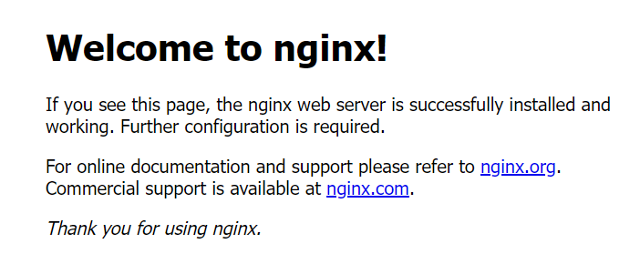

# 一、本地部署方案和技术储备

##  1.1 部署方案

本章使用虚拟机模拟服务器，完成前后端项目的部署，我们使用两台虚拟机分别部署前端和后端项目，具体的部署方案如下图所示。


上述方案中，`server-01`用于部署移动端和后台管理系统的两个后端服务。`server02`部署Nginx，作为移动端和后台管理系统两个前端项目的web服务器，同时也作为两个后端服务的反向代理。也就是说Nginx作为所有请求的入口，若请求内容是静态资源，Nginx便直接返回；若请求的内容为动态资源（后端服务接口），Nginx便代理请求后端服务，然后将结果响应给客户端。

注意： redis / minio /  mysql可以安装到server-01服务器中!!!

**知识点**：

**代理**

上述方案中提到了**反向代理**，下面系统的介绍一下**代理（Proxy）**这一概念。

这里的**代理**，是指在网络通信中，介于客户端和服务端之间的一个服务，客户端将请求发往代理服务，代理服务将请求转发到服务端，得到服务端响应后，再将结果响应为客户端，这一过程如下图所示。


下面介绍一下**代理**的两种类型——**正向代理**和**反向代理**，首先需要明确的是，两者的本质是相同的，都是位于客户端和服务端之间的一个”中间人“，只是两者代表的对象不同，正向代理是代表客户端向服务端发送请求，而反向代理是代表服务端接收请求。

下面是正向代理和反向代理的两个案例：

- **正向代理**

  某校园为了阻止学生沉迷于网络游戏，设计了一个防火墙，封锁了所有的游戏网站。聪明的小明同学，通过一个代理服务器，绕过了防火墙的封锁，这个代理服务器就是一个典型的正向代理。

  

- **反向代理**

  某电商平台由于日益增长的访问量，一台单一的后端服务器已经不能满足高并发的要求了，这时需要增设多个后端服务器，来分担压力。但是如何能够将客户端的请求均匀的分发到这多个后端服务器呢？一个最常用的方案便是使用代理服务，具体来讲，就是使用一个代理服务代表后端服务器接收请求，然后由代理服务将请求均匀的转发到多个后端服务器，这个代理服务就是一个典型的反向代理。

  

## 1.2 准备部署环境

### 1.2.1 安装JDK

根据前文的部署方案，需要在`server01`部署后端服务，因此需要在`server01`中安装JDK，本项目采用JDK17。

1. **获取JDK安装包**

   将资料中提前下载好的JDK上传到`server01`，也在服务器执行以下命令可直接下载。

   ```bash
   wget https://download.oracle.com/java/17/archive/jdk-17.0.8_linux-x64_bin.tar.gz
   ```

2. **解压JDK安装包**

   执行以下命令将jdk解压到`/opt`目录

   ```bash
   sudo tar -zxvf jdk-17.0.8_linux-x64_bin.tar.gz -C /opt
   ```

3. **配置环境变量**

   打开或创建`/etc/profile.d/my_env.sh`文件

   ```bash
   sudo vim /etc/profile.d/my_env.sh
   ```

   增加如下内容

   ```bash
   export JAVA_HOME=/opt/jdk-17.0.8
   export PATH=$JAVA_HOME/bin:$PATH
   ```

   加载环境变量，使其立即生效

   ```bash
   source /etc/profile.d/my_env.sh
   ```

4. **测试JDK安装效果**

   执行以下命令，观察输出是否正常

   ```bash
   java --version
   ```

### 1.2.2 其他环境说明

> server-01中如果安装minio,redis,mysql请参照前置课程等相关教程安装即可!

### 1.2.3 安装Nginx

根据前文的部署方案，需要在`server02`部署Nginx。Nginx官网有详细的安装步骤，具体内容可参考[官方文档](https://nginx.org/en/linux_packages.html)。

1. **配置Nginx yum存储库**

   创建`/etc/yum.repos.d/nginx.repo`文件

   ```bash
   sudo vim /etc/yum.repos.d/nginx.repo
   ```

   增加如下内容

   ```ini
   [nginx-stable]
   name=nginx stable repo
   baseurl=http://nginx.org/packages/centos/$releasever/$basearch/
   gpgcheck=1
   enabled=1
   gpgkey=https://nginx.org/keys/nginx_signing.key
   module_hotfixes=true
   
   [nginx-mainline]
   name=nginx mainline repo
   baseurl=http://nginx.org/packages/mainline/centos/$releasever/$basearch/
   gpgcheck=1
   enabled=0
   gpgkey=https://nginx.org/keys/nginx_signing.key
   module_hotfixes=true
   ```

2. **在线安装Nginx**

   执行以下命令，安装Nginx

   ```bash
   sudo yum install nginx
   ```

3. **启动Nginx**

   执行以下命令启动Nginx

   ```bash
   sudo systemctl start nginx
   ```

   执行以下命令查看Nginx运行状态

   ```bash
   sudo systemctl status nginx
   ```

   执行以下命令设置开机自启

   ```bash
   sudo systemctl enable nginx
   ```

4. **访问Nginx服务默认首页**

   访问`http://192.168.10.101`，能访问到如下页面，则证明Nginx运行正常。

   

## 1.3 技术储备

### 1.3.1 Nginx快速入门

#### 1.3.1.1  Nginx介绍和主要作用

*Nginx* (engine x) 是一个高性能的[HTTP](https://baike.baidu.com/item/HTTP/243074?fromModule=lemma_inlink)和[反向代理](https://baike.baidu.com/item/反向代理/7793488?fromModule=lemma_inlink)web服务器 [13]，同时也提供了IMAP/POP3/[SMTP](https://baike.baidu.com/item/SMTP/175887?fromModule=lemma_inlink)服务。Nginx是由伊戈尔·赛索耶夫为[俄罗斯](https://baike.baidu.com/item/俄罗斯/125568?fromModule=lemma_inlink)[访问量](https://baike.baidu.com/item/访问量/392852?fromModule=lemma_inlink)第二的Rambler.ru站点（[俄文](https://baike.baidu.com/item/俄文/5491693?fromModule=lemma_inlink)：Рамблер）开发的，公开版本1.19.6发布于2020年12月15日。

主要作用:

* http服务器: 支持客户端http协议请求，可以直接访问资源本身(静态资源的服务器，动态资源不能使用)
* 反向代理: 服务器通过反向代理可以实现间接的访问
* 负载均衡: 在反向代理的基础上，进行业务请求的均摊

#### 1.3.1.1 重要的目录、文件

Nginx中有很多十分重要的目录或者文件，下面对核心内容进行介绍

1. **配置文件相关**
   - `/etc/nginx/`：主要的Nginx配置文件目录。
   - `/etc/nginx/nginx.conf`：Nginx的主配置文件，包含全局配置信息。
   - `/etc/nginx/conf.d/`：这个目录通常包含一些附加的配置文件，默认情况下主配置文件`/etc/nginx/nginx.conf`会引入该目录的所有文件。
2. **日志相关**
   - `/var/log/nginx/`：Nginx的日志文件目录，包括访问日志和错误日志。
   - `/var/log/nginx/access.log`：访问日志，记录所有进入服务器的请求。
   - `/var/log/nginx/error.log`：错误日志，记录服务器处理过程中的错误信息。

#### 1.3.1.2 配置文件概述

1. **配置文件结构**

   Nginx的配置文件结构层次分明，整个文件分为多个区块（block），每个区块下可配置各种参数，也可包含其子级区块。

   

2. **重要配置说明**

   下面分块介绍重要的配置参数

   - **main block**

     `main block`位于配置文件的最外层，其包含了影响Nginx服务器整体行为的全局参数，例如

     - `user`：定义Nginx工作进程的用户和用户组。
   
     - `worker_processes`：指定Nginx使用的工作进程数。

     - `error_log`：配置全局错误日志文件路径。

     - **events block**
   
       `events block`用于配置Nginx服务器的事件处理机制，主要配置Nginx如何处理客户端连接。
   
     - **http block**
   
       `http block`是Nginx配置的主要部分，用于配置HTTP服务器和相关功能。
   
       - **server block**
   
         `server block`用于虚拟主机的具体配置。一个`http block`可以包含多个`server block`。
   
         > 虚拟主机：
         >
         > Nginx支持在一台物理服务上托管多个web应用，每个web应用对应着一个虚拟主机，例如我们需要在`server02`中部署移动端和后台管理系统的两个前端项目，就需要配置两个`server block`。
   
         - `listen`：指定虚拟主机监听的端口号。
         - `server_name`：指定虚拟主机的域名或者IP。
         
           **知识点**
         
           由于一台物理服务器可以多个IP地址（例如，双网卡），并且一个IP地址还可以绑定多个域名。所以在匹配虚拟主机时，客户端请求的域名（或IP地址）也会作为一个判断根据。所以不同的虚拟主机可能拥有不同的`server_name`。
         - **location block**：用于配置请求内容的位置，一个`server block`可以包含多个`location block`。
         
           - `root`：指定用于查找静态文件的根目录。
           - `proxy_pass`：配置反向代理到后端服务器的地址。

#### 1.3.1.3 静态资源服务器案例

下面完成一个简单案例，使用Nginx作为静态资源服务器。

项目资料中有一个简单的前端项目`hello-nginx`，其中只包含html、css等静态资源，现将其部署在`server02`上。

1. **上传静态资源到服务器**

   将`hello-nginx.zip`上传到`server02`服务器任意路径。

2. **解压`hello-nginx.zip`到`/usr/share/nginx/html`中**

   ```bash
   sudo unzip hello-nginx.zip -d /usr/share/nginx/html
   ```

   最终的路径结构如下

   ```tex
   /usr
   └── share
       └── nginx
           └── html
               └── hello-nginx
                   ├── css
                   │   └── style.css
                   ├── images
                   │   └── img.png
                   └── index.html
   ```

   

3. **配置Nginx虚拟主机**

   虚拟主机的配置应位于`/etc/nginx/nginx.conf`的**server block**中，由于`/etc/nginx/nginx.conf`的**http bolck**中引入了`/etc/nginx/conf.d/*.conf`，所以虚拟主机在`/etc/nginx/conf.d/`目录下的任意`.conf`文件配置即可。

   - 创建`/etc/nginx/conf.d/hello-nginx.conf`文件

     ```bash
     sudo vim /etc/nginx/conf.d/hello-nginx.conf
     ```

   - 添加如下内容

     ```nginx
     server {
         listen       8080;
         server_name  192.168.10.102;
     
         location /hello-nginx {
             root   /usr/share/nginx/html/;
             index  index.html;
         }
     }
     ```

   - 重新加载Nginx的配置文件

     ```bash
     sudo systemctl reload nginx
     ```

4. **访问项目**

   访问路径为http://192.168.10.102:8080/hello-nginx，若部署成功，可见到如下页面

   

5. **案例剖析**

   下面通过上述案例来了解Ngxin处理请求的逻辑。

   - **匹配server**

     由于Nginx中可存在多个虚拟主机的配置，故接收到一个请求后，Nginx首先要确定请求交给哪个虚拟主机进行处理。这很显然是根据`server_name`和`listen`进行判断的。例如上述的请求路径http://192.168.10.102:8080/hello-nginx，就会匹配到以下的虚拟主机

     ```nginx
     server {
         listen       8080;
         server_name  192.168.10.102;
     	......
     }
     ```

   - **匹配location**

     由于一个**server block**中可能包含多个**location block**，故Nginx在完成**server**匹配后，还要匹配**location**，**location**的匹配是根据请求路径进行判断的。例如以下写法`location`关键字后边的`/hello-nginx`就是匹配规则，它表达的含义是匹配以`/hello-nginx`为前缀的请求，例如上述的http://192.168.10.102:8080/hello-nginx请求就会匹配到该**location**，而http://192.168.10.102:8080/nginx则不会。

     ```nginx
location /hello-nginx {
     	......
     }
     ```
     
   - **定位文件**

     完成**location**的匹配后，Nginx会以**location block**中的`root`作为根目录，然后查找请求路径对应的资源，例如以下配置

     ```nginx
  location /hello-nginx {
         root   /usr/share/nginx/html;
         index  index.html;
     }
     ```
   
     当请求http://192.168.10.102:8080/hello-nginx 时，Ngxin会在`/usr/share/nginx/html/hello-nginx`路径中查找资源，由于该路径为**目录**（而非文件），故Nginx会在该目录下寻找`index`，也就是上述配置的`index.html`。然后将`index.html`响应给客户端。至此，该请求的处理就结束了。

     **注意**：上述提到的**server_name**和**location**均有多种匹配模式，例如精确匹配、前缀匹配、正则匹配，此处不再展开。

#### 1.3.1.4 反向代理案例

下面完成一个简单案例，使用Nginx作为反向代理。

使用Nginx反向代理其他网站，比如`http://www.baidu.com`。

1. **配置虚拟主机**

   创建`/etc/nginx/conf.d/hello-proxy.conf`文件

   ```bash
   sudo vim /etc/nginx/conf.d/hello-proxy.conf
   ```

   内容如下

   ``` nginx
   server {
       listen       9090;
       server_name  192.168.10.102;
   
       location / {
           proxy_pass http://www.atguigu.com;
       }
   }
   ```

2. **重新加载Nginx配置文件**

   ```bash
   sudo systemctl reload nginx
   ```

3. **观察代理效果**

   使用浏览器访问http://192.168.10.102:9090，观察响应结果。

**注意**：借助反向代理功能，Nginx可以实现负载均衡等高级功能，此处不再展开。

# 二、项目部署

## 2.1 配置域名映射

现实生活中，几乎所有的网站都是通过域名去访问。真正的域名需要付费购买，此处在宿主机本地配置一下域名映射，模拟一下域名的效果即可。

我们准备两个域名`lease.atguigu.com`和`admin.lease.atguigu.com`，前者用于访问移动端网站，后者用于访问后台管理系统。由于两个前端项目都部署在`server02`上，所以两个域名均指向`server02`的IP。

Windows的域名映射配置文件位于`C:\Windows\System32\drivers\etc\hosts`，需要使用管理员身份修改。使用管理员身份运行任意文本编辑器，然后使用其打开`hosts`文件，并增加如下内容：

```tex
192.168.6.101 lease.atguigu.com admin.lease.atguigu.com
```

修改完毕记得保存。【云服务器，不要映射，直接IP访问即可】

## 2.2 项目打包

### 2.2.1 前端项目打包

#### 1. 移动端

1. **明确前端请求的后端接口地址**

   打包之前需要明确前端请求的后台接口地址，根据前文的部署规划，前端请求后台接口时走的是Ngxin反向代理，也就是请求的地址为`lease.atguigu.com(192.168.10.102)`。

   所以我们需要修改`.env.production`文件中`VITE_APP_BASE_URL`环境变量的值，修改结果如下

   ```ini
   VITE_APP_BASE_URL='http://lease.atguigu.com'
   ```
   
2. **构建项目**

   在项目的根目录，也就`package.json`所在的目录中，执行以下命令

   ```bash
   npm run build
   ```

3. **查看打包结果**

   观察项目的根目录是否出现`dist`目录

#### 2. 后台管理系统

1. **明确前端请求的后端接口地址**

   后台管理系统的前端请求后端接口时，同样会走Nginx反向代理，故其请求的接口地址为`admin.lease.atguigu.com(192.168.10.102)`。

   确保**rentHouseAdmin**项目中的`.env.production`文件中的`VITE_APP_BASE_URL`环境变量配置为如下内容

   ```ini
   VITE_APP_BASE_URL='http://admin.lease.atguigu.com'
   ```

2. **打包**

   在项目根目录，也就是package.json文件所在的目录中，执行以下命令

   ```bash
   npm run build
   ```

3. **查看打包结果**

   观察项目的根目录是否出现`dist`目录

### 2.2.2 项目后端打包

使用IDEA的maven插件对项目进行打包，完成后，在**web-admin**和**web-app**模块的`target`目录下找到`web-admin-1.0-SNAPSHOT.jar`和`web-app-1.0-SNAPSHOT.jar`。

## 2.3 项目部署

### 2.3.1 部署后端项目

1. **上传jar包**

   将后端项目的两个jar包上传到`server01`服务器的`/opt/lease`目录下，若目录不存在，自行创建即可。

2. **项目启停脚本**

   为方便项目的启动、停止或者重启，编写一个简单的shell脚本

   - **移动端启停脚本**

     在`/opt/lease`目录下创建`app.sh`文件

     ```bash
     sudo vim /opt/lease/app.sh
     ```

     内容如下

     ```bash
     #!/bin/bash
     
     PROJECT_JAR="/opt/lease/web-app-1.0-SNAPSHOT.jar"
     
     start_project() {
         echo "Starting web-app"
         nohup java -jar $PROJECT_JAR > web-app.log 2>&1 &
         echo "web-app started."
     }
     
     stop_project() {
         echo "Stopping web-app"
         pkill -f $PROJECT_JAR
         echo "web-app stopped."
     }
     
     restart_project() {
         stop_project
         start_project
     }
     
     case "$1" in
         start)
             start_project
             ;;
         stop)
             stop_project
             ;;
         restart)
             restart_project
             ;;
         *)
             echo "Usage: $0 {start|stop|restart}"
     esac
     ```

     增加执行权限

     ```bash
     sudo chmod +x /opt/lease/app.sh
     ```

   - **后台管理系统启停脚本**

     在`/opt/lease`目录下创建`admin.sh`文件

     ```bash
     sudo vim /opt/lease/admin.sh
     ```

     内容如下

     ```bash
     #!/bin/bash
     
     PROJECT_JAR="/opt/lease/web-admin-1.0-SNAPSHOT.jar"
     
     start_project() {
         echo "Starting web-admin"
         nohup java -jar $PROJECT_JAR > web-admin.log 2>&1 &
         echo "web-admin started."
     }
     
     stop_project() {
         echo "Stopping web-admin"
         pkill -f $PROJECT_JAR
         echo "web-admin stopped."
     }
     
     restart_project() {
         stop_project
         start_project
     }
     
     case "$1" in
         start)
             start_project
             ;;
         stop)
             stop_project
             ;;
         restart)
             restart_project
             ;;
         *)
             echo "Usage: $0 {start|stop|restart}"
     esac
     ```

     增加执行权限

     ```bash
     sudo chmod +x /opt/lease/app.sh
     ```

3. **启动项目**

   执行以下命令启动两个后端项目。

   ```bash
   /opt/lease/app.sh start
   /opt/lease/admin.sh start
   ```

### 2.3.2 部署前端项目

1. **上传dist文件**

   将`rentHouseH5`和`rentHouseAdmin`项目编译得到`dist`文件分别上传至`server02`服务器的`/usr/share/nginx/html/app`和`/usr/share/nginx/html/admin`目录下。

   最终的目录结构为

   ```tex
   /usr
   └── share
       └── nginx
           └── html
               └── app
               │   ├── static
               │   └── index.html
               └── admin
                   ├── assets
                   └── index.html
   ```

2. **编辑Nginx配置文件**

   分别编辑两个虚拟主机的配置文件。

   - **移动端配置文件**

     创建`/etc/nginx/conf.d/app.conf`文件

     ```bash
     sudo vim /etc/nginx/conf.d/app.conf
     ```

     内容如下

     ```nginx
     server {
         listen       80;
         server_name  lease.atguigu.com;
     
         underscores_in_headers on; 
         
         location / {
             root   /usr/share/nginx/html/app;
             index  index.html;
         }
         location /app {
             proxy_pass http://192.168.10.101:8081;
         }
     }
     ```

     **注意**：

     `underscores_in_headers on; `表示允许Header包含下划线，默认情况下，Nginx会认为包含下划线的Header非法，导致`access_token`被忽略掉。

   - **后台管理系统配置文件**

     创建`/etc/nginx/conf.d/admin.conf`文件

     ```bash
     sudo vim /etc/nginx/conf.d/admin.conf
     ```

     内容如下

     ```nginx
     server {
         listen       80;
         server_name  admin.lease.atguigu.com;
     
         underscores_in_headers on; 
         
         location / {
             root   /usr/share/nginx/html/admin;
             index  index.html;
         }
         location /admin {
             proxy_pass http://192.168.10.101:8080;
         }
     }
     ```

3. **重新加载Nginx配置文件**

   执行以下命令重新加载配置文件

   ```bash
   sudo systemctl restart nginx
   ```

4. **访问项目**

   分别访问http://lease.atguigu.com和http://admin.lease.atguigu.com。
   
   如果没有配置映射，直接IP地址访问即可
   
5. 常见问题1

   

   代表系统缺少字体!

   下载即可:

   ``` 
   yum install fontconfig
   ```

6. 常见问题2

   在web端访问网页，tail -f /var/log/nginx/error.log 命令打印日志，发现报错为2024/xx/xx 03:26:49 [crit] 29714#29714: *2 connect() to 192.168.6.100:8080 failed (13: Permission denied

   ``` 
    # 临时关闭SELinux
   sudo setenforce 0
    
   # 永久关闭SELinux，系统重启SELinu仍然关闭
   sudo sed -i 's/^SELINUX=enforcing/SELINUX=disabled/' /etc/selinux/config
   ```

   