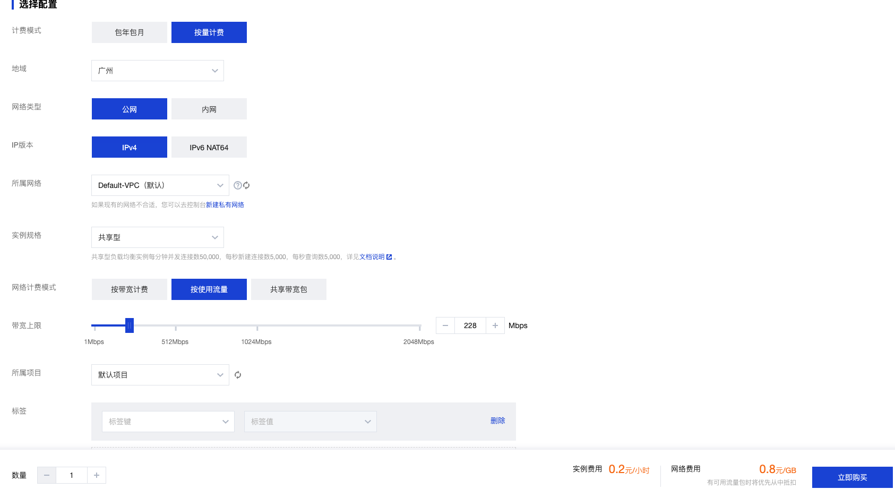
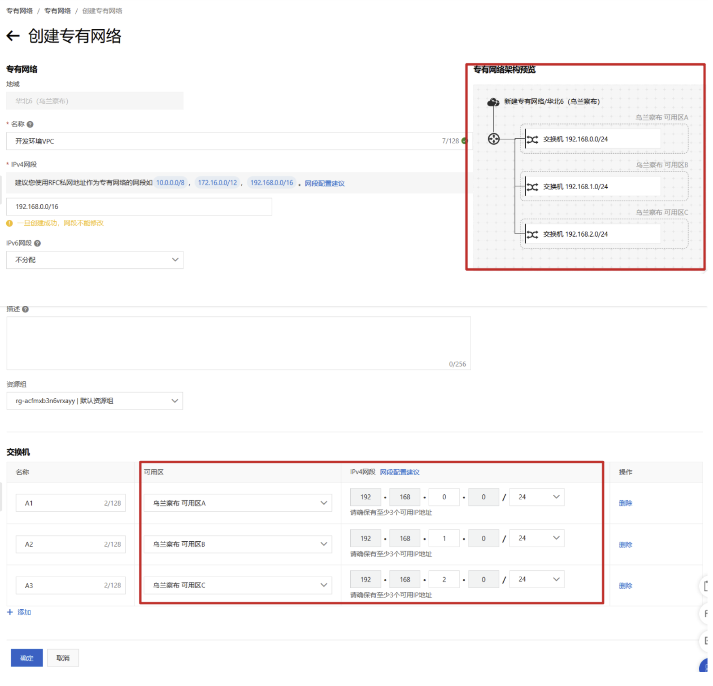
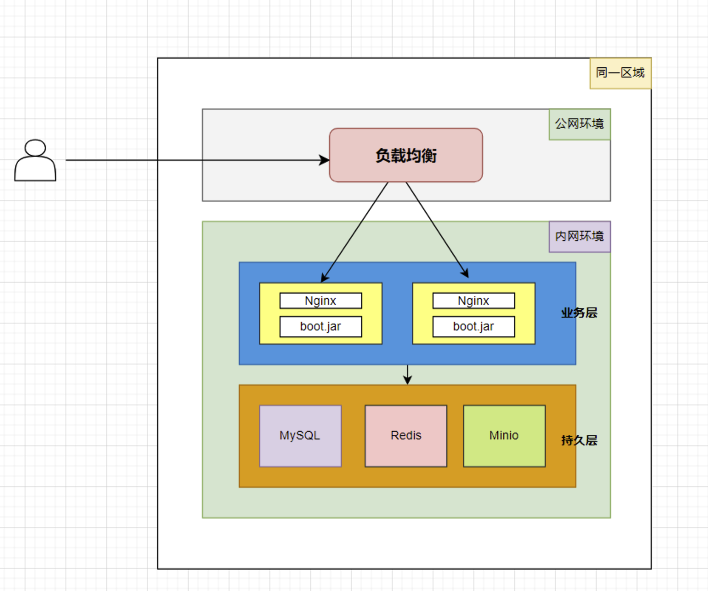

`

# 云上实战和部署

## 一、云计算基础

### 1.1 云概念

> 课程基于腾讯云进行讲解
>
> https://cloud.tencent.com/


#### 1.1.1 云平台优势

- `环境统一`
- `按需付费 `
- `即开即用 `
- `稳定性强`

国内常见云平台：

- [阿里云](https://promotion.aliyun.com/ntms/act/ambassador/sharetouser.html?userCode=50sid5bu&utm_source=50sid5bu)、百度云、[腾讯云](https://curl.qcloud.com/iyFTRSJb)、[华为云](https://activity.huaweicloud.com/discount_area_v5/index.html?fromacct=d1a6f32e-d6d0-4702-9213-eafe022a0708&utm_source=bGVpZmVuZ3lhbmc==&utm_medium=cps&utm_campaign=201905)、青云......

国外常见云平台：

- 亚马逊 AWS、微软 Azure ...

#### 1.1.2 公有云

公有云是最常见的云计算部署类型。公有云资源（例如服务器和存储空间）由第三方云服务提供商拥有和运营，这些资源通过 Internet 提供。在公有云中，所有硬件、软件和其他支持性基础结构均为云提供商所拥有和管理。Microsoft Azure 是公有云的一个示例。

在公有云中，你与其他组织或`云租户`共享相同的硬件、存储和网络设备，并且你可以使用 Web 浏览器访问服务和管理帐户。公有云部署通常用于提供基于 Web 的电子邮件、网上办公应用、存储以及测试和开发环境。

公有云优势：

- **成本更低**：无需购买硬件或软件，仅对使用的服务付费。
- **无需维护**：维护由服务提供商提供。
- **近乎无限制的伸缩性**：提供按需资源，可满足业务需求。
- **高可靠性**：具备众多服务器，确保免受故障影响。 

#### 1.1.3 私有云

私有云由专供一个企业或组织使用的云计算资源构成。私有云可在物理上位于组织的现场数据中心，也可由第三方服务提供商托管。但是，在私有云中，服务和基础结构始终在私有网络上进行维护，硬件和软件专供组织使用。

这样，私有云可使组织更加方便地自定义资源，从而满足特定的 IT 需求。私有云的使用对象通常为政府机构、金融机构以及其他具备业务关键性运营且希望对环境拥有更大控制权的中型到大型组织。

私有云优势：

- **灵活性更强**：组织可自定义云环境以满足特定业务需求。
- **控制力更强**：资源不与其他组织共享，因此能获得更高的控制力以及更高的隐私级别。
- **可伸缩性更强**：与本地基础结构相比，私有云通常具有更强的可伸缩性。

> **没有一种云计算类型适用于所有人。多种不同的云计算模型、类型和服务已得到发展，可以满足组织快速变化的技术需求。**

> 部署云计算资源有三种不同的方法：公共云、私有云和混合云。采用的部署方法取决于业务需求、数据中心预算以及企业运维能力等。

#### 1.1.4 云计算模式

**云计算的服务模式**是分几层的，分别是：

- **IaaS：**Infrastructure-as-a-Service； **基础设施**即服务
- **PaaS：**Platform-as-a-Service；**平台**即服务
- **SaaS：**Software-as-a-Service；**软件**即服务

基础设施在最下端，平台在中间，软件在顶端。


理解：

- 去云厂商买了服务器，自己安装数据库、Tomcat、部署Shop应用。此时**云厂商**是作为 **IaaS**； 例如云服务器
- 去云厂商买了集成环境（服务器、MySQL、Tomcat、Java...），自己部署Shop应用。此时云厂商作为 **PaaS**； 例如阿里云ACK平台
- 去云厂商直接买了**电商平台**，只需要上架自己商品就可售卖，此时云厂商作为 **SaaS**；例如保利威、飞书**、钉钉**等

### 1.2 云设施

#### 1.2.1 云设施概述

> [腾讯云产品](https://cloud.tencent.com/product)


#### 1.2.2 核心组件

* `云服务器CVM`

  云服务器（Cloud Server）是一种基于云计算技术的虚拟服务器，它在云平台上运行并提供计算资源、存储空间和网络连接，用户可以通过云平台按需购买和使用这些资源。

  

* `安全组`

  云服务器（Cloud Server）是一种基于云计算技术的虚拟服务器，它在云平台上运行并提供计算资源、存储空间和网络连接，用户可以通过云平台按需购买和使用这些资源。

  

* `云盘`

  云硬盘（Cloud Block Storage，CBS）为您提供用于 CVM 的持久性数据块级存储服务。云硬盘中的数据自动地在可用区内以多副本冗余方式存储，避免数据的单点故障风险，提供高达99.9999999%的数据可靠性。同时提供多种类型及规格，满足稳定低延迟的存储性能要求。

  

* `快照和镜像`

  快照和镜像在云服务器环境中提供了强大的数据管理和扩展性能。快照可以用于灾难恢复和数据备份，而镜像可以用于快速创建新的云服务器实例或部署应用程序。用户可以根据需要使用这两个功能来保护数据和提高运维效率。

  

* `负载均衡`

  负载均衡（Cloud Load Balancer，CLB）提供安全快捷的流量分发服务，访问流量经由 CLB 可以自动分配到云中的多台后端服务器上，扩展系统的服务能力并消除单点故障。负载均衡支持亿级连接和千万级并发，可轻松应对大流量访问，满足业务需求。

  

* `云数据库`

  云数据库为企业提供了完善的关系型数据库、非关系型数据库、分析型数据库和数据库生态工具。您可以通过产品选择和组合搭建，轻松实现高可靠、高可用性、高性能等数据库需求。云数据库服务也可大幅减少您的运维工作量，更专注于业务发展，让企业一站式享受数据上云及分布式架构的技术红利！

  

## 二、核心云设施

### 2.1 云服务器(CVM)

> [云服务器官方地址](https://cloud.tencent.com/product/cvm)

#### 2.1.1 简介

​	腾讯云服务器（Cloud Virtual Machine，`CVM`）是腾讯云提供的可扩展的计算服务。使用云服务器 CVM 避免了使用传统服务器时需要预估资源用量及前期投入的问题，帮助您在短时间内快速启动任意数量的云服务器并及时部署应用程序。
云服务器 `CVM` 支持用户自定义一切资源：`CPU`、`内存`、`硬盘`、`网络`、`安全`等，并可以在需求发生变化时轻松地调整它们。

**腾讯云提供如下方式进行云服务器的配置和管理：**

* [**控制台**](https://console.cloud.tencent.com/cvm/overview)：腾讯云提供的 Web 服务界面，用于配置和管理云服务器。
* **API**：腾讯云也提供了 API 接口方便您管理云服务器 CVM。关于 API 说明，请参见 [API 概览](https://cloud.tencent.com/document/api/213/15689)。
* **SDK**：您可以使用 [SDK 编程](https://cloud.tencent.com/document/sdk) 或使用腾讯云 [命令行工具 TCCLI](https://cloud.tencent.com/document/product/440) 调用 CVM API。

**云服务器对比轻量应用服务器:**

* 云服务器更加灵活，需要自行准备环境和部署文件

* 轻量级应用服务器开箱即用，简单方便

* 轻量级应用服务器如图

  

#### 2.1.2 相关概念

| 概念    | 说明                                                         |
| ------- | ------------------------------------------------------------ |
| 实例    | 云端的虚拟计算资源，包括 CPU、内存、操作系统、网络、磁盘等最基础的计算组件。腾讯云为云服务器提供了不同的 CPU、内存、存储和网络配置，详情请参见 [实例规格](https://cloud.tencent.com/document/product/213/11518)。 |
| 镜像    | 指云服务器 CVM 运行的预制模板，包括预配置的操作系统及预装软件。云服务器 CVM 提供 Windows，Linux 等多种预制镜像。 |
| 云硬盘  | 提供的分布式持久块存储设备，可以用作实例的系统盘或可扩展数据盘使用。 |
| IP 地址 | 腾讯云提供 [内网 IP](https://cloud.tencent.com/doc/product/213/5225) 和 [公网 IP](https://cloud.tencent.com/document/product/213/5224)。内网 IP 提供局域网（LAN）服务，使云服务器之间可以互相访问。通过公网IP，用户可以在云服务器实例上使用 Internet 服务。 |
| 安全组  | 安全组可以理解为是一种虚拟防火墙，具备状态检测和数据包过滤功能，用于一台或者多台云服务器网络访问控制，安全组是重要的网络安全隔离手段。 |

#### 2.1.3 图解

- **地域**：物理的数据中心。选择靠近客户的地域，可降低网络时延。**不同地域的ECS之间内网隔离**。**资源创建成功后不能更换地域**。
- **可用区**：在**同一地域内**，**电力和网络互相独立**的物理区域。可用区主要**用于故障隔离**。**同一地域**不同可用区的CVS之间可以**内网互通**。

  

理解：

- 假设阿里云有**10万台服务器**，每个服务器都是一个**实例**
- 每个服务器开放哪些端口，需要通过**安全组**进行控制，这就是防火墙
- 每个实例的操作系统在**系统盘**安装着。系统盘是云上的一块硬盘，这个硬盘我们也叫做 **块存储**
- 每个实例的数据可以单独放在**数据盘**。
- 所有数据最好进行定期备份，这个机制我们成为**快照**。备份的数据，我们被封装为**镜像**，保存到阿里云专门的一些硬盘中；
- 10万台服务器不可能放在一个城市，所以阿里云会在上海、北京、杭州等各个地方建立机房。每个城市都称为一个**地域**；
- 就算在一个地域，比如**北京**，有3000台服务器，这些服务器可能不在同一个机房，或者同一个大楼里面。假设A、B、C三栋大楼都有机房。那么A栋楼可以称为一个**可用区A**，B栋称为**可用区B**，同一个可用区内的机器是可以互相访问的，同一个地域不同可用区的也是可以互相访问的。同一个地域的所有实例，可以通过**VPC自定义组网**策略。
- 不同地域之间默认不能互通，如果需要互通要开通**专线**。
- 可用区、地域都是为了物理隔离。比如A栋楼停电了，可以不影响B栋楼。A城市停电了，可以不影响B城市。**容灾机制**就是基于这种隔离实现的

#### 2.1.4 规格和场景

| 类型           | 描述                                                         |
| -------------- | ------------------------------------------------------------ |
| 标准型实例族   | 均衡的计算、内存和网络资源，可满足大多数场景下的应用资源需求 |
| 内存型实例族   | 具有大内存的特点，适合高性能数据库、分布式内存缓存等需要大量的内存操作、查找和计算的应用 |
| 高 IO 型实例族 | 具有高随机 IOPS、高吞吐量、低访问延时等特点，适合对硬盘读写和时延要求高的高性能数据库等 I/O 密集型应用 |
| 大数据型实例族 | 搭载海量存储资源，具有高吞吐特点，适合 Hadoop 分布式计算、海量日志处理、分布式文件系统和大型数据仓库等吞吐密集型应用 |
| 计算型实例族   | 最高 3.8GHz 睿频，具有最高单核计算性能。适合批处理、高性能计算和大型游戏服务器等计算密集型应用 |
| 异构计算实例族 | 搭载 GPU、FPGA 等异构硬件，具有实时高速的并行计算和浮点计算能力，适合于深度学习、科学计算、视频编解码和图形工作站等高性能应用 |
| 批量型实例族   | 具有最优单位核时性价比，适用于渲染、基因分析、晶体药学等短时频繁使用超大规模计算节点的计算密集型应用 |
| 裸金属云服务器 | 物理机的高稳定、强劲的计算性能。完全无缝和腾讯云全产品融合   |
| 高性能计算集群 | 性能计算、人工智能、大数据推荐等应用的并行计算需求           |

#### 2.1.5 开通云服务器

1. **打开购买和开通页面**

   [云服务器购买地址](https://cloud.tencent.com/product/cvm)

   

2. **自定义配置和镜像**

   `选择配置和计费模式`

   

   `选择镜像和云盘`

   

3. **开通公网IP和密码**

   `开启公有IP`

   

   `设置安全组`

   

   ` 设置实例密码和名称`

   

4. **确认购买**

5. **控制台查看**

   [腾讯云控制台](https://console.cloud.tencent.com/)

   

#### 2.1.6 连接和测试

> 推荐使用 [WindTerm](https://github.com/kingToolbox/WindTerm/releases/download/2.6-prerelease/WindTerm_2.6.0_Prerelease_2_Windows_Portable_x86_64.zip) 软件。进行连接。
>
> 确保: 安全组22端口已经开放


输入root账号设置密码即可!!!

### 2.2 安全组配置

>  [安全介绍文档](https://cloud.tencent.com/document/product/213/12452)

#### 2.2.1 安全组介绍

​	安全组是一种虚拟防火墙，具备有状态的数据包过滤功能，用于设置云服务器、负载均衡、云数据库等实例的网络访问控制，控制实例级别的出入流量，是重要的网络安全隔离手段。
您可以通过配置安全组规则，允许或禁止安全组内的实例的出流量和入流量。

**特点**

* 安全组是一个逻辑上的分组，您可以将同一地域内具有相同网络安全隔离需求的云服务器、弹性网卡、云数据库等实例加到同一个安全组内。

* 安全组未添加任何规则时，默认拒绝所有流量，您需要添加相应的允许规则。

* 安全组是有状态的，对于您已允许的入站流量，都将自动允许其流出。

* 可以随时修改安全组的规则，新规则立即生效。


**安全组的使用流程如下图所示：**


#### 2.2.2 安全组配置

[安全组配置控制台](https://console.cloud.tencent.com/vpc/security-group?rid=33&rid=33)


#### 2.2.3 安全组配置

* 入和出方向

  1. 入方向（Inbound）：入方向是指流向云服务器的网络流量。当你创建一个入方向规则时，你定义了允许通过特定协议和端口流向云服务器的网络流量。这些规则可以控制从互联网或其他网络资源向云服务器发送的流量。例如，你可以设置一个入方向规则，允许通过HTTP协议的流量流向云服务器的80端口。
  2. 出方向（Outbound）：出方向是指从云服务器流出的网络流量。当你创建一个出方向规则时，你定义了允许从云服务器流出特定协议和端口的网络流量。这些规则可以控制云服务器向互联网或其他网络资源发送的流量。例如，你可以设置一个出方向规则，允许通过SSH协议的流量从云服务器的22端口流出。

* 配置语法

  

* 常见的开放端口

  1. 22端口（SSH）：用于远程登录服务器进行管理和维护。
  2. 80端口（HTTP）：用于通过HTTP协议访问网站。
  3. 443端口（HTTPS）：用于通过加密的HTTPS协议访问安全网站。
  4. 21端口（FTP）：用于文件传输协议，允许文件在服务器和客户端之间进行传输。
  5. 3306端口（MySQL）：用于MySQL数据库服务。
  6. 5432端口（PostgreSQL）：用于PostgreSQL数据库服务。
  7. 27017端口（MongoDB）：用于MongoDB数据库服务。
  8. 3389端口（RDP）：用于远程桌面连接。
  9. 25端口（SMTP）：用于发送电子邮件。
  10. 443端口（SMTPS）：用于加密的SMTP协议发送电子邮件。

#### 2.2.4 使用nginx进行测试

``` cmd
#安装Nginx
yum install nginx

#启动nginx
systemctl start nginx

#查看Nginx位置
whereis nginx
# 修改 /etc/nginx/nginx.conf 端口为8080
sudo vi /etc/nginx/nginx.conf
server {
    listen 80;
    ......
}
# 重启nginx
nginx -s reload
或者
systemctl restart nginx
```

### 2.3 云盘扩容和挂载(删除)

#### 2.3.1 介绍

​		云硬盘（Cloud Block Storage，CBS）为您提供用于云服务器的持久性数据块级存储服务。CBS 中的数据自动地在可用区内以多副本冗余方式存储，避免数据的单点故障风险，提供高达`99.9999999%`的数据可靠性。CBS 提供多种类型及规格的磁盘实例，支持在同可用区云服务器上挂载/卸载，并且可以在几分钟内调整存储容量，满足稳定延迟的存储性能及弹性的数据需求。您只需为所配置的资源量支付低廉的价格即可享受以上功能特性。

#### 2.3.2 图解


#### 2.3.3 实战

1. **创建云盘**

   [云盘购买地址](https://console.cloud.tencent.com/cvm/cbs/index?rid=33)

   

2. **查看状态**

   通过控制台,查看云盘状态即可

   

3. **挂载云盘**

   * `可视化关联和挂载`

     

   * `登录云服务器`

   * `以 root 用户执行以下命令，查看磁盘名称。`

     ```cmd
     fdisk -l
     ```

     回显信息示例如下，表示当前的云服务器有两块磁盘，**/dev/vda** 是系统盘，**/dev/vdb** 是新增数据盘。

     

   * `为新云盘设置文件格式`

     查看系统原有磁盘的文件格式

     ``` 
     df -T
     ```

     centos系统常见文件格式:

     1. **ext4**：是Linux中最常用的文件系统格式之一，提供了对大容量硬盘和大文件的支持，并具有较好的性能和稳定性。
     2. **ext3**：是ext4的前身，与ext4相比，不支持更大容量的硬盘和更大的文件，但在某些情况下仍然被广泛使用。
     3. **XFS**：是一种高性能的日志文件系统，通常用于大容量存储系统，支持高达16 EB（艾字节）的文件系统大小。
     4. **Btrfs**：是一种先进的复制文件系统，具有许多高级功能，如快照、压缩、数据完整性校验等，适用于各种用例，包括文件服务器和虚拟化环境。
     5. **FAT32**：是一种Windows下常见的文件系统格式，对于跨平台使用或与旧系统兼容时可能会选择。
     6. **NTFS**：是Windows NT操作系统系列中的默认文件系统，通常用于Windows系统中，但也可以在Linux中进行读写操作。
     7. **exFAT**：是一种用于大容量移动设备和闪存存储的文件系统格式，通常用于外部存储设备。
     8. **swap**：用于Linux系统的交换分区，用于虚拟内存支持。

     设置文件格式命令

     ```cmd
     mkfs -t <文件系统格式> <扩展云盘目录>
     ```

     不同文件系统支持的分区大小不同，请根据实际需求合理选择文件系统。以设置文件系统 `EXT4` 为例：

     ```cmd
     mkfs -t ext4 /dev/vdb
     ```

   * `创建挂载点和挂载命令`

     > 新的挂载点就是一个文件夹

     ```bash
     mkdir <挂载点>
     ```

     以新建挂载点 `/data` 为例：

     ```bash
     mkdir /data 
     ```

   * `执行以下命令，将新建分区挂载至新建的挂载点。`

     ``` cmd
     mount /dev/vdb /data
     ```

   * `执行以下命令，查看挂载结果。`

     ```cmd
     df -TH
     ```

4. **卸载云盘**

   * `可视化进行卸载`

     

   * `命令进行取消挂载`

      执行 `umount  /dev/vdb` 命令，卸载对应的挂载点

     ``` cmd
     umount  /dev/vdb
     ```

5. **删除云盘**

   

### 2.4 镜像和共享方案

> https://cloud.tencent.com/document/product/213/4940

#### 2.4.1 概念

​	腾讯云镜像提供启动云服务器实例所需的所有信息。指定需要的镜像后可以从该镜像启动所需任意数量的实例，也可以根据需要从任意多个不同的镜像启动实例。通俗地说，镜像就是云服务器的“装机盘”。

**腾讯云提供的镜像类型包括以下几种：**

* **公有镜像：**所有用户均可使用，涵盖大部分主流操作系统。

* **服务市场镜像：**所有用户均可使用，除操作系统外还集成了某些特定应用程序。

* **自定义镜像：**仅创建者和共享对象可以使用，由现有运行的实例创建而来或由外部导入而来。

* **共享镜像：**由其他用户共享而来的镜像，仅能用作创建实例。

**镜像的几种作用:**

* **部署特定软件环境** 使用共享镜像、自定义镜像、服务市场镜像都能帮助快速搭建特定的软件环境，免去了自行配置环境、安装软件等繁琐且耗时的工作，并能满足建站、应用开发、可视化管理等多种个性化需求，让云服务器“即开即用”，省时方便。

* **批量部署软件环境** 通过对已经部署好环境的云服务器实例制作镜像，然后在批量创建云服务器实例时使用该镜像作为操作系统，云服务器实例创建成功之后便具有和之前云服务器实例一致的软件环境，以此达到批量部署软件环境的目的。

* **服务器运行环境备份** 对一台云服务器实例制作镜像备份运行环境。若该云服务器实例使用过程中因软件环境被损坏而无法正常运行，则可以使用镜像恢复。

**镜像的生命周期:**

> 下图总结了自定义镜像的生命周期。创建或导入了一个新自定义镜像之后，用户可以将其用于启动新实例（用户也可从现有的公共镜像或服务市场镜像启动实例）。自定义镜像可以被复制到同账号的其他地域下，成为该地域下独立的镜像。用户还可以将自定义镜像共享给其他用户。


#### 2.4.2 实战

> 准备一份nginx的镜像，使用镜像快速创建带有nginx的云服务!

* **实例中安装nginx服务**

  ```cmd
  yum install nginx 
  systemctl start nginx
  # 可以设置成开机自启动
  ```

* **进行镜像生成**

  

  

  

* **基于镜像快速创建新实例**

  

  

#### 2.4.3 共享镜像

* **共享镜像作用**

  共享镜像可以实现跨账号进行系统模板的分享!

  例如: 组长完成环境安装，可以将镜像共享给组员进行快速环境搭建

* **共享镜像实现**

  * 分享者进行共享

    

  * 接受者进行查看

    

### 2.5 负载均衡

> https://cloud.tencent.com/document/product/214/524

#### 2.5.1 介绍

负载均衡（`Cloud Load Balancer，CLB`）是对多台后端服务器进行流量分发的服务。负载均衡可以通过流量分发扩展应用系统对外的服务能力，通过消除单点故障提升应用系统的可用性。

负载均衡服务通过设置虚拟服务地址（VIP），将位于**同一地域**的多台后端服务器资源虚拟成一个高性能、高可用的应用服务池。根据应用指定的方式，将来自客户端的网络请求分发到服务器池中。

负载均衡服务会检查服务器池中后端服务器实例的健康状态，自动隔离异常状态的实例，从而解决了后端服务器的单点问题，同时提高了应用的整体服务能力。

一个提供服务的负载均衡组通常由以下部分组成：

1. **负载均衡实例**：一个 CLB 实例是一个运行的负载均衡服务，用于流量分发。

2. **监听器**：用来检查客户端请求并将请求转发给后端服务器。

3. **后端服务器**：后端的一组服务器实例，用于接收前端的请求。

来自负载均衡外的访问请求，通过负载均衡实例并根据相关的策略和转发规则分发到后端服务器进行处理。

| 术语           | 全称                    | 说明                                                         |
| -------------- | ----------------------- | ------------------------------------------------------------ |
| 负载均衡器     | `Cloud Load Balancer`   | 腾讯云提供的一种负载均衡服务。用户可以使用 CNAME 或 A 记录解析对外提供访问。其中仅公网负载均衡可以选择 CNAME 方式。 |
| 负载均衡监听器 | `Load Balance Listener` | 负载均衡服务监听器，包括监听端口、负载均衡策略和健康检查配置等，每个监听项对应后端的一个应用服务。 |
| 后端服务器     | `Real Server`           | 接受负载均衡分发请求的一组后端服务器实例，负载均衡服务将访问请求按照用户设定的规则转发到这一组后端服务器上进行处理。 |

#### 2.5.2 使用场景

负载均衡主要适用于如下场景：

1. 流量分发，将高访问量的业务通过负载均衡分发到多台后端服务器上。

2. 消除单点故障，当其中一部分后端服务器不可用时，负载均衡可自动屏蔽故障的 CVM 实例，保障应用系统正常工作。

   

3. 横向扩展，根据业务发展的需要，按需扩展应用系统的服务能力，适用于各种 Web Server和 App Server。

   

4. 全局负载均衡，结合 [云解析 DNS](https://cloud.tencent.com/document/product/302)，可支持全局多地域负载均衡，保障异地容灾。

   可以在不同地域部署负载均衡实例，并分别绑定对应地域的后端服务器。

   使用云解析 DNS 将域名解析到各个地域的负载均衡 VIP 下。

   业务流量会通过域名解析和负载均衡转发到多个地域的多个后端服务器上，以此实现全局负载均衡。

   当某个地域不可用时，暂停对应地域负载均衡 VIP 的解析即可保障业务不受影响。

   

#### 2.5.3 购买



#### 2.5.4 使用和配置

* `查看控制台`

  [负载均衡控制台](https://console.cloud.tencent.com/clb/instance?rid=33&pid=0&type=OPEN)

  

* `配置监听器`

  

* `选择tcp监听器配置后台服务ip地址`

  > 不需要进行健康检测

  


### 2.6 私有网络（VPC）

[私有网络介绍地址](https://cloud.tencent.com/product/vpc)

> 私有网络（Virtual Private Cloud，VPC）是基于腾讯云构建的专属云上网络空间，为您在腾讯云上的资源提供网络服务，不同私有网络间完全逻辑隔离。作为您在云上的专属网络空间，您可以通过软件定义网络的方式管理您的私有网络 VPC，实现 IP 地址、子网、路由表、网络 ACL 、流日志等功能的配置管理。私有网络还支持多种方式连接 Internet，如弹性 IP 、NAT 网关等。同时，您也可以通过 VPN 连接或专线接入连通腾讯云与您本地的数据中心，灵活构建混合云。

#### 2.6.1 介绍

私有网络（Virtual Private Cloud，VPC）是一块您在腾讯云上自定义的逻辑隔离网络空间，您可以为 [云服务器](https://cloud.tencent.com/doc/product/213/495)、[云数据库](https://cloud.tencent.com/doc/product/236) 等资源构建逻辑隔离的、用户自定义配置的网络空间，以提升用户云上资源的安全性，并满足不同的应用场景需求


#### 2.6.2 网络划分

> **专有网络**是您独有的云上虚拟网络，您可以将云资源部署在您自定义的专有网络中。
>
> - 云资源不可以直接部署在专有网络中，必须属于专有网络内的一个交换机（子网）内。
> - **交换机**（vSwitch）是组成专有网络的基础网络设备，用来连接不同的云资源实例
> - 专有网络是地域级别的资源，**专有网络不可以跨地域**，但包含所属地域的所有可用区
> - 可以在每个可用区内创建一个或多个交换机来划分子网。

用户在创建私有网络时，需要用 [CIDR（无类别域间路由）](https://cloud.tencent.com/document/product/215/18509#2) 作为私有网络指定 IP 地址组。

腾讯云私有网络 CIDR 支持使用如下私有网段中的任意一个：

**10.0**.0.0 - **10.255**.255.255（**掩码范围需在12 - 28**之间）

**172.16**.0.0 - **172.31**.255.255（**掩码范围需在12 - 28**之间）

**192.168**.0.0 - **192.168**.255.255 （**掩码范围需在16 - 28**之间）

#### 2.6.3 组成部分

每个专有网络都由至少一个私网网段、一个路由器和至少一个交换机组成。

##### 2.6.3.1 私网网段

在创建专有网络和交换机时，您需要以CIDR地址块的形式指定专有网络使用的私网网段。

您可以使用下表中标准的私网网段及其子网作为VPC的私网网段，也可以使用自定义地址段作为VPC的私网网段。更多信息，请参见[网络规划](https://help.aliyun.com/document_detail/54095.htm#concept-dvk-lj5-sdb)。

| 网段           | 说明                                                         |
| -------------- | ------------------------------------------------------------ |
| 192.168.0.0/16 | 可用私网IP数量（不包括系统保留地址）：65,532                 |
| 172.16.0.0/12  | 可用私网IP数量（不包括系统保留地址）：1,048,572              |
| 10.0.0.0/8     | 可用私网IP数量（不包括系统保留地址）：16,777,212             |
| 自定义地址段   | 除100.64.0.0/10、224.0.0.0/4、127.0.0.0/8、169.254.0.0/16及其子网外的自定义地址段。 |

##### 2.6.3.2 路由器

> 系统自动创建，我们无需干预

路由器（vRouter）是专有网络的枢纽。作为专有网络中重要的功能组件，它可以连接专有网络内的各个交换机，同时也是连接专有网络和其他网络的网关设备。每个专有网络创建成功后，系统会**自动创建一个路由器**。每个路由器至少关联一张路由表。

更多信息，请参见[路由表概述](https://help.aliyun.com/document_detail/203494.htm#concept-qbk-bvn-4gb)。

##### 2.6.3.3 交换机

> 将VPC一个大的网段，划分成几个不同的小网段，这些小网段可以跨可用区互通，从而实现跨可用区的容灾机制

交换机（vSwitch）是组成专有网络的基础网络设备，用来连接不同的云资源。创建专有网络后，您可以通过创建**交换机为专有网络划分一个或多个子网**。**同一专有网络内的不同交换机之间内网互通**。您可以**将应用部署在不同可用区的交换机内，提高应用的可用性**。

更多信息，请参见[创建和管理交换机](https://help.aliyun.com/document_detail/65387.htm#task-1012575)。


#### 2.6.4 实战

##### 2.6.4.1 创建VPC

> 创建**VPC**并规划**交换机网段**



##### 2.6.4.2 创建ECS

> 创建三台ECS，分别使用指定的VPC和交换机。用ping命令，测试三台机器的集群内联通性

结论：跨VPC的机器不互通，同一个VPC下的机器即使跨可用区（跨交换机）也互通。

VPC做环境隔离；

- 生产环境：创建生产VPC（177.16.xx.xx/16）
- 测试环境：创建测试VPC（188.11.xxx.xx/16）
- 物理网络层隔离，不怕删库


## 三、环境储备和实战

### 3.1 云实战部署方案



### 3.2 部署细致描述

1. 确保云设施都在同一区域
2. 负载均衡应该是公网环境，负责两台项目cvm访问的负载均衡工作
3. 准备两台cvm服务器，搭建好Java环境，以及完成boot和前端项目部署工作
4. 准备三台持久层服务器，不需要开通公网ip
5. 按照上面结构，完成项目云部署