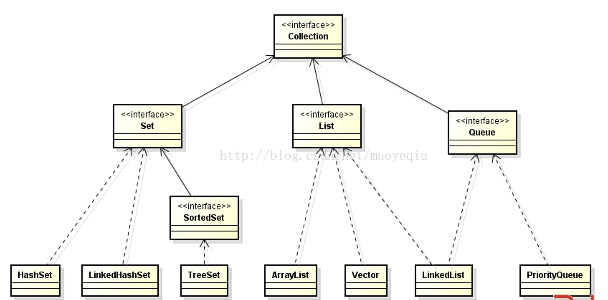
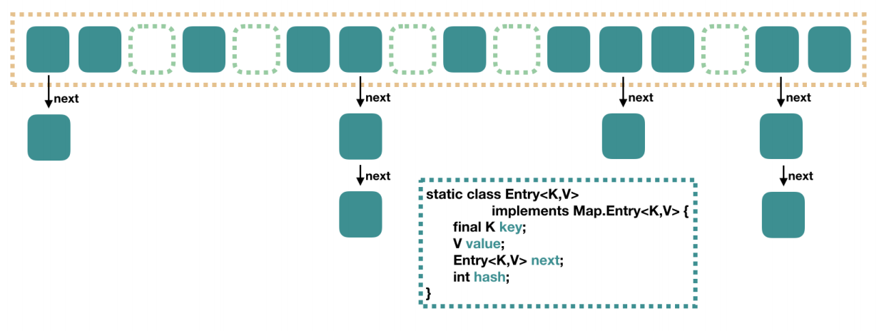
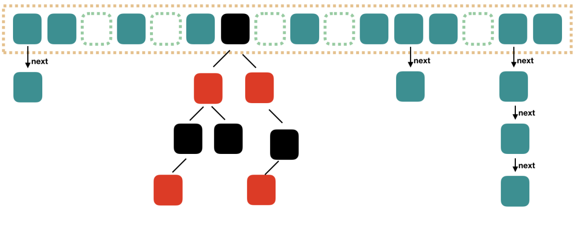
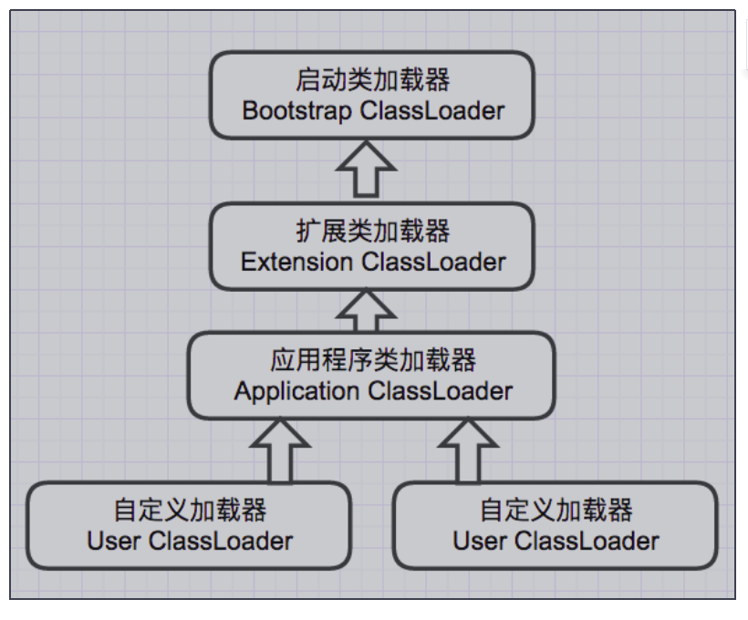
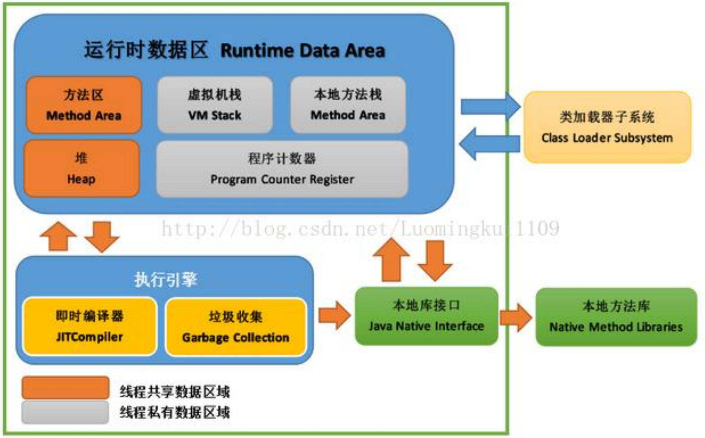
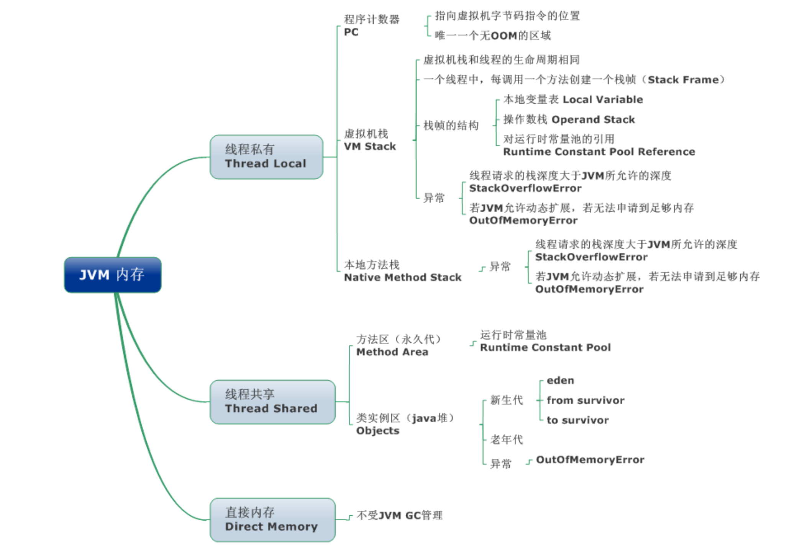
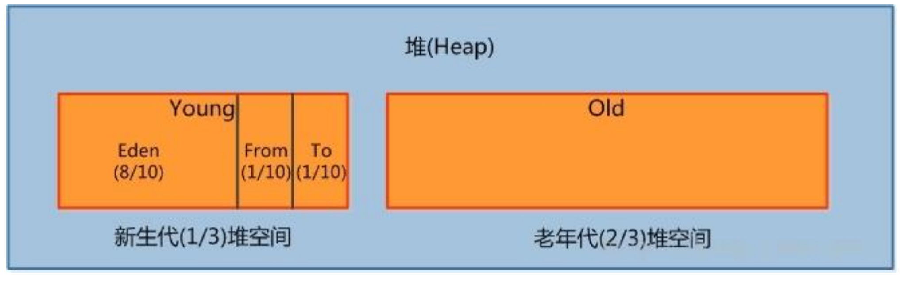
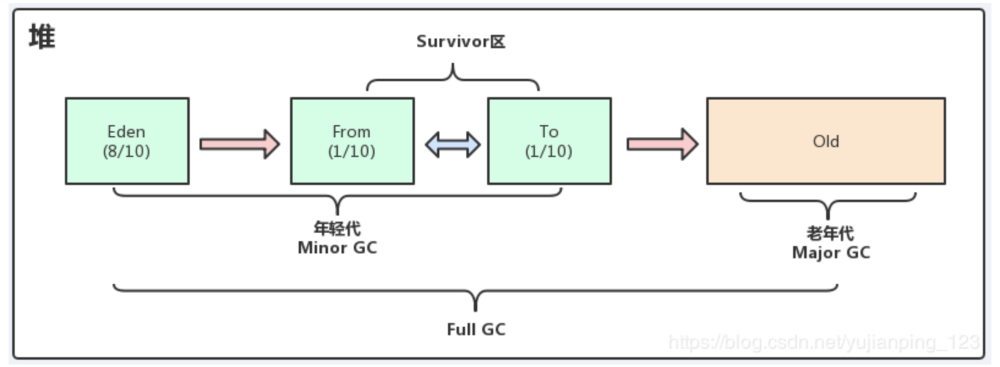

### String 是最基本的数据类型吗？是否可以被继承？

不是。String 类是 final 类，不可以被继承。


### switch 是否能作用在byte上，是否能作用在long上，是否能作用在String上

在Java 5以前，switch(expr)中，expr 只能是 byte、short、char、int。从 Java5 开始，Java 中引入了枚举类型，expr 也可以是 enum 类型，从 Java 7 开始，expr 还可以是字符串（String），但是长整型（long）在目前所有的版本中都是不可以的


### 访问修饰符public,private,protected,以及不写（默认）时的区别

**定义：**Java中，可以使用访问修饰符来保护对类、变量、方法和构造方法的访问。Java 支持 4 种不同的访问权限。
**分类：**
private : 在同一类内可见。使用对象：变量、方法。 
default (即缺省，什么也不写，不使用任何关键字）: 在同一包内可见，不使用任何修饰符。使用对象：类、接口、变量、方法。
protected : 对同一包内的类和所有子类可见。使用对象：变量、方法。 
public : 对所有类可见。使用对象：类、接口、变量、方法


### final 有什么用？

**用于修饰类、属性和方法**

- 被final修饰的类不可以被继承
- 被final修饰的方法不可以被重写
- 被final修饰的变量不可以被改变，被final修饰不可变的是变量的引用，而不是引用指向的内容，引用指向的内容是可以改变的


### final finally finalize区别

final可以修饰类、变量、方法，修饰类表示该类不能被继承、修饰方法表示该方法不能被重写、修饰变量表 示该变量是一个常量不能被重新赋值。
finally一般作用在try-catch代码块中，在处理异常的时候，通常我们将一定要执行的代码方法finally代码块 中，表示不管是否出现异常，该代码块都会执行，一般用来存放一些关闭资源的代码。
finalize是一个方法，属于**Object类的一个方法**，而Object类是所有类的父类，该方法一般由垃圾回收器来调 用，当我们**调用System.gc() 方法**的时候，由**垃圾回收器调用finalize()**，回收垃圾，一个对象是否可回收的 最后判断。

**ThreadLocal 是什么？**

`ThreadLocal` 是 Java 中用来实现**线程隔离**的工具。它可以让同一个变量在每个线程中都有自己的“副本”，线程之间互不干扰，从而保证线程安全。

------

**它是怎么工作的？**

- 每个线程内部都有一个 `ThreadLocalMap`（可以理解成一个 map）。
- 当你调用 `threadLocal.set(value)` 时，这个值会被存到当前线程的 `ThreadLocalMap` 中。
- 存储结构是：
  **key**：当前的 `ThreadLocal` 对象（弱引用）
  **value**：该线程的变量副本

> 所以，`ThreadLocal` 本身不存数据，它只是作为“钥匙”去线程里的 map 找对应的数据。

------

**为什么会有内存泄漏风险？**

- `ThreadLocal` 作为 key 是**弱引用**，在垃圾回收（GC）时可能被自动清理掉。
- 一旦 key 被回收了，map 中就会出现：**key 为 null，但 value 还在** 的“脏数据”。
- 因为 key 是 null，我们没法再访问这个 value，但它还占着内存。
- 如果不手动清理，就会造成**内存泄漏**。

------

**怎么避免内存泄漏？**

用完 `ThreadLocal` 后，一定要记得：

java浅色版本

```
threadLocal.remove();  // 清理当前线程的数据
```

或者调用 `set(null)`，也可以触发清理。

------

**小结一句话：**

> `ThreadLocal` 给每个线程提供独立变量副本，避免线程安全问题；但它作为 key 是弱引用，可能引发内存泄漏，所以用完记得调用 `remove()`！

------

**补充：**

- 如果不使用线程池（比如每个线程用完就结束），线程结束时它的 `ThreadLocalMap` 也会被回收，一般不会泄漏。
- **但在线程池中（线程复用）**，线程不会结束，所以必须手动 `remove()`，否则内存泄漏风险很高！

------

这样记就简单多了：

✅ 用 ThreadLocal → 每个线程有自己变量
 ⚠️ key 是弱引用 → 可能被回收 → 出现 null key
 💥 value 没清理 → 内存泄漏
 ✅ 解决办法：用完就 `threadLocal.remove()`

### static关键字

被static修饰的变量或者方法是独立于该类的任何对象，也就是说，这些变量和方法**不属于任何一个实例对象，而是被类的实例对象所共享**。

在该类被第一次加载的时候，就会去加载被static修饰的部分，而且只在类第一次使用时加载并进行初始化，注意这是第一次用就要初始化，后面根据需要是可以再次赋值的。

static变量值在类加载的时候分配空间，以后创建类对象的时候不会重新分配。赋值的话，是可以任意赋值的！

被static修饰的变量或者方法是优先于对象存在的，也就是说当一个类加载完毕之后，即便没有创建对象，也可以去访问。


### 什么是多态机制？

指程序中定义的引用变量所指向的具体类型和通过该引用变量发出的方法调用在**编程时并不确定**，而是在**程序运行期间才确定**，即一个引用变量倒底会指向哪个类的实例对象，该引用变量发出的方法调用到底是哪个类中实现的方法，必须在由程序运行期间才能决定。

多态分为编译时多态和运行时多态

编译时多态是静态的，主要是指方法的重载，它是根据参数列表的不同来区分不同的函数，通过编译之后会变成两个不同的函数

运行时多态是动态的，它是通过动态绑定来实现的，也就是我们所说的多态性。


### 多态的实现

**Java实现多态有三个必要条件：继承、重写、向上转型。**

继承：在多态中必须存在有继承关系的子类和父类。
重写：子类对父类中某些方法进行重新定义，在调用这些方法时就会调用子类的方法。
向上转型：在多态中需要将子类的引用赋给父类对象，只有这样该引用才能够具备技能调用父类的方法和子类的方法。


### 普通类和抽象类有哪些区别？

普通类不能包含抽象方法，抽象类可以包含抽象方法。

抽象类不能直接实例化，普通类可以直接实例化。


### 抽象类能使用 final 修饰吗？

不能，定义抽象类就是让其他类继承的，如果定义为 final 该类就不能被继承，这样彼此就会产生矛盾，所以 final 不能修饰抽象类。


### 抽象类和接口的区别

抽象类可以有构造方法，接口中不能有构造方法。

抽象类中可以有普通成员变量，接口中没有普通成员变量

抽象类中可以包含静态方法，接口中不能包含静态方法    

一个类可以实现多个接口，但只能继承一个抽象类。

接口可以被多重实现，抽象类只能被单一继承

如果抽象类实现接口，则可以把接口中方法映射到抽象类中作为抽象方法而不必实现，而在抽象类的子类中实现接口中方法


### Java中既然有了抽象类为什么还要引入接口？

就说一个：接口能解决多重继承

class Employee extends Person implements Comparable{

}


### 重载（Overload）和重写（Override）的区别。重载的方法能否根据返回类型进行区分？

方法的重载和重写都是实现多态的方式，区别在于前者实现的是**编译时的多态性**，而后者实现的是**运行时的多态性**。

重载：  比如构造器,发生在同一个类中，方法名相同**参数列表不同**（参数类型不同、个数不同、顺序不同），**与方法返回值和访问修饰符无关**，即**重载的方法不能根据返回类型进行区分。**

重写：发生在**父子类中，方法名、参数列表必须相同**，返回值小于等于父类，抛出的异常小于等于父类，访问修饰符大于等于父类；


### == 和 equals 的区别是什么？

**== :** 它的作用是判断两个**对象的地址**是否相等。即判断两个对象是不是同一个对象。(**基本数据类型 == 比较的是值**，**引用数据类型 == 比较的是内存地址**)。

**equals() :** 它的作用也是判断两个对象是否相等。但它一般有两种使用情况：

情况1：类没有覆盖 equals() 方法。比较该类的两个对象时，等价于通过“==”比较这两个对象。

情况2：重写了 equals() 方法。比较两个对象的内容相等；若它们的内容相等，则返回 true (即，认为这两个对象相等)。


### 为什么重写equals方法，还必须要重写hashcode方法

总结来说就是两点

1.**保证是同一个对象**，如果重写了equals方法，而没有重写hashcode方法，会出现equals相等的对象，hashcode不相等的情况，重写hashcode方法就是为了避免这种情况的出现。

如果不这样做的话，就会违反Object.hashCode的通用约定，从而导致该类无法结合所有基于散列的集合一起正常运作，这样的集合包括HashMap、HashSet和Hashtable。

2.使用hashcode方法**提前校验**，可以避免每一次比对都调用equals方法，**提高效率**

java利用哈希算法（也叫散列算法），将对象数据根据该对象的特征使用特定的算法将其定义到一个地址上，在后面定义进来的数据只   要看对应的hashcode地址上是否有值，有就用equals比较，如果没有则直接插入。这样大大减少了equals的使用次数，执行效率就大大提高了。


1. **先 `hashCode`，后 `equals`**：`hashCode` 用于快速定位到大致范围（哪个桶），`equals` 用于在范围内进行精确匹配。
2. **避免大量无谓的 `equals` 比较**：如果哈希码不同，直接判定为不同对象，无需执行耗时的 `equals` 方法。一个好的哈希算法能将数据均匀分布在各个桶中，使得每个桶内只有很少的元素，极大地提高了查询效率。

如果不重写 `hashCode`，所有对象都有不同的哈希码（默认行为），每个对象都会独占一个桶。虽然程序逻辑不会错，但**完全丧失了哈希表的性能优势**，变成了纯粹的线性查找。

1. **规则一 (`equals`)**：`equals` 方法判断两个对象在**内容**上是否相等，即它们是否是“同一个人”。
2. **规则二 (`hashCode`)**：`hashCode` 方法根据对象的**内容**计算一个唯一的身份证号码（哈希值）。

**关键约定：如果 `equals` 说两个对象是“同一个人”，那么它们的“身份证号码”（`hashCode`）也必须相同。**

**反之则不然：** 两个对象哈希码相同（哈希碰撞），`equals` 方法不一定认为它们相等。

**为了防止出现“逻辑上相等的两个对象，却拥有不同的哈希码”这种自相矛盾的情况，从而确保基于哈希的集合（如 `HashMap`, `HashSet`) 能正常工作。**


### 什么是反射机制？

JAVA反射机制是在**运行状态中**，对于任意一个类，都能够知道这个类的**所有属性和方法**；对于任意一个对象，都能够调用它的**方法和属性**；这种动态获取的信息以及动态调用对象的方法的功能称为java语言的反射机制。


### 你知道反射机制的应用场景有哪些？

动态代理设计模式采用了反射机制

JDBC连接数据库时使用Class.forName()通过反射加载数据库的驱动程序

一些自定义注解  比如在插入数据库时,一些公共的字段填充可以用到.

##### 优点：

1. **灵活性高**：可以在运行时动态操作类和对象
2. **扩展性强**：支持动态加载和使用类
3. **框架基础**：是许多框架（Spring、Hibernate等）的实现基础

##### 缺点：

1. **性能开销**：反射操作比直接调用慢
2. **安全性问题**：可以绕过访问权限检查
3. **代码复杂度**：使代码更难以理解和维护


### 什么是 java 序列化，如何实现 java序列化？

可以将一个对象保存到一个文件，所以可以通过流的方式在网络上传输，可以将文件的内容读取，转化为一个对象。

将需要被序列化的类实现 **Serializable** 接口，该接口没有需要实现的方法，implements Serializable 只是为了标注该对象是可被序列化的，然后使用一个输出流(如：FileOutputStream)来构造一个 ObjectOutputStream(对象流)对象，接着，使用ObjectOutputStream 对象的 writeObject(Object obj)方法就可以将参数为 obj 的对象写出(即保存其状态)，要恢复的话则用输入流


### **JAVA** **四中引用类型**

**强引用**

java最常见的就是强引用，把一个对象赋给一个引用变量，这个引用变量就是一个强引用。当一个对象被强引用变量引用时，它处于可达状态，它是不可能被垃圾回收机制回收的，即使该对象以后永远都不会被用到 JVM 也不会回收。因此强引用是造成 Java 内存泄漏的主要原因之一。


**软引用**

软引用需要用 SoftReference 类来实现，对于只有软引用的对象来说，当**系统内存足够时它不会被回收**，**当系统内存空间不足时它会被回收**。软引用通常用在对内存敏感的程序中。


**弱引用**

弱引用需要用 WeakReference 类来实现，它比软引用的生存期更短，对于只有弱引用的对象来说，只要垃圾回收机制一运行，不管 JVM 的内存空间是否足够，总会回收该对象占用的内存。


**虚引用**

虚引用需要 PhantomReference 类来实现，它不能单独使用，必须和引用队列联合使用。虚引用的主要作用是跟踪对象被垃圾回收的状

态。


**画一画集合框架Collection结构**




### ArrayList、Vector、LinkList

**ArrayList**

ArrayList 是最常用的 List 实现类，内部是通过**数组**实现的，它允许对元素进行快速随机访问。数组的缺点是每个元素之间不能有间隔，

当数组大小不满足时需要增加存储能力，就要将**已经有数组的数据复制到新的存储空间**中。当从 ArrayList 的中间位置插入或者删除元素

时，需要对数组进行复制、移动、代价比较高。因此，**它适合随机查找和遍历**，不适合插入和删除。

**Vector（数组实现、线程同步）**

Vector 与 ArrayList 一样，也是通过数组实现的，不同的是它支持线程的同步，即某一时刻只有一个线程能够写 Vector，避免多线程同时

写而引起的不一致性，但实现同步需要很高的花费，因此，访问它比访问 ArrayList 慢。

**LinkList（链表）**

LinkedList 是用**链表**结构存储数据的，很适合数据的动态插入和删除，随机访问和遍历速度比较慢。另外，他还提供了 List 接口中没有定

义的方法，专门用于操作表头和表尾元素，可以当作堆栈、队列和双向队列使用。


### **TreeSet**

- TreeSet()是使用**二叉树的原理**对新 add()的对象按照指定的顺序排序（升序、降序），每增加一个对象都会进行排序，将对象插入的二叉树指定的位置。
- Integer 和 String 对象都可以进行默认的 TreeSet 排序，而自定义类的对象是不可以的，自己定义的类**必须实现 Comparable 接口**，并且**覆写相应的 compareTo()方法**，才可以正常使用。
- 在覆写 compare()函数时，要返回相应的值才能使 TreeSet 按照一定的规则来排序
- 比较此对象与指定对象的顺序。如果该对象小于、等于或大于指定对象，则分别返回负整数、零或正整数。


### HashMap

HashMap 根据键的 hashCode 值存储数据，大多数情况下可以直接定位到它的值，因而具有很快的访问速度，但遍历顺序却是不确定

的。 HashMap 最多只允许一条记录的键为 null，允许多条记录的值为 null。HashMap 非线程安全，任一时刻可以有多个线程同时写 

HashMap，可能会导致数据的不一致。如果需要满足线程安全，可以用 Collections 的 synchronizedMap 方法使HashMap 具有线程安

全的能力，或者使用 ConcurrentHashMap


**java7实现**




**java8实现**

Java8 对 HashMap 进行了一些修改，最大的不同就是利用了**红黑树**，所以其由 数组+链表+红黑树 组成。

根据 Java7 HashMap 的介绍，我们知道，查找的时候，根据 hash 值我们能够快速定位到数组的具体下标，但是之后的话，需要顺着链

表一个个比较下去才能找到我们需要的，时间复杂度取决于链表的长度，为 O(n)。为了降低这部分的开销，在 Java8 中，当**链表中的元素**

**超过了 8 个以后，会将链表转换为红黑树**，在这些位置进行查找的时候可以降低时间复杂度为 O(logN)。





### **LinkHashMap**

LinkedHashMap 是 HashMap 的一个子类，保存了记录的插入顺序，在用 Iterator 遍历LinkedHashMap 时，先得到的记录肯定是先插入的，也可以在构造时带参数，按照访问次序排序


### JVM

#### 基本概念

JVM 是可运行 Java 代码的假想计算机 ，包括一套字节码指令集、一组寄存器、一个栈、一个垃圾回收，堆 和 一个存储方法域。JVM 

是运行在操作系统之上的，它与硬件没有直接的交互。


#### 运行过程

我们都知道 Java 源文件，通过编译器，能够生产相应的.Class 文件，也就是字节码文件，而字节码文件又通过 Java 虚拟机中的解释器，编译成特定机器上的机器码 。也就是如下：

① Java 源文件—->编译器—->字节码文件

② 字节码文件—->JVM—->机器码

每一种平台的解释器是不同的，但是实现的虚拟机是相同的，这也就是 Java 为什么能够跨平台的原因了


#### 说说JVM类加载器

**启动类加载器(Bootstrap ClassLoader)**

负责加载 JAVA_HOME\lib 目录中的，或通过-Xbootclasspath 参数指定路径中的，且被虚拟机认可（按文件名识别，如 rt.jar）的类。

**扩展类加载器(Extension ClassLoader)**

负责加载 JAVA_HOME\lib\ext 目录中的，或通过 java.ext.dirs 系统变量指定路径中的类库。

**应用程序类加载器(Application ClassLoader)**

负责加载用户路径（classpath）上的类库


JVM 通过双亲委派模型进行类的加载，当然我们也可以通过继承 java.lang.ClassLoader实现自定义的类加载器。



#### 解释下双亲委派

当一个类收到了类加载请求，他首先不会尝试自己去加载这个类，而是把这个请求委派给父类去完成，每一个层次类加载器都是如此，因

此所有的加载请求都应该传送到启动类加载其中，只有当父类加载器反馈自己无法完成这个请求的时候（在它的加载路径下没有找到所需

加载的Class），子类加载器才会尝试自己去加载。

采用双亲委派的一个好处是比如加载位于 rt.jar 包中的类 java.lang.Object，不管是哪个加载器加载这个类，最终都是委托给顶层的启动

类加载器进行加载，这样就保证了使用不同的类加载器最终得到的都是同样一个 Object 对象。


#### tomcat为什么要打破双亲委派机制

Tomcat作为一个Web应用服务器，它允许部署和运行多个独立的Web应用程序，在传统的双亲委派机制下，所有的Web应用程序共享同一个父类加载器（通常是系统类加载器），这可能导致以下问题：

1. 类冲突：由于所有Web应用程序共享同一个类加载器，如果不同的应用程序中存在相同包名和类名的类，会导致类冲突，无法正确加载和使用这些类。
2. 动态更新：在运行时动态更新Web应用程序的某些类文件，由于双亲委派机制的限制，无法直接加载新的类定义，需要重启应用程序才能生效，影响应用的灵活性和可用性。

为了解决上述问题，Tomcat引入了类加载器的分级机制，打破了双亲委派机制。在Tomcat中，每个Web应用程序都有自己的Web应用类加载器（WebAppClassLoader），它负责加载应用程序的类和资源。Web应用类加载器在加载类时会先检查自己是否已加载，如果未加载则尝试加载，而不委派给父加载器。

通过打破双亲委派机制，Tomcat能够实现以下优势：

1. 隔离性：每个Web应用程序拥有独立的类加载器，可以隔离类加载的命名空间，避免类冲突问题。
2. 动态更新：每个Web应用程序的类加载器可以独立加载和重新加载类定义，实现应用程序的热部署和动态更新。
3. 可定制性：Tomcat的类加载器机制允许开发人员自定义类加载器，实现特定的类加载策略，满足应用程序的特殊需求。


#### 结构




#### JVM内存

JVM 内存区域主要分为线程私有区域【程序计数器、虚拟机栈、本地方法区】、线程共享区域【JAVA 堆、方法区】、直接内存



**方法区**

我们常说的**永久代(Permanent Generation)**, 用于存储**被 JVM 加载的类信息**、**常量**、**静态变量**、**即时编译器编译后的代码**等数据.


**堆**

是被线程共享的一块内存区域，创建的对象和数组都保存在 Java 堆内存中，也是垃圾收集器进行垃圾收集的最重要的内存区域。由于现代 VM 采用**分代收集算法**, 因此 Java 堆从 GC 的角度还可以细分为: **新生代**(*Eden 区*、*From Survivor 区*和 *To Survivor 区*)和**老年代。**


##### JVM运行时内存



**新生代：**

是用来存放新生的对象。一般占据堆的 1/3 空间。由于频繁创建对象，所以新生代会频繁触发MinorGC 进行垃圾回收。新生代又分为 Eden 区、ServivorFrom、ServivorTo 三个区

**Eden** **区**

Java 新对象的出生地（如果新创建的对象占用内存很大，则直接分配到老年代）。当 Eden 区内存不够的时候就会触发 MinorGC，对新生代区进行一次垃圾回收。

**ServivorFrom**

上一次 GC 的幸存者，作为这一次 GC 的被扫描者。

**ServivorTo**

保留了一次 MinorGC 过程中的幸存者。

**老年代**

主要存放应用程序中生命周期长的内存对象。


#### 垃圾回收(GC)

Java的垃圾回收机制是Java虚拟机提供的能力，用于在空闲时间以不定时的方式动态回收无任何引用的对象占据的内存空间。


##### GC的种类**



Minor GC(Young GC)：从年轻代回收内存     

Major GC(Old GC)：清理老年代

Full GC：清理整个堆空间，包括年轻代和老年代


##### GC触发的条件有两种：**

（1）程序调用System.gc时可以触发；

（2）系统自身来决定GC触发的时机


##### 垃圾回收流程

1）我们创建的对象会优先在Eden分配，如果是大对象（很长的字符串数组）则可以直接进入老年代；

2）当Eden区填满时，触发 Minor GC，此时将 `Eden`中还存活的对象复制到 `S0`中，并清空 `Eden`区后继续为新的对象分配内存。

3）当`Eden`区再次满后，触发又一次的 Minor GC，此时会将 `Eden`和`S0`中存活的对象复制到 `S1`中，然后清空`Eden`和`S0`后继续为新的对象分配

4）当对象在 Survivor 区躲过一次Minor GC 后，其年龄就会+1， 默认情况下年龄到达 15 的对象会被移到老年代中。 

5）对象优先在Eden区中分配，当Eden区中没有足够空间时，虚拟机将发生一次Minor GC，因为Java大多数对象都是朝生夕灭，所以Minor GC非常频繁，而且速度也很快。当老年代内存不足时,再次触发 Major GC,进行老年代的内存清理，处理完还不足时，会产生Full GC，当执行Full GC后空间仍然不足，则抛出如下错误Java.lang.OutOfMemoryError:


**Survivor的存在意义，就是减少被送到老年代的对象，进而减少Full GC的发生。**


##### 垃圾回收算法

**标记清除算法**，（执行效率不可控、产生内存碎片）

**标记复制算法**，(存在浪费空间问题)

**标记整理法**,（解决了内存碎片问题，也不存在空间的浪费问题，但是，当内存中存活对象多，并且都是一些微小对象，而垃圾对象少时，要移动大量的存活对象才能换取少量的内存空间）。

**分代收集法**(分代收集算法会结合不同的收集算法来处理不同的空间)


#### JVM调优

#####  JVM调优是主要调什么

JVM调优主要是减少GC的频率和Full GC次数，STW（stop the world）的停顿时间和次数


STW指的是GC事件发生过程中，会产生应用程序的停顿。停顿产生时整个应用程序线程都会被暂停，没有任何响应, 有点像卡死的感觉，这个停顿称为STW。Java中一种全局暂停现象，全局停顿，所有Java代码停止，native代码可以执行，但不能与JVM交互；这些现象多半是由于gc引起。


##### 调优步骤

一般JVM调优，重点在于调整JVM堆大小、调整垃圾回收器

1）监控GC状态

2）生成堆的dump文件

​      主动：(jmap -dump:format=b,file=user.dump 1246)

​      自动：-XX:+HeapDumpOnOutOfMemoryError -XX:HeapDumpPath=/usr/app

3）分析dump文件（Jprofiler、MAT）

4）分析结果，判断是否需要进行优化


线上出现频繁的GC或者FullGC解决步骤234


##### jvm调优常用参数

​      通用GC参数
​     -Xmn：年轻代大小   -Xms：堆初始大小  -Xmx：堆最大大小  -Xss：栈大小

​    -XX:+UseTlab：使用tlab，默认打开，涉及到对象分配问题

​    -XX:+PrintTlab：打印tlab使用情况

​    -XX:+TlabSize：设置Tlab大小

​    -XX:+DisabledExplictGC：java代码中的System.gc()不再生效，防止代码中误写，导致频繁触动GC，默认不起用。

​    -XX:+PrintGC(+PrintGCDetails/+PrintGCTimeStamps)打印GC信息(打印GC详细信息/打印GC执行时间)

​    -XX:+PrintHeapAtGC打印GC时的堆信息

​    -XX:+PrintGCApplicationConcurrentTime 打印应用程序的时间

​    -XX:+PrintGCApplicationStopedTime 打印应用程序暂停时间

​    -XX:+PrintReferenceGC 打印回收多少种引用类型的引用

​    -verboss:class 类加载详细过程

​    -XX:+PrintVMOptions 打印JVM运行参数

​    -XX:+PrintFlagsFinal(+PrintFlagsInitial)  -version | grep 查找想要了解的命令，很重要

​    -X:loggc:/opt/gc/log/path  输出gc信息到文件

​    -XX:MaxTenuringThreshold  设置gc升到年龄，最大值为15

​    parallel常用参数
​    -XX:PreTenureSizeThreshold 多大的对象判定为大对象，直接晋升老年代

​    -XX:+ParallelGCThreads 用于并发垃圾回收的线程

​    -XX:+UseAdaptiveSizePolicy 自动选择各区比例

​    CMS常用参数
​    -XX:+UseConcMarkSweepGC 使用CMS垃圾回收器

​    -XX:parallelCMSThreads CMS线程数量

​    -XX:CMSInitiatingOccupancyFraction 占用多少比例的老年代时开始CMS回收，默认值68%，如果频繁发生serial old，适当调小该比例，降低FGC频率

​    -XX:+UseCMSCompactAtFullCollection 进行压缩整理

​    -XX:CMSFullGCBeforeCompaction 多少次FGC以后进行压缩整理

​    -XX:+CMSClassUnloadingEnabled 回收永久代

​    -XX:+CMSInitiatingPermOccupancyFraction 达到什么比例时进行永久代回收

​    GCTimeTatio 设置GC时间占用程序运行时间的百分比，该参数只能是尽量达到该百分比，不是肯定达到

​    -XX:MaxGCPauseMills GCt停顿时间，该参数也是尽量达到，而不是肯定达到

​    G1常用参数
​    -XX:+UseG1 使用G1垃圾回收器

​    -XX:MaxGCPauseMills GCt停顿时间，该参数也是尽量达到，G1会调整yong区的块数来达到这个值

​    -XX:+G1HeapRegionSize 分区大小，范围为1M~32M，必须是2的n次幂，size越大，GC回收间隔越大，但是GC所用时间越长

​    G1NewSizePercent 新生代所占最小比例，默认5%

​    G1MaxNewSizePercent 新生代所占最大比例，默认60%

​    GCTimeRatio GC时间比例，此值为建议值，G1会调整堆大小来尽量达到这个值

​    ConcGCThreads GC线程数量

​    InitiatingHeapOccupancyPercent 启动G1的堆空间占用比例


````````````````````````````                                                                                                                                                                       
