#### **内连接和外连接的区别？**

- 内连接会取出连接表中匹配到的数据，匹配不到的不保留；

- 外连接会取出连接表中匹配到的数据，匹配不到的也会保留，其值为NULL。


#### **left join 和 right join的区别？**

- 左外连接，以左边的表为主表
- 右外连接，以右边的表为主表

以某一个表为主表后，进行关联查询，不管能不能关联的上，主表的数据都会保留，关联不上的以NULL显示


#### **int(1)和int(10) 能存储的数据上限是一样的吗？**

mysql官方解释：

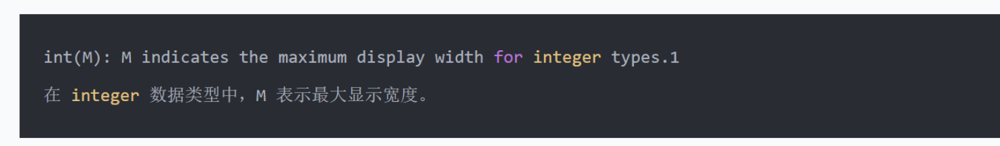 

在int(M)中，M的值跟int(M) 所占多少存储空间并无任何关系。

int(3)、int(8)、int(11)在磁盘上都是占用 4bytes的存储空间，所以int(1)和int(10)数据存储上限是一样的。

那么设置int(M)中的M的意义是什么呢？其实设置M得和zerofill结合起来才会生效

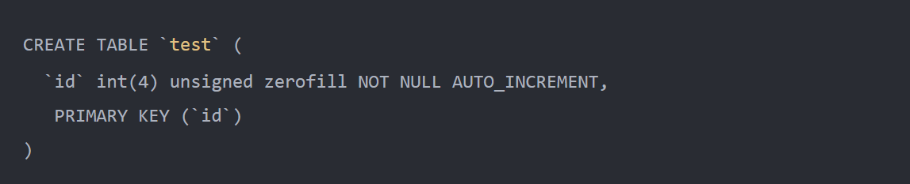 

 

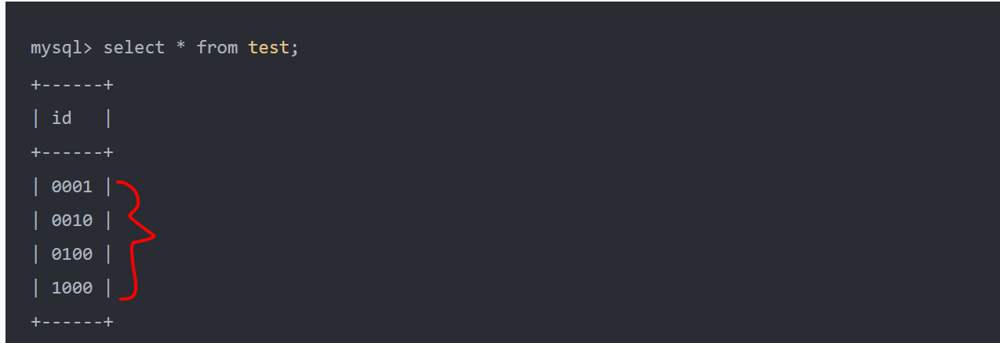 


#### **union 和 union all有什么区别？**

UNION和UNION ALL的主要区别在于是否去除重复记录和是否进行排序操作。

- union 会将多个结果集合中的重复记录去重,且会对结果排序
- union all 会显示所有结果,包括重复记录,且不会对结果排序.

此外，从效率的角度来看，如果查询不需要去除重复记录且不需要排序，使用UNION ALL通常比使用UNION效率更高。


#### **事务的ACID是什么？**

A=Atomicity原子性：就是上面说的,要么全部成功,要么全部失败，不可能只执行一部分操作。

C=Consistency一致性：系统(数据库)总是从一个一致性的状态转移到另一个一致性的状态,不会存在中间状态。

I=Isolation隔离性: **通常**来说:一个事务在完全提交之前,对其他事务是不可见的.注意前面的通常来说加粗,意味着有例外情况。

D=Durability持久性：一旦事务提交,那么就永远是这样子了,哪怕系统崩溃也不会影响到这个事务的结果。

>举例：转账
>
>A向B转账500，转账成功，A扣除500元，B增加500元，原子操作体现在要么都成功，要么都失败
>
>在转账的过程中，数据要一致，A扣除了500，B必须增加500
>
>在转账的过程中，隔离性体现在A像B转账，不能受其他事务干扰
>
>在转账的过程中，持久性体现在事务提交后，要把数据持久化（可以说是落盘操作）


#### **解释下什么是脏读？**

当一个事务正在访问数据并且对数据进行了修改，而这种修改还没有提交到数据库中，这时另外一个事务也访问了这个数据，然后使用了这个数据。因为这个数据是还没有提交的数据，那么另外一个事务读到的这个数据是“脏数据”，依据“脏数据”所做的操作可能是不正确的。


#### **解释下什么是不可重复读？**

指在一个事务内多次读同一数据。在这个事务还没有结束时，另一个事务也访问该数据。那么，在第一个事务中的两次读数据之间，由于第二个事务的修改导致第一个事务两次读取的数据可能不太一样。这就发生了在一个事务内两次读到的数据是不一样的情况，因此称为不可重复读。


#### **解释下什么是幻读？**

幻读与不可重复读类似。它发生在一个事务（T1）读取了几行数据，接着另一个并发事务（T2）插入了一些数据时。在随后的查询中，第一个事务（T1）就会发现多了一些原本不存在的记录，就好像发生了幻觉一样，所以称为幻读。


#### **mysql的事务隔离级别有哪些？默认是什么？**

**隔离级别**：未提交读(READ UNCOMMITTED)、已提交读(READ COMMITTED)、REPEATABLE READ(可重复读)、SERIALIZABLE(可串行化)


**未提交读(READ UNCOMMITTED)**：这个隔离级别下,其他事务可以看到本事务没有提交的部分修改。因此会造成脏读的问题(读取到了其他事务未提交的部分,而之后该事务进行了回滚)。这个级别的性能没有足够大的优势,但是又有很多的问题,因此很少使用.

sql演示：

```sql
# 插入数据
insert into goods_innodb(name) values('华为');
insert into goods_innodb(name) values('小米');

# 会话一
set session transaction isolation level read uncommitted ;		# 设置事务的隔离级别为read uncommitted
start transaction;												# 开启事务
select * from goods_innodb ;									# 查询数据

# 会话二
set session transaction isolation level read uncommitted ;		# 设置事务的隔离级别为read uncommitted
start transaction ;												# 开启事务
update goods_innodb set name = '中兴' where id = 1 ;			   # 修改数据

# 会话一
select * from goods_innodb ;									# 查询数据
```

**已提交读(READ COMMITTED)**：其他事务只能读取到本事务已经提交的部分。这个隔离级别有不可重复读的问题，在同一个事务内的两次读取,拿到的结果竟然不一样,因为另外一个事务对数据进行了修改。

sql演示：

```sql
# 会话一
set session transaction isolation level read committed ;		# 设置事务的隔离级别为read committed
start transaction ;												# 开启事务
select * from goods_innodb ;									# 查询数据

# 会话二
set session transaction isolation level read committed ;		# 设置事务的隔离级别为read committed
start transaction ;												# 开启事务
update goods_innodb set name = '华为' where id = 1 ;			   # 修改数据

# 会话一
select * from goods_innodb ;									# 查询数据

# 会话二
commit;															# 提交事务

# 会话一
select * from goods_innodb ;									# 查询数据
```

**REPEATABLE READ(可重复读)**：可重复读隔离级别解决了上面不可重复读的问题(看名字也知道)，但是不能完全解决幻读。MySql默认的事务隔离级别就是：**REPEATABLE READ**

```sql
select @@tx_isolation;
```

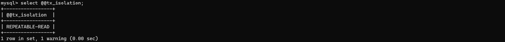 


sql演示(解决不可重复读)：

```sql
# 会话一
start transaction ;												# 开启事务
select * from goods_innodb ;									# 查询数据

# 会话二
start transaction ;												# 开启事务
update goods_innodb set name = '荣耀' where id = 1 ;			   # 修改数据

# 会话一
select * from goods_innodb ;									# 查询数据

# 会话二
commit;															# 提交事务

# 会话一
select * from goods_innodb ;									# 查询数据
```

sql演示(测试不会出现幻读的情况)：

```sql
# 会话一
start transaction ;												# 开启事务
select * from goods_innodb ;									# 查询数据

# 会话二
start transaction ;												# 开启事务
insert into goods_innodb(name) values('opp');			   	   # 插入数据
commit;															# 提交事务

# 会话一
select * from goods_innodb ;									# 查询数据
```


sql演示(测试出现幻读的情况)：

```sql
# 表结构进行修改
ALTER TABLE goods_innodb ADD version int(10) NULL ;

# 会话一
start transaction ;												# 开启事务
select * from goods_innodb where version = 1;					# 查询一条不满足条件的数据

# 会话二
start transaction ;												# 开启事务
insert into goods_innodb(name, version) values('vivo', 1);	    # 插入一条满足条件的数据 
commit;															# 提交事务

# 会话一
update goods_innodb set name = '金立' where version = 1; 		   # 将version为1的数据更改为'金立'
select * from goods_innodb where version = 1;					# 查询一条不满足条件的数据
```

**SERIALIZABLE(可串行化)**：这是最高的隔离级别,可以解决上面提到的所有问题，通过**加锁**，来实现事务的隔离性的。这就好像，如果你想一个人静静，不被别人打扰，你就可以在房门上加上一把锁。

加锁确实好使，可以保证隔离性。

但是频繁的加锁，导致读数据时，没办法修改，修改数据时，没办法读取，大大**降低了数据库性能**。


#### **解释下MVCC**

全称 Multi-Version Concurrency Control，**多版本并发控制。**

通俗的讲，数据库中同时存在多个版本的数据，并不是整个数据库的多个版本，而是某一条记录的多个版本同时存在，在某个事务对其进行操作的时候，需要查看这一条记录的隐藏列事务版本id，比对事务id并根据事物隔离级别去判断读取哪个版本的数据。

数据库隔离级别**读已提交、可重复读** 都是基于MVCC实现的。


MVCC（多版本并发控制）是数据库（如 MySQL InnoDB）处理并发访问的核心机制，主要作用是解决读写冲突，提升并发性能。

其核心原理是为数据行保存多个版本，通过版本管理让读写操作不互斥：

- 关键组成包括：每行数据的隐藏列（DB_TRX_ID 记录最后修改的事务 ID、DB_ROLL_PTR 指向历史版本）、undo log（存储历史版本形成版本链）、Read View（读视图，判断当前事务能看到哪些版本）。

工作时，事务修改数据会生成新版本（旧版本存入 undo log），读取数据时通过 Read View 在版本链中找到可见版本，实现 “读不加锁、写不阻塞读”。

它与隔离级别的关联体现在 Read View 生成时机：读已提交（RC）每次查询都生成新 View，可能出现不可重复读；可重复读（RR）仅首次查询生成 View，保证事务内读取结果一致，这也是 MySQL RR 级别能避免不可重复读的原因。

总体来说，MVCC 通过**多版本和版本可见性判断**，在**保证数据一致性**的同时大幅提升了**数据库并发能力**。


**MVCC的关键点**：隐式字段、事务版本号、undo log、版本链、快照读和当前读、Read View

**隐式字段**

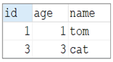 

当我们创建了上面的这张表，我们在查看表结构的时候，就可以显式的看到这三个字段。 实际上除了这三个字段以外，InnoDB还会自动的给我们添加三个隐藏字段及其含义分别是：

| 隐藏字段    | 含义                                                         |
| ----------- | ------------------------------------------------------------ |
| DB_TRX_ID   | 最近修改事务ID，记录插入这条记录或最后一次修改该记录的事务ID。 |
| DB_ROLL_PTR | 回滚指针，指向这条记录的上一个版本，用于配合undo  log，指向上一个版本。 |
| DB_ROW_ID   | 隐藏主键，如果表结构没有指定主键，将会生成该隐藏字段。       |

而上述的前两个字段是肯定会添加的， 是否添加最后一个字段DB_ROW_ID，得看当前表有没有主键，如果有主键，则不会添加该隐藏字段。

**事务版本号**

事务每次开启前，都会从数据库获得一个**自增**长的事务ID，可以从事务ID判断事务的执行先后顺序。这就是事务版本号。


**undolog**

用于记录数据被修改前的信息。在表记录修改之前，会在undo log里记录一条反向操作记录，如果事务回滚，即可以通过undo log来还原数据。

可以这样认为，当delete一条记录时，undo log 中会记录一条对应的insert记录，当update一条记录时，它记录一条对应相反的update记录。


**版本链**

多个事务并行操作某一行数据时，不同事务对该行数据的修改会产生多个版本，然后通过回滚指针（roll_pointer），连成一个链表，这个链表就称为**版本链**。如下：

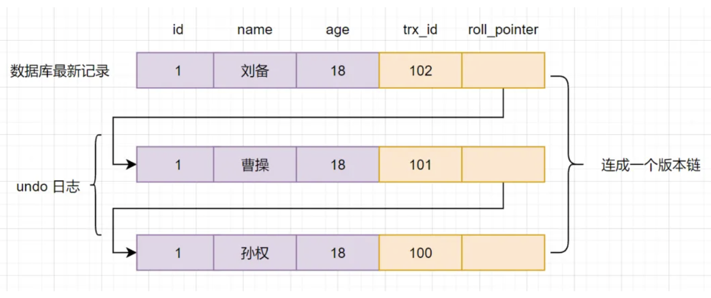


其实，通过版本链，我们就可以看出**事务版本号、表格隐藏的列和undo log**它们之间的关系。我们再来小分析一下。

1. 假设现在有一张core_user表，表里面有一条数据,id为1，名字为孙权：


1. 现在开启一个事务A：对core_user表执行`update core_user set name ="曹操" where id=1`,会进行如下流程操作

- 首先获得一个事务ID=100
- 把core_user表修改前的数据,拷贝到undo log
- 修改core_user表中，id=1的数据，名字改为曹操
- 把修改后的数据事务Id=101改成当前事务版本号，并把**roll_pointer**指向undo log数据地址。


**快照读和当前读**

**快照读：** 读取的是记录数据的可见版本（有旧的版本）。不加锁,普通的select语句都是快照读,如：

```
select * from student where id > 2;
```

**当前读**：读取的是记录数据的最新版本，**对读取的记录加锁, 阻塞其他事务同时改动相同记录**，避免出现安全问题

```
select * from student where id > 2 for update; 
select * from student where id > 2 lock in share mode;
```


**readview**

**是什么？** 它就是事务执行SQL语句时，产生的读视图。实际上在innodb中，每个SQL语句执行前都会得到一个Read View。

**有什么用？** 它主要是用来做可见性判断的，即判断当前事务可见哪个版本的数据~


#### 查询一条记录，基于MVCC，是怎样的流程

1. 获取事务自己的版本号，即事务ID
2. 获取Read View
3. 查询得到的数据，然后Read View中的事务版本号进行比较。
4. 如果不符合Read View的可见性规则， 即就需要Undo log中历史快照;
5. 最后返回符合规则的数据

InnoDB 实现MVCC，是通过`Read View+ Undo Log` 实现的，Undo Log 保存了历史快照，Read View可见性规则帮助判断当前版本的数据是否可见。


#### **mysql的存储引擎类型有哪些？有什么区别？**

- - MyISAM存储引擎
    - 访问快,不支持事务和外键。表结构保存在.frm文件中，表数据保存在.MYD文件中，索引保存在.MYI文件中。
  - InnoDB存储引擎(MySQL5.5版本后默认的存储引擎)
    - 支持事务 ,占用磁盘空间大 ,支持并发控制。表结构保存在.frm文件中，如果是共享表空间，数据和索引保存在 innodb_data_home_dir 和 innodb_data_file_path定义的表空间中，可以是多个文件。如果是多表空间存储，每个表的数据和索引单独保存在 .ibd 中。
  - MEMORY存储引擎
    - 内存存储 , 速度快 ,不安全 ,适合小量快速访问的数据。表结构保存在.frm中。
- 特性对比

| 特性         | MyISAM     | InnoDB        | MEMORY     |
| ------------ | ---------- | ------------- | ---------- |
| **事务安全** | **不支持** | **支持**      | **不支持** |
| **锁机制**   | **表锁**   | **表锁/行锁** | **表锁**   |
| **外键**     | **不支持** | **支持**      | **不支持** |


#### **解释下mysql的索引？**

索引（index）是帮助MySQL高效获取数据的数据结构(有序)。在数据之外，数据库系统还维护着满足**特定查找算法的数据结构**（B+树），这些数据结构以某种方式引用（指向）数据， 这样就可以在这些数据结构上实现高级查找算法，这种数据结构就是索引。


#### **索引的底层数据结构是什么？**

MySQL默认使用的索引底层数据结构是B+树。

MySQL索引数据结构对经典的B+Tree进行了优化。在原B+Tree的基础上，增加一个指向相邻叶子节点的链表指针，就形成了带有顺序指针的B+Tree，提高区间访问的性能，利于排序。


**为什么要用B+树**

1. B+树能显著减少IO次数，提高效率
2. B+树的查询效率更加稳定，因为数据放在叶子节点
3. B+树能提高范围查询的效率，因为增加了一个指向相邻叶子节点的链表指针，就形成了带有顺序指针的B+Tree，提高区间访问的性能，利于排序。


#### **聚簇(集）索引和非聚簇(集)索引有什么区别？**

而在在InnoDB存储引擎中，根据索引的存储形式，又可以分为以下两种：

| 分类                       | 含义                                                       | 特点                |
| -------------------------- | ---------------------------------------------------------- | ------------------- |
| 聚集索引(Clustered  Index) | 将数据存储与索引放到了一块，索引结构的叶子节点保存了行数据 | 必须有,而且只有一个 |
| 二级索引(Secondary  Index) | 将数据与索引分开存储，索引结构的叶子节点关联的是对应的主键 | 可以存在多个        |

聚集索引选取规则:

- 如果存在主键，主键索引就是聚集索引。

- 如果不存在主键，将使用第一个唯一（UNIQUE）索引作为聚集索引。

- 如果表没有主键，或没有合适的唯一索引，则InnoDB会自动生成一个rowid作为隐藏的聚集索引。


聚集索引和二级索引的具体结构如下： 

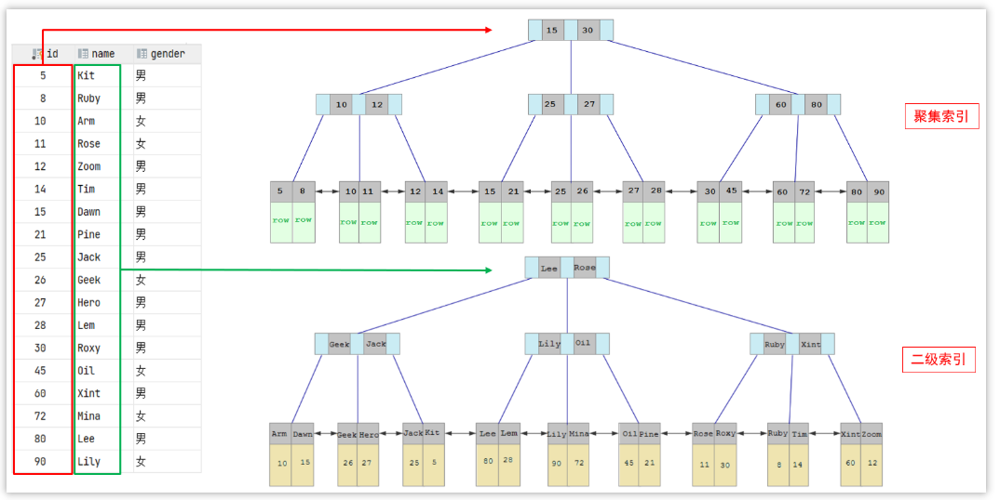 

- 聚集索引的叶子节点下挂的是这一行的数据 。
- 二级索引的叶子节点下挂的是该字段值对应的主键值。


#### **知道什么是回表查询吗？**

介绍回表之前，我们先看一个例子

比如执行了一条sql语句`select * from user where name = 'Arm'`，其中name字段已经创建了索引

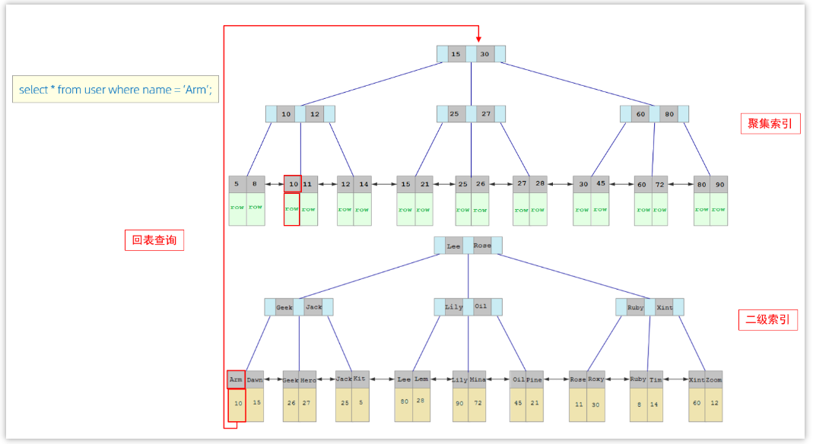 

具体过程如下:

①. 由于是根据name字段进行查询，所以先根据name='Arm'到name字段的二级索引中进行匹配查找。但是在二级索引中只能查找到 Arm 对应的主键值 10。

②. 由于查询返回的数据是*，所以此时，还需要根据主键值10，到聚集索引中查找10对应的记录，最终找到10对应的行row。 

③. 最终拿到这一行的数据，直接返回即可。 

**回表查询：** 这种先到二级索引中查找数据，找到主键值，然后再到聚集索引中根据主键值，获取数据的方式，就称之为回表查询。


#### **创建索引需要注意些什么？**

1). 针对于数据量较大，且查询比较频繁的表建立索引。

2). 针对于常作为查询条件（where）、排序（order by）、分组（group by）操作的字段建立索引。

3). 尽量选择区分度高的列作为索引，尽量建立唯一索引，区分度越高，使用索引的效率越高。

4). 尽量使用联合索引，减少单列索引，查询时，联合索引很多时候可以覆盖索引，节省存储空间，避免回表，提高查询效率。

5). 要控制索引的数量，索引并不是多多益善，索引越多，维护索引结构的代价也就越大，会影响增删改的效率。


#### **什么是最左前缀原则？**

如果索引了多列（联合索引），要遵守最左前缀法则。最左前缀法则指的是查询从索引的最左列开始，并且不跳过索引中的列。如果跳跃某一列，索引将会部分失效(后面的字段索引失效)。

```
CREATE INDEX idx_name_age ON users (name, age,phone);
本质上是创建了三个索引，
分别是：name
       name、age
       name、age、phone
最左前缀法则要求查询条件中必须包含name字段，如果不包含则不会走索引
SELECT * FROM users WHERE age = 25;
SELECT * FROM users WHERE name= ‘zhangsan’ and age=11;
SELECT * FROM users WHERE phone=’1811212322’ and name=’zhang’;
```


#### **什么是覆盖索引？**

1.覆盖索引是一种数据查询方式，不是索引类型
2.在索引数据结构中，通过索引值可以直接找到要查询字段的值，而不需要通过主键值回表查询，那么就叫覆盖索引
3.查询的字段被使用到的索引树全部覆盖到

假设定义一个联合索引


查询名称为 liudehua 的年龄：


上述语句中，查找的字段 name 和 age 都包含在联合索引 idx_name_age 的索引树中，这样的查询就是覆盖索引查询。


#### **如何定位慢查询？**

可以开启mysql的慢查询日志

慢查询日志记录了所有执行时间超过指定参数（long_query_time，单位：秒，默认10秒）的所有SQL语句的日志。 

如果要开启慢查询日志，需要在MySQL的配置文件（/etc/my.cnf）中配置如下信息：

```properties
# 开启MySQL慢日志查询开关
slow_query_log=1
# 设置慢日志的时间为2秒，SQL语句执行时间超过2秒，就会视为慢查询，记录慢查询日志
long_query_time=2
```

配置完毕之后，通过以下指令重新启动MySQL服务器进行测试，查看慢日志文件中记录的信息 /var/lib/mysql/localhost-slow.log。

如果这个时候有一条sql执行的时间超过2秒，则会记录到慢日志文件中


#### **一个SQL执行很慢，如何分析？**

可以采用EXPLAIN 查看执行计划

```SQL
-- 直接在select语句之前加上关键字 explain
EXPLAIN   SELECT   字段列表   FROM   表名   WHERE  条件 ;
```

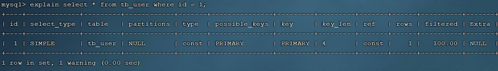 

Explain 执行计划中各个字段的含义:

| 字段         | 含义                                                         |
| ------------ | ------------------------------------------------------------ |
| id           | select查询的序列号，表示查询中执行select子句或者是操作表的顺序(id相同，执行顺序从上到下；id不同，值越大，越先执行)。 |
| select_type  | 表示 SELECT 的类型，常见的取值有 SIMPLE（简单表，即不使用表连接或者子查询）、PRIMARY（主查询，即外层的查询）、<br/>UNION（UNION 中的第二个或者后面的查询语句）、SUBQUERY（SELECT/WHERE之后包含了子查询）等 |
| type         | 表示连接类型，性能由好到差的连接类型为NULL、system、const、eq_ref、ref、range、 index、all 。 |
| possible_key | 显示可能应用在这张表上的索引，一个或多个。                   |
| key          | 实际使用的索引，如果为NULL，则没有使用索引。                 |
| key_len      | 表示索引中使用的字节数， 该值为索引字段最大可能长度，并非实际使用长度，在不损失精确性的前提下， 长度越短越好 。 |
| rows         | MySQL认为必须要执行查询的行数，在innodb引擎的表中，是一个估计值，可能并不总是准确的。 |
| filtered     | 表示返回结果的行数占需读取行数的百分比， filtered 的值越大越好。 |
| Extra        | 额外的建议                                                   |

主要可以根据以下字段，判断sql是否需要优化，特别是是否能命中索引或命中索引的情况

- type 通过sql的连接的类型进行优化
- possible_key  通过它查看是否可能会命中索引
- key 当前sql实际命中的索引
- key_len 索引占用的大小
- Extra 额外的优化建议


#### **什么情况索引会失效？**

1). 联合索引违反最左前缀法则

```
CREATE INDEX idx_name_age ON users (name, age);
SELECT * FROM users WHERE age = 25;
```

2). 索引列上进行函数操作。

```
SELECT * FROM users WHERE YEAR(birthday) > 1990;
```

3). 以%开头的Like模糊查询

```
SELECT * FROM users WHERE name LIKE  '%John%';
```

 通过覆盖索引来解决

4). 使用索引列进行类型转换。

```
SELECT * FROM users WHERE phone = '1234567890';
（phone为数字类型）
```

5). 使用不等于操作符(<>  !=) 

```sql
SELECT * FROM users WHERE age <> 20;
```

6). 使用索引列进行运算

```
SELECT * FROM users WHERE age + 1 = 21;
```

7). 如果MySQL评估使用索引比全表更慢，则不使用索引。


#### **说说mysql的主从同步原理**

MySQL主从复制的核心就是二进制日志，

> 二进制日志（BINLOG）记录了所有的 DDL（数据定义语言）语句和 DML（数据操纵语言）语句，但不包括数据查询（SELECT、SHOW）语句。

具体的主从同步过程如下：

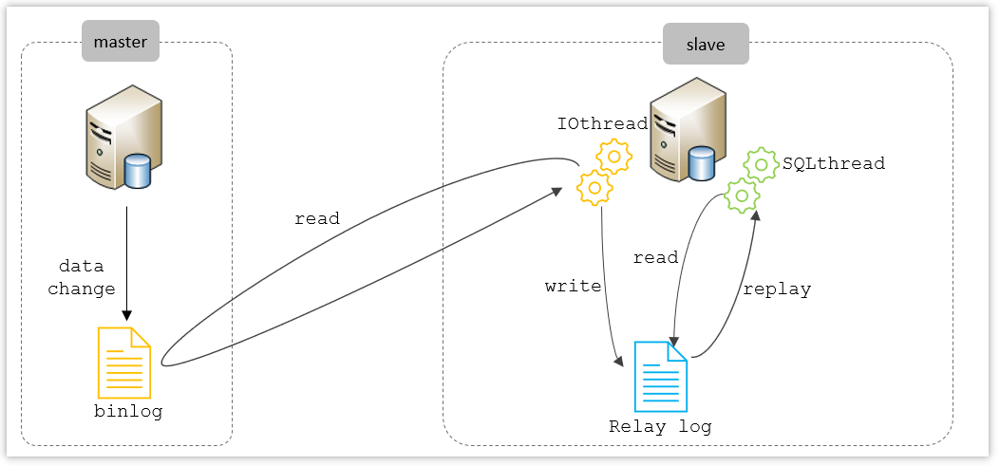

从上图来看，复制分成三步：

1. Master 主库在事务提交时，会把数据变更记录在二进制日志文件 Binlog 中。

2. 从库读取主库的二进制日志文件 Binlog ，写入到从库的中继日志 Relay Log 。

3. slave重做中继日志中的事件，将改变反映它自己的数据。

   

#### **读写分离的时候主从同步延迟怎么解决？**

**强制读主库**
如果你做的是类似支付这种对实时性要求非常高的业务，那么最直接的方法就是直接读主库，当然这种方法相当于从库做一个备份的功能了。

**延迟读**
就是在写入之后，等一段时间再读，Eg：写入后同步的时间是0.5s，读取的时候可以设置1s后再读，但是这个方案主要存在的问题就是，不知道主从同步完成所需要的时间。

**降低并发**
如果你理解了随机重放这个导致主从延迟的原因，那么就比较好理解了，控制主库写入的速度，主从延迟发生的概率自然就小了。{原因：因为主库中sql可能并发执行，可以控制并发速度}。

**并行复制(推荐)**
MySQL 5.6 版本后，提供了一种并行复制的方式，通过将 SQL 线程转换为多个 work 线程来进行重放，这样就解决了主从延迟的问题。


#### **解释下水平分表和垂直分表的区别**

1. 水平分表

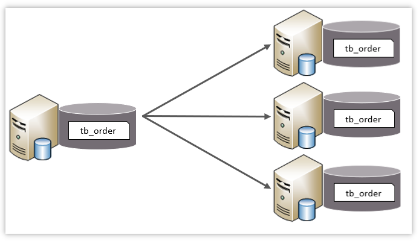 

水平分表：以字段为依据，按照一定策略，将一个表的数据拆分到多个表中。

特点：

- 每个表的表结构都一样。

- 每个表的数据都不一样。

- 所有表的并集是全量数据。

  

2. 垂直分表

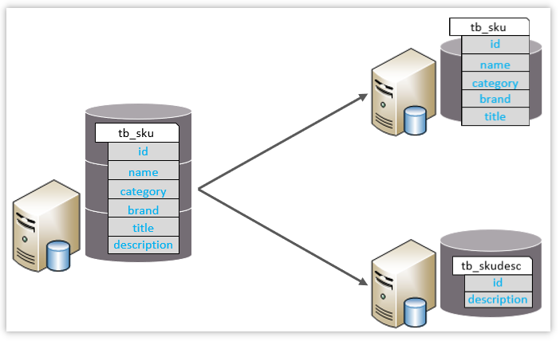 

垂直分表：以字段为依据，根据字段属性将不同字段拆分到不同表中。

特点：

- 每个表的结构都不一样。

- 每个表的数据也不一样，一般通过一列（主键/外键）关联。

- 所有表的并集是全量数据。


#### **分表以后怎么去对应的表查询数据？**

- shardingJDBC：基于AOP原理，在应用程序中对本地执行的SQL进行拦截，解析、改写、路由处理。需要自行编码配置实现，只支持java语言，性能较高。

- MyCat：数据库分库分表中间件，不用调整代码即可实现分库分表，支持多种语言，性能不及前者。 

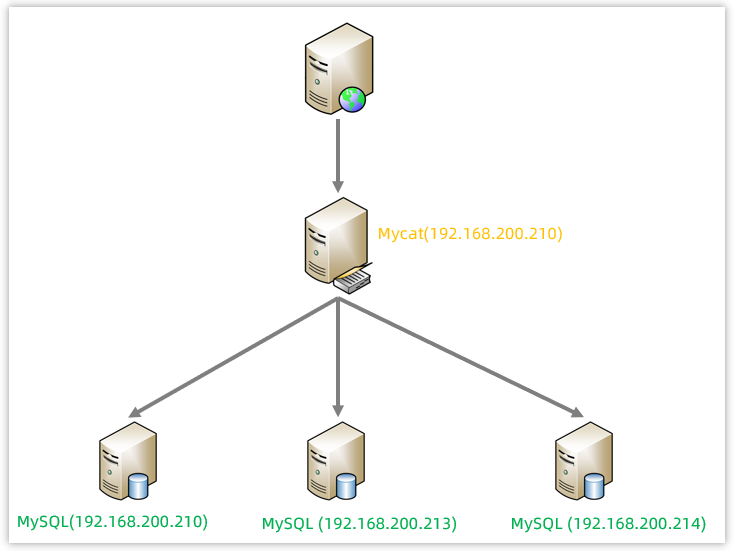


#### **说说你了解的mysql的锁**

MySQL中的锁，按照锁的粒度分，分为以下三类：

- 全局锁：锁定数据库中的所有表。

- 表级锁：每次操作锁住整张表。

- 行级锁：每次操作锁住对应的行数据。

#### **意向锁有什么作用？**

为了避免DML在执行时，加的行锁与表锁的冲突，在InnoDB中引入了意向锁，使得表锁不用检查每行数据是否加锁，使用意向锁来减少表锁的检查。


假如没有意向锁，客户端一对表加了行锁后，客户端二如何给表加表锁呢，来通过示意图简单分析一下：

首先客户端一，开启一个事务，然后执行DML操作，在执行DML语句时，会对涉及到的行加行锁。

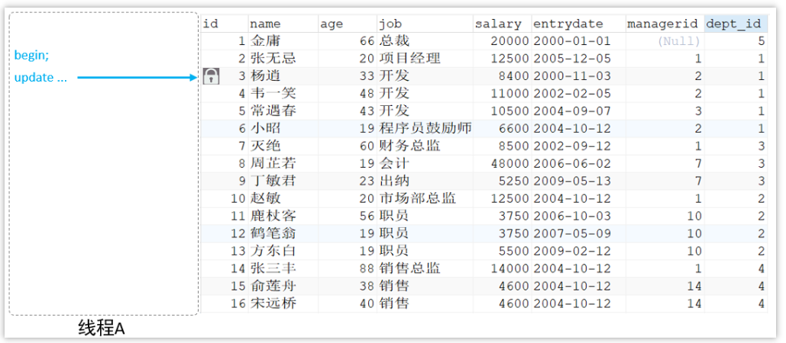 

当客户端二，想对这张表加表锁时，会检查当前表是否有对应的行锁，如果没有，则添加表锁，此时就会从第一行数据，检查到最后一行数据，效率较低。

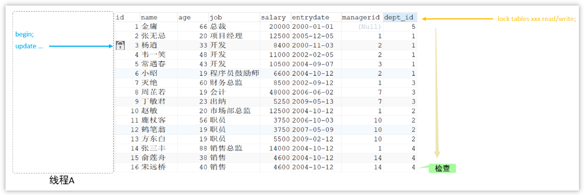 


有了意向锁之后 :

客户端一，在执行DML操作时，会对涉及的行加行锁，同时也会对该表加上意向锁。

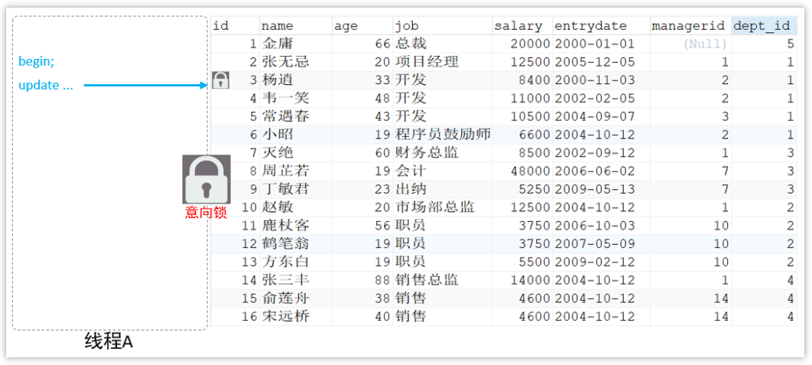 

而其他客户端，在对这张表加表锁的时候，会根据该表上所加的意向锁来判定是否可以成功加表锁，而不用逐行判断行锁情况了。

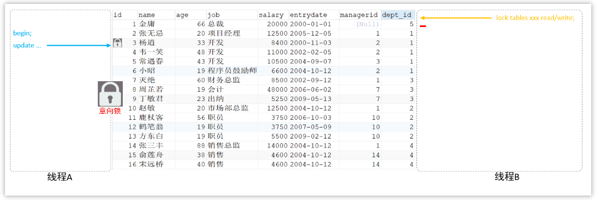 


#### **乐观锁和悲观锁的区别**

**乐观锁和悲观锁都是用于解决并发场景下的数据竞争问题，但是却是两种完全不同的思想。**

**乐观锁**：指的是**在操作数据**的时候非常乐观，乐观地认为别人**不会同时修改数据**，因此乐观锁默认是不会上锁的，只有在**执行更新**的时候才会去判断在此期间别人是否修改了数据，如果别人修改了数据则放弃操作，否则执行操作。

**悲观锁**：指的是在操作数据的时候比较悲观，悲观地认为别人一定会同时修改数据，因此悲观锁在操作数据时是直接把数据上锁，直到操作完成之后才会释放锁，在上锁期间其他人不能操作数据。


冲突比较少的时候, 使用乐观锁(没有**悲观锁**那样**耗时的开销**) 由于乐观锁的不上锁特性，所以在性能方面要比悲观锁好，比较适合用在DB的读大于写的业务场景。

读取频繁使用乐观锁，写入频繁使用悲观锁。


#### **谈谈你对SQL优化的经验？**

具体业务场景

1.现象

2.优化步骤(查看执行计划、优化SQL写法、拆分SQL、读写分离、T+1、缓存、业务限制等)

SQL优化是提升数据库性能的核心手段，需要结合业务场景、数据量和执行计划综合分析，核心思路是“减少不必要的资源消耗（IO/CPU）”。以下是我在实践中的一些经验总结：  ### 一、从索引入手：索引是优化的“基石” 1. **优先优化索引设计**     - 为高频查询的字段建索引（如`WHERE`、`JOIN`、`ORDER BY`后的字段），但避免“过度索引”（索引会拖慢写入速度）。     - 联合索引遵循“最左前缀原则”：如`(a,b,c)`索引，`WHERE a=? AND b=?`能命中，`WHERE b=? AND c=?`则无法命中，需调整查询条件或索引顺序。     - 避免索引失效场景：       - 索引字段用函数/运算（如`WHERE SUBSTR(name,1,3)='abc'`）；       - 隐式类型转换（如`WHERE id='123'`，字符串与数字比较）；       - `NOT IN`、`!=`、`IS NULL`（视版本和数据分布可能失效）；       - `LIKE`以通配符开头（如`WHERE name LIKE '%abc'`）。    ### 二、优化SQL语句：减少“无效操作” 1. **避免全表扫描和大表扫描**     - 不用`SELECT *`，只查需要的字段（减少IO，且可能触发“索引覆盖”，无需回表）。     - 控制`JOIN`表的数量：多表连接会生成笛卡尔积，尽量控制在3-4表以内，必要时拆分查询。     - 慎用`DISTINCT`和`GROUP BY`：`DISTINCT`会排序去重，可通过索引避免；`GROUP BY`尽量配合索引，或用`WITH ROLLUP`替代部分场景。   2. **优化子查询和分页**     - 子查询尽量改为`JOIN`：子查询可能生成临时表，`JOIN`更高效（如`SELECT * FROM t1 WHERE id IN (SELECT id FROM t2)` → `SELECT t1.* FROM t1 JOIN t2 ON t1.id = t2.id`）。     - 大数据量分页优化：`LIMIT 100000, 10`会扫描前100010行，可改为“基于主键定位”（如`WHERE id > 100000 LIMIT 10`，需主键有序）。   3. **避免“隐藏”的性能杀手**     - 禁止在`WHERE`中使用`OR`连接非索引字段（如`WHERE a=? OR b=?`，若a/b不全有索引，会全表扫描，可改为`UNION`）。     - 批量操作替代循环单条操作：如`INSERT INTO t VALUES (1),(2),(3)`比循环3次`INSERT`高效（减少网络交互和事务开销）。    ### 三、分析执行计划：定位瓶颈的“利器” 通过`EXPLAIN`或`EXPLAIN ANALYZE`（MySQL 8.0+）分析SQL执行计划，重点关注：   - `type`：表示连接类型，从优到差为`system > const > eq_ref > ref > range > index > ALL`，出现`ALL`（全表扫描）或`index`（全索引扫描）需优化。   - `key`：实际使用的索引，若为`NULL`说明未走索引。   - `rows`：预估扫描行数，值越大越可能低效。   - `Extra`：关键信息，如`Using filesort`（需额外排序，可加索引避免）、`Using temporary`（生成临时表，如`GROUP BY`无索引时）、`Using index`（索引覆盖，高效）。    ### 四、数据库结构与配置：从底层减少压力 1. **表结构优化**     - 字段类型“够用就好”：如用`INT`不用`BIGINT`，`VARCHAR(20)`不用`VARCHAR(255)`（节省空间，索引更紧凑）。     - 拆分大表：垂直拆分（将大字段如`text`拆分到子表）、水平拆分（按时间/地域分表，如订单表按月份分表）。     - 避免使用`NULL`：`NULL`会增加索引和查询复杂度，可用默认值（如空字符串）替代。   2. **配置与缓存优化**     - 合理设置`innodb_buffer_pool_size`（建议占可用内存的50%-70%），让热点数据常驻内存，减少磁盘IO。     - 开启查询缓存（MySQL 8.0前，需注意缓存失效问题）或应用层缓存（如Redis），缓存高频不变的查询结果。    ### 五、事务与锁：减少阻塞和竞争 - 避免长事务：长事务会持有锁导致其他事务阻塞，尽量拆分事务，缩短执行时间。   - 控制锁粒度：优先用行锁（如`InnoDB`的行锁），避免表锁（如`MyISAM`）；`UPDATE/DELETE`尽量用主键/索引条件，避免全表锁。    ### 总结：优化的核心原则 1. **“小步快跑”**：先通过执行计划定位瓶颈（如全表扫描、排序开销大），再针对性优化，避免盲目加索引。   2. **结合业务场景**：OLTP（高频读写）场景优先优化索引和锁；OLAP（大数据分析）场景可能需要分区表或专门的分析引擎。   3. **持续监控**：通过慢查询日志（`slow_query_log`）记录耗时SQL，定期复盘优化（如业务增长后，原索引可能不再适用）。   本质上，SQL优化是“平衡”的艺术——在查询性能、写入性能、存储空间之间找到适合业务的平衡点。