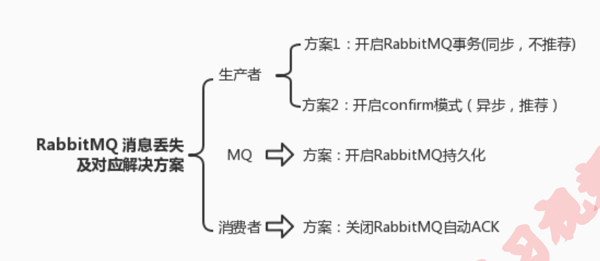
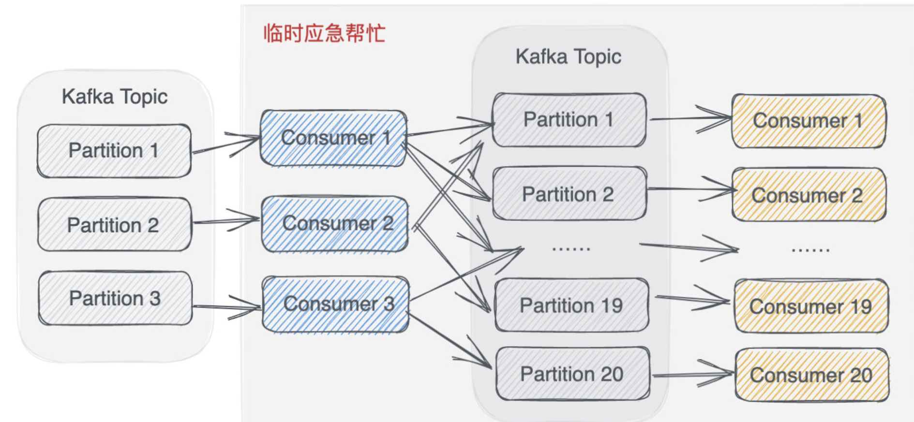

### **为什么使用消息队列？**

其实就是问问你消息队列都有哪些使用场景，然后你项目里具体是什么场景，说说你在这个场景里用消息队 

列是什么？ 

面试官问你这个问题，**期望的一个回答**是说，你们公司有个什么**业务场景**，这个业务场景有个什么技术挑战， 

如果不用 MQ 可能会很麻烦，但是你现在用了 MQ 之后带给了你很多的好处。 

先说一下消息队列常见的使用场景吧，其实场景有很多，但是比较核心的有 3 个：**解耦**、**异步**、**削峰**。

**解耦**

看这么个场景。A 系统发送数据到 BCD 三个系统，通过接口调用发送。如果 E 系统也要这个数据呢？那如 

果 C 系统现在不需要了呢？A 系统负责人几乎崩溃......

在这个场景中，A 系统跟其它各种乱七八糟的系统严重耦合，A 系统产生一条比较关键的数据，很多系统都 

需要 A 系统将这个数据发送过来。A 系统要时时刻刻考虑 BCDE 四个系统如果挂了该咋办？要不要重发， 

要不要把消息存起来？

**异步**

再来看一个场景，A 系统接收一个请求，需要在自己本地写库，还需要在 BCD 三个系统写库，自己本地写 

库要 3ms，BCD 三个系统分别写库要 300ms、450ms、200ms。最终请求总延时是 3 + 300 + 450 + 200 

= 953ms

**削峰**

每天 0:00 到 12:00，A 系统风平浪静，每秒并发请求数量就 50 个。结果每次一到 12:00 ~ 13:00 ， 每秒并发请求数量突然会暴增到 5k+ 条。但是系统是直接基于 MySQL 的，大量的请求涌入 MySQL

如果使用 MQ，每秒 5k 个请求写入 MQ，A 系统每秒钟最多处理 2k 个请求，因为 MySQL 每秒钟最多处理 2k 个。A 系统从 MQ 中慢慢拉取请求，每秒钟就拉取 2k 个请求，不要超过自己每秒能处理的最大请求数 量就 ok，这样下来，哪怕是高峰期的时候，A 系统也绝对不会挂掉

### **消息队列有什么缺点？**

##### **系统可用性降低** 

系统引入的外部依赖越多，越容易挂掉。本来你就是 A 系统调用 BCD 三个系统的接口就好了， ABCD 四 

个系统好好的，没啥问题，你偏加个 MQ 进来，万一 MQ 挂了咋整，MQ 一挂，整套系统崩溃

##### 系统复杂度提高 

硬生生加个 MQ 进来，你怎么保证消息没有重复消费？怎么处理消息丢失的情况？怎么保证消息传递的顺 

序性？头大头大，问题一大堆，痛苦不已。

##### 一致性问题

A 系统处理完了直接返回成功了，人都以为你这个请求就成功了；但是问题是，要是 BCD 三个系统那里， 

BD 两个系统写库成功了，结果 C 系统写库失败了，你这数据就不一致了。

### **如何保证消息不被重复消费？或者说，如何保证消息消费的**幂等性？ 

幂等性，通俗点说，就一个数据，或者一个请求，给你重复来多次，你得确保对应的数据是不会改变的，**不能出错**

是得结合业务来思考，我这里给几个思路： 

1.比如你拿个数据要写库，你先根据主键查一下，如果这数据都有了，你就别插入了

2.如基于数据库的唯一键来保证重复数据不会重复插入多条

3.让生产者发送每条数据的时候，里面加一 个全局唯一的 id，类似订单 id 之类的东西，然后你这里消费到了之后，先根据这个 id 去比如 Redis 里 查一下，之前消费过吗？如果没有消费过，你就处理，然后这个 id 写 Redis。如果消费过了，那你就别 处理了，保证别重复处理相同的消息即可。

4.分布式锁

5.数据库乐观锁

### **如何保证消息的可靠性传输？或者说，如何处理消息丢失的问题？** 

##### 1.生产者弄丢了数据

确保说写 RabbitMQ 的消息别丢，可以开启 confirm 模式，在生产者那里设置开 启 confirm 模式之后，你每次写的消息都会分配一个唯一的 id，然后如果写入了 RabbitMQ 中，RabbitMQ 会给你回传一个 ack 消息，告诉你说这个消息 ok 了。如果 RabbitMQ 没能处理这个消息，会回调你的一 个 nack 接口，告诉你这个消息接收失败，你可以重试。而且你可以结合这个机制自己在内存里维护每个消 息 id 的状态，如果超过一定时间还没接收到这个消息的回调，那么你可以重发。

##### 2.**RabbitMQ** **弄丢了数据**

**开启** **RabbitMQ** **的持久化**，就是消息写入之后会持久化到磁 盘，哪怕是 RabbitMQ 自己挂了，**恢复之后会自动读取之前存储的数据**，

注意，哪怕是你给 RabbitMQ 开启了持久化机制，也有一种可能，就是这个消息写到了 RabbitMQ 中，但 是还没来得及持久化到磁盘上，结果不巧，此时 RabbitMQ 挂了，就会导致内存里的一点点数据丢失。 所以，持久化可以跟生产者那边的 confirm 机制配合起来，只有消息被持久化到磁盘之后，才会通知生产 者 ack 了，所以哪怕是在持久化到磁盘之前，RabbitMQ 挂了，数据丢了，生产者收不到 ack，你也是可 以自己重发的

##### 3.消费端弄丢了数据

这个时候得用 RabbitMQ 提供的 ack 机制，简单来说，就是你必须关闭 RabbitMQ 的自动 ack，可以通 过一个 api 来调用就行，然后每次你自己代码里确保处理完的时候，再在程序里 ack 一把。这样的话，如 果你还没处理完，不就没有 ack 了？那 RabbitMQ 就认为你还没处理完，这个时候 RabbitMQ 会把这个 消费分配给别的 consumer 去处理，消息是不会丢的。

### **如何保证消息的顺序性？**

#### 1. 保证顺序性的意义

消息队列中的若干消息如果是对同一个数据进行操作，这些操作具有前后的关系，必须要按前后的顺序执行，否则就会造成数据异常。

举例：比如通过mysql binlog进行两个数据库的数据同步，由于对数据库的数据操作是具有顺序性的，如果操作顺序搞反，就会造成不可估量的错误。比如数据库对一条数据依次进行了 插入->更新->删除操作，这个顺序必须是这样，如果在同步过程中，消息的顺序变成了删除->插入->更新，那么原本应该被删除的数据，就没有被删除，造成数据的不一致问题。

#### 2 出现顺序错乱的场景

Kafka:一个topic发到多个Partition上

共同：在消费端里面进行了多线程消费

#### 3.解决方案

**Kafka:一个topic发到多个Partition上**

同一topic消息设置相同的key值，这样可以保证消息发送到同一个partition,而partition内是顺序的

**在消费端里面进行了多线程消费**

写 N 个内存 queue，具有相同 key 的数据都到同一个内存 queue；然后对于 N 个线程，每个线 程分别消费一个内存 queue 即可，这样就能保证顺序性

### 消息队列产生严重消息堆积怎么处理？

#### 1.为什么会产生消息堆积？

大多是因为 Consumer 出问题了，没有及时发现，或者故障恢复需要较长的时间，导致大量消息积压在 MQ 中。

#### 2. 消息堆积会有什么后果呢？

##### 2.1 消息被丢弃

例如 RabbitMQ 有一个消息过期时间 TTL，过期的消息会被扔掉，这样消息就彻底没有了。

##### 2.2 磁盘满了

如果堆积量太大，可能导致磁盘空间不足，那么新消息就进不来了。

##### 2.3 海量消息待处理

如果消息没过期，并且磁盘空间也够用，那么就是产生海量消息等待被消费，Consumer 的噩梦。

#### 3. 如何应对呢？

#### 3.1 消息被丢弃的情况

首先，要实现防止消息过期问题，不应该设置过期时间。

如果就是设置了过期时间，导致了消息丢失，怎么补救呢？

那就只能在夜深人静，趁着访问量最低的时候，写一个临时程序来补消息了。

例如有订单消息丢了，那就需要找出哪些订单消息丢了，然后重新发到队列。

#### 3.2 磁盘不足的情况

系统通常都是有监控的，达到空间阈值时就会发警报，这时就要马上处理了。

例如，在其他机器上创建临时的[消息队列](https://so.csdn.net/so/search?q=消息队列&spm=1001.2101.3001.7020)，再写一个临时的 Consumer，作为消息的中转，把消息积压队列中的消息取出来，放到临时队列里面去。快速疏散积压的消息，让磁盘空间恢复正常水平。

#### 3.3 快速处理海量积压消息

首先要解决consumer问题，Consumer 恢复正常之后，面对堆积如山的消息，怎么处理呢？

如何按照之前正常情况处理的话，猴年马月才能消费完，此过程中还有新消息在不断进来。这时又会积压多少新的消息呢？

所以正常处理肯定不行，需要提速。

例如 Kafka，这个消息积压的 Topic 有 3 个 Partition，那最多就能用 3 个 Consumer，所以增加 Consumer 没有用。

还是可以使用临时队列的方式。

新建一个 Topic，设置为 20 个 Partition，Consumer 不再处理业务逻辑了，只负责搬运，把消息放到临时 Topic 中

这 20 个 Partition 可以有 20个 Consumer 了，它们来处理原来的业务逻辑

这样很快就可以恢复正常水平，之后，再把整体结构恢复为原来的形式。

**小结一下**，消息积压还是比较麻烦的，最好是提前防范，做好硬件和消息系统的健康监控。如果出现消息丢失，就要人工查找丢失的消息，然后补上。在消费不过来的时候，可以考虑使用临时队列作为中转，提升处理能力。

### **mq 中的消息过期失效问题**

假设你用的是 RabbitMQ，RabbtiMQ 是可以设置过期时间的，也就是 TTL。如果消息在 queue 中积压超 过一定的时间就会被 RabbitMQ 给清理掉，这个数据就没了。那这就是第二个坑了。这就不是说数据会大 量积压在 mq 里，而是**大量的数据会直接搞丢**。 

A. 可以采取一个方案，就是**批量重导**这个时候我们就开始写程序，将丢失的那批数据，写个临时程序，一点一点的查出来，然后重新灌入 mq 里面去

B. 消息过期的处理方案(RabbitMq)

- 过期消息进入到死信队列
- 启动专门的消费者消费死信队列消息，并写入数据库记录日志
- 查询数据库消息日志，重新发送消息到mq

### **如何保证消息队列的高可用？**

##### RabbitMq**镜像集群模式（高可用性）** 

镜像集群模式，你创 建的 queue，无论元数据还是 queue 里的消息都会**存在于多个实例上**，就是说，每个 RabbitMQ 节点都 有这个 queue 的一个**完整镜像**，包含 queue 的全部数据的意思。然后每次你写消息到 queue 的时候，都 会自动把**消息同步**到多个实例的 queue 上。

那么**如何开启这个镜像集群模式**呢？其实很简单，RabbitMQ 有很好的管理控制台，就是在后台新增一个策 略，这个策略是**镜像集群模式的策略**，指定的时候是可以要求数据同步到所有节点的，也可以要求同步到指 定数量的节点，再次创建 queue 的时候，应用这个策略，就会自动将数据同步到其他的节点上去了。

##### Kafka高可用

提供了 HA (High Availability高可用性)机制，就是 replica（复制品） 副本机制。每个 partition 的数据都会 同步到其它机器上，形成自己的多个 replica 副本。所有 replica 会选举一个 leader 出来，那么生产 和消费都跟这个 leader 打交道，然后其他 replica 就是 follower。写的时候，leader 会负责把数据 同步到所有 follower 上去，读的时候就直接读 leader 上的数据即可。

因为如果某个 broker 宕机了，没事儿，那个 broker 上面的 partition 在其他机器上都有副本的。如果这个宕机的 broker 上面有某个 partition 的 leader，那么此时会从 follower 中**重新选举**一个新的 leader 出来，大家继续读写那个新的 leader 即可。这就有所谓的高可 

用性了

注意：一般都是部署三台。
